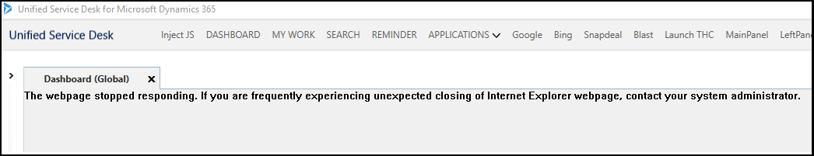
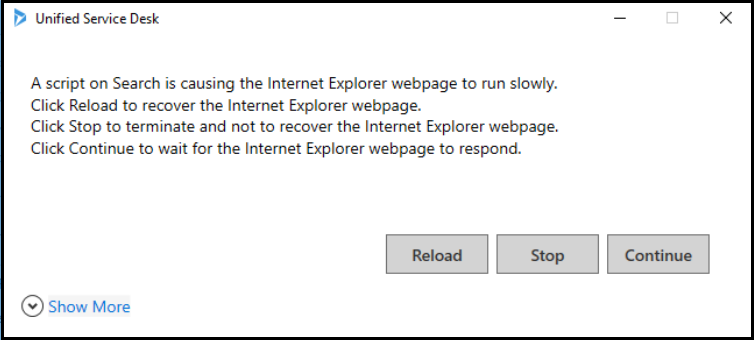
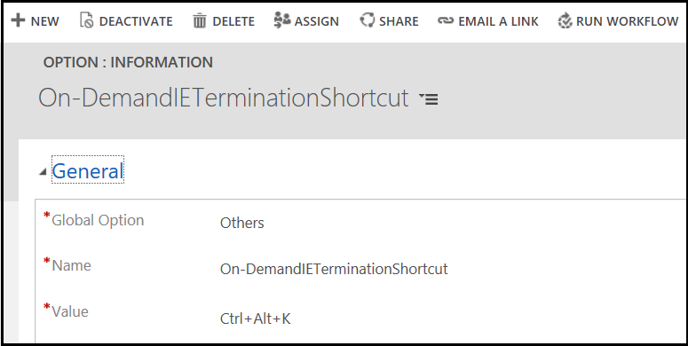

# Recover an Internet Explorer process instance
The `IE process` browser control hosts your controls in individual Internet Explorer process instances and displays them in the [!INCLUDE[pn_unified_service_desk](../../includes/pn-unified-service-desk.md)] client application. You can use the Internet Explorer process (IEWebPageRecovery) recovery feature to reload any Internet Explorer process instance (may have more than one webpage) that is unresponsive in the [!INCLUDE[pn_unified_service_desk](../../includes/pn-unified-service-desk.md)] client application. 

By default, Internet Explorer process instance recovery is enabled. To disable the feature, an administrator must configure the option and set it to **false**. [!INCLUDE[proc_more_information](../../includes/proc-more-information.md)] [Manage a Unified Service Desk option](../admin/manage-options-unified-service-desk.md)

## When you can recover Internet Explorer process instances

You can recover an Internet Explorer process instance in the following scenarios:

- When Internet Explorer closes abruptly.
- When an Internet Explorer webpage is unresponsive.
- When you manually end an unresponsive Internet Explorer process instance from Task Manager.
- When a script on the hosted control that uses `IE process` browser control takes time more than the timeout period for page navigation.
- When you use the keyboard shortcut to manually terminate the Internet Explorer webpage.

## Recover an unresponsive Internet Explorer process instance

You can recover the Internet Explorer process instance in the following ways:

When a hosted control that uses an Internet Explorer process browser control closes unexpectedly, the Unified Service Desk client application displays the message **Internet Explorer closed abruptly**.

To recover the closed instance (which may contain more than one webpage), select **Reload**. If you do not want to recover, select **Cancel**. If you cancel, the [!INCLUDE[pn_unified_service_desk](../../includes/pn-unified-service-desk.md)] client application skips recovery of the Internet Explorer process instance and displays a message, **The webpage stopped responding. If you frequently experience unexpected closing of Internet Explorer webpage, contact your system administrator**.

## Recover when using RunScript on a hosted control

A script running on a hosted control causes an Internet Explorer webpage to run slowly. If you have configured the **IEWebPageInactivityTimeOut** UII option, then [!INCLUDE[pn_unified_service_desk](../../includes/pn-unified-service-desk.md)] waits until the timeout period to display the message - **A script on \<Hosted Control Name> is causing the Internet Explorer webpage to run slowly**. 

To recover the webpage, select **Reload**. If you want to terminate and do not want to recover the webpage, select **Stop**. If you want to wait for the Internet Explorer webpage to respond, select **Continue**.

After you select **Continue** and wait for the Internet Explorer webpage to respond, if it does not respond, the [!INCLUDE[pn_unified_service_desk](../../includes/pn-unified-service-desk.md)] displays the window again after the timeout period.

> [!Note]
> - By default, the **IEWebPageInactivityTimeOut** timeout period is 15000 milliseconds (15 seconds).
> - To change the default timeout period, a System Administrator must configure the **IEWebPageInactivityTimeOut** on the **Active UII Options** page and type the value in milliseconds. [!INCLUDE[proc_more_information](../../includes/proc-more-information.md)] [Manage Options for Unified Service Desk](../../unified-service-desk/admin/manage-options-unified-service-desk.md).
> - If you set the value as 0 milliseconds, then the **IEWebPageInactivityTimeOut** is disabled.

If the webpage runs slowly while executing a script on the `IE process` browser hosting hosted control, and when you select **Reload**, the [!INCLUDE[pn_unified_service_desk](../../includes/pn-unified-service-desk.md)] client application displays another message, **Internet Explorer closed abruptly.** Select **Reload** again to recover the webpage.

> [!Note]
> If the web browser runs slowly while executing a script, and you choose **Stop** to terminate and not to recover the Internet Explorer webpage, the [!INCLUDE[pn_unified_service_desk](../../includes/pn-unified-service-desk.md)] may terminate other Internet Explorer webpages.

## Recover unresponsive Internet Explorer process instances using a keyboard shortcut

When the Internet Explorer webpage is unresponsive and causes the [!INCLUDE[pn_unified_service_desk](../../includes/pn-unified-service-desk.md)] to freeze, hover the cursor on the unresponsive tab and use the keyboard shortcut **Ctrl + Alt + K** to terminate. 

The [!INCLUDE[pn_unified_service_desk](../../includes/pn-unified-service-desk.md)] displays a dialog box: **You have chosen to end the Internet Explorer process that is active in Unified Service Desk by pressing Ctrl+Alt+K. Do you want to continue?**. 

Select **Yes** to end the Internet Explorer process instance. Select **No** to cancel the operation.

After you end the Internet Explorer process instance, the [!INCLUDE[pn_unified_service_desk](../../includes/pn-unified-service-desk.md)] client application displays a message, **Internet Explorer closed abruptly**. Select **Reload** to recover the closed Internet Explorer process instance. If you do not want to recover, select **Cancel**.

> [!Note]
> - An agent must wait for the [!INCLUDE[pn_unified_service_desk](../../includes/pn-unified-service-desk.md)] monitoring process (usdmp.exe) to detect and terminate the unresponsive Internet Explorer process instance. 
> - The agent must use the keyboard shortcut as last option when the [!INCLUDE[pn_unified_service_desk](../../includes/pn-unified-service-desk.md)] monitoring process fails to detect the unresponsive Internet Explorer process instance. 
> - Using the keyboard shortcut may terminate any responsive Internet Explorer webpage, causing you to lose any unsaved work. 
> - An agent must use the keyboard shortcut as a last option only when terminating an Internet Explorer web page can recover the [!INCLUDE[pn_unified_service_desk](../../includes/pn-unified-service-desk.md)].

## Change keyboard shortcut

To change the keyboard shortcut:

1. Sign in to [!INCLUDE[pn_microsoftcrm](../../includes/pn-microsoftcrm.md)].

2. [!INCLUDE[proc_settings_usd](../../includes/proc-settings-usd.md)]

3. Choose **Options**.  

4. click **New** on the **Active UII Options** page.

5. Choose **Others** for the **Global Option** field.

6. Type **On-DemandIETerminationShortcut** for the **Name** field.

7. Type the keyboard shortcut in the format _key1+key2+key3_ for the **Value** field.

8. Click **Save**.

## Limitations
The limitations of Internet Explorer process recovery are as follows: 

- When you recover an Internet Explorer webpage, [!INCLUDE[pn_unified_service_desk](../../includes/pn-unified-service-desk.md)] triggers all the events that associate with the webpage.  
For example:   **TaskUpdated** is a event configured for the **Agent Scripting** hosted control (webpage) and has **Action Call for Reminder** and **Action Call for Resolve Case** as Action Calls. 
If you recover **Agent Scripting** webpage, [!INCLUDE[pn_unified_service_desk](../../includes/pn-unified-service-desk.md)] triggers the **TaskUpdated** event and the **Action Calls**. [!INCLUDE[proc_more_information](../../includes/proc-more-information.md)] [Events](../events.md).

- [!INCLUDE[pn_unified_service_desk](../../includes/pn-unified-service-desk.md)] does not recover inline navigation of an Internet Explorer webpage, and you may lose an unsaved work.  
For example:  
  You open an **Account** Internet Explorer webpage and navigate inline to a **Case** Internet Explorer webpage. If the **Case** webpage becomes unresponsive, the recovery feature reloads only the **Account** webpage and not the **Case** webpage. You may lose any unsaved data that you had entered in the **Case** webpage.

- If the web browser runs slowly while executing a script, and you choose **Stop** to terminate and not to recover the Internet Explorer webpage, [!INCLUDE[pn_unified_service_desk](../../includes/pn-unified-service-desk.md)] may terminate other Internet Explorer webpages.

- Using **Ctrl+Alt+K** keyboard shortcut may terminate any responsive Internet Explorer webpage, causing you to lose any unsaved work.

## See also

[Manage Options for Unified Service Desk](../../unified-service-desk/admin/manage-options-unified-service-desk.md)
