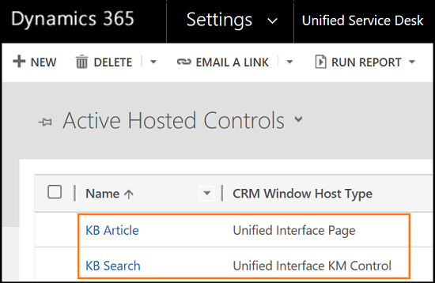

# Post-migration steps

[!INCLUDE[cc-data-platform-banner](../../includes/cc-data-platform-banner.md)]

This topic describes the steps you need to perform after you migrate configurations from the legacy web client to the Unified Interface app. 

1. [Clear the CEF cache folder](#clear-the-cef-cache-folder)
1. [Test configurations in the Unified Interface app](#test-configurations-in-the-target-unified-interface-app)
1. Perform the following post-migration steps
   1. [Verify window navigation rules](#verify-window-navigation-rules)
   1. [Reconfigure events](#reconfigure-events)
   1. [Reconfigure the associated view action call](#reconfigure-the-associated-view-action-call)
   1. [Reconfigure RunXrmCommands](#reconfigure-runxrmcommands) 
   1. [Update the hosting type to Chrome](#update-the-hosting-type-to-chrome) (optional)
   1. [Set the Unified Interface theme](#set-the-unified-interface-theme) (optional)

## Clear the CEF cache folder

Clear the CEF cache folder before you sign in to the Unified Service Desk application.

1. Go to c:\Users\*<user_name>*\Local\Microsoft\USD\CEF

2. Delete the contents of the folder.

## Test configurations in the target Unified Interface app

1. Sign in to the Dynamics 365 instance.

2. Expand **Dynamics 365**.

3. Select **Unified Service Desk Administrator**.

4. Select configurations that you migrated from the legacy web client. For this example, the selected configuration elements are as follows.

   |Configuration name|Description|
   |-------|-------|
   |KB Article| CRM Page|
   |KB Search| KM Control|

    </br>

5. Select **Hosted Controls**.

You can see that the configurations have been migrated to Unified Interface&ndash;specific elements.

  |Configuration name|Description|
  |-------|-------|
  |KB Article| Unified Interface Page|
  |KB Search| Unified Interface KM Control|
  
  


## Verify window navigation rules

Page navigation in the web client and Unified Interface are different. In the legacy web client, for window navigation rules, you might have set up the **Route-type** as **Pop-up** for the originating hosted control, and when you convert the hosted control, the migration tool replaces the **Pop-up** to **Inplace** route type. Based on your earlier configuration, if required, you might want to update the window navigation rules.

**Verify page navigation behavior**

You view an account page in a browser or in Unified Service Desk client application and want to open a related case from the sub-grid. Now, if the case is opened in a same browser, then route type is Inplace. If it opens in new browser window, then route type is Pop-up.

 > [!Note]
 > For certain URLs if you've defined window.open method, those URLs are opened in a new browser tab (pop-up route type). For these URLs, you don't need to change the behavior for these window navigation rules.

## Reconfigure events

The **BrowserDocumentComplete** event in the legacy web client is converted to the **PageReady** event in Unified Interface.

The **PageLoadComplete** event maps to **DataReady** event in the legacy web client. After conversion of the **BrowserDocumentComplete** to the **PageReady** event, the **DataReady** event is fired in Unified Interface. In this case, your page might not be ready for DOM interactions, so if you have any Runscript action calls on the **DataReady** event, we recommend moving the Runscript action calls to the **PageReady** event.

## Reconfigure the associated view action call

The **AssociatedView** action call is used to open an entity view. In the legacy web client, to open associated view of an entity, you might have defined the navigate action call with the URL for the corresponding associated view.

The parameters for **AssociatedView** action call in the [Unified Interface Page](../unified-interface-page-hosted-control.md#associatedview) is different from [CRM Page](../crm-page-hosted-control.md#associatedview) hosted control.

You need to update parameters of the **AssociatedView** action call in the Unified Interface Page hosted control. To learn more, see [Unified Interface Page](../unified-interface-page-hosted-control.md#associatedview).

**For example:**

- Action call to view associated cases for an account. The data parameters will be:

  ```
  ent=account
  id=[[account.id]]
  navitemid=navService
  ```

- Action call to show associated contacts for an account. The data parameters will be:

  ```
  ent=account
  id=[[account.id]]
  navitemid=navContacts
  ```

## Reconfigure RunXrmCommands

In the legacy web client, you can pass a script as data in an action call. In Unified Interface, you need to write the function in the web resource and pass the Unified Service Desk data parameters as parameters to that function.

The migration tool converts all your action calls and replaces the data parameters with the variables in the function. Be sure to test and validate each action call in the Unified Interface app.

All the data parameters are passed as strings in single quotation marks. For example, `‘[[incident.Id]+]’`.

> [!Note]
> If the data parameter is a JSON object and not a string, you must remove the quotation marks from the data parameter.

## Update the hosting type to Chrome

We recommend that you update your hosting type to Chrome. More information: [Update Unified Service Desk Component type to Chrome](../chrome-process.md)

## Set the Unified Interface theme

Set the Unified Interface theme for the Unified Service Desk client application after you migrate your configurations from the legacy web client to Unified Interface. More information: [Customize themes in Unified Service Desk](../customize-themes-in-unified-service-desk.md)

Create a **Unified Interface Settings** record with the theme as **Unified Blue**. More information: [Create Unified Interface Settings record](unified-interface-settings.md#create-unified-interface-settings-record)

After you create the record, update the following:

- [Custom panel layout](#update-the-custom-panel-layout-xml)
- [Custom Styles field on the Main toolbar](#update-the-custom-styles-field-on-the-main-toolbar)
- [Custom Styles field on the About toolbar](#update-the-custom-styles-field-on-the-about-toolbar)
- [Session overview lines XML in Session Lines](#update-the-session-overview-lines-xml-in-session-lines)

### Update the custom panel layout XML

```XML
<Grid xmlns="https://schemas.microsoft.com/winfx/2006/xaml/presentation" 

    xmlns:x="https://schemas.microsoft.com/winfx/2006/xaml" 

    xmlns:mc="https://schemas.openxmlformats.org/markup-compatibility/2006" 

    xmlns:d="https://schemas.microsoft.com/expression/blend/2008" 

    mc:Ignorable="d" xmlns:local="clr-namespace:Microsoft.Crm.UnifiedServiceDesk.Dynamics;assembly=Microsoft.Crm.UnifiedServiceDesk.Dynamics" 

    xmlns:USD="clr-namespace:Microsoft.Crm.UnifiedServiceDesk.Dynamics.PanelLayouts;assembly=Microsoft.Crm.UnifiedServiceDesk.Dynamics"> 

  <Grid Grid.Name="LayoutRoot"> 

    <Grid.Resources> 

      <local:CRMImageConverter x:Key="CRMImageLoader" /> 

    </Grid.Resources> 

    <Grid.RowDefinitions> 

      <RowDefinition Height="42" /> 

      <RowDefinition Height="*" /> 

      <RowDefinition Height="30" /> 

    </Grid.RowDefinitions> 

    <Grid Background="{DynamicResource WindowHeaderToolbarStyle}" Grid.Row="0" Margin="0"> 

      <Grid.ColumnDefinitions> 

        <ColumnDefinition Width="auto" /> 

        <ColumnDefinition Width="auto" /> 

        <ColumnDefinition Width="*" /> 

        <ColumnDefinition Width="Auto" /> 

      </Grid.ColumnDefinitions> 

      <USD:USDDeckTabPanel x:Name="ToolbarPanel"  FocusVisualStyle="{DynamicResource ToolbarFocusVisual}" Grid.Column="2" AutomationProperties.Name="Toolbar Panel" VerticalAlignment="Center" Focusable="True" Margin="0" USD:PanelNavigation.KeyboardShortcut="CTRL+1"/> 

      <Grid Grid.Column="3" > 

        <Grid.ColumnDefinitions> 

          <ColumnDefinition Width="*" /> 

          <ColumnDefinition Width="412" /> 

        </Grid.ColumnDefinitions> 

        <USD:USDStackPanel x:Name="CtiPanel" Grid.Column="0" Orientation="Horizontal" Focusable="True" VerticalAlignment="Center" AutomationProperties.Name="Cti Panel" /> 

        <USD:USDStackPanel x:Name="AboutPanel"  FocusVisualStyle="{DynamicResource ToolbarFocusVisual}" Grid.Column="1" HorizontalAlignment="Right" Orientation="Horizontal" Focusable="True" VerticalAlignment="Center" AutomationProperties.Name="AboutPanel" USD:PanelNavigation.KeyboardShortcut="CTRL+2"/> 

      </Grid> 

    </Grid> 

    <Grid Grid.Row="1" VerticalAlignment="Stretch" Margin="0,0,0,0" Background="{DynamicResource WindowBackgroundColor}"> 

      <Grid.RowDefinitions> 

        <RowDefinition Height="auto" /> 

        <RowDefinition Height="auto" /> 

        <RowDefinition Height="*" /> 

        <RowDefinition Height="auto" /> 

      </Grid.RowDefinitions> 

      <USD:USDDeckTabPanel x:Name="SessionTabsPanel" Style="{DynamicResource SessionTabPanelStyle}" Grid.Row="0" AutomationProperties.Name="Session Tabs Panel" Focusable="True" ClipToBounds="True" USD:PanelNavigation.KeyboardShortcut="CTRL+3"/> 

      <USD:USDDeckTabPanel x:Name="MainPanel" Style="{DynamicResource USDMainPanel}" Grid.Row="1" Margin="0,0,0,0" AutomationProperties.Name="Main Panel" Focusable="True" ClipToBounds="True" USD:PanelNavigation.KeyboardShortcut="CTRL+4" Background="{DynamicResource SessionTabsBackground}" /> 

      <Grid Grid.Row="2" AutomationProperties.Name="Main Panels" Margin="0,10,0,0"> 

        <Grid.ColumnDefinitions> 

          <ColumnDefinition Width="auto" /> 

          <ColumnDefinition Width="*" /> 

          <ColumnDefinition Width="auto" /> 

        </Grid.ColumnDefinitions> 

        <Expander x:Name="ExpanderSessionDetails" Grid.Column="0" Style="{DynamicResource StretchExpanderStyle}" ExpandDirection="Left" IsExpanded="False" BorderBrush="#FFFFFFFF" AutomationProperties.Name="ExpanderSessionDetails"> 

          <ScrollViewer VerticalScrollBarVisibility="Auto"> 

            <Grid Style="{DynamicResource LeftPanelGrid}" Margin="10,0,0,0"> 

              <Grid.RowDefinitions> 

                <RowDefinition Height="auto" /> 

                <RowDefinition Height="auto" /> 

                <RowDefinition x:Name="ChatPanelRow" Height="auto" /> 

                <RowDefinition Height="auto" /> 

                <RowDefinition Height="auto" /> 

                <RowDefinition Height="*" /> 

              </Grid.RowDefinitions> 

              <USD:USDCollapsePanel x:Name="SessionExplorerPanel" AutomationProperties.Name="Session Explorer Panel" Grid.Row="0" Margin="1,0,1,10" USD:PanelNavigation.KeyboardShortcut="CTRL+5"/> 

              <USD:USDCollapsePanel x:Name="WorkflowPanel"  AutomationProperties.Name="Workflow Panel" Grid.Row="1" Margin="1,0,1,10" USD:PanelNavigation.KeyboardShortcut="CTRL+6"/> 

              <USD:USDCollapsePanel x:Name="ChatPanel" Visibility="Collapsed" AutomationProperties.Name="Workflow Panel" Grid.Row="2" Margin="1,0,1,10" /> 

              <USD:USDCollapsePanel x:Name="LeftPanel1" Visibility="Collapsed" AutomationProperties.Name="Left Panel 1" Grid.Row="3" Margin="1,0,1,10" /> 

              <USD:USDCollapsePanel x:Name="LeftPanel2" Visibility="Collapsed" AutomationProperties.Name="Left Panel 2" Grid.Row="4" Margin="1,0,1,10" /> 

              <USD:USDTabPanel x:Name="LeftPanelFill" AutomationProperties.Name="Left Panel Fill" Grid.Row="5" Margin="1,0,1,1" USD:PanelNavigation.KeyboardShortcut="CTRL+7"/> 

            </Grid> 

          </ScrollViewer> 

        </Expander> 

        <Grid Grid.Column="1" Background="Transparent"> 

          <Grid.RowDefinitions> 

            <RowDefinition Height="0" /> 

            <RowDefinition Height="*" /> 

          </Grid.RowDefinitions> 

          <USD:USDCollapsePanel x:Name="RibbonPanel" Grid.Row="0" Visibility="Collapsed" AutomationProperties.Name="Ribbon Panel" Focusable="True" Margin="1" ClipToBounds="False" SnapsToDevicePixels="True" /> 

          <Border BorderThickness="1,0,1,1" BorderBrush="{DynamicResource PanelBorderBrush}" Grid.Row="1" Grid.RowSpan="2"> 

            <Border BorderBrush="{DynamicResource PanelTopBorderBrush}" BorderThickness="0,3,0,0" > 

              <ContentControl x:Name="MainPanelContent" FocusVisualStyle="{DynamicResource MainPanelFocusVisual}" Content="{Binding ElementName=MainPanel, Path=SelectedContent}" AutomationProperties.Name="Main Panel Content" USD:PanelNavigation.KeyboardShortcut="CTRL+8"/> 

            </Border> 

          </Border> 

        </Grid> 

        <Expander x:Name="RightPanelExpander" Grid.Column="2" Style="{DynamicResource StretchExpanderStyle}" ExpandDirection="Right" IsExpanded="False" BorderBrush="#FFFFFFFF" AutomationProperties.Name="RightPanelExpander" Padding="0,0,0,0"> 

          <ScrollViewer VerticalScrollBarVisibility="Auto"> 

            <Grid Style="{DynamicResource LeftPanelGrid}" Margin="0,0,10,0"> 

              <Grid.RowDefinitions> 

                <RowDefinition Height="*" /> 

              </Grid.RowDefinitions> 

              <USD:USDTabPanel x:Name="RightPanel" AutomationProperties.Name="Right Panel" Grid.Row="0" USD:PanelNavigation.KeyboardShortcut="CTRL+9"/> 

              <USD:USDPopupPanel x:Name="RightPopupPanel" Popup.Placement="Left" Popup.PopupAnimation="Scroll" Height="{Binding ActualHeight,ElementName=RightPanel,Mode=OneWay}" Width="{Binding ActualWidth,ElementName=RightPanel,Mode=OneWay}" Popup.PlacementTarget="{Binding ElementName=RightPanel}" > 

                <Grid> 

                  <Grid.RowDefinitions> 

                    <RowDefinition Height="20" /> 

                    <RowDefinition Height="*" /> 

                  </Grid.RowDefinitions> 

                  <Border Background="#FFCCCCCC" Grid.Row="0"> 

                    <TextBlock Text="Article Preview" HorizontalAlignment="Center" Margin="10,0,0,0" /> 

                  </Border> 

                  <Border BorderThickness="1" Grid.Row="1" BorderBrush="#FFCCCCCC" Background="#FFFFFFFF"> 

                    <ContentControl x:Name="PopupContainer" Margin="0,0,0,0" /> 

                  </Border> 

                </Grid> 

              </USD:USDPopupPanel> 

            </Grid> 

          </ScrollViewer> 

        </Expander> 

      </Grid> 

    </Grid> 

    <StatusBar Grid.Row="2" Style="{DynamicResource StatusBarStyle}"> 

      <StatusBarItem> 

        <USD:USDStackPanel x:Name="StatusPanel" Height="30" Focusable="true" Orientation="Horizontal" AutomationProperties.Name="Status Panel" USD:PanelNavigation.KeyboardShortcut="ALT+9"/> 

      </StatusBarItem> 

    </StatusBar> 

  </Grid> 

</Grid> 
```

More information: [Create custom panel layout](../create-custom-panel-layout.md)

### Update the Custom Styles field on the Main toolbar

```XML
<ResourceDictionary xmlns="https://schemas.microsoft.com/winfx/2006/xaml/presentation" 

xmlns:x="https://schemas.microsoft.com/winfx/2006/xaml"> 

 <ResourceDictionary.MergedDictionaries> 

  <ResourceDictionary Source="/UnifiedServiceDesk;component/Styles/UnifiedInterface/Style.xaml"/> 

  <ResourceDictionary xmlns="https://schemas.microsoft.com/winfx/2006/xaml/presentation" 

xmlns:x="https://schemas.microsoft.com/winfx/2006/xaml"> 

   <SolidColorBrush x:Key="ToolBarFontColor" Color="{Binding Color, Source={StaticResource TopToolbarTextColorBrush}}"/> 

   <SolidColorBrush x:Key="ToolBarButtonHover" Color="{Binding Color, Source={StaticResource TopToolbarHoverColorBrush}}"/> 

   <SolidColorBrush x:Key="ToolBarDropDownGoementryStrokeBrush" Color="{Binding Color, Source={StaticResource TopToolbarTextColorBrush}}"/> 

   <SolidColorBrush x:Key="GenericToolBarButtonBackground" Color="{Binding Color, Source={StaticResource TopToolBarButtonBackground}}"/> 

   <SolidColorBrush x:Key="ToolbarButtonPressedForeground" Color="{Binding Color, Source={StaticResource TopToolbarButtonPressedForeground}}" /> 

  </ResourceDictionary> 

 </ResourceDictionary.MergedDictionaries> 

  </ResourceDictionary> 
```

More information: [Configure toolbars in your application](../configure-toolbars-application.md#styles-in-toolbar)

### Update the Custom Styles field on the About toolbar

```XML
<ResourceDictionary xmlns="https://schemas.microsoft.com/winfx/2006/xaml/presentation" 

xmlns:x="https://schemas.microsoft.com/winfx/2006/xaml"> 

 <ResourceDictionary.MergedDictionaries> 

  <ResourceDictionary Source="/UnifiedServiceDesk;component/Styles/UnifiedInterface/Style.xaml"/> 

  <ResourceDictionary xmlns="https://schemas.microsoft.com/winfx/2006/xaml/presentation" 

xmlns:x="https://schemas.microsoft.com/winfx/2006/xaml"> 

   <SolidColorBrush x:Key="ToolBarFontColor" Color="{Binding Color, Source={StaticResource TopToolbarTextColorBrush}}"/> 

   <SolidColorBrush x:Key="ToolBarButtonHover" Color="{Binding Color, Source={StaticResource TopToolbarHoverColorBrush}}"/> 

   <SolidColorBrush x:Key="ToolBarDropDownGoementryStrokeBrush" Color="{Binding Color, Source={StaticResource TopToolbarTextColorBrush}}"/> 

   <SolidColorBrush x:Key="GenericToolBarButtonBackground" Color="{Binding Color, Source={StaticResource TopToolBarButtonBackground}}"/> 

   <SolidColorBrush x:Key="ToolbarButtonPressedForeground" Color="{Binding Color, Source={StaticResource TopToolbarButtonPressedForeground}}" /> 

  </ResourceDictionary> 

 </ResourceDictionary.MergedDictionaries> 

  </ResourceDictionary> 
```

More information: [Configure toolbars in your application](../configure-toolbars-application.md#styles-in-toolbar)

### Update the session overview lines XML in Session Lines

```XML
<Grid xmlns:x="https://schemas.microsoft.com/winfx/2006/xaml" 

          xmlns:CCA="clr-namespace:Microsoft.Crm.UnifiedServiceDesk.Dynamics;assembly=Microsoft.Crm.UnifiedServiceDesk.Dynamics" 

    xmlns:CCAUtils="clr-namespace:Microsoft.Crm.UnifiedServiceDesk.Dynamics.Utilities;assembly=Microsoft.Crm.UnifiedServiceDesk.Dynamics" Margin="0,0,0,0" Background="{DynamicResource USDTabPanelBackground}" > 

    <Grid.Resources> 

    <CCA:CRMImageConverter x:Key="CRMImageLoader" /> 

    <CCAUtils:EntityImageProvider x:Key="EntityImageProvider"> 

    <x:Arguments> 

      <x:String>account</x:String> 

      <x:String>[[Incident Account.accountid]x]</x:String> 

      <x:String>[[Incident Account.name]x]</x:String> 

     </x:Arguments> 

    </CCAUtils:EntityImageProvider> 

    <Style x:Key="ImageLogo" TargetType="{x:Type Image}"> 

     <Setter Property="Width" Value="14" /> 

     <Setter Property="Height" Value="14" /> 

    </Style> 

   </Grid.Resources> 

     <Grid.RowDefinitions> 

      <RowDefinition Height="auto" /> 

      <RowDefinition Height="*" /> 

     </Grid.RowDefinitions> 

     <Grid Grid.Row="0"> 

      <Grid.ColumnDefinitions> 

       <ColumnDefinition Width="78"/> 

       <ColumnDefinition Width="*"/> 

      </Grid.ColumnDefinitions> 

      <Image Margin="14,14,14,0" Grid.Row="0" Grid.Column="0" Height="50" Width="50" HorizontalAlignment="Center" VerticalAlignment="Center" Source="{Binding Source={StaticResource EntityImageProvider}, Path=EntityImageSource}">  

       <Image.Clip> 

       <EllipseGeometry Center="25,25" RadiusX="25" RadiusY="25" /> 

      </Image.Clip> 

      </Image> 

      <Grid Grid.Column="1"> 

       <Grid.RowDefinitions> 

        <RowDefinition Height="*"/> 

        <RowDefinition Height="*"/> 

       </Grid.RowDefinitions> 

       <TextBlock Margin="0,14,14,0" Grid.Row="0" TextWrapping="Wrap" FontWeight="Regular"  FontSize="14" Text="Customer Name"   Foreground="{DynamicResource USDTabTitle14Color}"/> 

       <TextBlock Margin="0,4,14,0" Grid.Row="1" TextWrapping="Wrap" FontWeight="Regular"  FontSize="21" Text="[[Incident Account.name]x]"   Foreground="{DynamicResource USDTabTitle21Color}"/> 

      </Grid> 

     </Grid> 

     <Grid Grid.Row="1" Margin="0"> 

      <Grid.RowDefinitions> 

       <RowDefinition Height="auto" /> 

       <RowDefinition Height="auto" /> 

       <RowDefinition Height="auto" /> 

       <RowDefinition Height="auto" /> 

      </Grid.RowDefinitions> 

      <Grid.ColumnDefinitions> 

       <ColumnDefinition Width="*"/> 

       <ColumnDefinition Width="50"/> 

      </Grid.ColumnDefinitions> 

      <TextBlock Margin="14,7,0,0" Grid.Row="0" Grid.Column="0" TextWrapping="Wrap" FontWeight="Regular"  FontSize="14" Text="[[Incident Account.emailaddress1]+x]"   Foreground="#FF3B79B7"/> 

      <Image Margin="14,7,0,0" Grid.Row="0" Grid.Column="1" Style="{DynamicResource ImageLogo}" Source="{Binding Source=msdyusd_email, Converter={StaticResource CRMImageLoader}}" ToolTip="Email"/> 

      <TextBlock  Margin="14,7,0,0" Grid.Row="1" Grid.Column="0" TextWrapping="Wrap" > 

       <Hyperlink Command="CCA:ActionCommands.DoActionCommand" CommandParameter="https://uii/CRM Global Manager/LaunchURL?callto:tel:[[Incident Account.telephone1]u+x]"  FontWeight="Regular" Foreground="#FF3B79B7" FontSize="14" AutomationProperties.Name="Telephone Number [[Incident Account.telephone1]+x]">[[Incident Account.telephone1]+x]</Hyperlink> 

       </TextBlock> 

      <Image Margin="14,7,0,0" Grid.Row="1" Grid.Column="1" Style="{DynamicResource ImageLogo}" Source="{Binding Source=msdyusd_phone, Converter={StaticResource CRMImageLoader}}" ToolTip="Phone"/> 

      <TextBlock Margin="14,7,0,0" Grid.Row="2" Grid.Column="0" TextWrapping="Wrap" AutomationProperties.Name="Facebook:"> 

     <Hyperlink Command="CCA:ActionCommands.DoActionCommand" CommandParameter="https://uii/Facebook/Navigate?url=about:blank" FontWeight="Regular" Foreground="#FF3B79B7" FontSize="14" AutomationProperties.Name="Link to the Facebook page">[[Incident Account.msdyusd_facebook]x+]</Hyperlink> 

      </TextBlock> 

      <Image Margin="14,7,0,0" Grid.Row="2" Grid.Column="1" Style="{DynamicResource ImageLogo}" Source="{Binding Source=msdyusd_facebook, Converter={StaticResource CRMImageLoader}}" ToolTip="Facebook"/> 

      <TextBlock Margin="14,7,0,14" Grid.Row="3" Grid.Column="0" AutomationProperties.Name="Twitter:" > 

     <Hyperlink Command="CCA:ActionCommands.DoActionCommand" CommandParameter="https://uii/Twitter/Navigate?url=about:blank"  FontWeight="Regular" Foreground="#FF3B79B7" FontSize="14" AutomationProperties.Name="Link to the Twitter page">[[Incident Account.msdyusd_twitter]x+]</Hyperlink> 

      </TextBlock> 

      <Image Margin="14,7,0,14" Grid.Row="3" Grid.Column="1" Style="{DynamicResource ImageLogo}" Source="{Binding Source=msdyusd_twitter, Converter={StaticResource CRMImageLoader}}" ToolTip="Twitter"/> 

     </Grid> 

</Grid>
```

After you make these updates, when you sign in to the Unified Service Desk client application, you can view the interface.

  > [!div class=mx-imgBorder]
  > 

### See also

[Migration steps](migration-steps-web-client-unified-interface-configuration.md)  
[Update Unified Service Desk Component type to Chrome](../chrome-process.md)  
[Create custom panel layout](../create-custom-panel-layout.md)  
[Customize themes in Unified Service Desk](../customize-themes-in-unified-service-desk.md)  
[Configure toolbars in your application](../configure-toolbars-application.md)


[!INCLUDE[footer-include](../../includes/footer-banner.md)]