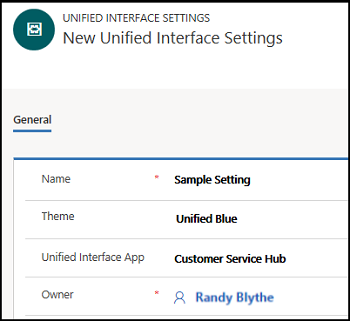

# Set default Unified Interface App using Unified Interface Settings

Unified Interface Settings is a new configuration element introduced under **Advanced Settings** in the Unified Service Desk Administrator app. Unified Interface Settings enables you as an administrator to configure the default Unified Interface App for your agents and transform the Unified Service Desk sign-in experience.  

 

In addition, you can now configure the settings like theme, Unified Interface app, and assign users (agents) to the Unified Interface Settings record. After creating a Unified Interface Settings record, you can assign this record to a configuration, so that when the users (agents) sign in to Unified Service Desk client, the system authenticates the users (agents) straight away without showing the application selection window.

> [!NOTE]
> The Unified Interface Settings configuration option is supported only on Unified Interface apps and not supported on Web Client.

## Create Unified Interface Settings record

1. Sign in to the Unified Service Desk Administrator app.
 
2. Select **Unified Interface Settings** under **Advanced Settings**.

3. Select **+ New** to create a new record in the **Active Unified Interface Settings** page.

4. Specify the following in the **New Unified Interface Settings** page.

    | Field  | Value  |
    |:----------|:----------|
    | Name         | Specify a name of the record.  For example, **Sample Setting**. |
    | Theme        | Select a theme for the App. There are two themes. - Air - Unified Blue |
    | Unified Interface App | Select a Unified Interface App for the record.   For example, **Customer Service Hub**.|
    | Owner | Add the user profile for the record by choosing the search icon. |
    
    

7. Select **Save & Close**.

## Add the Unified Interface Settings record to a Configuration

you can add the Unified Interface Settings record to a configuration in two ways:

- Assign a configuration the Unified Interface Settings page.
- Assign a Unified Interface Setting record to a configuration.

### Assign a configuration from the Unified Interface Settings page

1. Go to the Unified Interface Setting record for which you want to attach the configuration.

2. Choose **Related** > **Configuration**. 
   

3. In the **Configuration** tab, select **Add Existing Configuration**. 
  > [!Note]
  > You can select **Add New Configuration** to create and then add the configuration to the Unified Interface Settings record. In this walkthrough, we are attaching an already created configuration,**Test Configuration**, to the Unified Interface Settings record.
  
4. In the **Lookup Records** pane, specify the name of the configuration, and choose search icon.  The configuration appears, choose the configuration and then choose **Add**. 
   

The configuration is added successfully and appears in the **Configuration** tab.

### Assign a Unified Interface Settings record in the Configuration page

1. Sign in to the Unified Service Desk Administrator app.
 
2. Select **Configuration** under **Advanced Settings**.

3. Select **+ New** to create a configuration record.

4. In the **New Configuration** page, specify the required details for the fields. 

5. In the **Unified Interface Settings** field, type the name of the existing Unified Interface record you want to assign, and choose the search icon.  Select the record when it appears.. 
    
    >[!Note]
    > In the above step, we added an existing Unified Interface Settings record to the configuration. To create a new Unified Interface Settings record, see [How to create Unified Interface Setting record](#create-unified-interface-settings-record).

6. Select **Save & Close**.

## Login experience to Unified Service Desk

Here are the scenarios you need to consider for signing in to Unified Service Desk.

### Scenario 1: Users (agents) assigned to Configuration with a Unified Interface Settings record

Add users (agents) to a **Configuration** and add a record to the **Unified Interface Settings** field in the **Configuration**. When the user (agent) added to the configuration signs in to Unified Service Desk, the system authenticates the user (agent) and displays the landing page of the Unified Interface App. 

### Scenario 2: Users (agents) assigned to Configuration without a Unified Interface Settings record

Add users (agents) to a **Configuration**, and the **Unified Interface Settings** field is empty in the **Configuration**. In this scenario consider three cases:

 - If there is a default **Configuration** with a **Unified Interface Settings** record assigned, then the system authenticates the user (agent) and displays the landing page of Unified Interface App.

 - If there is a default **Configuration** with no **Unified Interface Settings** record, then during login, the system displays the application selection window for the user (agent) to select Unified Interface App.

 - If there is no default **Configuration**, then during login, the system displays the application selection window for the user (agent) to select Unified Interface App.

### Scenario 3: Users (agents) assigned to Configuration, and Unified Interface Settings record is not created

Add users (agents) to a **Configuration**, and no Unified Interface Settings records are created. As a result, there are no records to select for the **Unified Interface Settings** field in the **Configuration**. In this scenario, when the user (agent) assigned to a particular configuration signs in to Unified Service Desk, the application selection window is displayed and the user (agent) has to select the Unified Interface App.

## See also
 [Unified Interface Page (Hosted Control)](../../unified-service-desk/unified-interface-page-hosted-control.md)

 [Unified Service Desk and Unified Interface Configuration Walkthroughs](../../unified-service-desk/unified-service-desk-unified-interface-configuration-walkthroughs.md)

 [Walkthrough 1: Build a simple agent application for Unified Interface Apps](../../unified-service-desk/walkthrough1-unified-interface-build-a-simple-agent-application.md) 

 [Walkthrough 2: Display an external webpage in your agent application](../../unified-service-desk/walkthrough2-unified-interface-display-an-external-webpage-in-your-agent-application.md)  

 [Walkthrough 3: Display records in your agent application](../../unified-service-desk/walkthrough3-unified-interface-display-microsoft-dynamics-365-records-in-your-agent-application.md)  

 [Walkthrough 4: Display a record in a session in your agent application](../../unified-service-desk/walkthrough4-unified-interface-display-dynamics-365-record-session-agent-application.md)   

 [Walkthrough 5: Display enhanced session information by displaying session name and overview data](../../unified-service-desk/walkthrough5-unified-interface-display-enhanced-session-information-displaying-session-name-overview-data.md)  

 [Walkthrough 6: Configure the Debugger hosted control in your agent application](../../unified-service-desk/walkthrough6-unified-interface-configure-debugger-hosted-control-agent-application.md)
 
 [Walkthrough 7: Configure agent scripting in your agent application](../../unified-service-desk/walkthrough7-unified-interface-configure-agent-scripting-agent-application.md)

[!INCLUDE[footer-include](../../includes/footer-banner.md)]