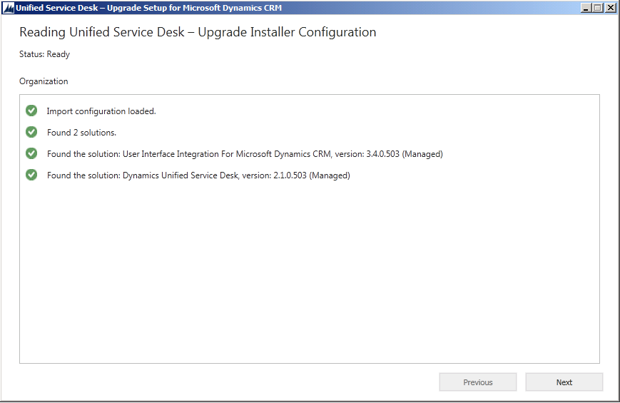

# Upgrading the solution
You can upgrade an existing Unified Service Desk sample application package to the latest Unified Service Desk by importing the Upgrade sample application package. The upgrade will not affect the configuration data associated with the existing solution.  
  
## Upgrade procedure  
 To upgrade a [!INCLUDE[pn_unified_service_desk](../../includes/pn-unified-service-desk.md)] solution, follow these steps.  
  
1. [Download](../download-unified-service-desk.md) the [!INCLUDE[pn_unified_service_desk](../../includes/pn-unified-service-desk.md)] sample application packages and [!INCLUDE[pn_package_deployer_long](../../includes/pn-package-deployer-long.md)] tool.  
  
2. Start [!INCLUDE[pn_package_deployer_long](../../includes/pn-package-deployer-long.md)], that will be used  to import the Upgrade sample application package. Alternatively, you can use [!INCLUDE[pn_PowerShell](../../includes/pn-powershell.md)] commands. [!INCLUDE[proc_more_information](../../includes/proc-more-information.md)] [Import-CrmPackage](/previous-versions/dynamicscrm-2016/deployment-administrators-guide/dn756301(v=crm.8))  
  
3. In the Package Deployer window, click **Continue**.  
  
4. Connect to the organization that you want to upgrade the current [!INCLUDE[pn_unified_service_desk](../../includes/pn-unified-service-desk.md)] solution.  
  
5. Under Select the import package to use, click **Unified Service Desk – Upgrade**, and then click **Next**.  
  
     
  
6. The Welcome to the Unified Service Desk – Upgrade Setup Tool page appears. Review the information about the components that will be upgraded, and then click **Next**.  
  
     
  
7. On the Ready to Install page, click **Next** to verify the components to upgrade.  
  
8. On the Reading Unified Service Desk – Upgrade Installer Configuration page, information about what will be upgraded is listed. Click **Next** to begin the upgrade.  
  
     
  
9. The Executing Install Actions page appears. Updating one or more solutions can take several minutes.  
  
10. The upgrade complete page appears. Click **Finish** to complete the upgrade.  
  
## See also  
 [Install, upgrade, and deploy Unified Service Desk](../../unified-service-desk/admin/install-upgrade-deploy-unified-service-desk.md)

[!INCLUDE[footer-include](../../includes/footer-banner.md)]