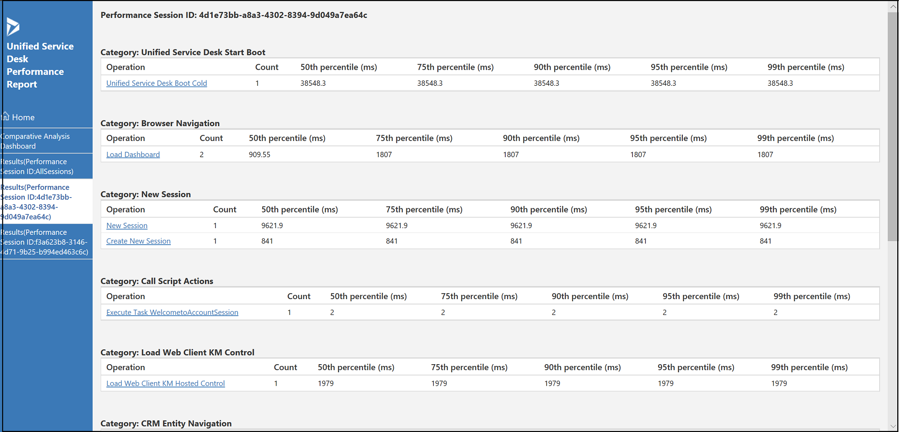
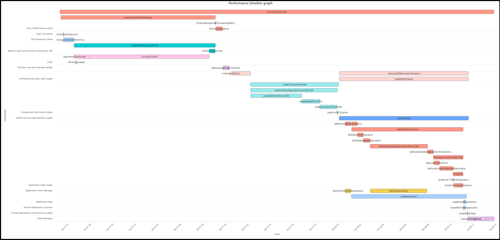
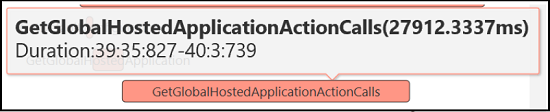

# Public Preview: View, read, and compare Unified Service Desk performance report

[!INCLUDE[cc-beta-prerelease-disclaimer](../../includes/cc-beta-prerelease-disclaimer.md)]

## View the performance report for a performance session

You can see a report with the performance session Id in the left pane. Selecting the report, you can see all the operations from various categories, and time consumed for the different percentiles in milliseconds.

## Compare operations from different reports (performance session)

Use the **Reports comparison** tab to review the comparative analysis of different operations based on the individual reports displayed in the performance report. The Report comparison tab displays sub tabs that has comparative analysis based on the percentiles. You can view the comparative analysis for 50th, 75th, 90th, 95th, and 99th percentile. The report shows **Operations ID** with an alphabet suffix and displays the comparison in terms of percentage. 

For example, time taken for the **Browser Navigation** operation under the category, **Load Dashboard** from the two different reports shows with the Operation ID. You can see the comparison between these operations displayed as **(a) vs (b)** in terms of percentage.

> [!NOTE]
> The readability and legibility of the comparison works best when you view three performance sessions in a report.

## View performance timeline graph and Performance details table

1. Select a performance session ID from the left pane of the report.

2. Select an operation from the list. 

3. Select the correlation ID from the list. 

The report displays the Performance timeline graph and Performance details table.

## Read the performance timeline graph and the details table

The timeline graph displays the time taken for an operation in terms of time consumed by each method under every class. The Y-axis displays the operation name and the X-axis displays the timeline.

Hover the cursor on any method name to see the time consumed.

> [!div class="nextstepaction"]
> [Categories and operations](operations-categories.md)

## See also

[Overview of Unified Service Desk Performance Analyzer](overview-performance-analyzer.md)

[Download Unified Service Desk Performance Analyzer](download-performance-analyzer.md)

[Generate (collect) performance data log](performance-data-collection-using-keyboard-shortcut.md)

[Generate performance report](generate-performance-report.md)

[Overview of performance report user interface](overview-performance-report-user-interface.md)

[Terminologies in the performance report](terminologies-performance-report.md)

[!INCLUDE[footer-include](../../includes/footer-banner.md)]