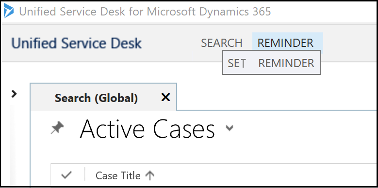

# Configure JAWS Screen Reader for Unified Service Desk

[!INCLUDE[pn-jaws](../includes/pn-jaws.md)] (Job Access With Speech) is a computer screen reader program for Microsoft Windows that allows blind and visually impaired users to read the screen either with a text-to-speech output or by a refreshable Braille display.

[!INCLUDE[pn-unified-service-desk](../includes/pn-unified-service-desk.md)] supports [!INCLUDE[pn-jaws](../includes/pn-jaws.md)] version 18 for Windows screen reader for speech output in the [!INCLUDE[pn-unified-service-desk](../includes/pn-unified-service-desk.md)] client. All the [!INCLUDE[pn-unified-service-desk](../includes/pn-unified-service-desk.md)] controls and custom controls that are part of the Web Client package  are JAWS compliant. For the custom controls that you develop as part of the solution package, you need to define the necessary properties to make the controls JAWS compliant.

## JAWS support for focusable controls (Interactive controls)
You can configure [!INCLUDE[pn-jaws](../includes/pn-jaws.md)] screen reader support for controls that are focusable (Interactive controls), such as buttons, list box, menu, radio button, and check box.

For [!INCLUDE[pn-jaws](../includes/pn-jaws.md)] screen reader to read a focusable control, you must specify a value for the [AutomationProperties.Name Attached Property](/dotnet/api/system.windows.automation.automationproperties.name). 

For example:

```<Button Width="30" Height="30" Name="Save" ToolTip="Click to save the doc." AutomationProperties.Name="Save" Focusable="True" IsTabStop="True">```

## JAWS support for tooltip

By default, [!INCLUDE[pn-jaws](../includes/pn-jaws.md)] screen reader does not support reading toolbar button tooltip text. However, you can create [!INCLUDE[pn-jaws](../includes/pn-jaws.md)] custom scripts to enable [!INCLUDE[pn-jaws](../includes/pn-jaws.md)] screen reader to read tooltip text.

Here is a sample script for checking button name and tooltip text (help text). 
In [!INCLUDE[pn-unified-service-desk](../includes/pn-unified-service-desk.md)], if you do not configure the tooltip text explicitly, the system applies the button name to the tooltip text. In such case, [!INCLUDE[pn-jaws](../includes/pn-jaws.md)] read both the button name and the tooltip text. To avoid reading the button name and tooltip text, you can create a custom script to check whether the button name and tooltip text is same.

In the sample script, if the help text is not the same as button name, [!INCLUDE[pn-jaws](../includes/pn-jaws.md)] screen reader reads the tooltip (help text).

```
include "hjConst.jsh"
void function SayObjectTypeAndText(int nLevel)
SayObjectTypeAndText(nLevel)
if nLevel == 0
   var string sHelp = GetObjectHelp()
   var string objName = GetObjectName()
   if sHelp && sHelp != objName // If help text is not equal to the object name, the JAWS screen reads the help text
      Say(sHelp,ot_help)
   endIf
endIf
EndFunction
```
In the example image, the button name and the tooltip text is same: **REMINDER**. In this scenario, the script checks for the button name and tooltip text, which is different and hence, [!INCLUDE[pn-jaws](../includes/pn-jaws.md)] does not read the tooltip text.


In the example image, the **REMINDER** button name is different than the tooltip text: **SET REMINDER**. In this scenario, the [!INCLUDE[pn-jaws](../includes/pn-jaws.md)] screen reads the tooltip text.



You can write script for your application in [!INCLUDE[pn-jaws](../includes/pn-jaws.md)]. For more information about writing scripts, see [Basics of Scripting Manual](https://www.freedomscientific.com/Content/Documents/Other/ScriptManual/01-0_Introduction.htm).

After you write the script, name the file as per the product name (example: UnifiedServiceDesk.jss). These are called application script file, and must be saved in either the [!INCLUDE[pn-jaws](../includes/pn-jaws.md)] shared or user settings folder in order to be loaded with the application at run-time. More information: [JAWS Scripts and Script Files](https://www.freedomscientific.com/Content/Documents/Other/ScriptManual/03-1_JAWSScriptsAndScriptFiles.htm).

## JAWS support for non-focusable controls (Non-Interactive controls)

By design of the product, the tab position does not focus the non-focusable controls (Non-interactive controls). Hence, [!INCLUDE[pn-jaws](../includes/pn-jaws.md)] screen reader does not read controls that are non-focusable, such as text block, image, and labels.

### Workaround

One of the ways to enable [!INCLUDE[pn-jaws](../includes/pn-jaws.md)] screen reader to read the non-focusable controls is to wrap the non-focusable control using the **UserControl** element, which enables the JAWS to read the non-focusable controls. 

> [!NOTE]
> This method of enabling [!INCLUDE[pn-jaws](../includes/pn-jaws.md)] screen reader support for non-focusable controls is just a workaround, and not the officially recommended way.

When [!INCLUDE[pn-jaws](../includes/pn-jaws.md)] reader lands on the first focusable control, reads the non-focusable controls and then reads the focusable controls.

The XAML example for Session Overview control displays you the **UserControl** wrapping of the grid.
```
<TabControl xmlns:controlStyles="clr-namespace:Microsoft.Crm.UnifiedServiceDesk.Dynamics.Controls.Styles;assembly=Microsoft.Crm.UnifiedServiceDesk.Dynamics">
    <controlStyles:USDTab Header="General">
<UserControl>
        <Grid Margin="0"
          xmlns:x="https://schemas.microsoft.com/winfx/2006/xaml"
          xmlns:CCA="clr-namespace:Microsoft.Crm.UnifiedServiceDesk.Dynamics;assembly=Microsoft.Crm.UnifiedServiceDesk.Dynamics">
<Grid.Resources>
<CCA:CRMImageConverter x:Key="CRMImageLoader" />
<Style x:Key="ImageLogo" TargetType="{x:Type Image}">
<Setter Property="Width" Value="16" /> 
<Setter Property="Height" Value="16" /> 
<!--<Setter Property="Margin" Value="5" /> -->
</Style>
    </Grid.Resources>            
<Grid.RowDefinitions>
                <RowDefinition Height="auto" />
                <RowDefinition Height="auto" />
                <RowDefinition Height="auto" />
                <RowDefinition Height="auto" />
                <RowDefinition Height="auto" />
                <RowDefinition Height="auto" />
            </Grid.RowDefinitions>
         <TextBlock Margin="5,6,0,0" Grid.Row="0" TextWrapping="Wrap" Padding="5,0,0,5"  FontFamily="Tohoma" FontSize="12" Text="Account Name: [[account.name]x]"   Foreground="#262626"/>
<TextBlock Margin="5,0,0,0" Grid.Row="4" TextWrapping="Wrap" Padding="3,0,0,3" FontFamily="Tohoma" FontSize="12" Style="{DynamicResource AutoCollapse}" Text="[[$Context.RevenuePotential]+]" />
<!--<TextBlock Margin="5,0,0,0" Grid.Row="1" TextWrapping="Wrap" Padding="3,0,0,3" Grid.ColumnSpan="3" FontFamily="Tohoma" FontSize="12" Style="{DynamicResource AutoCollapse}" Text="Phone: [[account.telephone1]x]"/>-->
<StackPanel  Orientation="Horizontal"  Grid.Row="2" Margin="5,0,0,0">
<Image Style="{DynamicResource ImageLogo}" Source="{Binding Source=msdyusd_Phone16, Converter={StaticResource CRMImageLoader}}" />
     <TextBlock  TextWrapping="Wrap" Padding="5,0,0,5" Text="Phone: " VerticalAlignment="Center"   Foreground="#262626" />
     <TextBlock  Padding="5,0,0,5" VerticalAlignment="Center">
     <Hyperlink Command="CCA:ActionCommands.DoActionCommand" CommandParameter="https://uii/CRM Global Manager/LaunchURL?callto:tel:[[account.telephone1]u+]" FontFamily="Tohoma" FontSize="12">[[account.telephone1]+]</Hyperlink>
       </TextBlock>
   </StackPanel >
<StackPanel  Orientation="Horizontal"  Grid.Row="1" Margin="5,0,0,0">
<Image Style="{DynamicResource ImageLogo}" Source="{Binding Source=msdyusd_Email16, Converter={StaticResource CRMImageLoader}}" />
<Label >
<TextBlock  TextWrapping="Wrap" Padding="3,0,0,3" Text="Email: [[Current Account.emailaddress1]+x]"   Foreground="#262626" />
</Label>
</StackPanel>
<TextBlock Margin="5,0,0,0" Grid.Row="3" TextWrapping="Wrap" Padding="5,0,0,5" Grid.ColumnSpan="3" FontFamily="Tohoma" FontSize="12" Style="{DynamicResource AutoCollapse}" Text="Primary Contact: [[account.primarycontactid.name]x]"   Foreground="#262626" />
</Grid>
</UserControl>
</controlStyles:USDTab>
<controlStyles:USDTab Header="Social Info">
    <Grid Margin="1"
       xmlns:x="https://schemas.microsoft.com/winfx/2006/xaml"
       xmlns:CCA="clr-namespace:Microsoft.Crm.UnifiedServiceDesk.Dynamics;assembly=Microsoft.Crm.UnifiedServiceDesk.Dynamics">
     <Grid.RowDefinitions>
        <RowDefinition Height="auto" />
        <RowDefinition Height="auto" />
        <RowDefinition Height="auto" />
     </Grid.RowDefinitions>
      <TextBlock Margin="5,6,0,0" FontSize="12" Height="20" Grid.Row="0" Text="Twitter:     "   Foreground="#262626" >
       <Hyperlink Command="CCA:ActionCommands.DoActionCommand" CommandParameter="https://uii/Twitter/Navigate?about:blank">
               [[Account.msdyusd_twitter]x+]
       </Hyperlink>
     </TextBlock>
     <TextBlock Margin="5,0,0,0" FontSize="12" Height="50" Grid.Row="2"  Text="Facebook: "   Foreground="#262626">
        <Hyperlink Command="CCA:ActionCommands.DoActionCommand" CommandParameter="https://uii/Facebook/Navigate?about:blank">
                    [[Account.msdyusd_facebook]x+]
        </Hyperlink>
       </TextBlock>
        </Grid>
    </controlStyles:USDTab>
</TabControl>
```


[!INCLUDE[footer-include](../includes/footer-banner.md)]