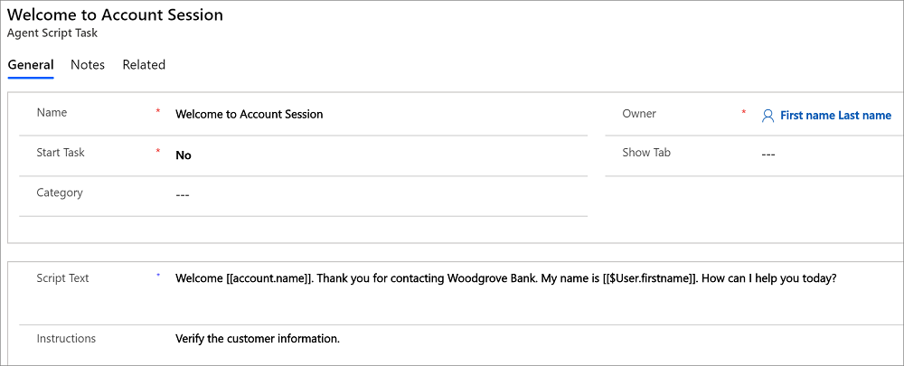
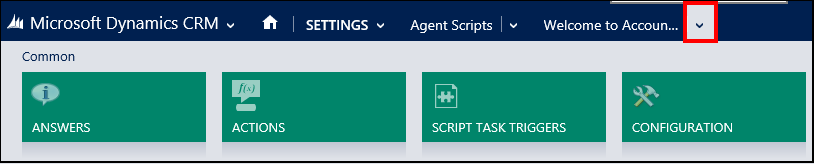
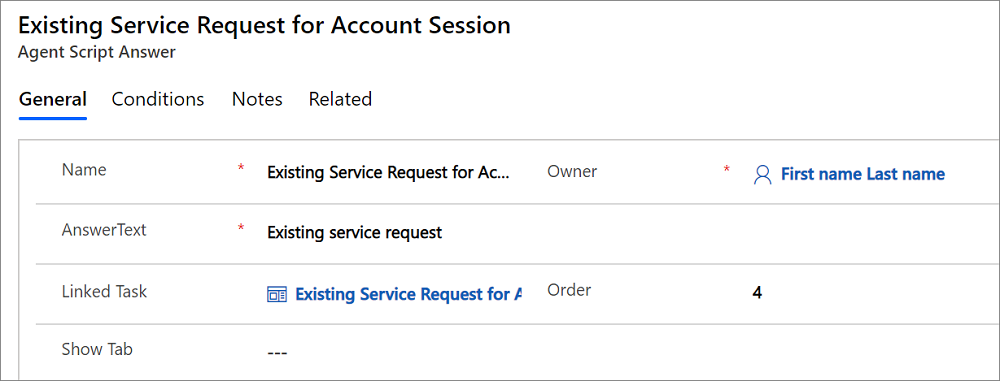
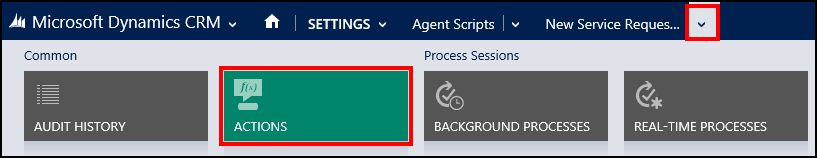

# Configure and manage agent scripts
Each step in an agent script is represented as an agent script task. An agent script task can have one or more answers (choices) for the next steps; the answers are represented as a stack of buttons in the agent script area in your application. An action can be performed on clicking one of the answers or when you go to the next task. This topic provides information on how you can create an agent script task, and then configure it by adding answers, actions, and triggers.  

 For more information about how agent scripts work in [!INCLUDE[pn_unified_service_desk](../includes/pn-unified-service-desk.md)], see [Guide customer interactions with agent scripts](../unified-service-desk/guide-customer-interactions-agent-scripts.md). For a walkthrough that demonstrates the agent scripting functionality, see [Walkthrough 7: Configure agent scripting in your agent application](../unified-service-desk/walkthrough-configure-agent-scripting-agent-application.md).  

   
## Create an agent script task  

1. Sign in to the Common Data Service platform..  

2. [!INCLUDE[proc_settings_usd](../includes/proc-settings-usd.md)]  

3. Click **Agent Scripts**. The page displays available agent script tasks.  

     

4. Click **NEW** on the command bar, and then specify the following information in the **New Agent Script Task** page:  

   |      Field       |                                                                                                                                                                                                                                                                                                                                                                                       Description                                                                                                                                                                                                                                                                                                                                                                                       |
   |------------------|-----------------------------------------------------------------------------------------------------------------------------------------------------------------------------------------------------------------------------------------------------------------------------------------------------------------------------------------------------------------------------------------------------------------------------------------------------------------------------------------------------------------------------------------------------------------------------------------------------------------------------------------------------------------------------------------------------------------------------------------------------------------------------------------|
   |     **Name**     |                                                                                                                                                                                                                                                                                                                                                              A name that will appear in the current step and history area.                                                                                                                                                                                                                                                                                                                                                              |
   |  **StartTask**   | Select **Yes** or **No**:   - **Yes**: This task will be displayed at the start of a session.  Typically, a user’s security will provide them only one start task.  Start tasks may represent functional areas or skills of the agent.  As agents get more experienced, they may get more start tasks (cross training).  If two or more start tasks are assigned to an agent, a special **[Main Menu]** will be displayed as the first task to the agent.  The buttons will then become the start tasks that the user may access. - **No**: These may be accessed from answers of other tasks or you may call [GoToTask](../unified-service-desk/agent-scripting-hosted-control.md#GoToTask) action on the **Agent Scripting** hosted control to access a specific task. |
   |   **Show Tab**   |                                                                                                                                                                                                                                        Select the hosted control (tab) that should be set to focus when this task is reached by the user.  This may be used to place the user on the control that will help to perform the actions that are needed for this task step.  If this field is left blank, no change will be made to the focused tab.                                                                                                                                                                                                                                        |
   |   **Category**   |                                                                                                                                                                                                                                                                                     Specify a category name to group, filter, or sort agent script tasks while managing agent script tasks.   The category value is not used by agents in the client application.                                                                                                                                                                                                                                                                                      |
   |  **ScriptText**  |                                                                                                                                                                                                                        This is the script that the agent should read to the caller at this stage.  This field supports replacement parameters.  To insert the context variable, **fullname** into the script, type **[[fullname]]** into the flow of the script.  At runtime, it will replace this text with the value from the context for the current session.                                                                                                                                                                                                                        |
   | **Instructions** |                                                                                                                                                                                                                                                                                                   These are instructions to the user for what they should do to complete their work.  This is displayed in a slightly different font than the **Script Text** to help distinguish it.                                                                                                                                                                                                                                                                                                   |

5. Click **Save** to save the record, and activate the **Answers** area.  

   The following image shows a typical agent script task definition.  

     

   
## Add answers to an agent script task  
 A task can have a series of answers attached to it.  Each answer is represented as a button in the user interface below the script and instructions.  

 To add answers to an agent script task:  

1. Open an agent script task definition by clicking its name on the agent scripts page (**Settings** > **Unified Service Desk** > **Agent Scripts**).  

2. You can add answers in either of the following two ways:  

   -   In the **Answers** area of the agent script task definition page, click **+**.  

   -   On the nav bar, click the down arrow next to the agent script task name, click **Answers**, and then click **Add Existing Agent Script Answer**.  

     

3. In the search box for existing answers, either click the search icon or press ENTER. From the search results, click **New** at the bottom of the search results pane.  

4. On the **New Agent Script Answer** page, specify the following details:  

   |      Field      |                                                                              Description                                                                              |
   |-----------------|-----------------------------------------------------------------------------------------------------------------------------------------------------------------------|
   |    **Name**     | This is a descriptive name for the answer.  This name will not be seen by the agent.  It is useful for administrative purposes in distinguishing it from other tasks. |
   | **AnswerText**  |                                                    This is the label shown on the button in the agent application.                                                    |
   | **Linked Task** |                               When the user clicks this answer (the button in the client application), they will go to the linked task.                               |
   |    **Order**    |         Defines the order of the appearance of the answer (button) in the client application if there are multiple answers attached to an agent script task.          |

5. Click **Save** to save the record.  

   The following image shows a typical answer definition.  

     

   
## Add action calls to an answer  
 After adding answers to an agent script task, you must attach the action calls to your answers, which define the list of actions to be performed in the agent application when the agent clicks the answer. These action calls occur before the transition to the next task.  Action calls are the mechanism in [!INCLUDE[pn_unified_service_desk](../includes/pn-unified-service-desk.md)] to call a UII action defined for a hosted control. For more information, see [Action calls](../unified-service-desk/action-calls.md).  

 To add action calls to an answer:  

1. Open an existing agent script answer.  

2. On the nav bar, click the down arrow next to the answer name, and click **Actions**.  

     

3. On the next page, Click **Add Existing Action Call** to search for an action call to add it to the answer. Type a name for the action call that you want to add, and press ENTER or click the search icon. To do a wildcard search, type a part of the action call name within asterisks (*); for example **\*account\\***. This will display all the action calls in the search results pane that have “account” in their name.  

    You can also create a new action call by clicking **New** at the bottom of the search results pane. For information about creating a new action call, see [Create an action call for a UII action](../unified-service-desk/create-action-call-uii-action.md).  

4. You can add multiple action calls to an answer. After adding multiple action calls, double click each action call in the list, and specify the **Order** in which you want an action call to be executed when the agent clicks the answer.  

5. Click **Save** to save the record.  

   These actions are often used when a general task is the next step.  That way different answers can perform different actions but end at the same task, thus reducing the number of tasks needed to satisfy the business process.  

   
## Add action calls to an agent script task  
 These are the action calls at the task level, and each action in the list is executed when the agent reaches the task in the client application.  This might include automations of the visible application or other actions that satisfy the business requirements.  

 To add an action call for to an agent script task:  

1. Open an agent script task definition by clicking its name on the agent scripts page (**Settings** > **Unified Service Desk** > **Agent Scripts**).  

2. On the nav bar, click the down arrow next to the agent script task name, and then click **Actions**.  

     

3. On the next page, Click **Add Existing Action Call** to search for an action call to add it to the agent script task. Type a name for the action call that you want to add, and press ENTER or click the search icon. To do a wildcard search, type a part of the action call name within asterisks (*); for example **\*account\\***. This will display all the action calls in the search results pane that have “account” in their name.  

    You can also create a new action call by clicking **New** at the bottom of the search results pane. For information about creating a new action call, see [Create an action call for a UII action](../unified-service-desk/create-action-call-uii-action.md).  

4. You can add multiple action calls to an answer. After adding multiple action calls, double click each action call in the list, and specify the **Order** in which you want an action call to be executed when the agent reaches the task.  

5. Click **Save** to save the record.  

   
## Add triggers to an agent script task  
 These are variables used to refer to a specific task. To add an agent script task trigger:  

1. Open an agent script task definition by clicking its name on the agent scripts page (**Settings** > **Unified Service Desk** > **Agent Scripts**).  

2. On the nav bar, click the down arrow next to the agent script task name, and then click **Script Task Triggers**.  

     

3. On the next page, Click **Add New Script Task Trigger**.  

4. On the **New Script Task Trigger** page, specify the following information:  

   |  Field   |                                                                                                                                                                                                                                                                                                                                     Description                                                                                                                                                                                                                                                                                                                                      |
   |----------|--------------------------------------------------------------------------------------------------------------------------------------------------------------------------------------------------------------------------------------------------------------------------------------------------------------------------------------------------------------------------------------------------------------------------------------------------------------------------------------------------------------------------------------------------------------------------------------------------------------------------------------------------------------------------------------|
   | **Name** |                                                                                                                                                                                                                                                                                          This is a descriptive name for the script task trigger.  This name will not be seen by the agent.                                                                                                                                                                                                                                                                                           |
   | **Type** | Select from the following options:   - **DNIS**: This is primarily meant for CTI integration scenario. Select this to execute an agent script task based on an incoming call. **Note:** [!INCLUDE[pn_unified_service_desk](../includes/pn-unified-service-desk.md)] does not ship with any out-of-box CTI adapters. This is only applicable if you are using any CTI solution with [!INCLUDE[pn_unified_service_desk](../includes/pn-unified-service-desk.md)]. For more information about CTI, see [Integrate CTI applications with Unified Service Desk](../unified-service-desk/integrate-cti-systems-cti-adapters.md). - **Other**: Use this for other scenarios. |
   | **Data** |                                                                                                                                                                                                                                                                                                                            Specify the data to be passed.                                                                                                                                                                                                                                                                                                                            |

5. Click **Save** to save the record.  

   
## Tips on configuring agent scripts  
 Agent scripts can be used with CTI solutions to provide a highly customized customer-centric experience for your agents. For example, in case of an outsourced call center that may be representing multiple companies, you can use the **DNIS** agent script trigger to display the right script based on the phone number of the calling customer. The script text may also be used for disclaimers that must be read out to the customer as part of legal compliance on sales calls.  

 You can use the answers to represent categories for call classification.  Once the call has been classified, a case will be created and auto filled using an action. This method can be combined with the ToDo list to make for a powerful work task list.  

 An interesting feature about agent script tasks is that whenever a task is reached in the agent scripting component, the entire contents of the entity that makes up that task is placed into the replacement parameter list in the [!INCLUDE[pn_unified_service_desk](../includes/pn-unified-service-desk.md)] data context.  This can be used to extend the agent script entity to add email template text so that whenever the agent reaches a step in the script, the email template text will be available in the [!INCLUDE[pn_unified_service_desk](../includes/pn-unified-service-desk.md)] data context to be used to populate an email.  

### See also  
 [Guide customer interactions with agent scripts](../unified-service-desk/guide-customer-interactions-agent-scripts.md)   
 [Agent Scripting (Hosted Control)](../unified-service-desk/agent-scripting-hosted-control.md)   
 [Unified Service Desk Configuration Walkthroughs](../unified-service-desk/unified-service-desk-configuration-walkthroughs.md)   
 [Overview of configuring agent application](../unified-service-desk/configure-agent-application-unified-service-desk.md)
