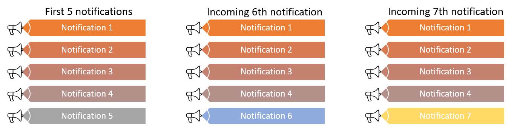

# How to configure notifications in Unified Service Desk
Configure notifications in [!INCLUDE[pn_unified_service_desk](../includes/pn-unified-service-desk.md)] to display popup notification messages to your customer service agents that contains general information or some customer or process-related information that the agent can act on. The layout and behavior of the notification message is defined in XAML format by using forms in [!INCLUDE[pn_unified_service_desk](../includes/pn-unified-service-desk.md)], and displayed as a floating popup message using the new hosted control type, `Popup Notification`. [!INCLUDE[proc_more_information](../includes/proc-more-information.md)] [Popup Notification (Hosted Control)](../unified-service-desk/popup-notification-hosted-control.md)  
  
 Notifications support [!INCLUDE[pn_unified_service_desk](../includes/pn-unified-service-desk.md)] actions, events, and replacement parameters for you to define popup messages that appear when particular events occur, interact with other hosted controls, and display contextual information from a session. You can define multiple notifications to appear at the same time. You can define the position where the notification can be displayed in the agent application, and the timeout information after which the notification automatically disappears.  
  
 Notifications can be global or session-based. Global notifications are displayed outside of a session and will hide only if it times out or is explicitly closed by the user. Session-based notifications appear only within a session, and switching to another session will hide the notification. Switching back to the session with notification displays the notification again until it times out or is explicitly closed by the user.

::: moniker range="<=dynamics-usd-4"

## Navigate on the notifications using keyboard shortcuts

You can use the Alt+1 keys (default) to set your focus on a notification. If there are multiple notifications displayed, you can press Alt+1 repeatedly to cycle through all the active notifications on your screen. To change the default keyboard shortcut keys for notifications, use the new **PopupNavigationShortcut** UII option to specify the shortcut keys of your choice. More information: [Manage Options for Unified Service Desk](admin/manage-options-unified-service-desk.md)

::: moniker-end

::: moniker range=">=dynamics-usd-4.1"

## Navigate on the notifications using keyboard shortcuts

You can use default keyboard shortcuts to navigate to, shift focus to and from the notifications. To change the default keyboard shortcuts, create the UII option and set the keyboard value of your choice. To learn more, see [Manage Options for Unified Service Desk](admin/manage-options-unified-service-desk.md).

| UII option              | Default keyboard shortcuts | Description |
|-------------------------|----------------------------|-------------|
| `PopupNavigationShortcut` | Alt+1                      | Sets focus on a notification.  |
| `PopupEscapeShortcut`     | Shift+Esc                  | Sets focus on the Unified Service Desk client application from the notification. |
| `PopupMoveUpShortcut`     | Shift+Up Arrow key         | Move up from one notification to another when notifications are displayed as stack. |
| `PopupMoveDownShortcut`   | Shift+Down Arrow key       | Move down from one notification to another when notifications are displayed as stack. |
| `PopupMoveLeftShortcut`   | Shift+Left Arrow Key       | Move left from one notification to another when multiple notifications are displayed. |
| `PopupMoveRightShortcut`  | Shift+Right Arrow Key      | Move right from one notification to another when multiple notifications are displayed. |

::: moniker-end
  
<a name="Define"></a>   
## Define layout and behavior of notification using forms  
 Use [!INCLUDE[pn_unified_service_desk](../includes/pn-unified-service-desk.md)] forms to define the layout and behavior of your forms. When you define a new form record, you specify your XAML in the **Markup** field of the form record to define the layout.  
  
   
  
> [!NOTE]
>  You should have prior knowledge of [!INCLUDE[pn_ms_Windows_Presentation_Foundation](../includes/pn-ms-windows-presentation-foundation.md)] and XAML scripting for defining the layout and behavior of the form.  
  
<a name="CommandBinding"></a>   
### Command binding to execute UII actions, action calls, and events from notification  
 There are custom WPF commands available in [!INCLUDE[pn_unified_service_desk](../includes/pn-unified-service-desk.md)] (Microsoft.Crm.UnifiedServiceDesk.Dynamics assembly) that can be associated to WPF controls such as buttons and hyperlinks in the form XAML to be hosted inside the notification control. The commands can be associated to the controls that implement the [ICommandSource](https://msdn.microsoft.com/library/system.windows.input.icommandsource\(v=vs.110\).aspx) interface. [!INCLUDE[proc_more_information](../includes/proc-more-information.md)] [Commanding Overview](https://msdn.microsoft.com/library/ms752308\(v=vs.110\).aspx).  
  
 The commands can be used to execute actions on any hosted control or fire events from the notification control that hosts the form XAML.  
  
> [!IMPORTANT]
>  The command values mentioned below to be specified in the form XAML have the namespace alias as CCA which is to be defined in the root element of the XAML as follows:  
>   
>  `xmlns:CCA="clr-namespace:Microsoft.Crm.UnifiedServiceDesk.Dynamics;assembly=Microsoft.Crm.UnifiedServiceDesk.Dynamics"`  
  
- **UII action**: To execute a UII action from the form XAML, specify the following values for `Command` and `CommandParameter`.  
  
     `Command`  
     CCA:ActionCommands.DoActionCommand  
  
  **CommandParameter**  
     The command parameter must contain the name of the hosted control on which the action is to be executed, the name of the UII action, and the optional action data. All these values have to be specified in the following URL format: `https://uii/[HostedControlName]/[UIIActionName]?[ActionData]`.  
  
     Note that the different parts of the URL must be encoded if required as per standard guidelines. For example, the space character has to be encoded as “%20” or ‘+’.  
  
  **Example**  
     Suppose there is a hosted control named `Contact` of type **CRM Page**, and you want to execute the `Open_CRM_Page` action on this control with the following action data:  
  
    ```  
    LogicalName=contact  
    id=[[contact.Id]]  
    ```  
  
     Then, you need to pass the following URL as the `CommandParameter` value in your form XAML:  
  
    ```xaml  
    https://uii/Contact/Open_CRM_Page?LogicalName%3Dcontact%0D%0Aid%3D%5B%5Bcontact.Id%5D%5D  
    ```  
  
     Further you can associate the command with a button select in the form XAML as follows:  
  
    ```xaml  
    <Button Command="CCA:ActionCommands.DoActionCommand"  
    CommandParameter="https://uii/Contact/Open_CRM_Page?LogicalName%3Dcontact%0D%0Aid%3D%5B%5Bcontact.Id%5D%5D"  
    ```  
  
- **Action call**: This serves as an alternative to executing a UII action on a hosted control where you don't want to encode the action data and put it in the XAML. To execute an action call from the form XAML, specify the following values for `Command` and `CommandParameter`.  
  
     `Command`  
     CCA:ActionCommands.DoActionCommand  
  
  **CommandParameter**  
     The command parameter must contain the name of the action call to be executed, and must be specified in the following URL format: `https://actioncall/[ActionCallName]`.  
  
     Note that the action call name must be URL encoded if it contains spaces or special characters. For example, the space character has to be encoded as “%20” or ‘+’.  
  
  **Example**  
     Suppose you want to execute an action call named `Open Contact Page`.  
  
     Then, you need to pass the following URL as the `CommandParameter` value in your form XAML:  
  
    ```xaml  
    https://actioncall/Open+Contact+Page  
    ```  
  
- **Event**: To execute an event from the form XAML, specify the following values for `Command` and `CommandParameter`.  
  
     `Command`  
     CCA:ActionCommands.UIIEvent  
  
  **CommandParameter**  
     The command parameter must contain the event name optionally followed by a question mark (?) and event parameters in the form of a query string. Each parameter is specified as a “name = value” pair where both name and value need to be URL encoded if required. Further, parameters must be separated using "&amp;".  
  
     Specify the command parameter in the following format: `[EventName]?[Name]=[Value]&amp;[Name]=[Value]`  
  
  **Example**  
     Suppose you want to fire an event named `OK` with following parameters.  
  
    ```  
    Name1=Value1  
    Name2=My Value  
    ```  
  
     Then, you need to pass the following as the `CommandParameter` value in your form XAML:  
  
    ```xaml  
    OK?Name1=Value1&amp;Name2=My+Value  
    ```  
  
<a name="Countdown"></a>   
### Display countdown timer in notifications  
 You can use the `TimeoutProperty` parameter to display a countdown timer for your notification message until which the message will be displayed. The timeout value for a notification control is defined when you configure the action to show the control. [!INCLUDE[proc_more_information](../includes/proc-more-information.md)] [How to configure a notification?](#HowTo)  
  
 For example, you can add a label element in form  XAML that is bound to the `TimeoutProperty` parameter to display countdown in seconds after which the notification message will be closed. For example:  
  
```xaml  
<TextBlock Foreground="White" x:Name="lblElapsedTime" Margin="0,0,9,0"   
           HorizontalAlignment="Right" VerticalAlignment="Center" FontSize="20"   
           Grid.Column="1" Text="{Binding TimeoutProperty}" FontFamily="Calibri" />  
```  

  
### Sample XAML for notification  
 The following sample XAML displays a notification based on the max number of sessions value configured in the replacement parameter for your instance, and displays a notification when you reach the session limit.  
  
```xaml  
<Border xmlns="https://schemas.microsoft.com/winfx/2006/xaml/presentation"  
        xmlns:x="https://schemas.microsoft.com/winfx/2006/xaml"   
xmlns:CCA="clr-namespace:Microsoft.Crm.UnifiedServiceDesk.Dynamics;assembly=Microsoft.Crm.UnifiedServiceDesk.Dynamics"  
BorderBrush="Blue" BorderThickness="1">  
        <Grid Background="AliceBlue" Height="100" Width="400">  
<Grid.Resources>  
 <CCA:CRMImageConverter x:Key="CRMImageLoader" />  
<Style x:Key="ImageLogo" TargetType="{x:Type Image}">  
<Setter Property="Width" Value="16" />   
<Setter Property="Height" Value="16" />   
<!--<Setter Property="Margin" Value="5" /> -->  
</Style>  
    </Grid.Resources>   
            <Grid.RowDefinitions>  
                <RowDefinition Height="75"/>  
                <RowDefinition Height="*"/>  
            </Grid.RowDefinitions>  
            <Grid.ColumnDefinitions>  
            </Grid.ColumnDefinitions>  
            <Grid Grid.Row="0">  
                <Grid.ColumnDefinitions>  
                    <ColumnDefinition Width="50"/>  
                    <ColumnDefinition Width="350"/>  
                </Grid.ColumnDefinitions>  
<Image Style="{DynamicResource ImageLogo}" Source="{Binding Source=msdyusd_Email16, Converter={StaticResource CRMImageLoader}}" Grid.Column="0" />  
                <TextBlock TextWrapping="Wrap" Grid.Column="1" Text="You can have a maximum of [[$Global.maxNumberOfSessions]+] concurrent sessions open. To open a new session, close at least one of the existing ones."/>  
            </Grid>  
            <Grid Background="SkyBlue" Grid.Row="1">  
                <Grid.ColumnDefinitions>  
                    <ColumnDefinition Width="300"/>  
                    <ColumnDefinition Width="100"/>  
                </Grid.ColumnDefinitions>  
                <TextBlock Grid.Column="0">  
                    <Run Text="The notification closes in " />  
                    <Run Text="{Binding TimeoutProperty}" />  
                    <Run Text=" seconds"/>  
                </TextBlock>  
                <Button Height="20" Width="90" Grid.Column="1" Foreground="Black" Command="CCA:ActionCommands.UIIEvent" CommandParameter="Cancel">Close</Button>  
            </Grid>  
        </Grid>  
    </Border>  
```  
  
<a name="Show"></a>   
## Show notifications using Popup Notification control  
 Use predefined actions for the `Popup Notification` control to show, hide and close a notification message.  
  
 Using the `Show` action, you can specify the form name to display, the position on the screen where you want the notification message to be displayed, and the time duration for the notification to be displayed. [!INCLUDE[proc_more_information](../includes/proc-more-information.md)] [Predefined UII Actions](../unified-service-desk/popup-notification-hosted-control.md#Actions).

 Use predefined events for the `Popup Notification` control to respond to user actions performed in the notification message as explained earlier. You can also add additional actions for an event that gets executed when the event occurs. [!INCLUDE[proc_more_information](../includes/proc-more-information.md)] [Predefined Events](../unified-service-desk/popup-notification-hosted-control.md#events). 

<a name="Consume"></a>
## Consume event parameters in the form used for notifications
The form used in the `Show` action of the Popup Notification control can also consume parameters of the event that triggered the `Show` action call.

Action calls in Unified Service Desk can use event parameters as replacement parameters in the action data . To make some or all of these event parameters available in the form XAML, you can add additional parameters in the `Show` action other than the pre-defined ones. For example, one extra `Show` action parameter can be added as:
 
`Param1 = [[EventParam1]+]` where `EventParam1` is one of the parameters of the event that triggered the `Show` action call.

The added custom parameter can be used in the form XAML as replacement parameter like any other replacement parameter. In the above example, `[[Param1]]` can be used in the form XAML to show some data. 
  
<a name="Multiple"></a>   
## Multiple notification controls
 
::: moniker range="dynamics-usd-3" 
 You can  configure multiple notification controls and invoke actions independently of each other. When multiple notifications are shown at the same time, all the notifications are visible in the order in which they were invoked. If two global notifications are configured to be displayed at the same  position, the latest one will overlay on top of the earlier notification. Similarly, if a global and session-based notifications or multiple session-based notifications are  configured to be displayed at the same  position in a session, the latest one will overlay on top of the earlier notification in the session.
::: moniker-end

::: moniker range=">=dynamics-usd-4" 
 You can  configure multiple notification controls and invoke actions independently of each other. <!--When multiple notifications are shown at the same time, all the notifications are visible in the order in which they were invoked.--> If two global notifications are configured to be displayed at the same  position, the latest one will overlay on top of the earlier notification. Similarly, if a global and session-based notifications or multiple session-based notifications are  configured to be displayed at the same  position in a session, the latest one will overlay on top of the earlier notification in the session.
::: moniker-end

::: moniker range=">=dynamics-usd-4"
 ### Stack notifications

 You can also configure the stack notification by adding the **stack** parameter in the **Data** field of **Show** action. The parameter takes a Boolean value. Unified Service Desk shows the notifications in stack when the parameter is set to **true**. The default value is **false**. If you do not specify any value, the default value (false) is passed. For example, **stack = true**, shows the notifications in stack.

 Also, you can define the height of the stack by defining the **stackHeight** parameter. The value range is 1 - 100. The default value is 50. If you do not specify any value, the default value (50) is passed. Also, if you specify 0 or specify more than 100, default value (50) is passed. For example, **stackHeight = 60**.

 For more information about the parameters, see  [Popup Notification (Hosted Control)](../unified-service-desk/popup-notification-hosted-control.md).

 The order of the notification in the stack is top to bottom, where the newest notification appears at the bottom. A maximum of five stack notification can be displayed at any given point.

 > [!Note]
 > When there are more than 5 notifications, the new notification overlays the recently shown notification.</br> For example, you see 5 notifications in stack. Now, 6th notification is incoming, then the 6th notification overlays the 5th notification. Similarly, when the 7th notification is incoming, it overlays the 6th notification.<br/>
 
::: moniker-end

::: moniker range="dynamics-usd-3"  
<a name="HowTo"></a>   
## How to configure a notification?  
 These are the broad steps for displaying a notification:  
  
1. Create a **Form** record with your notification definition (XAML). For example, create a form with the example XAML illustrated earlier and with the following name: `MaxSessionNotificationForm`.  
  
2. Create a `Popup Notification` control, and keep it global. For example, create a control with the following name: `MaxSessionNotificationControl`.  
  
3. Create an action call to display the notification by specifying the form name to display along with other parameters in the **Data** field of the `Show` action. For example,  create an action call with the following name: `Action Call for Max Sessions Notification`.
  
4. Finally, add the action call to an event to execute the action. As we are checking for maximum number of sessions on the creation of a new session to show the notification, add the action call to the `SessionNew` event of the [Global Manager (Hosted Control)](../unified-service-desk/global-manager-hosted-control.md). 
::: moniker-end

::: moniker range=">=dynamics-usd-4"  
<a name="HowTo"></a>   
## How to configure a notification?  
 These are the broad steps for displaying a notification:  
  
1. Create a **Form** record with your notification definition (XAML). For example, create a form with the example XAML illustrated earlier and with the following name: `Sample Notification Form`.  
  
2. Create a `Popup Notification` control, and keep it global. For example, create a control with the following name: `MaxSessionNotificationControl`.

    
  
3. Create an action call to display the notification.</br> For example, create an action call and specify the following: 

    |Field|Value|
    |--------|--------|
    |Name|Action Call for Max Sessions Notifications|
    |Hosted Control|MaxSessionNotificationControl|
    |Action|Show|
    |Data|formName = Sample Notification Form</br>top = 10</br>left = 80</br>timeout = 20</br>stack = true</br>stackHeight = 60 |
  
4. Finally, add the action call to an event to execute the action. </br>
As we are checking for maximum number of sessions on the creation of a new session to show the notification, add the action call to the `SessionNew` event of the [Global Manager (Hosted Control)](../unified-service-desk/global-manager-hosted-control.md). </br>

    a. Go to **Events**.</br>
    b. Select **SessionNew** from the list.</br>
    c. On the **SessionNew** event page, under the **Active Actions** area, select  **Add Existing Action Call** to add action calls. The **Lookup Records** pane is displayed.</br>
    d. In the search box, type **Action Call for Max Sessions Notifications** and select search icon. The result appears. Select the action call, and then select **Add**.
    e. Select **Save**.</br>  
::: moniker-end

### See also  
 [Popup Notification (Hosted Control)](../unified-service-desk/popup-notification-hosted-control.md)   
 [Add action calls to an event](../unified-service-desk/add-action-calls-event.md)
  
 [Get started with configuring your agent application](../unified-service-desk/get-started-configuring-agent-application.md)


[!INCLUDE[footer-include](../includes/footer-banner.md)]