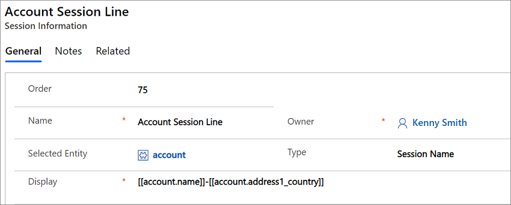
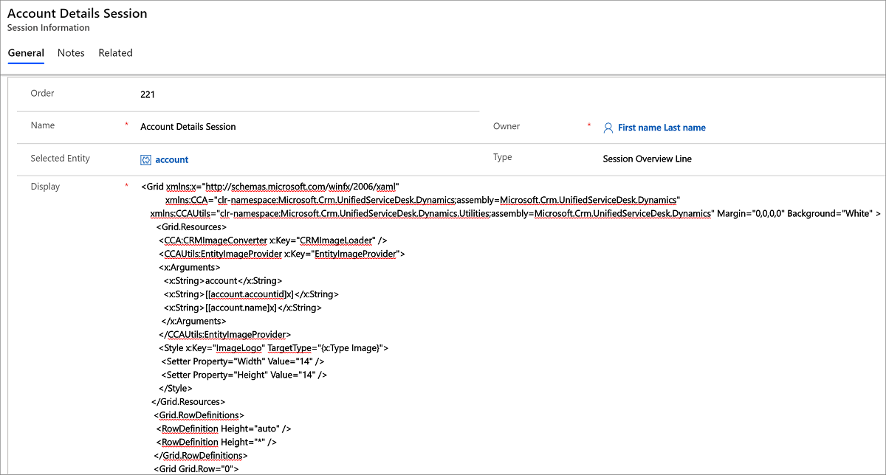
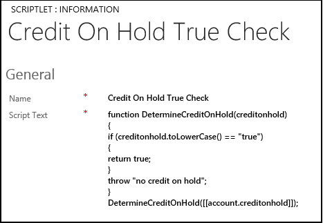
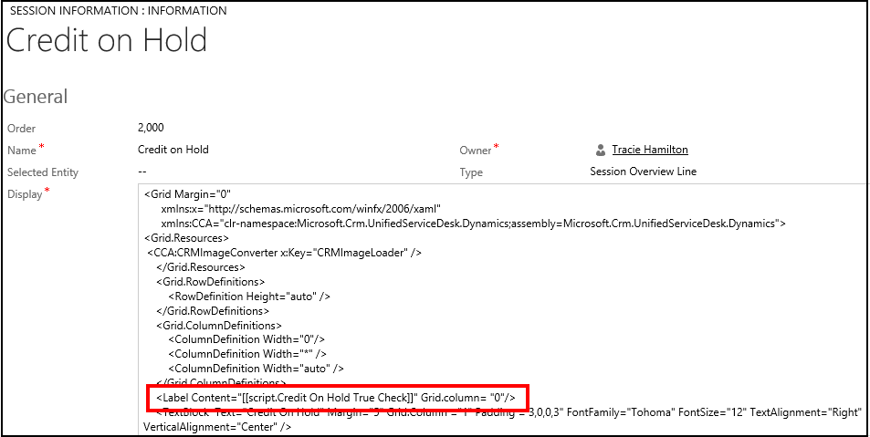

# Configure session information

[!INCLUDE[cc-data-platform-banner](../includes/cc-data-platform-banner.md)]

The session information is displayed under tabs in [!INCLUDE[pn_unified_service_desk](../includes/pn-unified-service-desk.md)] under two areas: session tab name and session overview. For an overview about this, see [Session management in Unified Service Desk](../unified-service-desk/session-management-unified-service-desk.md). You can configure the format of the information that displays as the session tab name and overview by creating appropriate session line rules.  
  
<a name="SessionName"></a>   
## Configure the session tab name format
  
1. Sign in to Unified Service Desk Administrator.  
  
2. Select **Session Lines** under **Basic Settings**. 

3. Select **+ New**.
  
4. On new **New Session Information** page:  
  
   1.  Type an integer value (say 100) in the **Order** field to ensure that your rule executes in the proper order.  
  
   2.  Type a meaningful name in the **Name** field.  
  
   3.  In the **Selected Entity** field, type the name of the entity for which the session tab will be displayed.  
  
   4.  From the **Type** drop-down list, select **Session Name**.  
  
   5.  In the **Display** field, type the display format for the tab. In this case, we want to display the name of the account followed by a dash, and then the primary contact name for the account. Type the following value: [[account.name]]-[[account.address1_primarycontactname]].  
  
     
  
    Alternatively, you can use replacement parameters as well to pick up values at runtime, and dynamically display the tab name. For example, to display the name of the account followed by a dash and ending with the name of the activity that started the session (such as chat, or phonecall). Type the following value: [[account.name]]-[[$Context.InitialEntity]].  
  
    > [!NOTE]
    >  If all replacement values have matching values in it’s dataset, the rule will be used and the system will stop looking for subsequent rules. If one or more replacement values can’t be replaced, because the data doesn’t exist, the rule will fail and the system will try the next rule ordering to the Order field (checked in order of lowest to highest).<br><br>
    In the preceding example, [[account.name]] will be looking for the name field from an account entity that has been loaded somewhere within the current session. Because we used the lowercased version of “account” that matches to the entity name in Microsoft Dataverse, it means that it is looking for the last account page loaded no matter which tab it happens to be loaded within. Because of this, if you load a subaccount and your rules have it loading in a subaccount tab (thus displaying your primary account in the Account tab, and your subaccount in your Sub Account tab), the account name that will be used will be that of the sub account. This is because the subaccount is loaded after the Account tab. If you instead wish to always use the account name of the account that is displayed in the Account tab, you would use the following: **[[Account.name]]**.<br><br>
    The [[$Context.InitialEntity]] value is replaced at runtime with the InitialEntity context variable. This is a special context variable populated by the system with the entity name that is used to start the session.  
  
5. Select **Save**.  
  
<a name="SessionOverview"></a>   
## Define session overview information  
  
1. Sign in to Unified Service Desk Administrator.  
  
2. Select **Session Lines** under **Basic Settings**. 

3. Select **+ New**. 
  
4. On **New Session Information** page,  
  
   1. Type an integer value (say 100) in the **Order** field to ensure that your rule executes in the proper order.  
  
   2. Type a meaningful name in the **Name** field.  
  
   3. In the **Selected Entity** field, type the name of the entity for which the session overview information.  
  
   4. From the **Type** drop-down list, select **Session Overview Line**.  
  
   5. In the **Display** field, specify XAML script that defines the layout and content of the overview area. You can use designer tools such as [!INCLUDE[pn_blend_for_visual_studio](../includes/pn-blend-for-visual-studio.md)] to create and design the XAML script, and then copy it in this field. The XAML script must be properly formatted for it to display correctly in [!INCLUDE[pn_unified_service_desk](../includes/pn-unified-service-desk.md)].  
  
     
  
5. Select **Save**.  
  
<a name="scriptlet"></a>   
## Define session overview information using scriptlets  
 For developers who are familiar with [!INCLUDE[pn_JavaScript](../includes/pn-javascript.md)], you can use scriptlets to display session overview information. For example:  
  
1. You could create a scriptlet, say **Address Output**, which accepts all the address values.  
  
2. Using [!INCLUDE[pn_JavaScript](../includes/pn-javascript.md)], you could use the string functions to perform the string concatenation to produce the desired output.  
  
3. In your XAML for the session overview information definition, use the following replacement parameter:  
  
   ```  
   [[script.Address Output]]  
   ```  
  
   At runtime, this triggers the execution of the scriptlet that formats the address output as you specified. If your scriptlet throws an exception, the rule will be ignored. This method is often the preferred method when the `AutoCollapse` style isn’t sufficient to hide related markup in the output as required. The replacement parameter may output XAML as well, which will be substituted before the XAML processor interprets the final result.  
  
<a name="Alerts"></a>   
## Displaying alerts in the session overview information  
 Alerts are notifications to the user about important information related to the customer. A basic alerting system is built into the session information mechanism. Session lines are evaluated and displayed when the replacement parameters are all replaced and no exceptions are thrown from scriptlets. Using this information, you can display optional lines of output in the session overview area of the screen based upon the existence or selections on entities or entity search values. Then use scriptlets to test for specific values, and return a value if you want the alert to display, or throw an exception if you do not.  
  
 Here is an example scriptlet that checks to see if the loaded account has its credit on hold.  
  
   
  
 Notice that the `creditonhold` property is checked for the account. If the value is `true`, it returns `true`, otherwise it throws an exception. Next here is a session overview line that displays a textbox and button (my alert) if the value is `true`.  
  
   
  
 Notice the highlighted command. This is on a column that isn’t visible to the user. Instead the replacement parameter here will either cause this session overview line to display or cause it to be skipped. If the Credit On Hold True Check scriptlet throws the exception, the system won’t display any of this Session Information element. Now that we have the condition that decides when to show the alert, let’s look at the button and some interesting features here.  
  
 Since there is no code behind for this XAML, we take advantage of another XAML feature, Commands. There is a special command defined in [!INCLUDE[pn_unified_service_desk](../includes/pn-unified-service-desk.md)], “USD:ActionCommands.DoActionCommand”. This command is designed to call a [!INCLUDE[pn_user_inteface_integration_uii](../includes/pn-user-interface-integration-uii.md)] action on any application within the agents currently running session. The CommandParameter is a URL encoded action call, with the following format.  
  
```  
https://uii/[UII Hosted Application]/[Action]?[Parameter]  
```  
  
 The action must be configured as a [!INCLUDE[pn_uii_acronym](../includes/pn-uii-acronym.md)] action for the specified [!INCLUDE[pn_uii_acronym](../includes/pn-uii-acronym.md)] hosted application. This button calls the GotoTask action on the AgentScripting application and passes “Welcome” as the parameter. For the AgentScripting application, this call locates the task with the name, “Welcome” and jumps to that task, thus displaying a new agent script.  
  
 The image source uses a special image loader defined in [!INCLUDE[pn_unified_service_desk](../includes/pn-unified-service-desk.md)] called CRMImageLoader and must be defined in the Grid resources.  
  
 Now when you specify a binding expression, you can specify the source as an image resource name. This causes [!INCLUDE[pn_unified_service_desk](../includes/pn-unified-service-desk.md)] to load the image from the web resources in Dataverse and show in the button. Using this method, you can refer to resources from Dataverse in your [!INCLUDE[pn_ms_Windows_Presentation_Foundation](../includes/pn-ms-windows-presentation-foundation.md)] (WPF) that is in your session overview. You may also specify an insecure URL for the image source. Specifying Dataverse image via the URL doesn’t work because authentication with the server is required to access it. WPF components do not authenticate against the URL when it attempts to load components.  
  
### See also  
 [Session management in Unified Service Desk](../unified-service-desk/session-management-unified-service-desk.md)   
 [Execute scripts using scriptlets in Unified Service Desk](../unified-service-desk/execute-scripts-using-scriptlets-unified-service-desk.md)   
 [Unified Service Desk Configuration Walkthroughs](../unified-service-desk/unified-service-desk-configuration-walkthroughs.md)   
 [Overview of configuring agent application](../unified-service-desk/configure-agent-application-unified-service-desk.md)


[!INCLUDE[footer-include](../includes/footer-banner.md)]