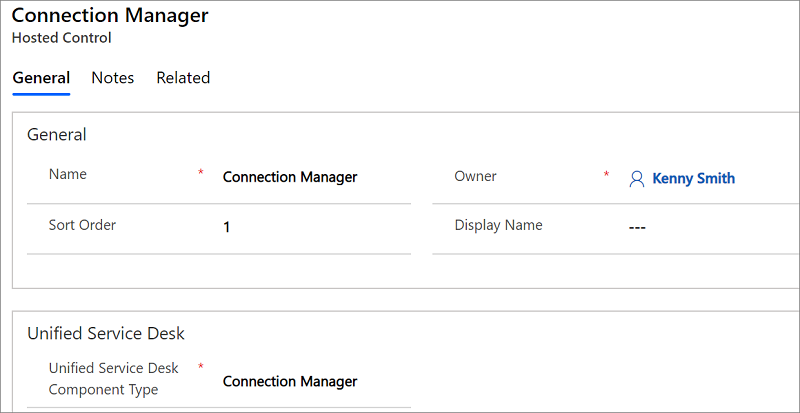

# Connection Manager (Hosted Control)

[!INCLUDE[cc-data-platform-banner](../includes/cc-data-platform-banner.md)]

The **Connection Manager** hosted control type manages connections to Microsoft Dataverse, and makes it available to the rest of the agent application. An instance of this hosted control is required by [!INCLUDE[pn_unified_service_desk](../includes/pn-unified-service-desk.md)], and only a single instance of this hosted control type must exist in your agent application.  
  
> [!IMPORTANT]
>  The three sample application packages for [!INCLUDE[pn_unified_service_desk](../includes/pn-unified-service-desk.md)], `New Environment`, `CRM Web Client`, and `Interactive Service Hub`, come preconfigured with an instance each of the **Connection Manager** hosted control type. For information about the sample applications, see [Deploy sample Unified Service Desk applications to CRM server using Package Deployer](admin/deploy-sample-unified-service-desk-applications-using-package-deployer.md).  
  
## In This Section  
 [Create a Connection Manager hosted control](../unified-service-desk/connection-manager-hosted-control.md#create)  
  
 [Predefined UII actions](../unified-service-desk/connection-manager-hosted-control.md#UIIactions)  
  
 [Predefined UII actions](../unified-service-desk/connection-manager-hosted-control.md#UIIactions)  
  
   
## Create a Connection Manager hosted control  
 While creating a new hosted control, the fields in the **New Hosted Control** screen vary based on the type of hosted control you want to create. This section provides information about the specific fields that are unique to the **Connection Manager** hosted control type. For detailed information about creating a hosted control, see [Create or edit a hosted control](../unified-service-desk/create-edit-hosted-control.md).  
  
   
  
 In the **New Hosted Control** screen, under the **Unified Service Desk** area, select **Connection Manager** from the **USD Component Type** drop-down list. Also, ensure that you set the **Sort Order** value of this hosted control to **1** to ensure this is the first hosted control to be retrieved and displayed by your agent application when the agent application is launched. For information about other **General** fields, see [Create or edit a hosted control](../unified-service-desk/create-edit-hosted-control.md).  
  
   
## Predefined UII actions  
 This hosted control type does not have any predefined UII actions.  
  
   
## Predefined events  
 This hosted control type does not have any predefined events.  
  
### See also  
 [Hosted control types and action/event reference](../unified-service-desk/hosted-control-types-action-event-reference.md)   
 [Create or edit a hosted control](../unified-service-desk/create-edit-hosted-control.md)   
 [Unified Service Desk Hosted Controls](../unified-service-desk/unified-service-desk-hosted-controls.md)   
 [Walkthrough 1: Build a simple agent application](../unified-service-desk/walkthrough-1-build-a-simple-agent-application.md)

[!INCLUDE[footer-include](../includes/footer-banner.md)]