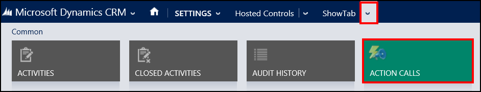

# Create an action call for a UII action in Unified Service Desk
There are two ways in which you can create an action call for a [!INCLUDE[pn_user_inteface_integration_uii](../includes/pn-user-interface-integration-uii.md)] action:  

-   Create an action call and then attach it to the hosted control and the respective UII action.  

-   Start from a hosted control that contains the UII action that you want to create the action call for.  

   
## Start from the action call  

1. Sign in to the Common Data Service platform.  

2. [!INCLUDE[proc_settings_usd](../includes/proc-settings-usd.md)]  

3. Click **Action Calls**.  

4. On the action call list page, choose **Add New Action Call** on the command bar.  

5. On the **New Action Call** page, specify information for various fields as per the following table.  

     

   |     Field      |                                                                                                                                                                                                                                                                         Description                                                                                                                                                                                                                                                                         |
   |----------------|-------------------------------------------------------------------------------------------------------------------------------------------------------------------------------------------------------------------------------------------------------------------------------------------------------------------------------------------------------------------------------------------------------------------------------------------------------------------------------------------------------------------------------------------------------------|
   |      Name      |                                                                                                                                                                                                                                                           A descriptive name of the action call.                                                                                                                                                                                                                                                            |
   | Hosted Control |                                                                                                                                                                                                                                                   The hosted control having the UII action to be called.                                                                                                                                                                                                                                                    |
   |     Action     |                                                                                                                                                                                   The UII action name to call on the hosted control. To call a UII action for a hosted control, the action must be added to the list of UII actions for a hosted control in the Common Data Service platform.                                                                                                                                                                                   |
   |      Data      |                                                                                                                                                                                   This is the serialized data (string data) that is passed as the data parameter to the action. **Note:**  Some actions interpret multiline input specified here as separate parameters.                                                                                                                                                                                    |
   |   Condition    |              This is a [!INCLUDE[pn_JavaScript](../includes/pn-javascript.md)] expression that should result in true or false. For example, “[[account.name]]”==”My Account”   If the condition results in false or throws an exception, the action won’t be performed. If the action is blank or the result is true, the action will be performed. **Note:**  If the condition results in false or throws an exception, the action won’t be performed. If the action is blank or the result is true, the action will be performed.               |
   |  Shortcut Key  | This is a shortcut key that can be used by an agent to run this action while within the [!INCLUDE[pn_unified_service_desk](../includes/pn-unified-service-desk.md)] client. Anything valid for the `KeyBinding.Gesture` string can be used here. For more information see: [http://msdn.microsoft.com/library/system.windows.input.keybinding.gesture.aspx](https://msdn.microsoft.com/library/system.windows.input.keybinding.gesture.aspx).   Examples:   -   CTRL+R -   CTRL+ALT+A -   SHIFT+ALT+A -   CTRL-F12 |

   > [!TIP]
   >  You can view the embedded help at the bottom of the **New Action Call** page to know the description and the applicable parameters that can be passed using the action call.  

6. Choose **Save**.  

   
## Start from the hosted control  

1. Create or edit the hosted control that contains the UII action that you want to create an action call for. For more information, see [Create or edit a hosted control](../unified-service-desk/create-edit-hosted-control.md).  

2. On the hosted control page, choose the down arrow next to the hosted control name on the nav bar, and then choose UII Actions.  

     

3. From the UII action list, choose the name of the UII action in the **Name** column for which you want to add the action call. Alternatively, select the required UII action record, and then choose **Edit** in the command bar. This will open the UII action record.  

4. On the UII action page, choose the down arrow next to the UII action name on the nav bar, and then choose **Action Calls**.  

     

5. On the action call list page, choose **Add New Action Call** on the command bar.  

6. On the **New Action Call** page, follows steps 5 and 6 in the previous section.  

### See also  
 [Manage hosted controls, actions, and events](../unified-service-desk/manage-hosted-controls-actions-events.md)   
 [Unified Service Desk Configuration Walkthroughs](../unified-service-desk/unified-service-desk-configuration-walkthroughs.md)  

