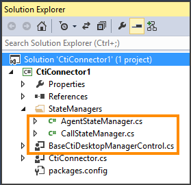

# Create a CTI Desktop Manager in Unified Service Desk

[!INCLUDE[cc-data-platform-banner](../includes/cc-data-platform-banner.md)]

The CTI Desktop Manager component is the interface between the computer telephony integration (CTI) system and [!INCLUDE[pn_unified_service_desk](../includes/pn-unified-service-desk.md)] or [!INCLUDE[pn_user_inteface_integration_uii](../includes/pn-user-interface-integration-uii.md)]. The CTI Desktop Manager component creates the following two objects that collectively manage the state and data in a call:  
  
-   `CallStateManager`: The [CtiCallStateManager](/dotnet/api/microsoft.uii.desktop.cti.core.cticallstatemanager) class is used as the base class that contains properties, methods, and events for communicating with the CTI Connector component to issue commands related to call management such as answer call, hang up, hold call, and transfer call. It provides multi-call management features and pre-wired events for the CTI Controls (user interface) to connect to, and base implementation and extensibility points for vendor specific customizations.  
  
-   `AgentStateManager`: The [CtiAgentStateManager](/dotnet/api/microsoft.uii.desktop.cti.core.ctiagentstatemanager) is used as the base class that contains properties, methods, and events for communicating with the CTI Connector component related to agent state management (agent’s availability such as available, busy, and away). It provides pre-wired events for the CTI Controls (user interface) to connect to, and base implementation and extensibility points for vendor specific customizations.  
  
<a name="define"></a>   
## Define a CTI Desktop Manager component  
 The CTI Desktop Manager implements the following interfaces:  
  
- [ICtiAgentStateManager](/dotnet/api/microsoft.uii.desktop.cti.core.ictiagentstatemanager)  
  
- [ICtiCallStateManager](/dotnet/api/microsoft.uii.desktop.cti.core.icticallstatemanager)  
  
  You define a CTI Desktop Manager component in the same project as the one that you use for defining your CTI Connector using the **USD CTI Connector** project template. For more information about using this template, see [Create a CTI Connector](../unified-service-desk/create-cti-connector.md).  
  
  Use the BaseCtiDesktopManagerControl.cs file in the **USD CTI Connector** project template to configure your CTI Desktop Manager, and the AgentStateManager.cs and CallStateManager.cs files in to configure call and agent states. These files provide pre-wired methods and instructions (in the form of comments) to help you create a CTI Desktop Manager component.  
  
    
  
<a name="CustLookup"></a>   
## Raise a search request when a call arrives  
 When a new call arrives, you can invoke a search request to look up the automatic number identification (ANI) number in Microsoft Dataverse repository, get extra information, such as first name, last name, and so on, and create a session. [!INCLUDE[pn_user_inteface_integration_uii](../includes/pn-user-interface-integration-uii.md)] provides the [CtiLookupRequest](/dotnet/api/microsoft.uii.desktop.cti.core.ctilookuprequest) class that describes a customer lookup request that the CTI system sends to a customer search provider. This class describes common data elements that the CTI system will provide. It also gives you the ability to add custom data to the request.  
  
 The customer lookup or search is implemented depending on whether you are searching in [!INCLUDE[pn_unified_service_desk](../includes/pn-unified-service-desk.md)] or UII:  
  
- **Unified Service Desk**: The search request is handled by the Global Manager hosted control.  
  
- **User Interface Integration (UII)**: The lookup request is sent to [ICustomerSearch](/dotnet/api/microsoft.uii.desktop.core.icustomersearch), and it is up to you how you want to implement the search control. You can also send additional data to the search request using the [String)](/dotnet/api/microsoft.uii.desktop.cti.core.ctilookuprequest.addlookuprequestitem(system.string,system.string)) method. UII provides you project templates to create a Windows Forms-based or WPF-based customer search control with the CTI search request pre-wired.  
  
<a name="CallData"></a>   
## Access call data and events  
 Use the [CallInfoData](/dotnet/api/microsoft.uii.desktop.cti.core.callinfodata) class to access information about a call that is in process in [!INCLUDE[pn_uii_acronym](../includes/pn-uii-acronym.md)] desktop (such as [!INCLUDE[pn_unified_service_desk](../includes/pn-unified-service-desk.md)]). The following example shows the syntax of this class:  
  
```  
CallInfoData calldata = GetCallInfoData(ctiCallRefCallId);  
```  
  
<a name="CallActions"></a>   
## Enable or disable call actions  
 Use the [CtiCallActionOptions](/dotnet/api/microsoft.uii.desktop.cti.core.cticallactionoptions) class to enable or disable call actions. The following example code shows how to use this class to handle a call.  
  
```csharp  
public override void OnCallStateChanged(CtiCoreEventArgs e)  
{  
   CallEventArgs CallArgs = (CallEventArgs)e.EventInfo;  
  
   // Set the state of the call in the call list.   
   CallInfoData calldata = GetCallInfoData(CallArgs.Call.CallID.ToString(CultureInfo.CurrentUICulture));  
   if (calldata != null)  
      calldata.CurrentCallState = string.IsNullOrEmpty(CallArgs.State.ToString()) ? string.Empty : CallArgs.State.ToString();  
  
   UpdateCallInfoItemEntry(calldata); // update call data..   
  
   CtiCallEventArgs args = null;  
   switch (CallArgs.State)  
   {  
      case CallClassProvider.CallState.Connected:  
      args = new CtiCallEventArgs(calldata.GetCtiCallRefId, CtiCallStates.OFFHOOK, new CtiCallActionOptions());  
      break;  
  
      case CallClassProvider.CallState.Disconnected:  
      args = new CtiCallEventArgs(calldata.GetCtiCallRefId, CtiCallStates.DISCONNECTED, new CtiCallActionOptions());  
      break;  
  
      case CallClassProvider.CallState.Hold:  
      args = new CtiCallEventArgs(calldata.GetCtiCallRefId, CtiCallStates.ONHOLD, new CtiCallActionOptions());  
      break;  
  
      case CallClassProvider.CallState.Idle:  
      args = new CtiCallEventArgs(calldata.GetCtiCallRefId, CtiCallStates.DISCONNECTED, new CtiCallActionOptions());  
      break;  
  
      case CallClassProvider.CallState.Incoming_Call:  
      args = new CtiCallEventArgs(calldata.GetCtiCallRefId, CtiCallStates.PICKUPPENDING, new CtiCallActionOptions());  
      break;  
  
      case CallClassProvider.CallState.Ringing:  
      args = new CtiCallEventArgs(calldata.GetCtiCallRefId, CtiCallStates.RINGING, new CtiCallActionOptions());  
      break;  
  
      default:  
      System.Diagnostics.Trace.WriteLine(ResourceStrings.UNSUPPORTEDEVENT + CallArgs.State.ToString());  
      break;  
   }  
   // Raise status change event.   
   RaiseCallStateChangeEvent(args);  
}  
  
```  
  
<a name="Configure"></a>   
## Configure CTI Desktop Manager hosted control in Unified Service Desk  
 After you have created the CTI Desktop Manager along with your CTI connector, you must configure these as hosted controls in [!INCLUDE[pn_unified_service_desk](../includes/pn-unified-service-desk.md)]. [!INCLUDE[pn_unified_service_desk](../includes/pn-unified-service-desk.md)] provides a hosted control of type **CTI Desktop Manager**  that can be used to configure your CTI Desktop Manager in [!INCLUDE[pn_unified_service_desk](../includes/pn-unified-service-desk.md)]. The CTI Connector should be configured as a [!INCLUDE[pn_uii_acronym](../includes/pn-uii-acronym.md)] hosted control. [!INCLUDE[proc_more_information](../includes/proc-more-information.md)] [Configure a hosted control for CTI Connector in Unified Service Desk](../unified-service-desk/create-cti-connector.md#Configure)  
  
1. Sign in to Unified Service Desk Administrator.  
  
2. Select **Hosted Controls** under **Basic Settings**.  
  
3. Select **+ New**.  
  
4. On the **New Hosted Control** page, specify the following values:  
  
   |Field|Value|  
   |-----------|-----------|  
   |Name|Give name as per your choice.|  
   |USD Component Type|CTI Desktop Manager|  
   |Display Group|HiddenPanel|  

5. Select the **Hosting** tab, and specify the following values

   |Field|Value|  
   |-----------|-----------| 
   |Assembly URI|This is the name of your assembly (.dll) file that you built in the previous step.|  
   |Assembly Type|This is the name of your assembly followed by a dot, and then the class name of your CTI Connector. For example, if your assembly name is MyCtiManager, and the name of the class of your CTI project is DesktopManager, then you must type the following in this field: MyCtiManager.DesktopManager.| 
  
6. Select **Save** to create the hosted control.  
  
> [!IMPORTANT]
>  After you have configured the CTI Desktop Manager hosted control in [!INCLUDE[pn_unified_service_desk](../includes/pn-unified-service-desk.md)], you must configure:  
> 
> - Actions for your CTI Desktop Manager hosted control. [!INCLUDE[proc_more_information](../includes/proc-more-information.md)] [Actions supported for telephony functions](../unified-service-desk/consideration-creating-cti-adapter-unified-service-desk.md#Actions)  
>   - Window navigation rules to route the CTI search requests appropriately to create sessions and display the search results in [!INCLUDE[pn_unified_service_desk](../includes/pn-unified-service-desk.md)][!INCLUDE[proc_more_information](../includes/proc-more-information.md)] [CTI search](../unified-service-desk/consideration-creating-cti-adapter-unified-service-desk.md#CTISearch)  
  
### See also  
 [Configure the CTI Desktop Manager hosted control for generic listener adapter](../unified-service-desk/use-generic-listener-adapter-unified-service-desk.md#Configure)   
 [Create a CTI Connector](../unified-service-desk/create-cti-connector.md)   
 [Create a CTI Control](../unified-service-desk/create-cti-control.md)   
 [Walkthrough: Use CTI Desktop Manager ro create a CTI adapter](../unified-service-desk/walkthrough-use-the-generic-listener-adapter-for-cti-event-routing.md)   
 [UII Computer Telephony Integration (CTI) framework](../unified-service-desk/uii-computer-telephony-integration-cti-framework.md)


[!INCLUDE[footer-include](../includes/footer-banner.md)]