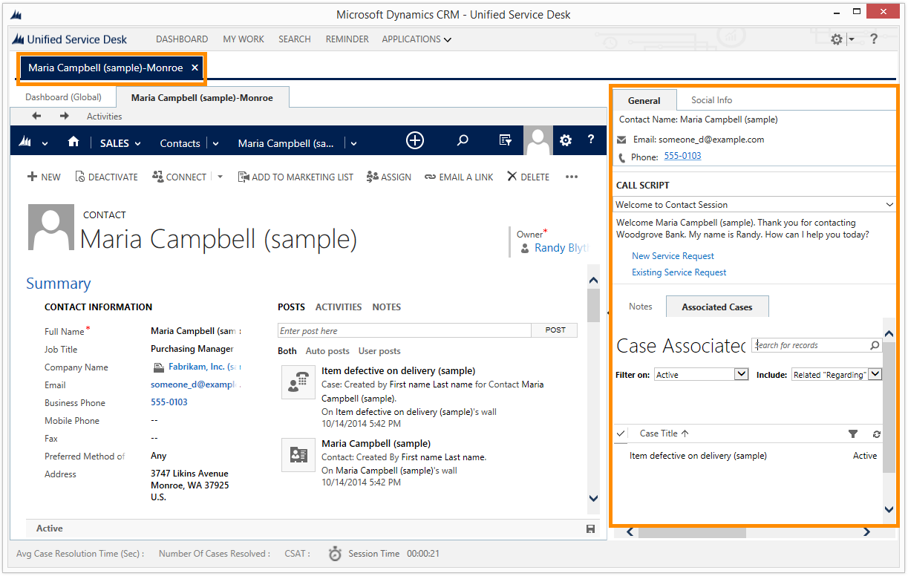

# Create a custom panel layout

[!INCLUDE[cc-data-platform-banner](../includes/cc-data-platform-banner.md)]

Panel layouts in [!INCLUDE[pn_unified_service_desk](../includes/pn-unified-service-desk.md)] are hosted controls, which provide the ability to load all sorts of different layouts in the system. [!INCLUDE[pn_unified_service_desk](../includes/pn-unified-service-desk.md)] provides some predefined panel layouts for you to use in your agent application. For more information, see [Panel layouts](../unified-service-desk/panels-panel-types-panel-layouts.md#PanelLayouts).  
  
 [!INCLUDE[pn_unified_service_desk](../includes/pn-unified-service-desk.md)] also lets you create user defined or custom panel layouts where you lay out the [!INCLUDE[pn_unified_service_desk](../includes/pn-unified-service-desk.md)] panel types as per your requirement, and enhance the experience with [code-behind XAML](https://msdn.microsoft.com/library/vstudio/aa970568\(v=vs.110\).aspx). Microsoft Dataverse provides a Visual Studio project template for creating user-defined panel layouts with code-behind support.  
  
 This topic shows you how to create a panel layout where you’ll rearrange the panels to display the session information, agent scripting, notes manager, and associated cases to appear on the right side of the desktop instead of the left side. Also, the pane that displays all this information will be displayed automatically when a session is started in the [!INCLUDE[pn_unified_service_desk](../includes/pn-unified-service-desk.md)], and will disappear automatically when the session is closed instead of you having to manually expand and collapse the pane.  
  
<a name="Prereq"></a>   
## Prerequisites  
  
- [!INCLUDE[pn_Microsoft_.Net_Framework](../includes/pn-microsoft-net-framework.md)] 4.6.2  
  
- [!INCLUDE[pn_unified_service_desk](../includes/pn-unified-service-desk.md)] client application; the client application is required for testing the custom panel layout hosted control by signing in using the agent application.  
  
- [!INCLUDE[pn_microsoft_visual_studio_2012](../includes/pn-microsoft-visual-studio-2012.md)], [!INCLUDE[pn_visual_studio_2013](../includes/pn-visual-studio-2013.md)], or [!INCLUDE[pn_visual_studio_2015](../includes/pn-visual-studio-2015.md)]  
  
- [!INCLUDE[tn_nuget](../includes/tn-nuget.md)] Package Manager for [Visual Studio 2012](https://visualstudiogallery.msdn.microsoft.com/27077b70-9dad-4c64-adcf-c7cf6bc9970c), [Visual Studio 2013](https://visualstudiogallery.msdn.microsoft.com/4ec1526c-4a8c-4a84-b702-b21a8f5293ca), or [Visual Studio 2015](https://visualstudiogallery.msdn.microsoft.com/5d345edc-2e2d-4a9c-b73b-d53956dc458d)  
  
- **CRM SDK Templates** for [!INCLUDE[pn_Visual_Studio_short](../includes/pn-visual-studio-short.md)] that contains the custom panel layout project template. [Download](https://go.microsoft.com/fwlink/p/?LinkId=400925) the **CRM SDK Templates** from the Visual Studio gallery, and double-click the CRMSDKTemplates.vsix file to install the template in [!INCLUDE[pn_Visual_Studio_short](../includes/pn-visual-studio-short.md)].  
  
<a name="HowTo"></a>   
## Create a custom panel layout  
  
<a name="Step1"></a>   
1. Start [!INCLUDE[pn_Visual_Studio_short](../includes/pn-visual-studio-short.md)], and create a new project.  
  
2. In the **New Project** dialog box:  
  
   1. From the list of installed templates, expand **Visual C#**, and select **CRM SDK Templates** > **Unified Service Desk** > **USD Custom Panel Layout**.  
  
   2. Ensure that **[!INCLUDE[pn_NET_Framework](../includes/pn-net-framework.md)] 4.6.2** is selected.  
  
   3. Specify the name and location of the project, and select **OK**.  
  
     
  
3. In **Solution Explorer**, double-click the `CustomLayout.xaml` file to bring up the XAML designer. The XAML designer displays the default panel layout in [!INCLUDE[pn_unified_service_desk](../includes/pn-unified-service-desk.md)].  
  
4. Replace the XAML code in the `CustomLayout.xaml` file with the code provided in the following sample. To do this, select all the code (CTRL+A) in the XAML area (as shown in the illustration), delete it, and then paste the XAML code provided at the same place. This is done to change the location of the expander pane from left to right.  
  
     
  
   ```  
   <USD:PanelLayoutBase             
           x:Class="MyUSDCustomPanelLayout.CustomLayout"  
           xmlns="https://schemas.microsoft.com/winfx/2006/xaml/presentation"  
           xmlns:x="https://schemas.microsoft.com/winfx/2006/xaml"  
           xmlns:mc="https://schemas.openxmlformats.org/markup-compatibility/2006"  
           xmlns:d="https://schemas.microsoft.com/expression/blend/2008"  
           mc:Ignorable="d"   
           xmlns:local="clr-namespace:Microsoft.Crm.UnifiedServiceDesk.Dynamics;assembly=Microsoft.Crm.UnifiedServiceDesk.Dynamics"  
           xmlns:USD="clr-namespace:Microsoft.Crm.UnifiedServiceDesk.Dynamics.PanelLayouts;assembly=Microsoft.Crm.UnifiedServiceDesk.Dynamics"  
           d:DesignHeight="500" d:DesignWidth="500">  
       <Grid x:Name="LayoutRoot">  
           <Grid.Resources>  
               <local:CRMImageConverter x:Key="CRMImageLoader" />  
               <Style x:Key="ImageLogo" TargetType="{x:Type Image}">  
                   <Setter Property="FlowDirection" Value="LeftToRight"/>  
                   <Setter Property="Width" Value="161" />  
                   <Setter Property="Height" Value="25" />  
                   <Setter Property="Margin" Value="0" />  
                   <Setter Property="HorizontalAlignment" Value="Left" />  
                   <Setter Property="VerticalAlignment" Value="Center" />  
               </Style>  
           </Grid.Resources>  
           <Grid.RowDefinitions>  
               <RowDefinition Height="auto"/>  
               <RowDefinition Height="*"/>  
               <RowDefinition Height="auto"/>  
           </Grid.RowDefinitions>  
           <Border Grid.Row="0" BorderBrush="#d8d8d8" BorderThickness="0,1,0,1">  
               <Grid Background="{DynamicResource WindowHeaderStyle}" Grid.Row="0"  Margin="0">  
                   <Grid.ColumnDefinitions>  
                       <ColumnDefinition Width="auto" />  
                       <ColumnDefinition Width="auto" />  
                       <ColumnDefinition Width="*" />  
                       <ColumnDefinition Width="Auto" />  
                   </Grid.ColumnDefinitions>  
                   <Image Grid.Column="0" Source="{Binding Source=msdyusd_Logo, Converter={StaticResource CRMImageLoader}}"  Style="{DynamicResource ImageLogo}"   />  
                   <Rectangle Width="10" Grid.Column="1" />  
                   <USD:USDDeckTabPanel x:Name="ToolbarPanel" Grid.Column="2" AutomationProperties.Name="Toolbar Panel" VerticalAlignment="Stretch" Focusable="False" Margin="1" />  
                   <Grid Grid.Column="3">  
                       <Grid.ColumnDefinitions>  
                           <ColumnDefinition Width="*" />  
                           <ColumnDefinition Width="412"/>  
                       </Grid.ColumnDefinitions>  
                       <Grid.Background>  
                           <ImageBrush ImageSource="{Binding Source=msdyusd_Office15, Converter={StaticResource CRMImageLoader}}" Stretch="Fill" ></ImageBrush>  
                       </Grid.Background>  
                       <USD:USDStackPanel Grid.Column="0" x:Name="CtiPanel"  Orientation="Horizontal" Focusable="False" VerticalAlignment="Center" AutomationProperties.Name="Cti Panel" SelectedAppChanged="SelectedAppChangedHander"/>  
                       <USD:USDStackPanel Grid.Column="1" HorizontalAlignment="Right" x:Name="AboutPanel"  Orientation="Horizontal" Focusable="False" VerticalAlignment="Center" AutomationProperties.Name="AboutPanel"/>  
                   </Grid>  
               </Grid>  
           </Border>  
           <Grid Grid.Row="1" VerticalAlignment="Stretch" Margin="0" Background="{DynamicResource WindowBackgroundStyle}">  
               <Grid.RowDefinitions>  
                   <RowDefinition Height="auto" />  
                   <RowDefinition Height="*" />  
                   <RowDefinition Height="auto" />  
               </Grid.RowDefinitions>  
               <USD:USDDeckTabPanel x:Name="SessionTabsPanel" Grid.Row="0" Margin="5,5,0,5" AutomationProperties.Name="Session Tabs Panel" Focusable="False" ClipToBounds="True" />  
               <Grid x:Name="MainGrid" Grid.Row="1" AutomationProperties.Name="Main Panels">  
                   <Grid.ColumnDefinitions>  
                       <ColumnDefinition Width="*" />  
                       <ColumnDefinition Width="auto"/>  
                   </Grid.ColumnDefinitions>  
                   <Expander Grid.Column="1" Style="{DynamicResource StretchExpanderStyle}"  ExpandDirection="Right" x:Name="RightExpander" IsExpanded="false" BorderBrush="White" Expanded="Expander_Expanded" Collapsed="Expander_Collapsed" >  
                       <Grid Style="{DynamicResource LeftPanelGrid}">  
                           <Grid.RowDefinitions>  
                               <RowDefinition Height="auto" />  
                               <RowDefinition Height="auto" />  
                               <RowDefinition Height="auto" Name="ChatPanelRow" />  
                               <RowDefinition Height="auto" />  
                               <RowDefinition Height="auto" />  
                               <RowDefinition Height="*" />  
                           </Grid.RowDefinitions>  
                           <USD:USDCollapsePanel x:Name="SessionExplorerPanel" AutomationProperties.Name="Session Explorer Panel" Grid.Row="0" Margin="1" SelectedAppChanged="SelectedAppChangedHander" />  
                           <USD:USDCollapsePanel x:Name="WorkflowPanel" AutomationProperties.Name="Workflow Panel" Grid.Row="1" Margin="1" SelectedAppChanged="SelectedAppChangedHander" />  
                           <USD:USDCollapsePanel x:Name="ChatPanel" AutomationProperties.Name="Workflow Panel" Grid.Row="2" Margin="1" SelectedAppChanged="SelectedAppChangedHander"/>  
                           <USD:USDCollapsePanel x:Name="LeftPanel1" AutomationProperties.Name="Left Panel 1" Grid.Row="3" Margin="1" SelectedAppChanged="SelectedAppChangedHander"/>  
                           <USD:USDCollapsePanel x:Name="LeftPanel2" AutomationProperties.Name="Left Panel 2" Grid.Row="4" Margin="1" SelectedAppChanged="SelectedAppChangedHander"/>  
                           <USD:USDDeckTabPanel x:Name="LeftPanelFill" AutomationProperties.Name="Left Panel Fill" Grid.Row="5" Margin="1" SelectedAppChanged="SelectedAppChangedHander"/>  
                       </Grid>  
                   </Expander>  
                   <Grid Grid.Column="0" Background="Transparent">  
                       <Grid.RowDefinitions>  
                           <RowDefinition Height="0" />  
                           <RowDefinition Height="*" />  
                       </Grid.RowDefinitions>  
                       <USD:USDCollapsePanel x:Name="RibbonPanel" Grid.Row="0" Visibility="Collapsed"  AutomationProperties.Name="Ribbon Panel" Focusable="False" Margin="1" ClipToBounds="False" SnapsToDevicePixels="True" />  
                       <USD:USDTabPanel x:Name="MainPanel" Grid.Row="1" AutomationProperties.Name="Main Panel" SelectedAppChanged="SelectedAppChangedHander"/>  
                   </Grid>  
               </Grid>  
           </Grid>  
           <StatusBar Margin="0" Background="{DynamicResource WindowHeaderStyle}"  Grid.Row="2" Height="auto" VerticalAlignment="Bottom">  
               <StatusBarItem Background="{DynamicResource WindowHeaderStyle}" >  
                   <USD:USDStackPanel x:Name="StatusPanel" Orientation="Horizontal" AutomationProperties.Name="Status Panel" Margin="1" SelectedAppChanged="SelectedAppChangedHander" />  
               </StatusBarItem>  
           </StatusBar>  
       </Grid>  
   </USD:PanelLayoutBase>  
   ```  
  
5. You can also define a keyboard shortcut to access a panel in your custom panel layout. [!INCLUDE[proc_more_information](../includes/proc-more-information.md)] [Define keyboard shortcuts for panels in custom panel layout](../unified-service-desk/keyboard-shortcuts-panels.md)  
  
6. In **Solution Explorer**, right-click the `CustomLayout.xaml` file, and click **View Code** to add the code behind the XAML. This opens up the `CustomLayout.xaml.cs` file.  
  
7. Update the `NotifyContextChange` method definition by adding the following code.  
  
   ```  
   if (context.Count != 0)  
   {  
      RightExpander.IsExpanded = true;  
   }  
   else  
   {   
      RightExpander.IsExpanded = false;  
   }  
   ```  
  
    The code checks if there are any sessions active in [!INCLUDE[pn_unified_service_desk](../includes/pn-unified-service-desk.md)], and automatically displays (expands) or hides (collapses) the expander pane.  
  
    This is the updated `NotifyContextChange` method definition.  
  
     
  
8. Save your project, and build it (**Build** > **Build Solution**) to check if it builds successfully.  
  
   > [!NOTE]
   >  Note the name of the class that is used to build your custom panel layout in the `CustomLayout.xaml.cs` file. In this case, it’s `CustomLayout`. You’ll need this information in the next step.  
  
<a name="Test"></a>   
## Test your custom panel layout  
 After your project builds successfully, test the custom panel layout. The testing consists of two parts: defining the custom panel layout hosted control on the server and then signing in to [!INCLUDE[pn_unified_service_desk](../includes/pn-unified-service-desk.md)] on the server using your client application with the custom code assembly in the client directory.  
  
### Define the custom panel layout hosted control on server  
  
1. Sign in to Unified Service Desk Administrator.  
  
2. Select **Hosted Controls** under **Basic Settings**.
  
3. Select **+ New**.  
  
4. On the hosted control page, specify the following. 
  
  | Field | Value |
  |-------------------------|-------------------------------|
  | Name | My custom panel layout |
  | Display Name | My Custom Panel Layout | 
  | Unified Service Desk Component Type | Panel Layout |
  | PanelType | User Defined | 
  | Application is Global | Checked |
  | Display Group | MainWorkArea |

5. Select the **Hosting** tab, and specify the following:

  | Field | Value |
  |-------------------------|-------------------------------|
  | Assembly Uri | MyUSDCustomPanelLayout|
  | Assembly Type | MyUSDCustomPanelLayout.CustomLayout| 
  
   > [!NOTE]
   > **Assembly URI** is the name of your assembly and the **Assembly Type** is the name of your assembly file (dll) followed by a dot (.) and then the class name in your [!INCLUDE[pn_Visual_Studio_short](../includes/pn-visual-studio-short.md)] project. In this example, the name of the assembly is **MyUSDCustomPanelLayout** and name of the class is **CustomLayout**, which is the default class name when you create a custom panel layout.  
  
6. Select **Save**.  
  
### Run the Unified Service Desk client to work with the custom panel layout  
  
1. Copy the assembly file (dll) that contains your custom hosted control definition from your [!INCLUDE[pn_Visual_Studio_short](../includes/pn-visual-studio-short.md)] project debug folder to the [!INCLUDE[pn_unified_service_desk](../includes/pn-unified-service-desk.md)] application directory, which is, by default, c:\Program Files\Microsoft Dynamics CRM USD\USD.  
  
2. Run the [!INCLUDE[pn_unified_service_desk](../includes/pn-unified-service-desk.md)] client to connect to your instance.  
  
3. On successful sign in, you’ll see the custom panel layout without the expander pane in the left side. The expander pane is now on the right side.  
  
     
  
4. Choose **Search** on the toolbar, and then select a record to be displayed in a session. In this case, choose **Contacts** in the **Search** window, and then choose **Maria Campbell (Sample)**. The right pane automatically appears to display the associated session data, agent scripting, and other information about the current contact record.  
  
     
  
5. Close the session by selecting the cross button in the session tab at the top, and the right pane will automatically close/collapse.  
  
   > [!NOTE]
   >  In case of multiple sessions, the right pane will continue to display until you have closed all the session tabs.

### See also
 [Display hosted controls in the custom panel layout](../unified-service-desk/display-hosted-controls-custom-panel-layout.md)
 [Panels, panel types, and panel layouts in Unified Service Desk](../unified-service-desk/panels-panel-types-panel-layouts.md)


[!INCLUDE[footer-include](../includes/footer-banner.md)]