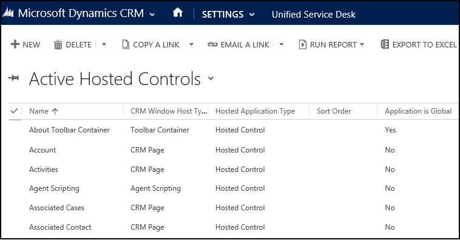
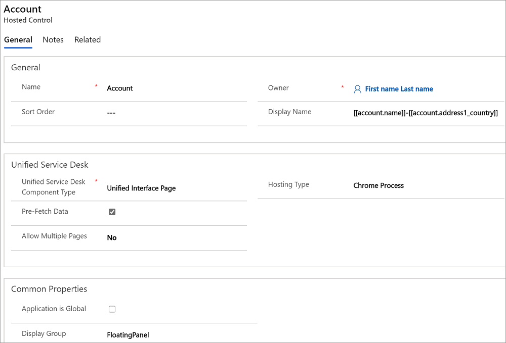

# Create or edit a hosted control
You create or edit an existing hosted control using the Unified Service Desk Administrator app. The controls in the new hosted control page differ based on the type of hosted control you create.  
  
1. Sign in to Unified Service Desk Administrator.  
  
2. Select **Hosted Controls** under **Basic Settings**. The page displays available hosted controls.  
  
     
  
3. On the hosted control page:  
  
   1.  To create a hosted control, select **New**.  
  
   2.  To edit a hosted control, either select on the hosted control name in the **Name** column, or select the hosted control record in the list, and then select **Edit**.  
  
4. Depending on what you selected, a new hosted control page or the existing hosted control page is displayed.  
  
     
  
5. Under the **General** area, specify or change a name, sort order, and display name for the hosted control. Note that fields marked with a red asterisk are required.  
  
   1.  Specify a **Name** for your hosted control. Each hosted application must have a unique name.  
  
   2.  Specify an integer value in the **Sort Order** field for your hosted control. The sort order value specifies the order in which the hosted applications are retrieved and displayed in the agent application.  
  
   3.  By default, the name of the current user is displayed in the **Owner** field. Set another user as the owner of this hosted control, if required.  
  
6. Under the **Unified Service Desk** area, select a hosted control type from the **USD Component Type** list. The fields in the **New Hosted Control** page change based on the type of hosted control you select. For information about the various types of hosted control and the respective fields, see [Hosted control types and action/event reference](../unified-service-desk/hosted-control-types-action-event-reference.md).  
  
7. select **Save** to create or update the hosted control.  
  
   After you have created a new hosted control, you can view, add, or remove actions and events to the hosted control.  
  
### See also  
 [Create an action call for a UII action](../unified-service-desk/create-action-call-uii-action.md)   
 [Manage hosted controls, actions, and events](../unified-service-desk/manage-hosted-controls-actions-events.md)

[!INCLUDE[footer-include](../includes/footer-banner.md)]