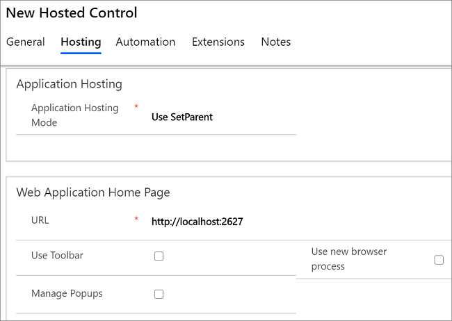
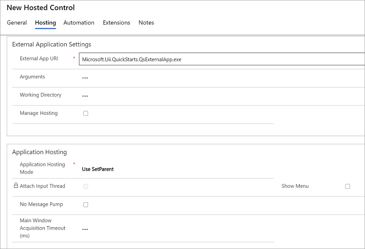
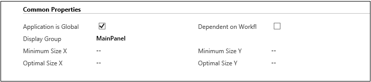

# Create and manage UII hosted applications in Unified Service Desk
A [!INCLUDE[pn_user_inteface_integration_uii](../includes/pn-user-interface-integration-uii.md)] hosted application enables you to create and host a [!INCLUDE[pn_uii_acronym](../includes/pn-uii-acronym.md)] hosted control, Windows Forms or [!INCLUDE[pn_ms_Windows_Presentation_Foundation](../includes/pn-ms-windows-presentation-foundation.md)] application, web application, or a remote (Citrix) application in [!INCLUDE[pn_unified_service_desk](../includes/pn-unified-service-desk.md)].  
  
 In this topic, you’ll learn how to configure a [!INCLUDE[pn_uii_acronym](../includes/pn-uii-acronym.md)] hosted application in [!INCLUDE[pn_unified_service_desk](../includes/pn-unified-service-desk.md)].  
  
## Create a hosted application  
  
1. Sign in to the Unified Service Desk Administrator.  
  
2. Select **Hosted Controls** under **Basic Settings**.  
  
4. Select **+ New**.
  
5. On the **New Hosted Control** page, under the **General** area, specify a name, sort order and display name for the hosted application. Each hosted application should have a unique name. Sort order specifies the order in which the hosted applications are retrieved and displayed in **Unified Service Desk**. Select the owner in the **Owner** box.  
  
6. Under the **Unified Service Desk** area, select **CCA Hosted Application** from the **Unified Service Desk Component Type** list. The fields in the New Hosted Control page change based on the type of hosted control you choose. For more information on the various hosted control types, see [Hosted control types and action/event reference](../unified-service-desk/hosted-control-types-action-event-reference.md)  
  
7. Under the **Hosted App Type** area, select the type of the hosted application. The fields in the **Hosting** area change based on the type of hosted application type selected.
  
   1.  For a hosted control, select **Hosted Control** type. Under **Hosting** area, specify the assembly URI and Type.  
  
   **URI** is the name of your assembly and the **Type** is the name of your assembly (dll) followed by a dot (.) and then the class name in your Visual Studio project.
  
   2.  For hosting a web application, select **Web Hosted Application** type. Select the **Hosting** tab.  
       1. **Application Hosting** is used to specify the mode of hosting the application. There are three modes of hosting an application, namely,  
  
           1. **Host Outside** – allows the application to be started outside of **Unified Service Desk**  
  
           2. **Use SetParent** – sets the application’s root window as the child window of **Unified Service Desk**.  
  
           3. **Use Dynamic Positioning** – monitors the size and position of the **Unified Service Desk** application and dynamically adjusts the size and position of the application.  
  
       1.  Under **Web Application Home Page**,  
  
           1. **URL** - specifies the URL where the application is running.  
  
           2. **Use Toolbar** – when checked displays the Internet Explorer toolbar.  
  
           3. **Use New Browser Process** – when checked, initiates the application in a new Internet Explorer process.  
  
           4. **Manage Pop ups** – when checked, allows the pop-up windows to be managed in **Unified Service Desk**.  
  
     
  
      For more information about how to build and host a web application in **Unified Service Desk**, see steps 1 to 3 of [Walkthrough: Create a UII Web Application Adapter](../unified-service-desk/walkthrough-create-uii-web-application-adapter.md)  
  
   3.  For hosting an external application, select **External Hosted Application** type. Under **Hosting** area,  
  
       1.  Under the **External Application Settings** area,  
  
           1. **External App URI** – Specifies the path of the executable.  
  
           2. **Arguments** – Specifies the arguments used during the application initiation.  
  
           3. **Working Directory** – Specifies the working directory of the executable.  
  
           4. **Manage Hosting** – Allows the hosting to be managed in **Unified Service Desk**  
  
       2.  Under **Application Hosting**,  
  
           1. **Application Hosting** - same as 8a above.  
  
           2. **No Message Pump** – Specifies if the application has a Windows Messaging queue.  
  
           3. **Show Menu** – When checked, displays the system menu for the application.  
  
           4. **Main Window Acquisition Time out** – Specifies the timeout period for the top-level window handle to be found.  
  
     
  
      For more information about how to build and host an external application in **Unified Service Desk**, see steps 1 to 3 of [Walkthrough: Create a UII Application Adapter](../unified-service-desk/walkthrough-create-uii-application-adapter.md)  
  
   4. For hosting a Citrix application, select **Remote Hosted Application** type. [!INCLUDE[proc_more_information](../includes/proc-more-information.md)] [Integrate with Citrix applications](../unified-service-desk/integrate-citrix-applications.md)  
  
8. In the **Common Properties** area,  
  
   1.  When **Application is Global** is checked, the application is run globally and is independent from the session context.  
  
   2.  The **Display Group** specifies where the application will be hosted in **Unified Service Desk**. For example, MainPanel or WorkflowPanel.  
  
   3.  When **Dependent on Workflow** is checked, the application is only loaded through a workflow step.  
  
   4. **Minimum Size X** specifies the minimum size of the application window in **Unified Service Desk** along the X axis.  
  
   5. **Minimum Size Y** specifies the minimum size of the application window in **Unified Service Desk** along the Y axis.  
  
   6. **Optimal Size X** specifies the display size of the application in **Unified Service Desk** along the X axis.  
  
   7. **Optimal Size Y** specifies the display size of the application in **Unified Service Desk** along the Y axis.  
  
     
  
9. In the **Dynamic** area, when the **Application is Dynamic** is checked, it means the application can be loaded dynamically and the **User Can Close** and the **Show in Toolbar Dropdown** check boxes become enabled.  
  
10. In the **Adapter Configuration** section, there are three adapter configurations to choose from the **Adapter** drop-down list:  
  
    1. **Use No Adapter** – specifies that the hosted application does not require any automation.  
  
    2. **Use Automation Adapter (HAT)** – specifies the default configuration used for the Hosted Application Toolkit (HAT) Software Factory.  
  
    3. **Use Adapter** – Specifies that the hosted application uses a custom adapter.  
  
         To understand how to create and configure an external application adapter, see steps 4 to 6 of [Walkthrough: Create a UII Application Adapter](../unified-service-desk/walkthrough-create-uii-application-adapter.md).  
  
         To understand how to create and configure a web application adapter, see steps 4 to 6 of [Walkthrough: Create a UII Web Application Adapter](../unified-service-desk/walkthrough-create-uii-web-application-adapter.md).  
  
11. If the hosted application uses an Automation Adapter (HAT), the **Automation XML** in the **Automation** section contains the hosted application’s binding information. For more information about bindings, see [Use UII inspector to create bindings for the hosted application](../unified-service-desk/use-uii-inspector-create-bindings-hosted-application.md).  
  
12. In the **Extensions** section, specify additional configuration information for your hosted control. For an example of the Extentions XML configuration, see the definition of the Kpi hosted control. Kpi hosted control is one of the sample applications that is shipped with **Unified Service Desk**.  
  
13. Select **Save** to create the hosted application.  
  
### See also  
 [Integrate with external applications and web applications](../unified-service-desk/integrate-external-applications-web-applications.md)   
 [Integrate with Citrix applications](../unified-service-desk/integrate-citrix-applications.md)

[!INCLUDE[footer-include](../includes/footer-banner.md)]