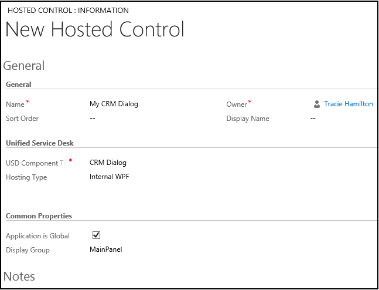

# CRM Dialog (Hosted Control)

[!INCLUDE[cc-data-platform-banner](../includes/cc-data-platform-banner.md)]

Use the **CRM Dialog** hosted control type to work with dialog. You can call the **StartDialog** action on your CRM Dialog hosted control to start a dialog within [!INCLUDE[pn_unified_service_desk](../includes/pn-unified-service-desk.md)].  

## Create a CRM Dialog hosted control
 While creating a new hosted control, the fields in the **New Hosted Control** screen vary based on the type of hosted control you want to create. This section provides information about the specific fields that are unique to the **CRM Dialog** hosted control type. For detailed information about creating a hosted control, see [Create or edit a hosted control](../unified-service-desk/create-edit-hosted-control.md).

   

 In the **New Hosted Control** screen:

- Under **Unified Service Desk** area, select **CRM Dialog** from the **USD Component Type** drop-down list.

- The **Hosting Type** drop-down list specifies how you want this control to be hosted. You can choose **Internal WPF** (default) or **IE Process**. For more information, see [Select a hosting method for hosted controls](../unified-service-desk/select-hosting-method-controls.md).

- Under the **Common Properties** area, select the **Application is Global** check box to set the hosted control as global. Global hosted controls can be displayed outside of a customer session. Controls like the agents’ dashboard, wall or search are common uses for global hosted controls. Global hosted controls do not have do not have session-specific state so when you change sessions, these same global hosted controls remain. If the check box is not selected, the hosted control becomes session based. Session-based controls exist in the context of the customer session. If the user changes to another session, all the session pages from the previous session are hidden.

- The **Display Group** field displays the panel where this hosted control will be displayed. **MainPanel** is the most common for this hosted control type. For information about various panels available in [!INCLUDE[pn_unified_service_desk](../includes/pn-unified-service-desk.md)], see [Panels in Unified Service Desk](../unified-service-desk/panels-panel-types-panel-layouts.md#Panels). For information about other **General** fields, see [Create or edit a hosted control](../unified-service-desk/create-edit-hosted-control.md).

## Predefined UII actions
 These are the predefined actions for this hosted control type.

### Close
 This action is used to close the hosted control.

### FireEvent
 Fires a user-defined event from this hosted control.

|Parameter|Description|
|---------------|-----------------|
|name|Name of the user-defined event.|

 All subsequent name=value pairs become the parameters to the event. For more information about creating a user-defined event, see [Create a user-defined event](../unified-service-desk/create-user-defined-event.md).

### MoveToPanel
 This action is used to move hosted controls between panels at runtime.

|Parameter|Description|
|---------------|-----------------|
|app|Name of the hosted control to be moved.|
|panel|Target panel for the hosted control.|

### New_CRM_Page  
 Creates a page for creating a new record of the entity specified, and treats the page as a popup from the specified hosted control. The window navigation rules are evaluated to determine the location where the page to create the entity record is displayed.  

|Parameter|Description|
|---------------|-----------------|
|LogicalName|The logical name of the entity for creating a new instance.|

> [!NOTE]
>  The rest of the parameters should consist of name=value pairs. These are the additional pre-populated values in the form for creating a new record for the specified entity. For more information about using this action, see step 4 in [Walkthrough 7: Configure agent scripting in your agent application](../unified-service-desk/walkthrough-configure-agent-scripting-agent-application.md).

### Open_CRM_Page
 Opens an existing instance of the entity specified and identified by the ID, and treats the page as a popup from the specified hosted control. The window navigation rules are evaluated to determine the location where the popup should be displayed.

|Parameter|Description|
|---------------|-----------------|
|LogicalName|The logical name of the entity to open.|
|id|The ID of the entity record to open.|

### Popup
 Pops up a URL from the hosted control and runs the window navigation rules against it for routing the popup to the appropriate location.

|Parameter|Description|
|---------------|-----------------|
|url|Routes a popup from this hosted control using this URL as if it were a popup requested from the displayed control.|
|frame|The frame from which this popup originated.|

### RealignWindow
[!INCLUDE[cc_RealignWindow_Action](../includes/cc-realignwindow-action.md)]

### SetSize
 This action explicitly sets the width and height of the hosted control. This is particularly useful when using "auto" in your panel layouts.

|Parameter|Description|
|---------------|-----------------|
|width|The width of the hosted control.|
|height|The height of the hosted control.|

### StartDialog
 This action takes several parameters but for dialogs that do not relate to a specific record, you can just specify the **Name** parameter.

| Parameter |                                                                                      Description                                                                                       |
|-----------|----------------------------------------------------------------------------------------------------------------------------------------------------------------------------------------|
|   Name    |                        The name of the dialog as seen in the **Settings** > **Process** section of Microsoft Dataverse.                        |
| DialogId  |                 You can also specify the dialog by its ID. If you specify the **DialogId** parameter, it will be used by the action instead of the **Name** parameter.                 |
|  Entity   |    This is the type of entity that the dialog is to be run against. This is required if you use the **DialogId** parameter. It is not required, if the **Name** parameter is used.     |
|    Id     | This is the ID of the entity to which the Dialog session applies. If this parameter is not specified, the dialog is run against the first entry of the appropriate type in the system. |

 When the dialog is finished, it will prompt the user to close the window. If the user affirms, the tab in the [!INCLUDE[pn_unified_service_desk](../includes/pn-unified-service-desk.md)] will close as well, which is by design.

## Predefined events
 The following predefined events are associated with this hosted control type.

### BrowserDocumentComplete
 Occurs when the page has finished loading. On a **CRM Page** type of hosted control, this event occurs after the data has been saved to the replacement parameter list. This event occurs only once, even though multiple frames will have individually fired their **BrowserDocumentComplete** events.

|Parameter|Description|
|---------------|-----------------|
|url|The URL of the page that has finished loading.|

### PopupRouted
 Occurs after a popup has been routed by the system.

|Parameter|Description|
|---------------|-----------------|
|url|The URL of the popup that was routed.|

### See also  
 [CRM Page (Hosted Control)](../unified-service-desk/crm-page-hosted-control.md)   
 [UII actions](../unified-service-desk/uii-actions.md)   
 [Events](../unified-service-desk/events.md)   
 [Unified Service Desk Configuration Walkthroughs](../unified-service-desk/unified-service-desk-configuration-walkthroughs.md)   
 [Hosted control types and action/event reference](../unified-service-desk/hosted-control-types-action-event-reference.md)   
 [Administration Guide for Unified Service Desk](https://go.microsoft.com/fwlink/p/?LinkID=394402)

[!INCLUDE[footer-include](../includes/footer-banner.md)]