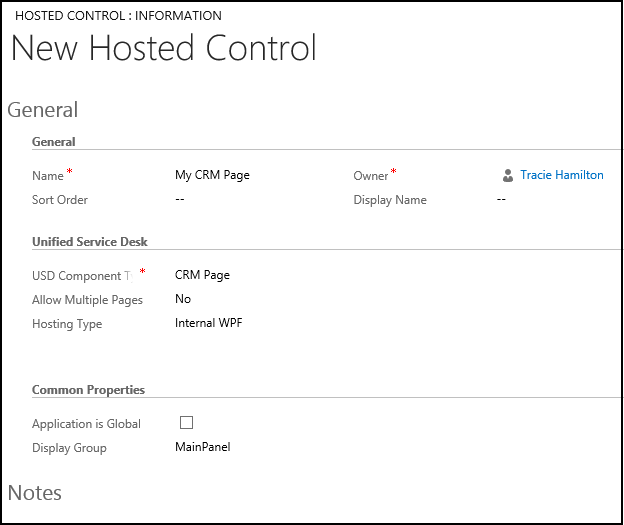

# CRM Page (hosted control)

[!INCLUDE[cc-data-platform-banner](../includes/cc-data-platform-banner.md)]

Use the CRM Page hosted control type to load a URL or page from model-driven apps. When a model-driven app page is loaded within a hosted control of this type, it automatically scans the page for data from the entity and automatically populates the replacement parameters.  

This hosted control type exposes a number of predefined UII actions and events that are unique to the handling of windows, including list manipulation actions and a find action for displaying a quick search or advanced search page.  

## Create a CRM Page hosted control

While you're creating a new hosted control, the fields on the **New Hosted Control** screen will vary based on the type of hosted control you want to create. This section provides information about the specific fields that are unique to the CRM Page hosted control type. More information: [Create or edit a hosted control](../unified-service-desk/create-edit-hosted-control.md)

   

On the **New Hosted Control** screen:

- In the **Unified Service Desk** area, select **CRM Page** from the **Unified Service Desk Component Type** drop-down list.

- Select **Pre-fetch Data** to load related information for an entity record in the context along with the entity record page, without having to wait for the full entity webpage to load in the client application. The fetched entity information is populated in the [!INCLUDE[pn-unified-service-desk](../includes/pn-unified-service-desk.md)] context, thus enabling any hosted control to quickly display relevant entity information in the client application. This can help agents instantly act or kick-start discussions with customers, saving crucial interaction time.

- From the **Allow Multiple Pages** drop-down list, select **No** (default) to replace the model-driven app page that is currently displayed and update the browser history when [!INCLUDE[pn_unified_service_desk](../includes/pn-unified-service-desk.md)] receives a navigate action call or a page is routed to the tab. Select **Yes** to automatically create a drop-down list when a second URL is called or a window navigation rule directs a page to the tab. This allows the user to quickly search between the model-driven app pages that are attached to this control. Also, when you select **Yes**, an additional field, **Maximum Browsers**, becomes available where you can specify the maximum number of pages to be displayed in the drop-down list.  

- The **Hosting Type** drop-down list specifies how you want this control to be hosted. Choose **Chrome Process**. More information: [Select a hosting method for hosted controls](../unified-service-desk/select-hosting-method-controls.md)

- In the **Common Properties** area, select the **Application is Global** check box to set the hosted control as global. Global hosted controls can be displayed outside of a customer session. Controls like the agent's dashboard, wall, or search are common uses for global hosted controls. Global hosted controls don't have a session-specific state, so when you change sessions, these same global hosted controls remain. If this check box isn't selected, the hosted control becomes session-based. Session-based controls exist in the context of the customer session. If the user changes to another session, all the pages from the previous session are hidden.

- The **Display Group** field displays the panel where this hosted control will be displayed. **MainPanel** is the most common choice for this hosted control type. More information: [Panels, panel types, and panel layouts in Unified Service Desk](../unified-service-desk/panels-panel-types-panel-layouts.md)

For information about other **General** fields, go to [Create or edit a hosted control](../unified-service-desk/create-edit-hosted-control.md).

## Predefined UII actions

The following are the predefined actions for this hosted control type.

### AssociatedView  

This action loads a specific associated view of model-driven apps. These views are typically accessed by expanding the entity record name in the nav bar, and selecting the associated entities.  

|  Parameter  |                                                 Description                                                  |
|-------------|--------------------------------------------------------------------------------------------------------------|
| navItemName |                        The associated entity that you want to display. Example: Cases                        |
|     Id      |             The ID of the main entity record for which to display the associated entity records.             |
|   tabset    | The area in model-driven apps. Examples: areaSales or areaService. |

More information: Step 5 in [Walkthrough 7: Configure agent scripting in your agent application](../unified-service-desk/walkthrough-configure-agent-scripting-agent-application.md)

### Close

This action is used to close the hosted control. Unlike the **CloseActive** action, if this tab (hosted control) is displaying more than one page, this action will close all the pages displayed in the tab in your agent application.

### CloseActive

This action is used to close the active window within this hosted control. If the active window is the only window displayed in the hosted control, the hosted control itself will be closed. For CRM Page type of hosted controls that don't allow multiple pages (**Allow Multiple Pages** = No), this action is equivalent to the **Close** action.

### CloseAndPrompt

This action closes the hosted control, but prompts the user to save or abandon their changes before closing.

### DisableToolbarButton

This action disables the specified toolbar button on the toolbar in your agent application.

|Parameter|Description|
|---------------|-----------------|
| *See description* |The name of the toolbar button to disable.|

### EnableToolbarButton

This action enables the specified toolbar button on the toolbar in your agent application.

|Parameter|Description|
|---------------|-----------------|
|*See description*|The name of the toolbar button to enable.|

### Find

Navigate to the quick find list view of the specified entity.

|Parameter|Description|
|---------------|-----------------|
|*See description*|The data parameter should specify the entity logical name of the quick find list view to display. There are some special case values:   -   Use **case** or **incident** to display the quick find list view for cases. -   Use **advfind** to display the advanced find view. -   Use **activities** or **activity** to display the quick find list view for activities.|

### FireEvent

Fires a user-defined event from this hosted control.

|Parameter|Description|
|---------------|-----------------|
|name|The name of the user-defined event.|

 All subsequent name/value pairs become the parameters to the event. More information: [Create a user-defined event](../unified-service-desk/create-user-defined-event.md)

### GetSelectedIds

This action is used to retrieve the selected IDs from the lists.

|Parameter|Description|
|---------------|-----------------|
|*See description*|The data parameter should specify the list name to capture the selected IDs from.|

 The return value contains a semicolon-delimited list of IDs containing the selected items.

### GetSelectedCount

This action retrieves the number of items that are selected. Use the **GetSelectedIds** action to get the actual list of IDs for the entity.

|Parameter|Description|
|---------------|-----------------|
|*See description*|The data parameter should specify the list name to retrieve the selected IDs from.|

 The return value contains a number representing the quantity of selected items.

### GoHome

This action goes to the initial URL specified for this browser instance.

### GoBack

This action is equivalent to selecting the back button in the browser instance.

### GoForward

This action is equivalent to selecting the forward button in the browser instance.

### LoadArea  

This action loads a specific area from model-driven apps. This is equivalent to selecting an area in the navigation pane (such as Sales, Service, or Marketing). The only parameter is the name of the area to select, for example **areaService**.  

|Parameter|Description|
|---------------|-----------------|
|frame|The name of the frame to affect. If no name is specified, the action will automatically target the first frame found on the page.|

### LookupInfo

Displays the Microsoft Dataverse lookup information dialog box so you can select an entity from a list.  

|Parameter|Description|  
|---------------|-----------------|  
|AllowFilterOff|**0** or **1** to allow the user to turn off filtering|  
|DefaultType|The Logical Name of the default display. This should be one of the numeric values specified in the objecttypes parameter.|  
|DefaultViewId|**0** or **1** to show the default view|  
|DisableQuickFind|**0** or **1** to show the quick find field|  
|DisableViewPicker|**0** or **1** to show the view selector|  
|LookupStyle|Single or Multiple|  
|ShowNewButton|**0** or **1** to show the **New** button|  
|ShowPropButton|**0** or **1** to show the **Properties** button|  
|Browse|**0** or **1** whether to use browsing mode|  
|Currentid|The GUID for the current value|  
|objecttypes|List of object types to display. Example: **1,2** to display accounts and contacts.|  

### MoveToPanel

This action moves a CRM Page hosted control to a different panel at runtime.

|Parameter|Description|
|---------------|-----------------|
|*See description*|The data parameter should specify the target panel name to move the hosted control to. For example: `FloatingPanel`.|

### Navigate 
 This action is used to navigate to a model-driven app URL.  

|     Parameter     |                                                                                                                                                                                                                                       Description                                                                                                                                                                                                                                        |
|-------------------|------------------------------------------------------------------------------------------------------------------------------------------------------------------------------------------------------------------------------------------------------------------------------------------------------------------------------------------------------------------------------------------------------------------------------------------------------------------------------------------|
|        url        |                                                                                                                                                                                                                  The URL to navigate to. This is a mandatory parameter.                                                                                                                                                                                                                  |
|      Noscan       |                                                                                                                                                                                           If this parameter is supplied and **True**, the data parameters won't be captured from the page.                                                                                                                                                                                            |
|  HideCommandBar   |                                                                                                                                                        If this parameter is supplied and **True**, the inner frame will be displayed without loading the model-driven app command bar.                                                                                                                                                        |
| HideNavigationBar |                                                                                                                                                          If this parameter is supplied and **True**, the form will be displayed without loading the model-driven app navigation bar.                                                                                                                                                          |
|       Frame       |                                                                                                                                                                          When frames exist on the page, this parameter specifies the name of the frame to navigate, rather than navigating the main window.                                                                                                                                                                          |
|     postdata      |                Data that is sent to the server as part of an HTTP POST transaction. A POST transaction is typically used to send data gathered by an HTML page. In [!INCLUDE[pn_unified_service_desk](../includes/pn-unified-service-desk.md)], this data can be received from any event triggered by using "<https://event/?>". Example: `[[postdata]+]`   Alternatively, the data can be passed as an encoded string with its header type in the intended format.                 |
|      header       | A string value that contains additional HTTP headers to send to the server. When the `postdata` parameter is used in the **Navigate** action, you should also specify an appropriate value for the `header` parameter. Example: `Content-Type:application/x-www-form-urlencoded`   If a [!INCLUDE[pn_unified_service_desk](../includes/pn-unified-service-desk.md)]POST event triggers the **Navigate** action, the default value of this parameter should be `header=[[header]+]`    To add multiple headers, the value of this parameter should be: `header=$Multiline(<headers separated by newline>)`   Example:`header=$Multiline(accessToken;dummyAccessToken==`  `refreshToken;dummyRefreshToken===)`|

### New_CRM_Page  

Creates a page for creating a new record of the entity specified, and treats the page as a pop-up window from the specified hosted control. The window navigation rules are evaluated to determine the location where the page to create the entity record will be displayed.  

|Parameter|Description|
|---------------|-----------------|
|LogicalName|The logical name of the entity for creating a new instance.|

> [!NOTE]
> The rest of the parameters should consist of name/value pairs. These are the additional pre-populated values in the form for creating a new record for the specified entity. More information: Step 4 in [Walkthrough 7: Configure agent scripting in your agent application](../unified-service-desk/walkthrough-configure-agent-scripting-agent-application.md)

### Open_CRM_Page

Opens an existing instance of the entity specified and identified by the ID, and treats the page as a pop-up window from the specified hosted control. The window navigation rules are evaluated to determine the location where the pop-up window should be displayed.

|Parameter|Description|
|---------------|-----------------|
|LogicalName|The logical name of the entity to open.|
|id|The ID of the entity record to open.|

### Popup

"Pops up" a URL from the hosted control and runs the window navigation rules against it for routing the pop-up window to the appropriate location.

|Parameter|Description|
|---------------|-----------------|
|url|Routes a pop-up window from this hosted control by using this URL as if it were a pop-up window requested from the displayed control.|
|frame|The frame from which this pop-up window originated.|

### RealignWindow

[!INCLUDE[cc_RealignWindow_Action](../includes/cc-realignwindow-action.md)]

### Refresh

This action refreshes the current page.

### ReRoute

This action takes the currently displayed URL and sends it through the window navigation rules from the current hosted control as a pop-up window.

### RunScript  

This action injects JavaScript into the main frame of the application. You should avoid using Dataverse client SDK calls with this action; instead, use the **RunXrmCommand** action.  

|Parameter|Description|
|---------------|-----------------|
|*See description*|The data parameter is the JavaScript that will be injected into the form. **Note:**  The replacement parameters can be used in the script, and they'll be replaced before the script is executed.|

   
### RunXrmCommand  

This action is used to inject Dataverse SDK JavaScript into the model-driven app form.  

|Parameter|Description|
|---------------|-----------------|
|*See description*|The data parameter is the JavaScript that will be injected into the form. **Note:**  The replacement parameters can be used in the script, and they'll be replaced before the script is executed.|

### SetSize

This action explicitly sets the width and height of the hosted control. This is particularly useful when using "auto" in your panel layouts.

|Parameter|Description|
|---------------|-----------------|
|width|The width of the hosted control.|
|height|The height of the hosted control.|

### SaveAndClose  

This action saves the "dirty" data on the model-driven app form and closes the hosted control.  

### SaveAll

This action saves all forms in a hosted control that allows multiple pages to be displayed (**Allow Multiple Pages** = Yes). If the hosted control allows only a single page to be displayed (**Allow Multiple Pages** = No), this is equivalent to the **Save** action.

### Save

This action saves the current CRM Page.

### ToggleRibbon

This action collapses or expands the ribbon. If you hide the ribbon in the **Navigate** action, it won't be displayed and this action won't work. This action will work only when the ribbon was initially loaded.

### ToggleNavigation  

This action collapses or expands the navigation pane on the left side of the model-driven app window. The navigation must contain a navigation panel for this action to work.  

## Predefined events

The following predefined events are associated with this hosted control type.

### ActiveClosed

Occurs when the active hosted control is closed by using the [**CloseActive**](../unified-service-desk/crm-page-hosted-control.md#CloseActive) action.

|Parameter|Description|
|---------------|-----------------|
|url|The URL that was displayed in the hosted control when it was closed.|

### BrowserDocumentComplete

Occurs when the page has finished loading. On a CRM Page type of hosted control, this event occurs after the data has been saved to the replacement parameter list. This event occurs only once, even though multiple frames will have individually fired their **BrowserDocumentComplete** events.

|Parameter|Description|
|---------------|-----------------|
|url|The URL of the page that has finished loading.| 

### DataReady

Occurs as soon as the related information for an entity record is loaded in the [!INCLUDE[pn-unified-service-desk](../includes/pn-unified-service-desk.md)] context. This event occurs before the **BrowserDocumentComplete** event. If the **Pre-Fetch Data** option is selected for the control instance, this event will occur as soon as the entity data is fetched in a separate parallel call to the server and won't wait for the full page to finish loading. The entity data is pre-fetched and the **DataReady** event is fired for inline navigation as well.

### PageLoadComplete

Occurs any time that a frame has completed loading. This event can occur multiple times per page load when an iFrame or frame is used on the page. This event corresponds to the individual **BrowserDocumentComplete** events in code.

|Parameter|Description|
|---------------|-----------------|
|frame|The name of the frame that finished loading, if available.|
|url|The URL of the frame that finished loading.|

### PopupRouted

Occurs after a pop-up window has been routed by the system.

|Parameter|Description|
|---------------|-----------------|
|url|The URL of the pop-up window that was routed.|

### RefreshRequested

Occurs when refresh is requested on the current page. Refresh can be requested either by pressing the F5 key or calling the Refresh action by the application.

|Parameter|Description|
|---------------|-----------------|
|url|The URL displayed when refresh was requested.|

### Saved  

Occurs after a record in the model-driven app page is saved.  

|Parameter|Description|
|---------------|-----------------|
|newId|The ID assigned to the newly created record.|

> [!Note]
> We recommend that you not use `window.IsUSD` in model-driven app forms, and instead use the [BrowserDocumentComplete](#browserdocumentcomplete) event or other events listed in this topic.

### See also

 [CRM Dialog (Hosted Control)](../unified-service-desk/crm-dialog-hosted-control.md)   
 [UII actions](../unified-service-desk/uii-actions.md)   
 [Events](../unified-service-desk/events.md)   
 [Walkthrough 3: Display records in your agent application](../unified-service-desk/walkthrough-3-display-microsoft-dynamics-365-records-in-your-agent-application.md)   
 [Hosted control types and action/event reference](../unified-service-desk/hosted-control-types-action-event-reference.md)   
 [Administration Guide for Unified Service Desk](https://go.microsoft.com/fwlink/p/?LinkID=394402)

[!INCLUDE[footer-include](../includes/footer-banner.md)]