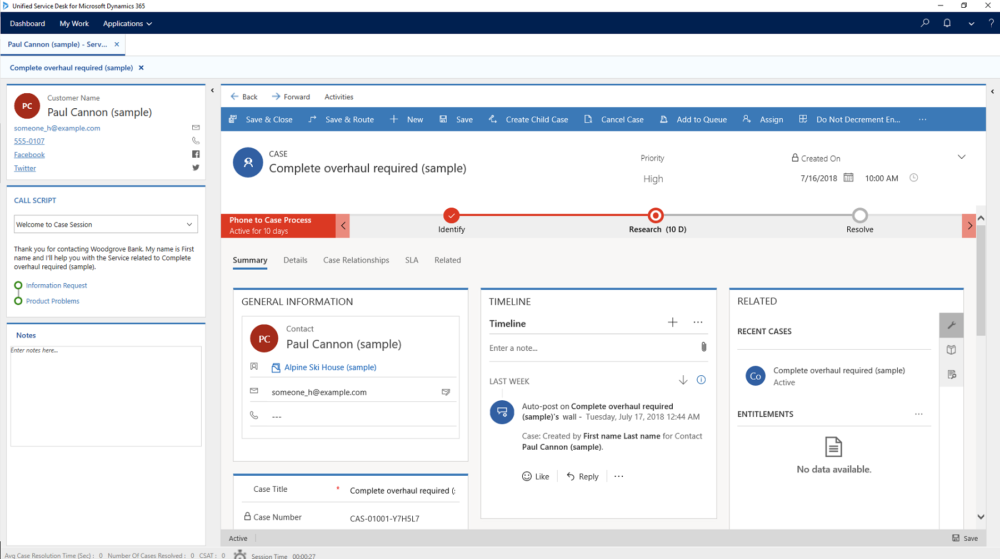
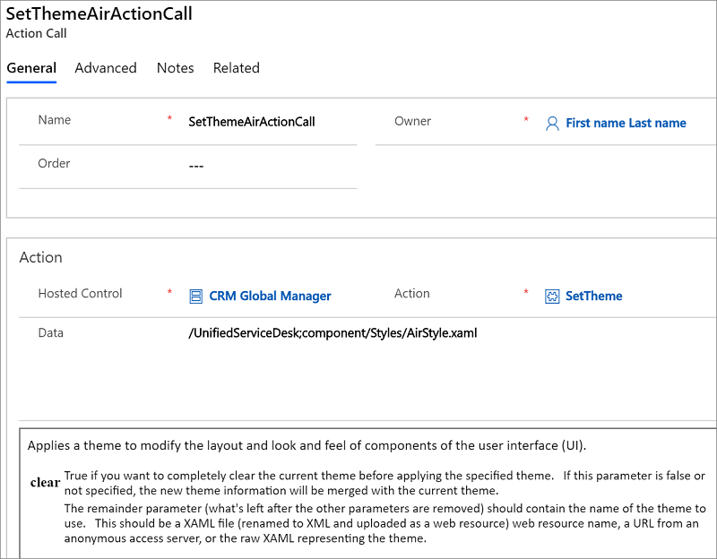

# Customize themes in Unified Service Desk

[!INCLUDE[cc-data-platform-banner](../includes/cc-data-platform-banner.md)]

Themes in [!INCLUDE[pn_unified_service_desk](../includes/pn-unified-service-desk.md)] define the look and feel of the agent application. A theme in [!INCLUDE[pn_unified_service_desk](../includes/pn-unified-service-desk.md)] consists of a XAML resource library, and can be placed on any web server and referenced via URL or can be compile into .NET assemblies (dll), and distributed with the agent applications.

  The predefined [Air Theme](../unified-service-desk/customize-themes-in-unified-service-desk.md#AirTheme) supports the high-contrast mode. The high-contrast mode in [!INCLUDE[pn_ms_Windows_short](../includes/pn-ms-windows-short.md)] helps you read the text on screen clearly by increasing the color contrast. When you turn on high-contrast mode on your computer and are using the  `Air Theme`, the [!INCLUDE[pn_unified_service_desk](../includes/pn-unified-service-desk.md)] client will automatically switch to the high-contrast mode. Similarly, disabling the high-contrast mode on your computer will cause the [!INCLUDE[pn_unified_service_desk](../includes/pn-unified-service-desk.md)] client to automatically switch to the normal display mode.

> [!NOTE]
>  The automatic switching between normal and high-contrast modes in the [!INCLUDE[pn_unified_service_desk](../includes/pn-unified-service-desk.md)] client is supported only for the  predefined [Air Theme](../unified-service-desk/customize-themes-in-unified-service-desk.md#AirTheme). If you are using custom themes or custom hosted controls that supports high-contrast mode, the switching happens only after you restart the [!INCLUDE[pn_unified_service_desk](../includes/pn-unified-service-desk.md)] client after switching to normal or high-contrast mode on your computer. [!INCLUDE[proc_more_information](../includes/proc-more-information.md)] [High-contrast mode support  for custom themes](#HighContrast)

<a name="PredefinedThemes"></a>
## Predefined Themes available in Unified Service Desk
 [!INCLUDE[pn_unified_service_desk](../includes/pn-unified-service-desk.md)] comes with three predefined themes.

::: moniker range=">=dynamics-usd-4"

<a name="UnifiedBlueTheme"></a>
### Unified Blue Theme

This is Unified Blue theme, which is the predefined theme for Unified Service Desk when you are using Unified Interface App.



::: moniker-end

<a name="AirTheme"></a>   
### Air Theme  
 This is the Air theme. This theme supports high-contrast mode.  
  
  
  
<a name="SetPredefinedTheme"></a>   
## Set a predefined theme  
 The **SetTheme** action for the Global Manager hosted control lets you set a theme in [!INCLUDE[pn_unified_service_desk](../includes/pn-unified-service-desk.md)]. You can create an action call to the **SetTheme** action, and pass the predefined theme call in the **Data** field using the following syntax to set one of the predefined themes:  
  
```  
/UnifiedServiceDesk;component/Styles/<Theme_Style>.xaml  
```  
  
 The following table provides the syntax for the **Data** field in your action call to set a predefined theme:  
  
|Theme|Syntax for the Data field|  
|-----------|-------------------------------|  
|Air|/UnifiedServiceDesk;component/Styles/AirStyle.xaml|  
|Blue|/UnifiedServiceDesk;component/Styles/BlueStyle.xaml|  
|Style|/UnifiedServiceDesk;component/Styles/Style.xaml|  
  
 In the sample [!INCLUDE[pn_unified_service_desk](../includes/pn-unified-service-desk.md)] client application, agents can set theme by selecting the down arrow next to the settings icon at the top-right corner, and then selecting a predefined theme from the **Set Theme** submenu.  
  
 Selecting a theme in the **Set Theme** submenu makes an action call to the **SetTheme** action with the appropriate syntax in the **Data** field as mentioned earlier. For example, this is the action call definition for the Air style:  
  
   
  
<a name="Customize"></a>   
## Customize themes in Unified Service Desk  
 Apart from being able to choose from various predefined themes, you can customize a theme in [!INCLUDE[pn_unified_service_desk](../includes/pn-unified-service-desk.md)]. This is done by updating selective controls and then merging it with the existing theme in [!INCLUDE[pn_unified_service_desk](../includes/pn-unified-service-desk.md)] to customize the appearance. [!INCLUDE[pn_unified_service_desk](../includes/pn-unified-service-desk.md)] provides a default style (XAML file) and a bunch of XAML brush resources that you can use to understand the various WPF controls and layout that define the appearance of your agent application. You can find the default style for [!INCLUDE[pn_unified_service_desk](../includes/pn-unified-service-desk.md)] application, **DefaultStyle.xaml**, along with other XAML brush resources in the [!INCLUDE[pn_user_interface_integration](../includes/pn-user-interface-integration.md)] SDK download package. [Download](https://go.microsoft.com/fwlink/p/?LinkId=395257) the package, and extract it to view the file and its contents under the "UII\USD Developer Assets\USD Layout and Style Sheet" directory.  
  
> [!NOTE]
>  WPF and XAML scripting are essential skills required for customizing the display of your agent applications by manipulating controls in a XAML file.  
  
 Use the **SetTheme** action for the Global Manager hosted application to customize the default style of the agent application. [!INCLUDE[pn_unified_service_desk](../includes/pn-unified-service-desk.md)] supports merging of your customizations with the existing theme or display style of the agent application. This effectively means that you just need to specify the controls or areas that you want to be changed along with the ResourceDictionary reference block to customize an existing display style. For general information about ResourceDictionary, select [ResourceDictionary and XAML resource references](/previous-versions/windows/apps/hh968442(v=win.10)).  
  
 Let us create an action call to change the text in the title and the skin color of the agent application to Yellow. Make sure you have the DefaultStyle.xaml file handy as we will need it.  
  
1. Sign in to Unified Service Desk Administrator.  
  
2. Select **Action Calls** under **Basic Settings**.  
  
3. Select **+ Nw** to create an action call.  
  
4. On the **New Action Call** page, set the general properties:  
  
   1.  In the **Name** field, type **Action Call for Custom Display**.  
  
   2.  In the **Hosted Control** field, select **CRM Global Manager**. If you have a different name for your Global Manager hosted control type, specify that name instead.  
  
   3.  In the **Action** field, select **SetTheme**.  
  
5. Now, we will set the parameter for customizing the display. In the **Data** field, copy the following ResourceDictionary reference:  
  
   ```  
  
   <ResourceDictionary xmlns="https://schemas.microsoft.com/winfx/2006/xaml/presentation"  
        xmlns:x="https://schemas.microsoft.com/winfx/2006/xaml"  
        xmlns:Microsoft_Windows_Themes="clr-namespace:Microsoft.Windows.Themes;assembly=PresentationFramework.Classic"  
        xmlns:themes="clr-namespace:Microsoft.Windows.Themes;assembly=PresentationFramework.Luna"  
        xmlns:ribbon="clr-namespace:Microsoft.Windows.Controls.Ribbon;assembly=RibbonControlsLibrary"  
        xmlns:classic="clr-namespace:Microsoft.Windows.Themes;assembly=PresentationFramework.Classic"  
        xmlns:shell="clr-namespace:Microsoft.Windows.Shell;assembly=Microsoft.Windows.Shell"  
        xmlns:system="clr-namespace:System;assembly=mscorlib">  
   ```  
  
   > [!IMPORTANT]
   >  This `ResourceDictionary` reference must be included in every action call that you use to customize the default style.  
  
6. Copy the following command in the **Data** field after the ResourceDictionary reference that you copied earlier.  
  
   ```  
   <SolidColorBrush x:Key="WindowBackgroundStyle" Color="Yellow"/>  
   ```  
  
    This will change the skin of the agent application to Yellow. You will find this command to set the background color in the `<!-- Region General -->` section in the `DefaultStyle.xaml` file.  
  
7. Copy the following command after the command that you copied in the previous step:  
  
   ```  
   <Style x:Key="MainWindow" TargetType="{x:Type Window}" BasedOn="{StaticResource {x:Type Window}}">  
       <Setter Property="Title" Value="CUSTOM TITLE: Agent Application for CONTOSO INC."/>  
       <Setter Property="Icon" Value="/UnifiedServiceDesk;component/imageResources/dynamics16-32-48-256.ico"/>  
       <Setter Property="FontFamily" Value="Segoe UI" />  
   </Style>  
   ```  
  
    This will change the text in the title bar to “CUSTOM TITLE: Agent Application for CONTOSO INC.”. You will find this command to set the Window title in the `<!-- Region Window --> section in the DefaultStyle.xaml file.`  
  
8. Close the ResourceDictionary tag by adding the following at the end of the **Data** field:  
  
    ```  
    </ResourceDictionary>  
    ```  
  
     This is how your action call definition looks like:  
  
     
  
9. Select **Save**.  
  
    You are done, and now ready to test the action call in the agent application.  
  
<a name="Test"></a>   
## Test the action call for customizing your display  
 You can call this action call by creating a toolbar button, and then attaching the action call to it. For the sake of brevity, we will use the Debugger hosted application to test the action call.  
  
1. Start [!INCLUDE[pn_unified_service_desk](../includes/pn-unified-service-desk.md)] client application, and sign in to your Dynamics 365 instance.  
  
2. In the client application, start Debugger by selecting down arrow next to the settings menu in the top-right corner, and select **Debug**.  
  
3. In Debugger, select the down arrow above the **Action Calls** tab to display the area where you can test action calls and UII actions.  
  
     
  
4. From the **Action Calls** drop-down list, select **Action Call for Custom Theme**, and select the **Run Action Call** icon (). The text in the title bar and skin color of the agent application change.  
  
     
  
   To undo the changes, select one of the predefined themes in the client application.  
  
<a name="HighContrast"></a>   
## High-contrast mode support  for custom themes  
 [!INCLUDE[pn_unified_service_desk](../includes/pn-unified-service-desk.md)] internally uses normal and high-contrast mode XAML brush resources to display its UI elements depending on the high-contrast mode setting on your computer. You can find the XAML brush resources in the [!INCLUDE[pn_user_interface_integration](../includes/pn-user-interface-integration.md)] SDK download package. [Download](https://go.microsoft.com/fwlink/p/?LinkId=395257) the package, and extract it to view the file and its contents under the "UII\USD Developer Assets\USD Layout and Style Sheet" directory.  
  
 To support high-contrast mode in your custom themes, consider the following:  
  
-   Create two action calls for setting a custom theme: one for the *normal* mode and the other for the *high-contrast* mode. For example, while defining the color property of a XAML brush, use:  
  
    -   One of the predefined colors as defined in the [Colors](https://msdn.microsoft.com/library/system.windows.media.colors\(v=vs.110\).aspx) class for the *normal* mode:  
  
        ```  
        <SolidColorBrush x:Key="WindowBackgroundStyle" Color="Yellow"/>  
        ```  
  
    -   One of the system colors as defined in the [SystemColors](https://msdn.microsoft.com/library/system.windows.systemcolors.windowcolor\(v=vs.110\).aspx) class for the *high-contrast* mode:  
  
        ```  
        <SolidColorBrush x:Key="WindowBackgroundStyle" Color="{x:Static SystemColors.WindowColor}"/>  
        ```  
  
-   Use the new  `$SystemParameters.HighContrast` replacement parameter in each of your action call definition as a condition to ensure that a action call is fired appropriately. For example, in the action call definition for setting custom theme for:  
  
    -   The *normal* mode, use the following in the **Condition** field to check that the high-contrast mode is not set on your computer:  
  
        ```  
        "[[$SystemParameters.HighContrast]g]"=="False"  
        ```  
  
    -   The *high-contrast* mode, use the following in the **Condition** field to check that the high-contrast mode is set on your computer:  
  
        ```  
        "[[$SystemParameters.HighContrast]g]"=="True"  
        ```  
  
### See also  
 [Customize themes for High Contrast settings](../unified-service-desk/customize-themes-in-unified-service-desk.md )   
 [Unified Service Desk Configuration Walkthroughs](../unified-service-desk/unified-service-desk-configuration-walkthroughs.md)   
 [Use themes to customize the appearance of your application](../unified-service-desk/customize-appearance-application.md)   
 [Hosted control types and action/event reference](../unified-service-desk/hosted-control-types-action-event-reference.md)   


[!INCLUDE[footer-include](../includes/footer-banner.md)]