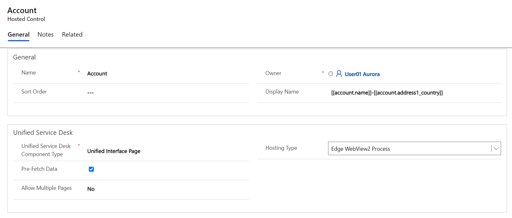

# Use Edge WebView2 Process to host web applications (Preview)

[!INCLUDE[cc-data-platform-banner](../includes/cc-data-platform-banner.md)]
> - This is a preview feature. [!INCLUDE[cc-preview-features-definition](../includes/cc-preview-features-definition.md)]
> - [!INCLUDE[cc-preview-features-expect-changes](../includes/cc-preview-features-expect-changes.md)]
> - [!INCLUDE[cc-preview-features-no-ms-support](../includes/cc-preview-features-no-ms-support.md)]

The Edge WebView2 Process (Preview) browser control hosts your controls in individual Edge WebView2 process instances and displays them in tabs in the Unified Service Desk client application. It facilitates predictable and secure page rendering by making sure that if your web application works in Microsoft Edge, it will work in Unified Service Desk.

The advantages of using the Edge WebView2 Process hosting method are as follows:

- Available on supported versions of the Windows operating system.
- Highly reliable.
- Easy to configure to host applications in Unified Service Desk.
- Switch seamlessly from one browser to another for your entire organization.
- Enhanced performance and memory optimization.

Also, administrators will be able to perform the following:

- Select Edge WebView2 process as the hosting type for the organization.
- Select Edge WebView2 process as the hosting type for select web applications, alongside Chrome process.

## Edge WebView2 Process settings

You can set the **Edge WebView2** process on the hosted controls (existing hosted controls and new hosted controls) to host applications. This allows you to choose the hosted controls that uses **Edge WebView2 Process** based on your requirements. More information: [Create a hosted control with hosting type as Edge WebView2](edge-webview2-process.md#create-a-hosted-control-with-hosting-type-as-edge-webview2)

If you want to set the **Edge WebView2** process to host the applications for an entire organization, then use the **GlobalBrowserMode** Global UII option and specify the value as **EdgeWebView2**. More information: [Enable Edge WebView2 for Unified Service Desk on client desktop](edge-webview2-process.md#enable-edge-webview2-for-unified-service-desk-on-client-desktop)

If you want to set the **Edge WebView2** process only for some agents in your organization, then in the **UnifiedServiceDesk.exe.config** file, add the **GlobalBrowserMode** key with the value as **EdgeWebView2**. More information: [Enable Edge WebView2 for an entire organization](edge-webview2-process.md#enable-edge-webview2-for-an-entire-organization)

## Enable Edge WebView2 Process

Enable the **Edge WebView2** process in any one of the following ways:

- Create an individual hosted control with hosting type as Edge WebView2
- Enable for individual client desktops
- Enable for an entire organization

> [!NOTE]
> Enable the **Edge WebView2** process either for individual client desktops or for entire organization.

### Order of precedence

- Setting the **GlobalBrowserMode** Global UII option value as **EdgeWebView2**, takes precedence over the individual hosted control settings.   For example, some hosted controls have hosting type as **Chrome** process. At the organization level, you set **GlobalBrowserMode** Global UII option value as **EdgeWebView2**. In this scenario, the Global UII option takes precedence and configuration uses the **Edge WebView2** process to host the applications. 

- Setting the **GlobalBrowserMode** key to **EdgeWebView2** in the **UnifiedServiceDesk.exe.config** file for a particular client desktop, takes precedence over the individual hosted control settings.  For example, some hosted controls have hosting type as **Chrome** process. For a few agents, in their client desktops, you have set **GlobalBrowserMode** key to **EdgeWebView2** in the **UnifiedServiceDesk.exe.config** file. The value set in the **UnifiedServiceDesk.exe.config** file take precedence and configuration uses the **Edge WebView2** process to host the applications.

- Setting the **GlobalBrowserMode** key to **EdgeWebView2** in the **UnifiedServiceDesk.exe.config** file for a particular client desktop, takes precedence over other settings.

### Create a hosted control with hosting type as Edge WebView2

When you are creating a new hosted control, you can select **Edge WebView2 Process** as the **Hosting Type**.

1. Sign in to Dynamics 365.

2. Go to **Settings** > **Unified Service Desk**.

3. Select **Hosted Controls**. The page displays available hosted controls.

4. To create a new hosted control, select **New**.

5. On the **New Hosted Control** page, specify the details and select **Edge WebView2 process** from the **Hosting Type** drop-down. 

6. Select **Save** to create the hosted control.

### Enable Edge WebView2 for Unified Service Desk on client desktop

1. Go to the directory where you have installed Unified Service Desk and double-click to open the **UnifiedServiceDesk.exe.config** file.
Example path: `C:\Program Files\Microsoft Dynamics CRM USD\USD`
r
2. Under the `<appSettings>` section add the new key. 
`<add key="GlobalBrowserMode" value="EdgeWebView2"/>`

3. Save the file.

### Enable Edge WebView2 for an entire organization

Add a new Global UII option for your organization named **GlobalBrowserMode**. Specify the value as **Edge WebView2**.

1. Sign in to Dynamics 365.

2. Go to **Settings** > **Unified Service Desk** > **Options**.

3. On the **Active UII Options** page, select **New**.

4. Choose **Others** for the **Global Option** field.

5. Type **GlobalBrowserMode** for the **Name** field.

6. Type **Edge WebView2** for the **Value** field.

7. Select **Save**.

## RunScript action is asynchronous in Edge WebView2 Process

The Microsoft Edge browser supports only the asynchronous operations, and the RunScript action will be asynchronous.
If your custom code execution is dependent on the return value provided by RunScript action that injects JavaScript into the main frame of the application, then your custom code execution might fail.

For example, your custom code has a RunScript actions that injects the JavaScript into the main frame of the application followed by an operation or another RunScript action. The RunScript action is invoked and returns a value after the JavaScript injection. If the subsequent operation or another RunScript action executes based on the return value provided by the executed RunScript action, then subsequent operations of your custom code will fail.

### Scenario example 

Whenever you open a case, verify whether the case has been open for 10 or more days, then display a message in a dialog. When you perform an action on the dialog box, the phone call page is opened for further operations.

To perform the above-mentioned scenario, you must have an action call that executes a **RunScript** action and returns a value for the next operation. The data on the action call calculates the number of days a case is open. 

Now, you must create an action call with action as **ExecuteOnDataAvailable**, and the data field must have the return value of the first action call. That is, the return value will have the form `[[$Return.ActionCallName]]`. This ensures that after the first action is executed and the return is available, this action call will be executed.

Next, you must create a sub action call to show the number of days a case is in the open state. The data field will use the return value form the first action call, that is, `[[$Return.ActionCallName]]`.

You must create another sub action call to open the phone call page and perform the next operation. After seeing the message, you select the **OK** button on the dialog, and this causes the phone call page to opens.

Let us see what configurations you need to create for the above-mentioned scenario.

### Step 1: Create a hosted control

1. Go to **Settings** > **Unified Service Desk** > **Hosted Controls**.

2. Select **New**.

3. Add the following details and save the hosted control.

| Field | Value |
|--------|---------|
| Name | Incident |
| Display Name | `[[incident.title]]` |
| Unified Service Desk Component Type | Unified Interface Page |
| Hosting Type | Edge WebView2 Process |
| Display Group | MainPanel |

### Step 2: Create two action calls

1. Go to  **Settings** > **Unified Service Desk** > **Action Calls**.

2. Select **New**.

3. Add the following details and save the action call.

| Field | Value |
|--------|---------|
| Name | FindNoOfDaysCaseBeingOpened |
| Order | 1 |
| Hosted Control | Incident |
| Action | RunScript |
| Data | function findAge(dateString) { if("[[incident.statuscode]]".indexOf("1") > -1){ var date1 =new Date(dateString); var date2 =new Date(); var timeDiff = Math.abs(date2.getTime() - date1.getTime()); var diffDays = Math.ceil(timeDiff / (1000 * 3600 * 24)); return diffDays.toString(); } return 0; } findAge("[[incident.createdon]]"); |

4. Repeat steps 2 and 3 to create another action call.

| Field | Value |
|--------|---------|
| Name | DaysValue|
| Order | 2 |
| Hosted Control | CRM Global Manager |
| Action | ExecuteOnDataAvailable |
| Data | `[[$Return.FindNoOfDaysCaseBeingOpened]]` |

#### Step 3: Create two action calls, and add them under the DaysValue action call

1. Go to **Settings** > **Unified Service Desk** > **Action Calls**.

2. Select **New**.

3. Add the following details and save the action call.

| Field | Value |
|--------|---------|
| Name | DisplayMessageForCaseOpen |
| Hosted Control | CRM Global Manager |
| Action | DisplayMessage |
| Data | 	text=No of days case is in open state: [[$Return.FindNoOfDaysCaseBeingOpened]] caption=Case is open |

4. Repeat steps 2 and 3 to create another action call.

| Field | Value |
|--------|---------|
| Name | OpenPhoneCallPage |
| Hosted Control | PhoneCall |
| Action | New_CRM_Page |
| Data | 		LogicalName=phonecall description=Long pending case more than 9 days   subject=Long pending case   |
| Condition | "[[$Return.FindNoOfDaysCaseBeingOpened]]">9 |

5. From the list of action calls, select the **DaysValue** action call.

6. In the navigation bar, next to the **DaysValue** action call, select the **>** icon, and select **Sub Action Call**.

7. Select the **ADD EXISTING ACTION CALL** option. In the search field, type the action **DisplayMessageForCaseOpen**, and select the search icon.

8. To add the action call, select the action call name that appears.

9. Perform the steps 7 and 8 to add the **OpenPhoneCallPage** action call.

10. Save the changes.

#### Step 4: Add the action calls to the PageReady event

1. Go to  **Settings** > **Unified Service Desk** > **Events**.

2. Select the **PageReady** event for the **Incident** hosted control from the list of events.

3. On the event page, under the **Active Actions** area, select **+** to add action calls.

4. A search box appears, type **FindNoOfDaysCaseBeingOpened** and select the search icon and select the action call. The action call appears under the **Active Actions** area.

5. Repeat step 4 to add the **DaysValue** action.

6. Save the changes.

## Sign out from sessions when using the Edge WebView2 Process

To sign out from sessions when using the **Edge WebView2** process, you must configure the sign-out URL using the **Navigate** action on the hosted control. For example, the sign-out URL for the model-driven app is `url=/main.aspx?signout=1`.

## Enable the confirmation dialog box with Edge WebView2 Process

If you perform an action on an app tab within a Unified Service Desk session and close the session, the **EdgeWebView2ConfirmationDialog** UII option will display a dialog box so you can confirm the saving and closing of a session. 

The confirmation dialog box is displayed if this UII option has been added or the value is set as **True**. If this option hasn't been added or the value is set as **False**, the confirmation dialog box isn't displayed.

**To add the EdgeWebView2ConfirmationDialog UII option**

1. Sign in to the Dynamics 365 instance.

2. Go to **Settings** > **Unified Service Desk** > **Options**.

3. On the **Active UII Options** page, select **New**.

4. For the **Global Option** field, select **Others**.

5. For the **Name** field, enter **EdgeWebView2ConfirmationDialog**. For the **Value** field, enter **True**.

6. Select **Save**.

## Handling the URI protocol in Edge WebView2 Process

When using Edge WebView2 Process, you might want to block the protocol navigation inside the Unified Service Desk client application, or you might want to open the application in a separate window outside of the Unified Service Desk client application. Use the window navigation rules to block or open the application outside of the Unified Service Desk client application.

Add the URL in **Window Navigation Rules** and set the **Action** to **None** to block the navigation, and set **Show Outside** to show the application outside of Unified Service Desk client application.

For example, say you've integrated a softphone with Unified Service Desk and are using the Chrome Edge WebView2 hosting type to host web applications. When an agent selects the phone number in the contact or account page, you want to initiate the call by using the softphone instead of Skype. You create the window navigation rule and set the **Action** to **None** to block the Skype protocol. You can create specific action calls as sub-action calls of this window navigation rule to initiate the call using the softphone.

**To create a window navigation rule**

1. Sign in to the Dynamics 365 instance.

2. Expand **Dynamics 365**.

3. Select **Unified Service Desk Administrator**.

4. Under **Basic Settings**, select **Window Navigation Rules**.

5. On the **Active Window Navigation Rules** page, select **New**.

6. Specify the following values on the **New Window Navigation Rules** page.

   | Tab |  Field | Value |
   |-------------------|------------------------------------------------|--------------------------------------------------|
   | General | Name | Telephone Protocol    or    Skype Protocol |
   | General | Url | tel:    or    skype: |
   | Result | Route Type | Popup |
   | Result | Action | None or Show Outside |

7. Select **Save**.

Now when an agent selects the number in the contact or account page, based on the window navigation rule, Edge WebView2 Process blocks or opens the application outside of the Unified Service Desk client application.

## Set focus on webpage when using Edge WebView2 Process

With Edge WebView2 Process, if you want to set the focus on a webpage automatically, you must create an action call with the action as **RunScript** and **Data** with a JavaScript function: `window.top USDEdgeWebView2SetFocus()`. After you create the action call, add it to the **PageReady** event for **Unified Interface Page**, and add it to the **BrowserDocumentComplete** event for the **CRM Page** hosted control.

## Edit a PDF in Edge WebView2 Process

The Edge WebView2 Process supports the ability to edit a PDF file inline if the PDF has editable fields.

## Enable language support in Edge WebView2 Process

The **Edge WebView2** process supports the ability to switch languages on webpages within Unified Service Desk. To switch languages, you must add the **EdgeWebView2Language** UII option.

**To add the EdgeWebView2Language UII option**

1. Sign in to the Dynamics 365 instance.

2. Go to **Settings** > **Unified Service Desk**.

3. Select **Options**.

4. On the **Active UII Options** page, select **New**.

5. For the **Global Option** field, select **Others**.

6. For the **Name** field, enter **EdgeWebView2Language**.

7. For the **Value** field, enter the locale code. More information: [Languages Codes](https://go.microsoft.com/fwlink/p/?linkid=2153933)

    > [!NOTE]
    > Only the locales available in the path C:\Program Files\Microsoft Dynamics CRM USD\USD\locales are supported.

8. Select **Save**.

## Limitations

To learn about the limitations of the Edge WebView2 Process, see [Edge WebView2 Process limitations](release-notes.md)

## See also  
 [Create or edit a hosted control](../unified-service-desk/create-edit-hosted-control.md)  

 [Hosted control types and action/event reference](../unified-service-desk/hosted-control-types-action-event-reference.md)   

 [Manage hosted controls, actions, and events](../unified-service-desk/manage-hosted-controls-actions-events.md)

[!INCLUDE[footer-include](../includes/footer-banner.md)]
