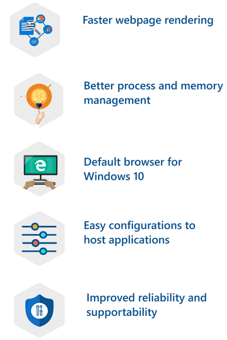
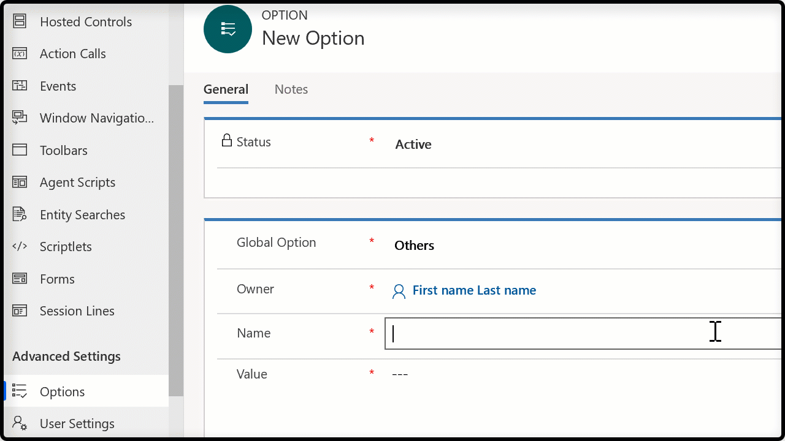

# Use Edge WebView2 Process to host web applications

[!INCLUDE[cc-data-platform-banner](../includes/cc-data-platform-banner.md)]

The Edge WebView2 Process browser control hosts your controls in individual Edge WebView2 process instances and displays them in tabs in the Unified Service Desk client application. It facilitates predictable and secure page rendering by making sure that if your web application works in Microsoft Edge, it will work in Unified Service Desk.

> [!IMPORTANT]
> - Unified Service Desk version 4.2 supports Chromium version 84.

The advantages of using the Edge WevView2 Process hosting method are as follows:

- Webpages, including model-driven app pages, render faster in Microsoft Edge.
- Microsoft Edge is a modern browser with better process and memory management.
- Microsoft Edge is the default browser for the Windows 10 operating system.
- It provides easy configurations to host the applications in Unified Service Desk.
- It provides improved reliability and supportability for browser-specific issues.

You can select Edge WebView2 Process as the hosting method for the **KM Control**, **Unified Interface Page**, **Unified Interface KM Control**, **CRM Page**, **Channel Integration Framework**, and **Standard Web Application** types of hosted controls.

> [!NOTE]
> To use **Edge WebView2 Process**, you must have the latest Windows 10 operating system (Windows 10 October 2018 release).

## Edge WebView2 Process settings

You can set the **Edge WebView2 Process** on the hosted controls (existing hosted controls and new hosted controls) to host applications. This allows you to choose the hosted controls that uses **Edge WebView2 Process** based on your requirements. More information: [Create a hosted control with hosting type as Edge WebView2](edge-webview2-process.md#create-a-hosted-control-with-hosting-type-as-edge-webview2)

If you want to set the **Edge WebView2 Process** to host the applications for an entire organization, then use the **GlobalBrowserMode** Global UII option and specify the value as **Edge WebView2**. More information: [Enable Edge WebView2 for Unified Service Desk on client desktop](edge-webview2-process.md#enable-edge-webview2-for-unified-service-desk-on-client-desktop)

If you want to set the **Edge WebView2 Process** only for some agents in your organization, then in the **UnifiedServiceDesk.exe.config** file, add the **GlobalBrowserMode** key with the value as **Edge WebView2**. More information: [Enable Edge WebView2 for an entire organization](edge-webview2-process.md#enable-edge-webview2-for-an-entire-organization)

### Order of precedence

- Setting the **GlobalBrowserMode** Global UII option value as **Edge WebView2**, takes precedence over the individual hosted control settings.   For example, some hosted controls have hosting type as **IE Process** and/or **Internal WPF**. At the organization level, you set **GlobalBrowserMode** Global UII option value as **Edge WebView2**. In this scenario, the Global UII option takes precedence and configuration uses the **Edge WebView2 Process** to host the applications. 

- Setting the **GlobalBrowser** mode key to **Edge WebView2** in the **UnifiedServiceDesk.exe.config** file for a particular client desktop, takes precedence over the individual hosted control settings.  For example, some hosted controls have hosting type as **IE Process** and/or **Internal WPF**. For a few agents, in their client desktops, you have set **GlobalBrowser** mode key to **Edge WebView2** in the **UnifiedServiceDesk.exe.config** file. The value set in the **UnifiedServiceDesk.exe.config** file take precedence and configuration uses the **Edge WebView2 Process** to host the applications.

Setting the **GlobalBrowser** mode key to **Edge WebView2** in the **UnifiedServiceDesk.exe.config** file for a particular client desktop, takes the precedence over other settings.

## Enable Edge WebView2 Process

Enable the **Edge WebView2 Process** by doing one of the following ways:

- Create an individual hosted control with hosting type as Edge WebView2
- Enable for individual client desktops
- Enable for entire an organization

> [!NOTE]
> Enable the **Edge WebView2 Process** either for individual client desktops or for entire organization.

### Create a hosted control with hosting type as Edge WebView2

When you are creating a new hosted control, you can select **Edge WebView2 Process** as the **Hosting Type**.

1. Sign in to Dynamics 365.

2. Go to **Settings** > **Unified Service Desk**.

3. Select **Hosted Controls**. The page displays available hosted controls.

4. To create a new hosted control, select **New**.

5. On the **New Hosted Control** page, specify the details and select **Edge WebView2 process** from the **Hosting Type** drop-down. 

6. Select **Save** to create the hosted control.

### Enable Edge WebView2 for Unified Service Desk on client desktop

1. Go to directory where you have installed Unified Service Desk and double-click to open the **UnifiedServiceDesk.exe.config** file.
Example path: `C:\Program Files\Microsoft Dynamics CRM USD\USD`

2. Under the `<appSettings>` section add the new key. 
`<add key="GlobalBrowserMode" value="Edge"/>`

  > [!div class="mx-imageBorder"]
  > 

3. Save the file.

### Enable Edge WebView2 for an entire organization

Add a new Global UII option for your organization named **GlobalBrowserMode**. Specify the value as **Edge WebView2**.

1. Sign in to Dynamics 365.

2. Go to **Settings** > **Unified Service Desk** > **Options**.

3. On the **Active UII Options** page, select **New**.

4. Choose **Others** for the **Global Option** field.

5. Type **GlobalBrowserMode** for the **Name** field.

6. Type **Edge WebView2** for the **Value** field.

7. Select **Save**.

## Debug Edge WebView2 Process using Microsoft Edge DevTools Preview

With Edge WebView2 Process, you can use the **Microsoft Edge DevTools Preview** tool as a JavaScript debugger. Edge DevTools helps you debug the webpage locally or remotely.

In the panel, you can see all the active Edge WebView2 Process. Select the desired webpage from the active list to open a new instance.

More information: [Microsoft Edge DevTools Preview](https://docs.microsoft.com/microsoft-edge/devtools-guide)

## RunScript action is asynchronous in Edge WebView2 Process

The Microsoft Edge browser supports only the asynchronous operations, and the RunScript action will be asynchronous.
If your custom code execution is dependent on the return value provided by RunScript action that injects JavaScript into the main frame of the application, then your custom code execution might fail.

For example, Your custom code has a RunScript actions that injects the JavaScript into the main frame of the application followed by an operation or another RunScript action. The RunScript action is invoked and returns a value after the JavaScript injection. If the subsequent operation or another RunScript action executes based on the return value provided by the executed RunScript action, then subsequent operations of your custom code will fail.

### Scenario example 

Whenever you open a case, verify whether the case has been open for 10 or more days, then display a message in a dialog. When you perform an action on the dialog box, the phone call page is opened for further operations.

To perform the above-mentioned scenario, you must have an action call that executes a **RunScript** action and returns a value for the next operation. The data on the action call calculates the number of days a case is open. 

Now, you must create an action call with action as **ExecuteOnDataAvailable**, and the data field must have the return value of the first action call. That is, the return value will have the form `[[$Return.ActionCallName]]`. This ensures that after the first action is executed and the return is available, this action call will be executed.

Next, you must create a sub action call to show the number of days a case is in the open state. The data field will use the return value form the first action call, that is, `[[$Return.ActionCallName]]`.

You must create another sub action call to open the phone call page and perform the next operation. After seeing the message, you select the **OK** button on the dialog, and this causes the phone call page to opens.

Let us see what configurations you need to create for the above-mentioned scenario.

### Step 1: Create a hosted control

1. Go to **Settings** > **Unified Service Desk** > **Hosted Controls**.

2. Select **New**.

3. Add the following details and save the hosted control.

| Field | Value |
|--------|---------|
| Name | Incident |
| Display Name | `[[incident.title]]` |
| Unified Service Desk Component Type | Unified Interface Page |
| Hosting Type | Edge WebView2 Process |
| Display Group | MainPanel |

### Step 2: Create two action calls

1. Go to  **Settings** > **Unified Service Desk** > **Action Calls**.

2. Select **New**.

3. Add the following details and save the action call.

| Field | Value |
|--------|---------|
| Name | FindNoOfDaysCaseBeingOpened |
| Order | 1 |
| Hosted Control | Incident |
| Action | RunScript |
| Data | function findAge(dateString) { if("[[incident.statuscode]]".indexOf("1") > -1){ var date1 =new Date(dateString); var date2 =new Date(); var timeDiff = Math.abs(date2.getTime() - date1.getTime()); var diffDays = Math.ceil(timeDiff / (1000 * 3600 * 24)); return diffDays.toString(); } return 0; } findAge("[[incident.createdon]]"); |

4. Repeat steps 2 and 3 to create another action call.

| Field | Value |
|--------|---------|
| Name | DaysValue|
| Order | 2 |
| Hosted Control | CRM Global Manager |
| Action | ExecuteOnDataAvailable |
| Data | `[[$Return.FindNoOfDaysCaseBeingOpened]]` |

#### Step 3: Create two action calls, and add them under the DaysValue action call

1. Go to **Settings** > **Unified Service Desk** > **Action Calls**.

2. Select **New**.

3. Add the following details and save the action call.

| Field | Value |
|--------|---------|
| Name | DisplayMessageForCaseOpen |
| Hosted Control | CRM Global Manager |
| Action | DisplayMessage |
| Data | 	text=No of days case is in open state: [[$Return.FindNoOfDaysCaseBeingOpened]] caption=Case is open |

4. Repeat steps 2 and 3 to create another action call.

| Field | Value |
|--------|---------|
| Name | OpenPhoneCallPage |
| Hosted Control | PhoneCall |
| Action | New_CRM_Page |
| Data | 		LogicalName=phonecall description=Long pending case more than 9 days   subject=Long pending case   |
| Condition | "[[$Return.FindNoOfDaysCaseBeingOpened]]">9 |

5. From the list of action calls, select the **DaysValue** action call.

6. In the navigation bar, next to the **DaysValue** action call, select the **>** icon, and select **Sub Action Call**.

7. Select the **ADD EXISTING ACTION CALL** option. In the search field, type the action **DisplayMessageForCaseOpen**, and select the search icon.

8. To add the action call, select the action call name that appears.

9. Perform the steps 7 and 8 to add the **OpenPhoneCallPage** action call.

10. Save the changes.

#### Step 4: Add the action calls to the PageReady event

1. Go to  **Settings** > **Unified Service Desk** > **Events**.

2. Select the **PageReady** event for the **Incident** hosted control from the list of events.

3. On the event page, under the **Active Actions** area, select **+** to add action calls.

4. A search box appears, type **FindNoOfDaysCaseBeingOpened** and select the search icon and select the action call. The action call appears under the **Active Actions** area.

5. Repeat step 4 to add the **DaysValue** action.

6. Save the changes.

## EdgeWebView2SingleProcess UII option

With the Edge WebView2 control, each domain will have its own process. If your organization requires common authentication modes across different domains, the Edge WebView2 Process might not support the same authentication.

To use common authentication mode across different domains, use the `EdgeWebView2SingleProcess` global UII option to ensure all the processes with different domains are created in a single process at the run-time. 

To use the `EdgeWebView2SingleProcess`, you must add the UII option and set the value to `True`. More information: [EdgeWebView2SingleProcess](admin/manage-options-unified-service-desk.md)

### Add the UII option

1. Sign in to the Dynamics 365 instance.

2. [!INCLUDE[proc_settings_usd](../includes/proc-settings-usd.md)]

3. Select **Options**.  

4. Select **New** on the **Active UII Options** page.

5. Choose **Others** for the **Global Option** field.

6. Type **EdgeSingleProcess** for the **Name** field.

7. Type **True** for the **Value** field.

8. Select **Save**.

> [!NOTE]
> If you set the value as `False` or leave the field blank, the option will be disabled.

## Sign out from sessions when using the Edge WebView2 Process

To sign out from sessions when using the Edge WebView2 Process, you must configure the sign-out URL using the **Navigate** action on the hosted control. For example, the sign-out URL the model-driven app is `url=/main.aspx?signout=1`.

## Support for webcam and microphone access with Edge WebView2 Process - need confirmation for UII option

Agents in your organization probably require webcam and microphone access, according to your business workflow. By default, certain websites might not have access to webcams or microphones. To enable webcam and microphone support for Edge WebView2 Process, use the **EdgeWebView2EnableMediaStream** UII option. Set the UII option to **True**. If you don't provide any value or set this to **False**, the option will be disabled.
<!--markdownlint-disable MD036-->
**To add the EdgeWebView2EnableMediaStream UII option**

 1. Sign in to the Dynamics 365 instance.

 2. Go to **Settings** > **Unified Service Desk** > **Options**.

 3. On the **Active UII Options** page, select **New**. 
 
 4. For the **Global Option** field, select **Others**.

 5. For the **Name** field, enter **EdgeWebView2EnableMediaStream**.

 6. For the **Value** field, enter **True**.

 7. Select **Save**.

 ## Debug Edge WebView2 Process

You can debug Edge WebView2 Process in two ways:

- Remotely

- Locally

### Debug Edge WebView2 Process remotely - need confirmation for UII option

When you want to access and debug all the Edge WebView2 Process instances running in a desktop remotely, you need to have remote debugging access along with the port number.

Use the **EdgeWebView2RemoteDebuggingPort** UII option and add the port number as the value. After setting this value, from the web browser, go to the `<IP address>:<\port number>` of the remote desktop. You can see all the Edge WebView2 Process instances running in that desktop, and then you can proceed with debugging.

### Debug Edge WebView2 Process locally

When you want to access and debug all the Edge WebView2 Process instances running in a desktop locally, you need to have access along with the port number to connect to.

Use the **EdgeWebView2RemoteDebuggingPort** UII option and add the port number as the value. After setting this value, from the web browser, go to the `localhost:<\port number>` of the local desktop. You can see all the Edge WebView2 Process instances running in that desktop, and then you can proceed with debugging.

Also, within the Unified Service Desk client application, you can debug an Edge WebView2 Process instance by using the keyboard shortcut **F12** to open **Developer Tools**. More information: [Manage options in Unified Service Desk](admin/manage-options-unified-service-desk.md)

**To add the EdgeWebView2RemoteDebuggingPort UII option**

1. Sign in to the Dynamics 365 instance.

2. Go to **Settings** > **Unified Service Desk** > **Options**.

3. On the **Active UII Options** page, select **New**.

4. For the **Global Option** field, select **Others**.

5. For the **Name** field, enter **EdgeWebView2RemoteDebuggingPort**. For the **Value** field, enter the port number (for example, **1030**).

6. Select **Save**.

## Enable the close confirmation dialog box with Edge WebView2 Process

With Edge WebView2 Process, if you accidentally close any application, the close confirmation dialog box for the application doesn't appear and the application closes without user confirmation. To avoid closing the application accidentally, use the **OnBeforeCloseHandler** UII option. 

If ***onbeforeunload*** event handlers are set for the page loaded in the hosted control, ***onbeforeunload*** event handlers are called if this UII option is set to **True**. If the UII option is set to **False**, the event handlers aren't called.

**To add the OnBeforeCloseHandler UII option**

1. Sign in to the Dynamics 365 instance.

2. Go to **Settings** > **Unified Service Desk** > **Options**.

3. On the **Active UII Options** page, select **New**.

4. For the **Global Option** field, select **Others**.

5. For the **Name** field, enter **OnBeforeCloseHandler**. For the **Value** field, enter **True**.

6. Select **Save**.

## Enable the confirmation dialog box with Edge WebView2 Process

If you perform an action on an app tab within a Unified Service Desk session and close the session, the **EdgeWebView2ConfirmationDialog** UII option will display a dialog box so you can confirm the saving and closing of a session. 

The confirmation dialog box is displayed if this UII option has been added or the value is set as **True**. If this option hasn't been added or the value is set as **False**, the confirmation dialog box isn't displayed.

**To add the EdgeWebView2ConfirmationDialog UII option**

1. Sign in to the Dynamics 365 instance.

2. Go to **Settings** > **Unified Service Desk** > **Options**.

3. On the **Active UII Options** page, select **New**.

4. For the **Global Option** field, select **Others**.

5. For the **Name** field, enter **EdgeWebView2ConfirmationDialog**. For the **Value** field, enter **True**.

6. Select **Save**.

## Limitations

To learn about the limitations of the Edge WebView2 Process, see [Edge Process limitations](release-notes.md)

## See also  
 [Create or edit a hosted control](../unified-service-desk/create-edit-hosted-control.md)  

 [Hosted control types and action/event reference](../unified-service-desk/hosted-control-types-action-event-reference.md)   

 [Manage hosted controls, actions, and events](../unified-service-desk/manage-hosted-controls-actions-events.md)

[!INCLUDE[footer-include](../includes/footer-banner.md)]