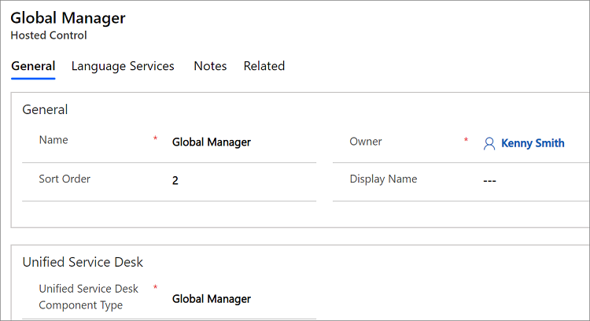

# Global Manager (Hosted Control)

[!INCLUDE[cc-data-platform-banner](../includes/cc-data-platform-banner.md)]

The **Global Manager** hosted control type is the core of [!INCLUDE[pn_unified_service_desk](../includes/pn-unified-service-desk.md)], and an instance of this hosted control is required by [!INCLUDE[pn_unified_service_desk](../includes/pn-unified-service-desk.md)]. This hosted control loads and reads all the [!INCLUDE[pn_unified_service_desk](../includes/pn-unified-service-desk.md)] configuration data from Microsoft Dataverse at application startup, interprets the window navigation rules, provides data to the toolbar components and agent scripts, and manages the data for the session. Only a single instance of the **Global Manager** hosted control type can be loaded.  

> [!IMPORTANT]
>  The three sample application packages for [!INCLUDE[pn_unified_service_desk](../includes/pn-unified-service-desk.md)], `New Environment`, `CRM Web Client`, and `Interactive Service Hub`, come preconfigured with an instance each of the **Global Manager** hosted control type. For information about the sample applications, see [Deploy sample Unified Service Desk applications to CRM server using Package Deployer](admin/deploy-sample-unified-service-desk-applications-using-package-deployer.md).

 In addition to providing interpretation for most of the functions in [!INCLUDE[pn_unified_service_desk](../includes/pn-unified-service-desk.md)], the **Global Manager** hosted control type also provides the multi-language features in the system so that you can localize UI strings and messages in your application in multiple languages. For more information, see [Add multilanguage support for your agent applications](../unified-service-desk/add-multilanguage-support-agent-applications.md). It also provides the search provider, which is designed to be generic and adaptable through configuration.

<a name="CreateGlobal"></a>
## Create a Global Manager hosted control
 While creating a new hosted control, the fields in the **New Hosted Control** screen vary based on the type of hosted control you want to create. This section provides information about the specific fields that are unique to the **Global Manager** hosted control type. For detailed information about creating a hosted control, see [Create or edit a hosted control](../unified-service-desk/create-edit-hosted-control.md).

 

 In the **New Hosted Control** screen, under the **Unified Service Desk** area, select **Global Manager** from the **Unified Service Desk Component Type** drop-down list. Also, ensure that you set the **Sort Order** value of this hosted control to **2** to ensure it is loaded by your agent application immediately *after* the connection has been established to Dataverse using the Connection Manager hosted control. For information about other **General** fields, see [Create or edit a hosted control](../unified-service-desk/create-edit-hosted-control.md).  

 Next, select the **Language Services** tab to add resources for adding localized strings for your agent application’s UI. For information about how to add language resources, see [Add multilanguage support for your agent applications](../unified-service-desk/add-multilanguage-support-agent-applications.md).

<a name="predefined"></a>   
## Predefined UII actions  
 Global Manager provides a series of predefined actions that allow you to manipulate Dataverse record data through the web services. The predefined actions can be used during configuration to perform advanced functions in Dataverse.  

 The following predefined UII actions are available for the **Global Manager** hosted control type:

<a name="Audit"></a>
### Audit
 Add an audit entry to the [!INCLUDE[pn_unified_service_desk](../includes/pn-unified-service-desk.md)] audit logs. For more information, see [Configure auditing in Unified Service Desk](admin/configure-auditing-diagnostics-unified-service-desk.md)

|Parameter|Description|
|---------------|-----------------|
|Name|The audit entry name. You must add an option under the **Options** area (**Settings** > **Unified Service Desk** > Options ([How do I get there?](https://go.microsoft.com/fwlink/p/?LinkId=525636))) with the value set to **1**.|
|Action|String representing the action that is being audited.|
|TargetApplication|String representing the target application for the audit.|
|CustomerId|String representing the customer ID.|
|ContextId|String representing the context ID.|
|ApplicationId|GUID of the hosted control for the auditing.|
|AgentState|String representing the agent state|
|ActionData|Data to write out to the audit entry. If this parameter isn’t explicitly provided, it will use all the remainder lines in the **Data** field of the action call definition.|

<a name="CallDoAction"></a>
### CallDoAction
 Calls an action on another hosted control.

|Parameter|Description|
|---------------|-----------------|
|panel|Panel to find the active application, if no application is specified.|
|action|Action to call on the hosted control.|
|data|Data parameter to pass to the action.|
|application|Hosted control name for which you want to execute an action call. If the hosted control name is specified, the **panel** parameter is ignored.|

<a name="ClearAppBar"></a>
### ClearAppBar
 Undocks the specified hosted control in the client application.

|Parameter|Description|
|---------------|-----------------|
|ApplicationName|Name of the hosted control to undocked. If this parameter is not supplied, the client application main window is undocked.|

<a name="ClearEntityList"></a>
### ClearEntityList
 Clears the list of accumulated search results, and should always be called before calling the **DoSearch** action

|Parameter|Description|
|---------------|-----------------|
|global|`True` if you want the search results tied to the global session to be cleared. You must be careful while storing search results in the global session as the search results are not automatically cleared by the system. In this case, you must call the **ClearEntityList** action before calling the **DoSearch** action.|

<a name="Close"></a>
### Close
 Closes the hosted control. Unlike the [CloseActive](#CloseActive) action, if this tab is displaying more than one page, it will close all the pages displayed in the tab in your agent application.

<a name="CloseActive"></a>
### CloseActive
 Closes the active hosted control on the specified panel.

|Parameter|Description|
|---------------|-----------------|
||The first line in the action call should contain the name of the panel to locate the active application. If no parameter is specified, MainPanel is assumed.|

### CopyToClipboard
 Copies or appends the article URL to Clipboard.

|Parameter|Description|
|---------------|-----------------|
|data|Data that you want to be copied. You can also use replacement parameters. For example:  `data=[[$context.title]]`|
|append|Indicates whether or not to append the data to the Clipboard. Set `true` or `false`. For example: `append=false`.|

<a name="CopyToContext"></a>
### CopyToContext
 Copies a value or series of values to context variables. Context variables can be serialized with the session. This action takes a series of name=value pairs. The name is the name of the context variable.

### CopyLogicalEntityToContext
 Copies values from an entire section of the data parameters to the context.

|Parameter|Description|
|---------------|-----------------|
|LogicalName|The type or section of data parameters to copy values from.|

<a name="CloseActivity"></a>   
### CloseActivity  
 Closes an activity record in the model-driven apps.  

|Parameter|Description|
|---------------|-----------------|
|Id|The GUID of the activity record to close.|
|LogicalName|The logical name of the activity to close.|
|StatusCode|The display name of the final status code after the activity is closed.|
|StateCode|The display name of the final state code after the activity is closed.|

 For example, to close a phone call activity, you must specify the following parameter and values:

```
Id=<GUID of the phone activity record>

LogicalName=phonecall

statuscode=Received

statecode=Completed
```

 After the activity record is closed, the [$Return](../unified-service-desk/replacement-parameters.md#Return) system replacement parameter will be populated with a Boolean value indicating whether the action was successful.

<a name="CreateEntity"></a>   
### CreateEntity  
 Creates a new record in the model-driven apps.  

|Parameter|Description|
|---------------|-----------------|
|`LogicalName`|The logical name of the entity to create the record.|
|`RunAsync`|Set the parameter to **True** to create the entity record asynchronously so that Unified Service Desk is not blocked and remains responsive during the action execution.<br/><br/>**Note**: The associated sub-action calls and subsequent action calls for the **CreateEntity** action do not wait for the asynchronous create operation to complete. So, you must ensure that if you are running the **CreateEntity** action asynchronously, the sub-action calls that depend on the created record are configured to execute only when the target record is complete. This can be achieved using the **ExecuteOnDataAvailable** action on the Global Manager hosted control.|

 Each subsequent line in the parameter list contains a series of Name=Value pairs that will define your other fields to populate on create.

 Entity References can be described like the following:

```
Param=EntityReference(“logicalname”, “id”)
```

 OptionSetValues can be specified like the following:

```
Param=OptionSetValue(value)
```

 Booleans can be described like the following:

```
Param=Boolean(value)
```

 PartyList (used with email) can be described like the following:

```
Param=PartyList(email[“test@test.com”], er[“contact”, guid])
```

 You can use any number of `email` and `er` entries to represent email addresses and entity references respectively.

 Other values such as string values can be specified like the following:

```
Param=value
```

 Once the record is created, the $Return value will be populated with the GUID of the newly created record.

<a name="CreateSession"></a>
### CreateSession
 Creates a session.

|Parameter|Description|
|---------------|-----------------|
| BackGround | Set the value of the parameter to True. <br>A session is created but the focus is not changed to the new session right away. All the sub actions on this action call are then executed only when you manually switch to this session. |
| SessionName | Name of the session tab for the newly created session. This parameter is dependent on the BackGround parameter. |

<a name="DeleteEntity"></a>   
### DeleteEntity  
 Deletes a record in the model-driven apps.  

|Parameter|Description|
|---------------|-----------------|
|Id|The ID (GUID) of the record to delete.|
|LogicalName|The logical name of the entity to delete.|

<a name="route"></a>
### DoRoute
 Can be used to test your window navigation rules by simulating a popup window from a specific hosted control. It may be used in production to trigger the window navigation rules manually as per the requirement.

|Parameter|Description|
|---------------|-----------------|
|name|The ID of the entity that is the target of the queueItem|
|entity|The Logical Name of the entity that is opened in a pop-up window.|
|id|The ID of the entity that will be opened in a pop-up window.|
|frame|The frame from which the popup is said to occur.|

<a name="DoSearch"></a>   
### DoSearch  
 Calls Dataverse web services using the FetchXML defined as an entity search in [!INCLUDE[pn_unified_service_desk](../includes/pn-unified-service-desk.md)] For more information about defining an entity search, see [Search data using entity searches in Unified Service Desk](../unified-service-desk/search-data-entity-searches.md).  

|Parameter|Description|
|---------------|-----------------|
|name|The name of the entity search to be used for searching the record.|
|global|`True` if you want the search results tied to the global session to be cleared. You must be careful while storing search results in the global session as the search results are not automatically cleared by the system. In this case, you must call the **ClearEntityList** action before calling this action.|
|maxcount|The maximum number of records to store in the EntityList results from this call.|

> [!NOTE]
>  By default, the page count (number of records per page) for a   result set is set to 50. This implies that if there are more than 50 records returned, it will be displayed in pages. If you want to specify a different page count value for the `DoSearch` action, specify the new value in the **EntitySearchPageCount** option. [!INCLUDE[proc_more_information](../includes/proc-more-information.md)] [Manage Options for Unified Service Desk](admin/manage-options-unified-service-desk.md)
>
>  When you call the `DoSearch` action, the **$Return** replacement parameter displays the number of records found and stored in EntityList as a result of this search. [!INCLUDE[proc_more_information](../includes/proc-more-information.md)] [$Return](../unified-service-desk/replacement-parameters.md#Return).

<a name="DisplayMessage"></a>
### DisplayMessage
 Displays a message box to the user.


| Parameter |                                                                             Description                                                                             |
|-----------|---------------------------------------------------------------------------------------------------------------------------------------------------------------------|
|   text    |      Text displayed in the message box. If this parameter is not specified, any remaining text (remainder parameter) or empty string will be used.      |
|  caption  | Caption displayed in the message box. If no caption is specified, **Dataverse Message** will be used. |

### ExecuteOnDataAvailable
 Delays the execution of the sub-actions until a specified set of replacement parameters becomes available. A time-out value may be specified to limit the amount of time to wait for the replacement parameters to become available. If no time-out is specified, it will wait indefinitely or until the session ends. [!INCLUDE[proc_more_information](../includes/proc-more-information.md)] [Blog: How to use the special actions, ExecuteOnTimeout, ExecuteOnDataAvailable, ExecuteOnExpressionTrue](https://blogs.msdn.com/b/usd/archive/2015/09/25/how-to-use-the-special-actions-executeontimeout-executeondataavailable-executeonexpressiontrue.aspx)

|Parameter|Description|
|---------------|-----------------|
|milliseconds|The time, in milliseconds, to indicate the amount of time to wait before this action expires, and is canceled. The remaining parameters should contain replacement parameters that need to exist before sub-actions can execute.<br /><br /> Data Parameter Example:<br /><br /> milliseconds=5000<br />[[account.Id]] <br />[[incident.Id]]|

> [!IMPORTANT]
>  This action applies to all the hosted control types. This action isn’t exposed by default when you create an instance of a hosted control type. To use the `ExecuteOnDataAvailable` action with an instance of a hosted control type, you must explicitly add a UII action called `ExecuteOnDataAvailable` to the respective hosted control instance. [!INCLUDE[proc_more_information](../includes/proc-more-information.md)] [Add a UII action to a hosted control](../unified-service-desk/add-uii-action-hosted-control.md)

### ExecuteOnTimeout
 Delays the execution of the sub-actions until a specified time elapses. A time-out value is required to indicate when the sub-actions should be run. [!INCLUDE[proc_more_information](../includes/proc-more-information.md)] [Blog: How to use the special actions, ExecuteOnTimeout, ExecuteOnDataAvailable, ExecuteOnExpressionTrue](https://blogs.msdn.com/b/usd/archive/2015/09/25/how-to-use-the-special-actions-executeontimeout-executeondataavailable-executeonexpressiontrue.aspx)

|Parameter|Description|
|---------------|-----------------|
|milliseconds|The time, in milliseconds, to indicate the amount of time to wait before the sub-actions execute.<br /><br /> Data Parameter Example:<br /><br /> milliseconds=5000|

> [!IMPORTANT]
>  This action applies to all the hosted control types. This action isn’t exposed by default when you create an instance of a hosted control type. To use the `ExecuteOnTimeout` action with an instance of a hosted control type, you must explicitly add a UII action called `ExecuteOnTimeout` to the respective hosted control instance. [!INCLUDE[proc_more_information](../includes/proc-more-information.md)] [Add a UII action to a hosted control](../unified-service-desk/add-uii-action-hosted-control.md)

### ExecuteOnExpressionTrue
 Delays the execution of the sub-actions until a specified [!INCLUDE[pn_JavaScript](../includes/pn-javascript.md)] expression returns `true`. A time-out value may be specified to limit the amount of time to wait before expiring. If no time-out is specified, it will wait indefinitely or until the session ends. [!INCLUDE[proc_more_information](../includes/proc-more-information.md)] [Blog: How to use the special actions, ExecuteOnTimeout, ExecuteOnDataAvailable, ExecuteOnExpressionTrue](https://blogs.msdn.com/b/usd/archive/2015/09/25/how-to-use-the-special-actions-executeontimeout-executeondataavailable-executeonexpressiontrue.aspx)


|  Parameter   |                                                                                                                                                                                                                             Description                                                                                                                                                                                                                             |
|--------------|---------------------------------------------------------------------------------------------------------------------------------------------------------------------------------------------------------------------------------------------------------------------------------------------------------------------------------------------------------------------------------------------------------------------------------------------------------------------|
| milliseconds | The time, in milliseconds, to indicate the amount of time to wait before this action expires and is canceled. The remaining parameter is a [!INCLUDE[pn_JavaScript](../includes/pn-javascript.md)] expression to evaluate. When this expression is `true`, sub-actions will execute.<br /><br /> Data Parameter Example:<br /><br /> milliseconds=5000<br />function IsAccountLoaded()<br />{<br /> return “[[account.Id]$+]” != “”;<br />}<br />IsAccountLoaded(); |

> [!IMPORTANT]
>  This action applies to all the hosted control types. This action isn’t exposed by default when you create an instance of a hosted control type. To use the `ExecuteOnExpressionTrue` action with an instance of a hosted control type, you must explicitly add a UII action called `ExecuteOnExpressionTrue` to the respective hosted control instance. [!INCLUDE[proc_more_information](../includes/proc-more-information.md)] [Add a UII action to a hosted control](../unified-service-desk/add-uii-action-hosted-control.md)

<a name="ExecuteScriptlet"></a>
### ExecuteScriptlet
 Executes the specified scriptlet.

|Parameter|Description|
|---------------|-----------------|
||Specify the name of the scriptlet to execute in the **Data** field.|

### FireEvent
 Fires a user-defined event from this hosted control.

|Parameter|Description|
|---------------|-----------------|
|name|Name of the user-defined event.|

 All subsequent name=value pairs become the parameters to the event. For more information about creating a user-defined event, see [Create a user-defined event](../unified-service-desk/create-user-defined-event.md).

<a name="GetTemplate"></a>
### GetTemplate
 Retrieves the contents of a merged email template.

|Parameter|Description|
|---------------|-----------------|
|name|Name of the template to retrieve.|
|id|The ID of the entity to associate with this template for the merge operation.|

<a name="InvokeCTI"></a>
### InvokeCTI
 Simulates CTI events

|Parameter|Description|
|---------------|-----------------|
|type|This is the type of CTI event, such as phone call or chat.|
|appname|The desktop manager name to be used for this pop-up simulation.|
|ani|The automatic number identification (ANI) or callers phone number.|
|dnis|The DNIS or dialed number.|
||All remaining parameters will be passed as parameters to the CTI event processor.|

### LaunchURL
 Launches a URL in [!INCLUDE[pn_Internet_Explorer](../includes/pn-internet-explorer.md)] outside of the [!INCLUDE[pn_unified_service_desk](../includes/pn-unified-service-desk.md)] application. You must specify the URL as a parameter in the **Data** field.

<a name="LookUpQueueItem"></a>
### LookupQueueItem
 Looks up a queueitem in the system and obtain the information.

|Parameter|Description|
|---------------|-----------------|
|Id|The ID of the entity that is the target of the queueItem|
|EntityType|The type or logical name of the entity referred to in the Id field.|

 The resulting queueitem details will be placed into the queueitem replacement parameter and may be referenced later.

<a name="MoveApplicationToPanel"></a>
### MoveApplicationToPanel
 Moves a hosted control to the specified panel in the client application.

|Parameter|Description|
|---------------|-----------------|
|app|Name of the hosted control to move.|
|panel|Name of the target panel.|

<a name="MoveToPanel"></a>
### MoveToPanel
 Moves hosted controls between panels at runtime.

|Parameter|Description|
|---------------|-----------------|
|app|Name of the hosted control to be moved.|
|panel|Target panel for the hosted control.|

### New_CRM_Page  
 Creates a page for creating a new record of the entity specified, and treats the page as a popup from the specified hosted control. The window navigation rules are evaluated to determine the location where the page to create the entity record is displayed.  

|Parameter|Description|
|---------------|-----------------|
|LogicalName|The logical name of the entity for creating a new instance.|

> [!NOTE]
>  The rest of the parameters should consist of name=value pairs. These are the additional pre-populated values in the form for creating a new record for the specified entity. For more information about using this action, see step 4 in [Walkthrough 7: Configure agent scripting in your agent application](../unified-service-desk/walkthrough-configure-agent-scripting-agent-application.md).

### Open_CRM_Page
 Opens an existing instance of the entity specified and identified by the ID, and treats the page as a popup from the specified hosted control. The window navigation rules are evaluated to determine the location where the popup should be displayed.

|Parameter|Description|
|---------------|-----------------|
|LogicalName|The logical name of the entity to open.|
|id|The ID of the entity record to open.|

<a name="Pause"></a>
### Pause
 Pauses execution of the action without blocking message processing. This action is different from suspending the current thread for the specified amount of time ([Thread.Sleep](https://msdn.microsoft.com/library/d00bd51t.aspx)) because the action allows the processing to continue. This action is useful when you are waiting for web operations to complete.

|Parameter|Description|
|---------------|-----------------|
|milliseconds|The number of milliseconds to pause.|

<a name="popup"></a>
### Popup
 Pops up a URL from the hosted control and runs the window navigation rules against it for routing the popup to the appropriate location.

|Parameter|Description|
|---------------|-----------------|
|url|Routes a popup from this hosted control using this URL as if it were a popup requested from the displayed control.|
|frame|The frame from which this popup originated.|

### RealignWindow
[!INCLUDE[cc_RealignWindow_Action](../includes/cc-realignwindow-action.md)]

<a name="ReadSettings"></a>   
### ReadSettings  
 Reads the previously saved settings from the [$Settings](../unified-service-desk/replacement-parameters.md#Settings) replacement parameter.  

|Parameter|Description|  
|---------------|-----------------|  
|readfromcache|`True` if you want to read the local cached version of these settings. `False` or missing otherwise.|  

<a name="RedoScreenPop"></a>   
### RedoScreenPop  
 Pops the last screen again. This can be useful in cases where the session limit was reached and the pop-up wasn’t successful, or you closed the session but more work is required. This action requires no parameters.  

<a name="ResetLocalCache"></a>   
### ResetLocalCache  
 Resets the configuration cache in [!INCLUDE[pn_unified_service_desk](../includes/pn-unified-service-desk.md)]. The next time [!INCLUDE[pn_unified_service_desk](../includes/pn-unified-service-desk.md)] is started, it will download the configuration from the server. The user must have write access to the msdyusd_usersettings entity for this action to work.  

<a name="RouteToQueue"></a>   
### RouteToQueue  
 Routes an entity to a queue in the model-driven apps.  

|Parameter|Description|
|---------------|-----------------|
|destination|The target queue ID. This is mutually exclusive with the destinationqueuename parameter|
|destinationqueuename|This is the name of the queue to route the entity.|
|entitytype|This is the logical name of the entity to be routed|
|entityid|This is the GUID/Id of the entity to be placed into queue.|

<a name="SaveAll"></a>
### SaveAll
 Saves all forms in hosted control that allows multiple pages to be displayed (**Allow Multiple Pages** = Yes). If the hosted control allows only a single page to be displayed (**Allow Multiple Pages** = No), this is equivalent to the **Save** action.

<a name="SaveSetting"></a>
### SaveSetting
 Stores a user-specific setting.

|Parameter|Description|
|---------------|-----------------|
|name|The name of the setting. This will show up in the[$Settings](../unified-service-desk/replacement-parameters.md#Settings) replacement parameter.|
|value|The value of the setting to save.|

<a name="SetTheme"></a>
### SetTheme
 Applies a theme to modify the layout or look and feel of components of the user interface. [!INCLUDE[proc_more_information](../includes/proc-more-information.md)] [Use themes to customize the appearance of your application](../unified-service-desk/customize-appearance-application.md)

|Parameter|Description|  
|---------------|-----------------|  
|clear|`True` if you want to completely clear the current theme before applying the specified theme. If this parameter is false, or not specified, the new theme information will be merged with the current theme.|  
||The remainder parameter (what is left after the other parameters are removed), should contain the name of theme to use. This should be a XAML file (renamed to XML and uploaded as a web resource) web resource name, a URL from an anonymous access server, or the raw XAML representing theme.|  

<a name="SetAppBar"></a>
### SetAppBar
 Docks a hosted control to the specified edge of the client application main window.

|Parameter|Description|
|---------------|-----------------|
|ApplicationName|The name of the hosted control to dock. If this parameter is specified, the parent window hosting this hosted control will be docked.|
|width|The width in pixels of the docked window. If this is not specified, the current width of the window is used.|
|height|The height in pixels of the docked window. If this is not specified, the current height of the window is used.|
|Edge|The edge to dock against. If nothing is specified, **Top** is assumed. Specify one of the following values: **Top**, **Bottom**, **Left**, or **Right**.|

<a name="StartEventTimer"></a>
### SetEventTimer
 Sets an event timer to start.

|Parameter|Description|
|---------------|-----------------|
|name|Name of the event timer.|

<a name="SetSize"></a>
### SetSize
 Sets the width and height of the hosted control. This is particularly useful when using "auto" in your panel layouts.

|Parameter|Description|
|---------------|-----------------|
|width|The width of the hosted control.|
|height|The height of the hosted control.|

<a name="SetWindowProperty"></a>
### SetWindowProperty
 Sets the window state for the client application main window.

|Parameter|Description|
|---------------|-----------------|
|WindowState|One of the following values: **maximized**, **minimized**, or **normal**.|

### ShellExecute
 This action is intended to launch a URL or command line. Note that the user must have rights to execute the application.

|Parameter|Description|
|---------------|-----------------|
||The only parameter is the command line or URL of the application to execute.|

<a name="ShowAbout"></a>   
### ShowAbout  
 Displays the about dialog box for [!INCLUDE[pn_unified_service_desk](../includes/pn-unified-service-desk.md)] that contains information such as the name of the current user, Dataverse server and organization that the user is connected to, version number of the [!INCLUDE[pn_unified_service_desk](../includes/pn-unified-service-desk.md)] client application, and the support site URL.  

<a name="ShowTab"></a>
### ShowTab
 Sets the focus on a tab (hosted control) in your agent application.

|Parameter|Description|
|---------------|-----------------|
||The first line in the action call should contain the name of the hosted control to display in the foreground. Don’t use the display name of the hosted control. For more information about using this action call, see step 4 of [Walkthrough 2: Display an external webpage in your agent application](../unified-service-desk/walkthrough-2-display-an-external-webpage-in-your-agent-application.md).|

<a name="StopEventTimer"></a>
### StopEventTimer
 Stops an event timer.

|Parameter|Description|
|---------------|-----------------|
|name|Name of the event timer to stop.|

<a name="Translate"></a>
### Translate
 Enables you to perform language translation using [Microsoft Translator](https://datamarket.azure.com/dataset/bing/microsofttranslator).


|  Parameter   |                                                                                                                                                                                                                                               Description                                                                                                                                                                                                                                               |
|--------------|---------------------------------------------------------------------------------------------------------------------------------------------------------------------------------------------------------------------------------------------------------------------------------------------------------------------------------------------------------------------------------------------------------------------------------------------------------------------------------------------------------|
|    value     | This is the text to translate. This value may be escaped for multi-line support.<br /><br /> Some valid examples:<br /><br /> `value=$Escaped("my string<br>new line\\\"my text\\\"")`<br /><br /> `value=[[myapp.myparam]^]`<br /><br /> `value=$Escaped([[myapp.myparam]$])`<br /><br /> For more information about these replacement keys, see [Use replacement parameters to configure Unified Service Desk](../unified-service-desk/use-replacement-parameters-configure-unified-service-desk.md). |
| fromlanguage |                                                                                                      Name of the language to translate from. If this is blank, the system will attempt to detect the language of the specified value to be translated before translating. For a list of valid language values, see [Translator Language Codes](https://msdn.microsoft.com/library/hh456380.aspx).                                                                                                       |
|  tolanguage  |                                                                                                                                                                      Name of the language to translate to. For a list of valid language values, see [Translator Language Codes](https://msdn.microsoft.com/library/hh456380.aspx).                                                                                                                                                                      |
|   clientId   |                                                                                                       A client ID obtained from [!INCLUDE[pn_Windows_Azure](../includes/pn-windows-azure.md)] for translation services. For information about registering with [!INCLUDE[pn_azure_shortest](../includes/pn-azure-shortest.md)], see [https://datamarket.azure.com](https://datamarket.azure.com).                                                                                                       |
| clientsecret |                                                                                                     A client secret obtained from [!INCLUDE[pn_Windows_Azure](../includes/pn-windows-azure.md)] for translation services. For information about registering with [!INCLUDE[pn_azure_shortest](../includes/pn-azure-shortest.md)], see [https://datamarket.azure.com](https://datamarket.azure.com).                                                                                                     |

 The translated value is displayed under the [$Return](../unified-service-desk/replacement-parameters.md#Return) replacement parameter.

<a name="UpdateEntity"></a>   
### UpdateEntity  
 Updates a record in the model-driven apps.

|Parameter|Description|
|---------------|-----------------|
|Id|The ID of the value to update. This must be the GUID of the record to update.|
|LogicalName|The logical name of the entity to update|

 Each subsequent line the parameter list contains a series of Name=Value pairs that will define your other fields to populate on update.

 Entity References can be described like the following:

```
Param=EntityReference(“logicalname”, “id”)
```

 OptionSetValue’s can be specified like the following:

```
Param=OptionSetValue(value)
```

 Boolean’s can be described like the following:

```
Param=Boolean(value)
```

 PartyList (used with email) can be described like the following:

```
Param=PartyList(email[“test@test.com”], er[“contact”, guid])
```

 You can use any number of emails and er entries to represent email addresses and entity references respectively.

 Other values such as string values can be specified like the following:

```
Param=value
```

<a name="WorkOn"></a>
### WorkOn
 This action is equivalent to selecting a queue item from a queue and clicking the WorkOn button on the ribbon. It marks the queue item as being worked by a specific agent.

|Parameter|Description|
|---------------|-----------------|
|Id|This is the Id of the queueitem. See [LookupQueueItem](../unified-service-desk/global-manager-hosted-control.md#LookUpQueueItem) for information on how to obtain the ID for a target entity.|
|Action|Optional parameter allowing the administrator to specify that they wish to remove the `WorkOn` attribute to return it to the queue.<br /><br /> Valid Values:<br /><br /> Remove – Removes the WorkOn attribute and returns the item to the queue for others to work on.|

<a name="events"></a>
## Predefined events
 Here are the predefined events that are associated with this hosted control.

### DesktopReady  
 Occurs on startup when all the desktop initialization has completed and the connections to Dataverse have been established. This event will be fired only once, and it is common to use this event to set themes and do other startup actions.  

### SessionActivated
 Occurs whenever a session is activated.

|Parameter|Description|
|---------------|-----------------|
|SessionId|ID of the currently active session.|
|IsGlobal|Indicates whether this event applies to the global session. Returns True or False.|
|Activate|This is set to True.|

### SessionClosed
 Occurs when a session is closed.

|Parameter|Description|
|---------------|-----------------|
|SessionId|ID of the session that was closed.|
|IsGlobal|Indicates whether this event applies to the global session. Returns True or False.|

### SessionDeactivated
 Occurs when a session is deactivated.

|Parameter|Description|
|---------------|-----------------|
|SessionId|ID of the inactive session.|
|IsGlobal|Indicates whether this event applies to the global session. Returns True or False.|
|Activate|This is set to False.|

<a name="sessionnew"></a>
### SessionNew
 Occurs when a new session is created.

|Parameter|Description|
|---------------|-----------------|
|SessionId|ID of the newly created session.|
|IsGlobal|Returns True if the new session is a global session. Otherwise, returns False.|

### See also
 [UII actions](../unified-service-desk/uii-actions.md)
 [Events](../unified-service-desk/events.md)
 [View predefined actions and events for a hosted control](../unified-service-desk/view-predefined-actions-events-hosted-control.md)
 [View embedded help for actions and events](../unified-service-desk/view-embedded-help-for-actions-and-events.md)
 [Unified Service Desk Configuration Walkthroughs](../unified-service-desk/unified-service-desk-configuration-walkthroughs.md)
 [Hosted control types and action/event reference](../unified-service-desk/hosted-control-types-action-event-reference.md)


[!INCLUDE[footer-include](../includes/footer-banner.md)]