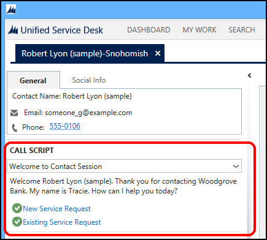

# Guide customer interactions with agent scripts in Unified Service Desk
Agent scripting in [!INCLUDE[pn_unified_service_desk](../includes/pn-unified-service-desk.md)] provides guidance to agents about what they should say on calls or what they should type on chat conversations. It includes a script that can use values from any loaded entity on the agent application, hosted control, or the [!INCLUDE[pn_unified_service_desk](../includes/pn-unified-service-desk.md)] context (using replacement parameters). Agent scripting also provides a mechanism to display instructions to the agent on what and how to perform the tasks necessary to complete their work.  
  
 The scripting module supports branching for non-linear agent workflow. It also supports jumping to specific scripts based on variables such as buttons defined in the UI, computer telephony integration (CTI) events, and parameters such as dialed number identification service (DNIS). A history of steps is kept in a drop-down list so that the user can return to a previously visited step. Actions that were performed along the way aren’t undone when an agent returns to a previous step. If an answer has already been visited, a check box will appear next to it.  
  
## Components of an agent script  
 The following is a sample agent script in [!INCLUDE[pn_unified_service_desk](../includes/pn-unified-service-desk.md)]:  
  
   
  
- **Current step and history**: The drop down list (Welcome to Contact Session) shows the current step. If you click the list, you’ll see a history of where you have been. You can select a previous step from this list to return to it.  
  
    > [!NOTE]
    >  If you go back to a previous point using the drop-down list, the actions and input that you performed on applications during the subsequent steps aren’t rolled back.  
  
- **Introductory text**: This is the text that is used by the agent to initiate conversation with the customer. This text supports replaceable parameters from the [!INCLUDE[pn_unified_service_desk](../includes/pn-unified-service-desk.md)] data context. If this field is left blank when you create the agent script, the section won’t be present in the display to the agents and the script header will be removed.  
  
     If a chat conversation initiates the session, a button will show next to the agent script. When this button is clicked, the text will be copied to the compatible chat output automatically.  
  
- **Instructions to agent**: This text provides instructions to the agent about the action that should be performed. It may provide hints or other instructions as well. If this field is left blank when you create the agent script, the header and the text won’t display to the client while on this task. This instructional text appears in different font from the introductory script.  
  
- **Next Steps/Answers**: This stack of buttons shows possible choices for next steps. An action may be performed in response to clicking one of the answers or an action may execute when reaching the next task.  
  
  [!INCLUDE[proc_more_information](../includes/proc-more-information.md)] [Configure and manage agent scripts](../unified-service-desk/configure-manage-agent-scripts.md)  
  
### See also  
 [Agent Scripting (Hosted Control)](../unified-service-desk/agent-scripting-hosted-control.md)   
 [Replacement parameters](../unified-service-desk/replacement-parameters.md)   
 [UII Computer Telephony Integration (CTI) framework](../unified-service-desk/uii-computer-telephony-integration-cti-framework.md)   
 [Walkthrough 7: Configure agent scripting in your agent application](../unified-service-desk/walkthrough-configure-agent-scripting-agent-application.md)

[!INCLUDE[footer-include](../includes/footer-banner.md)]