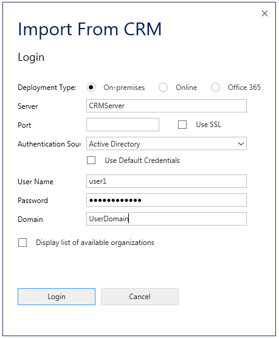

# Import hosted application from Unified Service Desk
A hosted application can be imported from [!INCLUDE[pn_unified_service_desk](../includes/pn-unified-service-desk.md)] to your [!INCLUDE[pn_Visual_Studio_short](../includes/pn-visual-studio-short.md)] project.  
  
1. In **Solution Explorer**, right-click the solution and select **Import**.  
  
2. In the import dialog box, enter the Common Data platform server name and your credentials.  
  
     
  
3. If there’s more than one organization, select the **Display list of available organizations** check box and click **Login**.  
  
4. Select your organization from the list.  
  
5. From the list of hosted applications, select the one that you want and choose **Import**. In this case, it’s StandAloneTestApp.  
  
     
  
6. The hosted application you selected (StandAloneTestApp) is imported and you can see it displayed in **Solution Explorer**.  
  
     
  
### See also  
 [Create a HAT hosted application project](../unified-service-desk/use-hat-software-factory-create-hosted-application.md#Create)   
 [Using UII inspector to create bindings](../unified-service-desk/use-uii-inspector-create-bindings-hosted-application.md)   
 [Configure the HAT application](../unified-service-desk/configure-hosted-application.md)   
 [Configuring an action for the HAT application](../unified-service-desk/configure-action-hosted-application.md)   
 [Deploy your hosted application to Unified Service Desk](../unified-service-desk/deploy-hosted-application-unified-service-desk.md#deploy)

[!INCLUDE[footer-include](../includes/footer-banner.md)]
