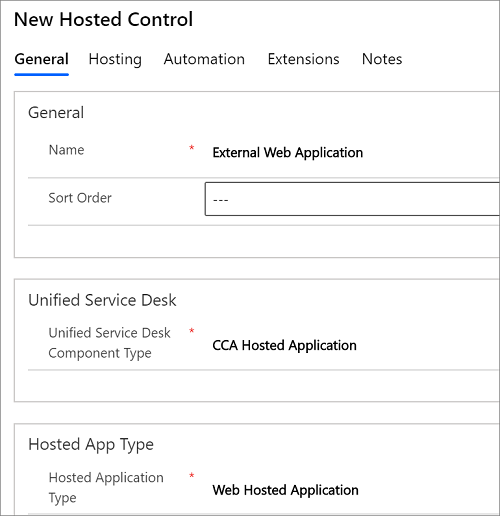

# Integrate with external applications and web applications
Use the [!INCLUDE[pn_user_inteface_integration_uii](../includes/pn-user-interface-integration-uii.md)] hosted application to host your external application or a web application in [!INCLUDE[pn_unified_service_desk](../includes/pn-unified-service-desk.md)]. To host an external or web application in [!INCLUDE[pn_unified_service_desk](../includes/pn-unified-service-desk.md)], you configure a hosted control of type **CCA Hosted Application**, and then select **Web Hosted Application** or **External Hosted Application** from the **Hosted Application** list. [!INCLUDE[proc_more_information](../includes/proc-more-information.md)] [UII Hosted Applications](../unified-service-desk/uii-hosted-applications.md)  
  
   
  
 For information about hosting external applications or web applications in [!INCLUDE[pn_unified_service_desk](../includes/pn-unified-service-desk.md)], see steps 1 through 3 in [Walkthrough: Create a UII Application Adapter](../unified-service-desk/walkthrough-create-uii-application-adapter.md) and [Walkthrough: Create a UII Web Application Adapter](../unified-service-desk/walkthrough-create-uii-web-application-adapter.md).  
  
 You can use the [!INCLUDE[pn_user_inteface_integration_uii](../includes/pn-user-interface-integration-uii.md)] adapters (application and web) to facilitate interaction with the external applications that are hosted in [!INCLUDE[pn_unified_service_desk](../includes/pn-unified-service-desk.md)]. For information about how to create and use [!INCLUDE[pn_user_inteface_integration_uii](../includes/pn-user-interface-integration-uii.md)] adapters, see [Walkthrough: Create a UII Application Adapter](../unified-service-desk/walkthrough-create-uii-application-adapter.md) and [Walkthrough: Create a UII Web Application Adapter](../unified-service-desk/walkthrough-create-uii-web-application-adapter.md).  
  
 You can also create and use [!INCLUDE[pn_user_inteface_integration_uii](../includes/pn-user-interface-integration-uii.md)] hosted controls in [!INCLUDE[pn_unified_service_desk](../includes/pn-unified-service-desk.md)]. [!INCLUDE[pn_user_inteface_integration_uii](../includes/pn-user-interface-integration-uii.md)] hosted controls are hybrid hosted controls that are different from the predefined [!INCLUDE[pn_unified_service_desk](../includes/pn-unified-service-desk.md)] hosted controls, and are typically used to add advanced functionality to [!INCLUDE[pn_unified_service_desk](../includes/pn-unified-service-desk.md)]. To use a [!INCLUDE[pn_user_inteface_integration_uii](../includes/pn-user-interface-integration-uii.md)] hosted control in [!INCLUDE[pn_unified_service_desk](../includes/pn-unified-service-desk.md)], you configure a hosted control of type **CCA Hosted Application**, and then select **Hosted Control** from the **Hosted Application** list. For more information about creating a [!INCLUDE[pn_user_inteface_integration_uii](../includes/pn-user-interface-integration-uii.md)] hosted control and using it in [!INCLUDE[pn_unified_service_desk](../includes/pn-unified-service-desk.md)], see [Use UII hosted controls with Unified Service Desk](../unified-service-desk/use-uii-hosted-controls-unified-service-desk.md).  
  
## In this Section  
 [Create and manage UII hosted applications](../unified-service-desk/create-manage-uii-hosted-applications.md)  
  
 [Use UII adapters to interact with external and web applications](../unified-service-desk/use-uii-adapters-interact-external-web-applications.md)  
  
 [Understanding HAT adapters](../unified-service-desk/use-uii-automation-adapter-interact-external-web-applications.md)  
  
 [Use UII hosted controls with Unified Service Desk](../unified-service-desk/use-uii-hosted-controls-unified-service-desk.md)  
  
 [Walkthrough: Create a UII Application Adapter](../unified-service-desk/walkthrough-create-uii-application-adapter.md)  
  
 [Walkthrough: Create a UII Web Application Adapter](../unified-service-desk/walkthrough-create-uii-web-application-adapter.md)  
  
 [Walkthrough: Create a UII Windows Forms Hosted Control](../unified-service-desk/walkthrough-create-uii-windows-forms-hosted-control.md)  
  
 [Walkthrough: Create a UII WPF Hosted Control](../unified-service-desk/walkthrough-create-uii-wpf-hosted-control.md)  
  
## Related Sections  
 [UII Hosted Applications](../unified-service-desk/uii-hosted-applications.md)  
  
 [UII adapters](../unified-service-desk/uii-adapters.md)  
  
 [Unified Service Desk Hosted Controls](../unified-service-desk/unified-service-desk-hosted-controls.md)  
  
 [Programming reference](../unified-service-desk/programming-reference.md)

[!INCLUDE[footer-include](../includes/footer-banner.md)]