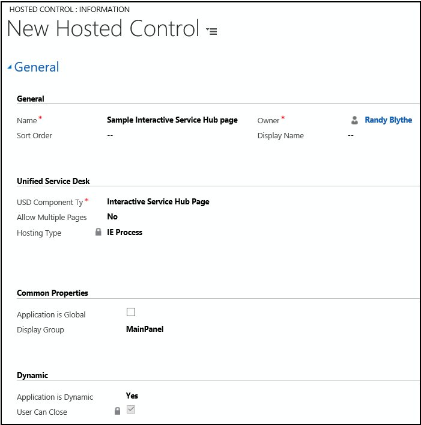

# Interactive Service Hub Page (Hosted Control)

[!INCLUDE[cc-data-platform-banner](../includes/cc-data-platform-banner.md)]

Use the **Interactive Service Hub Page** hosted control type to host  interactive service hub forms within [!INCLUDE[pn_unified_service_desk](../includes/pn-unified-service-desk.md)] to integrate the capabilities of both the applications. Interactive Service Hub provides an intuitive interface and displays all the vital information related to customers in one place that lets customer support agents focus on things that require attention.  

 When an interactive service hub form  is loaded within the **Interactive Service Hub Page** hosted control, it will automatically scan the page for data, and automatically populate the replacement parameters in [!INCLUDE[pn_unified_service_desk](../includes/pn-unified-service-desk.md)]. The **Interactive Service Hub Page** hosted control type exposes a number of predefined UII actions and events that are unique to handling of interactive service hub pages including list manipulation actions, and a find action for displaying a quick search or advanced search page.  

 Unified Service Desk provides you with a sample package, **Interactive Service Hub**, which demonstrates how easily you can integrate the interactive service hub pages within Unified Service Desk. More information: [Unified Service sample applications](admin/sample-unified-service-desk-applications.md)  

> [!NOTE]
>  You can convert your existing **CRM Page** type of hosted controls to the **Interactive Service Hub Page** type to display [interactive experience](https://go.microsoft.com/fwlink/?linkid=857057) forms used by the Interactive Service Hub application instead of the model-driven apps forms. However, there are some considerations in doing so. For more information, see [Blog: Support for Interaction Centric Forms within Unified Service Desk](https://blogs.msdn.microsoft.com/usd/2016/05/24/support-for-interaction-centric-forms-within-unified-service-desk/)  

<a name="Create"></a>   
## Create an Interactive Service Hub Page hosted control
  
 While creating a new hosted control, the fields in the **New Hosted Control** screen vary based on the type of hosted control you want to create. This section provides information about the specific fields that are unique to the **Interactive Service Hub Page** hosted control type. For detailed information about creating a hosted control, see [Create or edit a hosted control](../unified-service-desk/create-edit-hosted-control.md).  

   

 In the **New Hosted Control** screen:  

- Under **Unified Service Desk** area, select **Interactive Service Hub Page** from the **Unified Service Desk Component Type** drop-down list.  

- From the **Allow Multiple Pages** drop-down list, select **No** (default) to replace the interactive service hub page that is currently displayed, and update the browser history when [!INCLUDE[pn_unified_service_desk](../includes/pn-unified-service-desk.md)] receives a navigate action call or a page is routed to the tab. Select **Yes** to automatically create a drop-down list when a second URL is called or a window navigation rule directs a page to the tab. This will allow the user to quickly search between the interactive service hub pages that are attached to this control. Also, when you select **Yes**, an additional field, **Maximum Browsers**, becomes available where you can specify the maximum number of pages to be displayed in the drop-down list.  

- **IE Process** is the default **Hosting Type** for this hosted control type, and you cannot select any other hosting type . For information about supported hosting methods in [!INCLUDE[pn_unified_service_desk](../includes/pn-unified-service-desk.md)], see [Select a hosting method for hosted controls](../unified-service-desk/select-hosting-method-controls.md).  

- Select the **Application is Global** check box to set the hosted control as global. Global hosted controls can be displayed outside of a customer session. Controls like the agents’ dashboard, wall or search are common uses for global hosted controls. Global hosted controls do not have session-specific state so when you change sessions, these same global hosted controls remain. If the check box is not selected, the hosted control becomes session based. Session-based controls exist in the context of the customer session. If the user changes to another session, all the session pages from the previous session are hidden.  

- The **Display Group** field displays the panel where this hosted control will be displayed. **MainPanel** is the most common for this hosted control type. For information about various panels available in [!INCLUDE[pn_unified_service_desk](../includes/pn-unified-service-desk.md)], see [Panels, panel types, and panel layouts in Unified Service Desk](../unified-service-desk/panels-panel-types-panel-layouts.md).  

- Select **Yes** or **No** from the **Application is Dynamic** list to specify whether this is a dynamic hosted control. Dynamics hosted controls allow an agent to start or close a hosted control on demand, either by using the UI or programmatically through code. More information: [Dynamic Unified Service Desk hosted controls](../unified-service-desk/unified-service-desk-hosted-controls.md#Dynamic)  

   If you select **Yes**, the **User Can Close** check box becomes available. Select this check box to let users close this hosted control.  

  For information about other **General** fields, see [Create or edit a hosted control](../unified-service-desk/create-edit-hosted-control.md).  

<a name="actions"></a>   
## Predefined UII actions  
 These are the predefined actions for this hosted control type.  

> [!NOTE]
>  The **Interactive Service Hub Page** type of hosted control supports all the UII actions supported by the **CRM page** type of hosted control. However, some UII actions are not available when you first create and save an instance of the **Interactive Service Hub Page** type hosted control. Any subsequent update to the hosted control instance adds the missing UII actions.  

### AssociatedView  
 This action loads a specific associated view of the interactive service hub.  These views are typically accessed by clicking down arrow next to an entity record name in the nav bar, and selecting the associated entities.  


|   Parameter   |                                                 Description                                                  |
|---------------|--------------------------------------------------------------------------------------------------------------|
| `navItemName` |                        The associated entity that you want to display. Example: Cases                        |
|     `Id`      |             The ID of the main entity record for which to display the associated entity records.             |
|   `tabset`    | The area in the model-driven apps. Examples: areaSales or areaService. |

<a name="Close"></a>   
### Close  
 This action is used to close the hosted control. Unlike the **CloseActive** action, if this tab (hosted control) is displaying more than one page, it will close all the pages displayed in the tab in your agent application.  

<a name="CloseActive"></a>   
### CloseActive  
 This action is used to close the active window within this hosted control. If the active window is the only window displayed in the hosted control, the hosted control itself will be closed. If you have chosen not to allow multiple pages for your hosted control (**Allow Multiple Pages** = No), this action is equivalent to the **Close** action.  

### CloseAndPrompt  
 This action prompts the user to save or abandon the changes before closing the hosted control.  

### Find  
 Navigate to the quick find list view of the specified entity.  

|Parameter|Description|  
|---------------|-----------------|  
||The data parameter should specify the entity logical name of the quick find list view to display. There are some special case values:<br /><br /> Use `case` or `incident` to display the quick find list view for cases.<br /><br /> Use `advfind` to display the advanced find view.<br /><br /> Use `activities` or `activity` to display the quick find list view for activities.|  

### FireEvent  
 Fires a user-defined event from this hosted control.  

|Parameter|Description|  
|---------------|-----------------|  
|`name`|Name of the user-defined event.|  

 All subsequent name=value pairs become the parameters to the event. For more information about creating a user-defined event, see [Create a user-defined event](../unified-service-desk/create-user-defined-event.md).  

### GetSelectedCount  
 This action retrieves the number of items that are selected. Use the **GetSelectedIds** action to get the actual list of IDs for the entity.  

|Parameter|Description|  
|---------------|-----------------|  
||The data parameter should specify the list name to retrieve the selected IDs.|  

 The return value contains a number represented the quantity of selected items.  

### GetSelectedIds  
 This action is used to retrieve the selected IDs from the lists.  

|Parameter|Description|  
|---------------|-----------------|  
||The data parameter should specify the list name to capture the selected IDs.|  

 The return value contains a semi-colon delimited list of IDs containing the selected items.  

### GoBack  
 This action is equivalent to clicking the back button in the interactive service hub, which will take you back in the navigation stack of the interactive service hub.  

### GoHome  
 This action takes you to the homepage specified by the user in the model-driven apps.  

<a name="MoveToPanel"></a>   
### MoveToPanel  
 This action is used to move hosted controls between panels at runtime.  

|Parameter|Description|  
|---------------|-----------------|  
|app|Name of the hosted control to be moved.|  
|panel|Target panel for the hosted control.|  

### Navigate  
 This action is used to navigate to the interactive service hub URL.  


|     Parameter     |                                                                                                                                                                                                                                       Description                                                                                                                                                                                                                                        |
|-------------------|------------------------------------------------------------------------------------------------------------------------------------------------------------------------------------------------------------------------------------------------------------------------------------------------------------------------------------------------------------------------------------------------------------------------------------------------------------------------------------------|
|        url        |                                                                                                                                                                                                                  The URL to navigate to. This is a mandatory parameter.                                                                                                                                                                                                                  |
|      Noscan       |                                                                                                                                                                                           If this parameter is supplied and **True**, the data parameters will not be captured from the page.                                                                                                                                                                                            |
|  HideCommandBar   |                                                                                                                                                                         If this parameter is supplied and **True**, the inner frame will be displayed without loading the interactive service hub  command bar.                                                                                                                                                                          |
| HideNavigationBar |                                                                                                                                                                            If this parameter is supplied and **True**, the form will be displayed without loading the interactive service hub navigation bar.                                                                                                                                                                            |
|     postdata      |                Data that is sent to the server as part of an HTTPPOST transaction. A POST transaction is typically used to send data gathered by an HTML page. In [!INCLUDE[pn_unified_service_desk](../includes/pn-unified-service-desk.md)], this data can be received from any event triggered using "<https://event/?>". Example: `[[postdata]+]`<br /><br /> Alternatively, the data can be passed as an encoded string with its header type in the intended format.                 |
|      header       | A string value that contains additional HTTP headers to send to the server. When the `postdata` parameter is used in the `Navigate` action, you should also specify an appropriate value for the `header` parameter. Example: `Content-Type:application/x-www-form-urlencoded`<br /><br /> If a [!INCLUDE[pn_unified_service_desk](../includes/pn-unified-service-desk.md)]POST event triggers the `Navigate` action, the default value of this parameter should be `header=[[header]+]` |

### New_CRM_Page  
 Creates a page for creating a new record of the entity specified, and treats the page as a popup from the specified hosted control. The window navigation rules are evaluated to determine the location where the page to create the entity record is displayed.  

 You can pass attribute values in name=value pairs as data parameters for this action. For example:  

```  
LogicalName=incident  
title=Sample Case  

```  

### Open_CRM_Page  
 Opens an existing instance of the entity specified and identified by the ID, and treats the page as a popup from the specified hosted control. The window navigation rules are evaluated to determine the location where the popup should be displayed.  

|Parameter|Description|  
|---------------|-----------------|  
|LogicalName|The logical name of the entity to open.|  
|id|The ID of the entity record to open.|  

### Popup  
 Pops up a URL from the hosted control and runs the window navigation rules against it for routing the popup to the appropriate location.  

|Parameter|Description|  
|---------------|-----------------|  
|url|Routes a popup from this hosted control using this URL as if it were a popup requested from the displayed control.|  

<a name="RealignWindow"></a>   
### RealignWindow  
[!INCLUDE[cc_RealignWindow_Action](../includes/cc-realignwindow-action.md)]

### Refresh  
 This action refreshes the current page.  

### ReRoute  
 This action takes the currently displayed URL, and sends it through the window navigation rules from the current hosted control as a popup.  

### RunScript  
 This action injects JavaScript into the main frame of the application. You should avoid using Microsoft Dataverse client SDK calls with this action; instead, use the **RunXrmCommand** action.  

|Parameter|Description|  
|---------------|-----------------|  
||The data parameter is the JavaScript that will be injected into the form.<br /><br /> The replacement parameters can be used in the script, and they will be replaced before the script is executed.|  

<a name="RunXrmCommand"></a>   
### RunXrmCommand  
 This action is used to inject Dataverse SDK JavaScript into the interactive service hub form.  

|Parameter|Description|  
|---------------|-----------------|  
||The data parameter is the JavaScript that will be injected into the form.<br /><br /> The replacement parameters can be used in the script, and they will be replaced before the script is executed.|  

### Save  
 This action saves the current data on the interactive service hub form.  

<a name="SaveAll"></a>   
### SaveAll  
 This action saves all forms in hosted control that allows multiple pages to be displayed (**Allow Multiple Pages** = Yes). If the hosted control allows only a single page to be displayed (**Allow Multiple Pages** = No), this is equivalent to the **Save** action.  

### SaveAndClose  
 This action saves the current data on the interactive service hub form, and closes the hosted control.  

<a name="SetSize"></a>   
### SetSize  
 This action explicitly sets the width and height of the hosted control. This is particularly useful when using "auto" in your panel layouts.  

|Parameter|Description|  
|---------------|-----------------|  
|`width`|The width of the hosted control.|  
|`height`|The height of the hosted control.|  

<a name="events"></a>   
## Predefined events  
 The following predefined events are associated with this hosted control type.  

### ActiveClosed  
 Occurs when the active hosted control is closed using the [CloseActive](../unified-service-desk/crm-page-hosted-control.md#CloseActive) action.  

|Parameter|Description|  
|---------------|-----------------|  
|`url`|The URL that was displayed in the hosted control when it was closed.|  

### DataReady  
 Occurs after the data in the interactive service page has been saved to the replacement parameter list.  

|Parameter|Description|  
|---------------|-----------------|  
|`url`|The URL of the page.|  

### NavigationRequested  
 Occurs when navigation happens within the interactive service hub.  

|Parameter|Description|  
|---------------|-----------------|  
|`url`|The URL of the page navigated to.|  

### RefreshRequested  
 Occurs when refresh is requested on the current page. Refresh can be requested either by pressing the F5 key or calling the Refresh action by the application.  

|Parameter|Description|  
|---------------|-----------------|  
|`url`|The URL displayed when refresh was requested.|  

### Saved  
 Occurs after a record in the interactive service hub page is saved.  

|Parameter|Description|  
|---------------|-----------------|  
|`newId`|The ID assigned to the newly created record.|  

### See also  
 [Hosted control types and action/event reference](../unified-service-desk/hosted-control-types-action-event-reference.md)   
 [CRM page (Hosted Control)](../unified-service-desk/crm-page-hosted-control.md)


[!INCLUDE[footer-include](../includes/footer-banner.md)]