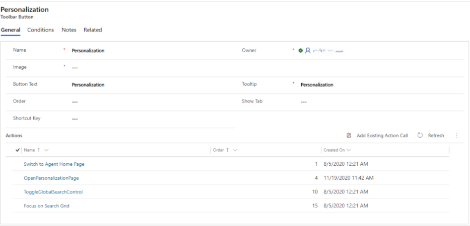

# Add personalization tab

[!INCLUDE[cc-use-with-omnichannel](../../includes/cc-use-with-omnichannel.md)]

You can use personalization tab to enable personal quick replies in Unified Service Desk client application. After you add the personalization tab, you can view the tab in a conversation panel depending on where it was added. More information on quick replies: [Create a record in Ominichannel for Customer Service](../oc-usd/create-record.md).

## How to add the personalization tab

You can can add the personalization tab by doing the following:

1. Create an action call record.

2. Add a toolbar button.

3. Add artefacts to the configuration of agent.

### Create an action call record

1. Open the **Unified Service Desk Administrator** app. In the left pane, go to **Basic Settings** > **Action Calls**.

2. To create an action call record, select **New** and then provide the following information:

    * **Name**: OpenPersonalizationPage
    
    * **Order**: 4
    
    * **Hosted Control**: Search Page HC
    
    * **Action**: Navigate

    * **Data**: `url=/main.aspx?pagetype=entityrecord&etn=msdyn_usersetting&id=b5c6b1bb-47ad-ea11-a812-000d3a8c9c8c   HideNavigationBar=True`

3. Select **Save**.

    > [!div class=mx-imgBorder]
    > 

### Add a toolbar button

1. In the left pane, under **Basic Settings**, go to **Toolbars** > **Omnichannel ToolbarStrip**.

2. In the **Buttons** area, select the button under which you want the personalization button to appear, and then in the **Related** tab, select **Toolbar Buttons**.

    > [!div class=mx-imgBorder]
    > 

3. Select **New Toolbar Button** and create a toolbar button record with the following parameters:

    * **Name**: Personalization
    
    * **Button** Text: Personalization
    
    * **Tooltip**: Personalization

4. Select **Save**.

### Add artefacts to the configuration of agent

1. Select **Add Existing Action Call**, and add the following action calls:

    a. Switch to Agent Home Page
    
    b. OpenPersonalizationPage
    
    c. ToggleGlobalSearchControl
    
    d. Focus on Search Grid

    > [!div class=mx-imgBorder]
    > 

2. Under **Advanced Settings** in the left pane, go to **Configurations** > **Agent Configuration** > **Hosted Controls, Events and Action Calls** tab.

3. In the **Action Calls** area, go to **Add Existing Action Call**, and then add the **OpenPersonalizationPage** action call.

    > [!div class=mx-imgBorder]
    > 

 After the personalization tab is added, you can create your personal quick replies. More information: [Create personal quick replies in Omnichannel for Customer Service in Unified Service Desk](../oc-usd/create-personal-quick-replies-usd.md).

[!INCLUDE[footer-include](../../includes/footer-banner.md)]