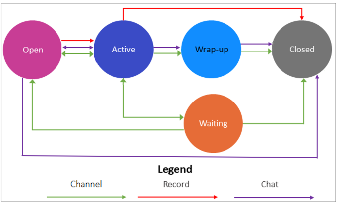

# Understand how conversation states work in Omnichannel for Customer Service

[!INCLUDE[cc-use-with-omnichannel](../../includes/cc-use-with-omnichannel.md)]

The topic explains the various states of the conversation (work item) in Omnichannel for Customer Service.

Types of conversation states:

 - [Open](#open)

 - [Active](#active)
 
 - [Wrap-up](#wrap-up)

 - [Waiting](#waiting)

 - [Closed](#closed) 

 

## Open

The conversation (work items) that is in the queue and not assigned to you (agent) is classified under **Open** state. 

The conversation (work item) transitions from **Open** to **Active** or **Closed** state under the following scenarios.

| From state | To state | Scenario  | Type (Chat, SMS, and Entity Record) |
|---------------|------------------|---------------------------------------------------------|------------|
| Open          | Active           | When you pick the conversation from the **Open work items** stream.   When the routing and work distribution feature pushes (assigns) the conversation to you. | SMS, Chat, and Entity Record |
| Open          | Closed           | When the customer disconnects or ends the chat before the conversation is assigned to you.| Chat |

## Active

The conversation that you pick or that is assigned to you is classified under **Active** state. In the **Active** state, your capacity is consumed.

The conversation (work item) transitions from **Active** to **Closed**, **Open**, **Waiting**, or **Wrap-up** state under the following scenarios.

| From state | To state | Scenario  | Type (Chat, SMS, and Entity Record) |
|---------------|------------------|---------------------------------------------------------|------------|
| Active        | Wrap-up          | When you select the **End** button on communication panel during the conversation with the customer.    When customer ends the conversation by selecting the **End** button on the portal chat widget (only for a chat channel). | Chat and SMS |
| Active        | Open             | When you disconnect the conversation and don't reconnect within a specified timeout period.    When you release the conversation to the queue.    When you transfer the conversation to another queue.    | Chat and SMS |
| Active        | Waiting          | When you close the session (not ending the conversation by selecting the **End** button) while the conversation is active.   When the customer is disconnected from the conversation, and you're no longer getting reply, you can close the session without ending the conversation (this is applicable only for an SMS channel). This will keep conversation in waiting state. |   Chat and SMS |
| Active | Closed | When you resolve the case (or get an entity record to non-active state) and close the session. | Entity Record |

## Wrap-up

This is an intermediate state after you end the conversation, where you can do after active conversation activities like taking notes and update the customer information before moving the conversation to **Closed** state. In the **Wrap-up** state, your (agent) capacity is consumed.

The conversation (work item) transitions from **Wrap-up** to **Closed** state under the following scenario. 

| From state | To state | Scenario  | Type (Chat, SMS, and Entity Record) |
|---------------|------------------|---------------------------------------------------------|------------|
| Wrap-up       | Closed           | When you select the **End** button in communication panel and close the session. | Chat and SMS |

## Waiting

A conversation in waiting state doesn't block your capacity. The conversation gets transitioned to waiting state when you (agent) close the session without ending the conversation (without selecting **End** button on communication panel) or the customer closes the browser window without closing the chat widget. For example, you're waiting for some information from customer and don't want to end the conversation or the customer has to restart the computer in a troubleshooting scenario.

The conversation (work item) transitions from **Waiting** to **Closed**, **Active**, or **Open** state under the following scenarios.

| From state | To state | Scenario  | Type (Chat, SMS, and Entity Record) |
|---------------|------------------|---------------------------------------------------------|------------|
| Waiting       | Closed           | When there's no activity on this conversation from either customer or agent, within inactivity timeout period.    When the customer selects the **End** button to end the conversation and close the session (only for a chat channel).| Chat and SMS |
| Waiting       | Active           | When you revive the session from your **My work items** stream on **Omnichannel Agent Dashboard**. | Chat and SMS |
| Waiting       | Open             | When the customer revives the conversation within a specified timeout period while the session is still active in the browser. | Chat and SMS |

## Closed

The conversation that are complete by ending, and closing the session is classified under **Closed** state. When you close a conversation, you can't reactivate or reopen the conversation again.

## Automatic closure of a conversation

Omnichannel for Customer Service has a default time set for the conversation to close automatically. That is, if a conversation in a certain state remains in the same state more than the default time, then the conversation is moved to the closed state.

Advantages of automatic-closure of a conversation:

- Conversations don’t stay in a state for long duration, and the system helps in the clean-up job.
- Conversations achieve a closure, and agents can focus on important conversation, which ultimately enhances the productivity.

### Understand working of auto-close of conversations

The Omnichannel for Customer Service application checks the conversations every 24 hours to identify the conversations that remain in the same state more than the default configured time. These conversations become eligible for automatic-closure, and next time, when the scheduler runs, these conversations are moved from the existing state to the **Closed** state.

### Default time for automatic closure of conversation

The conversations coming from different channel has varied scenarios and hence has different default configured time. 
Administrator can change the default configured time as per the business requirement programmatically. To learn more, see [Set default time using APIs](#set-default-time-using-apis).

The matrix describes the channel, state, and default configured time. 

 | Channel | Existing state | Default configured time | Description |
 |--------------------|-------|-------------|--------------------------------------|
 | Chat | Open |  20 min   | For a chat channel, a conversation in the **Open** state for more than 20 minutes is eligible for automatic-closure. Next time, when the scheduler runs, the conversation will be moved from the **Open** state to the **Closed** state. |
 | Chat | Active | None | For a chat channel, a conversation in the Active won’t be automatically closed. |
 | Chat | Wrap-up | 15 minutes | For a chat channel, a conversation in the **Wrap-up** state for more than 15 minutes is eligible for automatic-closure. Next time, when the scheduler runs, the conversation will be moved from the **Wrap-up** state to the **Closed** state. |
 |  |  |  |  |
 | Entity records (Case) | Open | None | For an entity channel, a conversation in the **Open** won’t be automatically closed. |
 | Entity records (Case) | Active | None | For an entity channel, a conversation in the **Active** state won’t be automatically closed. |
 |  |  |  |  |
 | SMS | Open | 30 days | For an SMS channel, a conversation in the **Open** state for more than 30 days is eligible for automatic-closure. Next time, when the scheduler runs, the conversation will be moved from the **Open** state to the **Closed** state. |
 | SMS | Active | 30 days | For an SMS channel, a conversation in the **Active** state for more than 30 days is eligible for automatic-closure. Next time, when the scheduler runs, the conversation will be moved from the **Active** state to the **Closed** state. |
 | SMS | Wrap-up | 1 day | For an SMS channel, a conversation in the **Wrap-up** state for more than 1 day is eligible for automatic-closure. Next time, when the scheduler runs, the conversation will be moved from the **Wrap-up** state to the **Closed** state. |

**Example**

The scheduler runs for every 24 hours considering starting at 0000 hours AM.

For the chat channel, a conversation is in Open state at 1100 hours of Jan 10, 2020. and remains in this state until midnight 2359 hours. Since the conversation is in Open state for more than 20 minutes (default configured time), this conversation is eligible for automatic-closure. At 0000 hours of Jan 11, 2020, the scheduler runs and the conversation in the **Open** state is moved to the **Closed** state.

> [!Note]
> A scheduler runs every 24 hours to close all eligible conversations. However, the exact time at which the scheduler runs is dependent on the Omnichannel for Customer Service deployment time in your region. For more information, contact Microsoft support.

### Conversation in waiting state

For chat and SMS channel, a conversation in the **Waiting** state is moved to the **Closed** state when the conversation is inactive for a specified time. **Auto-close after inactivity** is the option in the work stream configuration based on which the conversation is moved to the closed state. 

For example, set the **Auto-close after inactivity** as 5 minutes, and if the conversation is in **Waiting** state for more than 5 minutes, then the conversation is moved to the **Closed** state.

To learn more, see [Create a work stream](../../customer-service/work-streams-introduction.md#create-a-work-stream).

### Set default time using APIs

Programmatically, you can change the default time and set it as per your organization's requirements using the Web APIs. To learn more, see [Automatic closure of a conversation](../../customer-service/auto-close-conversation.md).

> [!div class="nextstepaction"]
> [Next topic: View alert and toast notifications](notifications.md) 

## See also

[View communication panel](left-control-panel.md)

[Automatic closure of a conversation](../../customer-service/auto-close-conversation.md)

[!INCLUDE[footer-include](../../includes/footer-banner.md)]