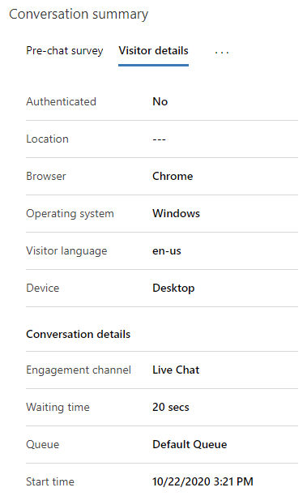
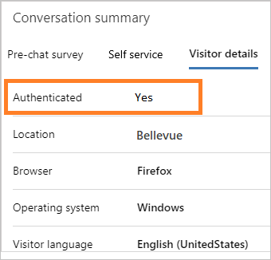
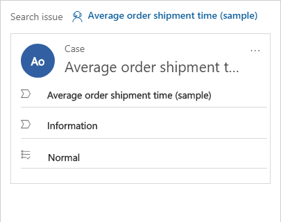
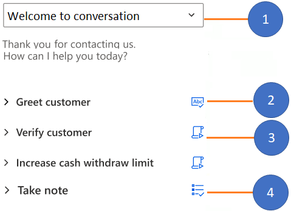
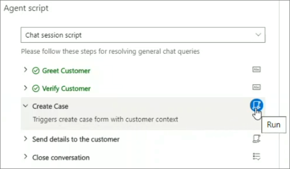
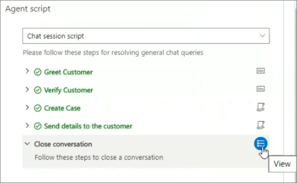

# View a customer summary to get available information about a customer

[!INCLUDE[cc-use-with-omnichannel](../../includes/cc-use-with-omnichannel.md)]

## Overview of the existing challenges

One of the major challenges that customers face when contacting customer support is repeatedly giving the same information about the issue to each support agent they talk to. And if they want to review the status of their request later, they'll have to share the same information with another support agent to explain the context of the conversation. To avoid this situation, support agents need access to all the information the customer has provided, including details about the product or service, issue, case history, related cases, and location.

Having this information ready can help support agents reduce the hold time that they spend retrieving customer information, reduce average handling time, and increase customer satisfaction by resolving issues faster.

## What is a customer summary?

**Customer summary** is a page in Omnichannel for Customer Service where you can get all available information about a customer when you accept an incoming request from any engagement channel. The default view of the **Customer summary** page provides the following sections:

   - Customer
   - Conversation summary
   - Case
   - Recent cases
   - Timeline

> [!div class=mx-imgBorder]
> 

> [!NOTE]
> We recommend that you don't use **Advanced Find** to navigate to the **Customer Summary** form because the form might not be displayed correctly.

## Customer

The **Customer profile** section provides details about the customer, such as the name of the customer or account, job, title, relationship type, city, category, and preferred channel for engagement.

> [!div class='mx-imgBorder']
> 

## Conversation summary

The **Conversation summary** section provides detailed information about the conversation between the agent and customer. The details shown in the **Conversation details** area include the following:

- Engagement channel
- Waiting time
- Skills
- Queue
- Start time

  > [!div class='mx-imgBorder']
  > 
 
In addition, the **Conversation summary** section includes several tabs:

- Pre-chat survey
- Self service
- Visitor details
- Additional details, if they've been configured and additional context variables are available

These tabs are described in the following sections.

### Pre-chat survey

The **Pre-chat survey** tab displays the customer's answers to the survey questions that were posed by your organization, which helps your interaction with the customer.

### Self service

The **Self service** tab displays information about the activities the customer performed before they initiated a conversation with an agent. This information helps you understand why the customer reached out and helps you provide a personalized service for enhanced customer satisfaction. The activity information, which is categorized into the following action types, appears in reverse chronological order.

| Action type | Description |
|-------------|-----------------------------------|
| Page visited | The page visited on the portal, with time stamp.|
| Phrase searched | The keyword or phrase that was searched for, with time stamp. |
| Knowledge article viewed | The knowledge article viewed, with time stamp. |
| Custom action performed | Any other custom action that's being tracked by your organization, with time stamp. |

   > [!div class='mx-imgBorder']
   > 

To configure the appearance of the **Self service** tab, see [Enable self-service settings of customer actions in conversation summary](../../customer-service/enable-self-service-settings.md).

### Visitor details

The **Visitor details** tab provides information such as whether the customer is authenticated, the browser the customer used to contact support, the operating system used by the customer, the customer's location, and the language used during the interaction.

 If the customer has signed in to the portal to initiate the chat with a support agent, the **Authenticated** field value is **Yes**; otherwise, the **Authenticated** field value is **No**.

 

To learn more, see [Create chat authentication settings](../../customer-service/create-chat-auth-settings.md).

## Case

For an incoming conversation request, the system links an existing case to the conversation and shows it in the **Case** section. This section shows information such as the title of the case, its priority, its status, the relevant product, and the owner of the case.

> [!div class='mx-imgBorder']
> 

## Recent cases

This section displays the recent cases related to the customer.

> [!div class='mx-imgBorder']
> 

## Timeline

This section displays activities related to the case and the customer in the form of a timeline. You can create quick notes based on your discussion with the customer. You can also filter the timeline to view it based on customer activities, case activities, or conversation activities.

> [!div class='mx-imgBorder']
> 

## Agent script

An agent script in Omnichannel for Customer Service provides guidance for what you, the agent, should do when you get a customer issue. It helps ensure that you share only information that's been endorsed by your company. Agent scripts help you to be accurate and effective, while being faster and more efficient in terms of customer handling.

When you accept an incoming conversation request, a session starts and the **Customer summary** page opens. In the **Agent script** section, you'll see steps as shown in the following illustration.

> [!div class='mx-imgBorder']
> 

1. Agent script control
2. Text instructions
3. Macro
4. Sub agent script

Based on the type of agent script your system administrator has configured, you might see one or more of the following types of steps:

- Text instructions
- Macro
- Sub-agent script

### Text instructions

Text instructions provides guidance for the action you must perform. A text instruction step in the agent script shows a title, instructions, and the **Text instruction** icon. After you perform the instruction, you can select the **Mark as done** icon to indicate that you've executed the step.

**Example**
| Title | Instruction that you perform |
|----------------|-------------------------------------------------------------------------|
| Greet customer | Greet the customer by using the welcome message from the quick reply repository.|

> [!div class='mx-imgBorder']
> 

### Macro

A macro is a set of instructions that tells the system how to complete a task. When a macro runs, the system performs each instruction. A macro step in the agent script shows a title, the instruction that the system performs, and the macro icon. When you select the **Run macro** icon, the system executes the macro.

**Example**

| Title | Instruction that the system performs |
|----------------|----------------------------------------|
| Create case | Triggers create a case from customer context  |

In this example, when an agent selects the macro icon, the system opens a new **Create case** form in the application tab panel with prepopulated fields based on the customer context.

> [!div class='mx-imgBorder']
> 

### Sub-agent script

A *sub-agent script* is another agent script that has been invoked from the current agent script. When you select the view icon, the system loads the sub-agent script.

> [!div class='mx-imgBorder']
> 

> [!div class="nextstepaction"]
> [Next topic: View communication panel](left-control-panel.md)

### See also

- [Introduction to the agent interface in Omnichannel for Customer Service](introduction-agent-interface.md)
- [View call scripts, take notes, and search knowledge articles](right-control-panel.md)
- [View customer summary for an incoming conversation request](view-customer-summary-incoming-conversation-request.md)
- [Create a record](create-record.md)
- [Search for records](search-record.md)
- [Link and unlink a record](link-unlink-record.md)
- [setContextProvider](../../customer-service/developer/reference/methods/setContextProvider.md)
