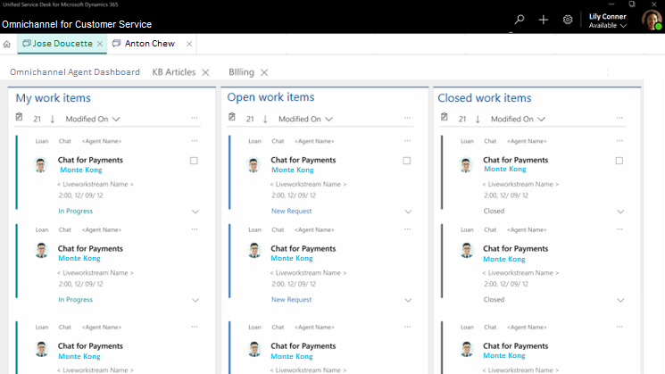

# View agent dashboard and agent work items

[!INCLUDE[cc-use-with-omnichannel](../../includes/cc-use-with-omnichannel.md)]

When you first sign in to Unified Service Desk, you see the **Omnichannel Agent Dashboard** page of Omnichannel for Customer Service. This page provides a multi-stream view of conversations. Here, you can view the conversations that you're actively working on, conversations that are available for you to pick from the queues and conversations that you've completed during the last 24 hours.

The **Home** button on the **Session** tab provides quick navigation to the **Omnichannel Agent Dashboard** page. When you select this button, the dashboard appears on the **Application Management** tab.

The **Omnichannel Agent Dashboard** page consists of the following stream:

 - My work items

 - Open work items

 - Closed work items

> [!div class=mx-imgBorder]
> 

## My work items

In the **My work items** stream, you see all the conversations (work items) that you're actively working on. Select the ellipsis button (**...**) for a conversation, and then select **Open** to open the conversation as a session on the **Session** tab.

## Open work items

In the **Open work items** stream, you see all the conversations that are in the **Open** state and are available for you to pick. Conversations (work items) are shown for all the queues where you're added as a member. Select the ellipsis button (**...**) for a conversation (work item), and then select **Pick** to assign the work item to yourself. When you select **Pick**, the system moves the conversation (work item) from **Open work items** stream to the **My work items** stream, and you can see the following message: **Work item picked successfully. Work item: < Subject of the work item >**.

## Closed work items

In the **Closed work items** stream, the stream refreshes and shows you all the conversations that you've closed in the past 24 hours. To view a closed conversation (work item), select the ellipsis button (**...**) for it, and then select **Open** to view the details.

> [!div class="nextstepaction"]
> [Next topic: Create a record](create-record.md)

## See also

- [Introduction to the agent interface in Omnichannel for Customer Service](introduction-agent-interface.md)

[!INCLUDE[footer-include](../../includes/footer-banner.md)]