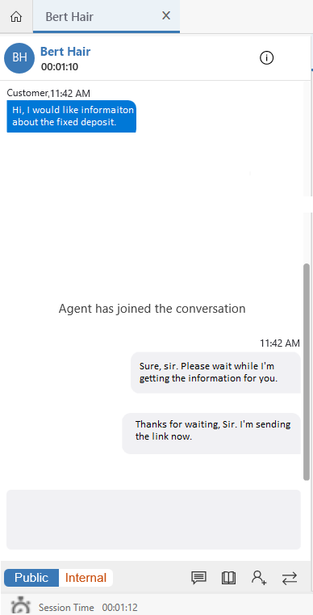
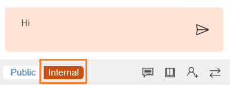
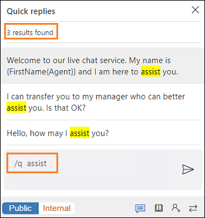
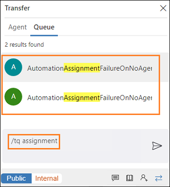

# View the communication panel

[!INCLUDE[cc-use-with-omnichannel](../../includes/cc-use-with-omnichannel.md)]

The communication panel displays messages that you and your customer exchange during your conversation.In the communication panel, you can:

- Send quick replies.
- Search for and share knowledge articles with the customer with whom you're interacting.
- Transfer the conversation (work item) to another agent or queue.
- Consult with others if you need help to resolve the work item.
- Switch between internal and public mode to send messages to internal participants (other agents or supervisors).

## Use keyboard commands

You can use the communication panel options or keyboard commands to switch between public-facing and internal messages, get quick replies, show your customer a relevant knowledge article, consult with other agents, or transfer work items.

The following keyboard commands are available in the communication panel.
 
 | Option           | Description                                   |  Command |
 |------------------|-----------------------------------------------|-----------|
 | Public           | Send public messages | `/p` |
 | Internal         | Send messages to internal users | `/i` |
 | Quick replies    | Send messages based on templates  | `/q` |
 | Knowledge articles | Search for and share knowledge articles | `/kb` |
 | Consult          | View a list of others you can consult with | `/c` |
 | Transfer         | View a list of agents or queues to transfer the conversation to | `/t` and `/tq` |

> [!div class=mx-imgBorder]
>    

> [!NOTE]
> You can't play MP4 video files in the communication panel. To play videos, we recommend that you download the video files.

## Internal and public messages

With the communication panel, you can send messages in two ways: **Internal** and **Public**. 

When you want to send messages only to internal participants, like other agents or supervisors, use the **Internal** option. These internal messages won't be shown to the customers.

> [!div class=mx-imgBorder]
> 

When you want to send messages to all participants in the conversation, including the customer, use the **Public** option.

> [!div class=mx-imgBorder]
> 

You can use keyboard commands to alternate between sending internal and public messages:

- **Internal**: Enter **/i** to send an internal message that only agents or supervisors can see.

- **Public**: Enter **/p** to send a public message to all the participants who are interacting in the conversation.

You can change the mode while you're in the conversation. For example, if you're in **Public** mode and you enter **/i**, the mode will change to **Internal**.

## Send quick replies in the chat

You can send messages that were created based on templates to the customer with whom you're interacting. These messages are stored as quick replies. Select **Quick replies** to retrieve and send a message to the customers.

> [!div class=mx-imgBorder]
>

You can also enter the keyboard command **/q** to see the list of quick replies.

### Search for specific messages

After you enter **/q** in the communication panel messaging area, continue by typing any keywords and if the **Quick replies** library has at least one message associated with the words, the message will be displayed.

 > [!div class=mx-imgBorder] 
 >  

## Search for and share knowledge articles

From the communication panel, you can open the knowledge article search control by selecting the knowledge articles option. You can also enter the keyboard command **/kb** to open knowledge article search.

After opening knowledge article search, you can search for relevant knowledge articles based on the context of your session and you can share articles with customers through the communication panel. Select the **Send link** button to share the knowledge article link. More information: [Search for knowledge articles](right-control-panel.md#search-for-knowledge-articles)

## Consult with an agent or supervisor

You can consult with other agents or your supervisors. Select **Consult** to invite your colleagues.

> [!div class=mx-imgBorder]
>  

You can also enter the keyboard command **/c** to see the list of the supervisors or agents who are available for consultation. 

> [!Note]
> We recommend that you invite no more than five consulting agents when conversing with the customer.

### Search for a specific agent

After you enter **/c**, you can continue typing the name of a participant you'd like to consult with. If the participant is present, the name is displayed.

## Transfer the conversation

You can transfer the conversation (work item) either to an agent or a queue.

> [!div class=mx-imgBorder]
>

You can transfer a conversation only to agents who are configured in the same work stream and queue. If the conversation belongs to another queue, when you transfer the request, routing rules assign the conversation (work item) to the appropriate agent in the queue.

To see the list of agents or supervisors who are available to transfer the conversation to, enter **/t**.

To see the list of queues you can transfer the conversation to, enter **/tq**.

When skill-based routing is enabled, the **Transfer** flyout shows users sorted in order of matching skills.

### Search for specific agents or queues

Enter **/t** or **/tq** followed by the name of a participant or queue. If the participant or queue is present, the name is displayed.

> [!div class="nextstepaction"]
> [Next topic: View call scripts, take notes, and search knowledge articles](right-control-panel.md)

### See also

[Introduction to the agent interface in Omnichannel for Customer Service](introduction-agent-interface.md)  
[View customer summary and know everything about customers](customer-summary.md)  
[View customer summary for an incoming conversation request](view-customer-summary-incoming-conversation-request.md)  
[Create a record](create-record.md)  
[Search for records](search-record.md)  
[Link and unlink a record](link-unlink-record.md)  

[!INCLUDE[footer-include](../../includes/footer-banner.md)]