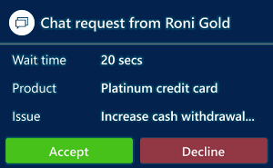

# View alert and toast notifications

[!INCLUDE[cc-use-with-omnichannel](../../includes/cc-use-with-omnichannel.md)]

A notification is a visual alert you see as a dialog box each time you get a chat, or SMS conversation request from a customer. When you get a notification, you see the details of the customer with whom you are going to interact. When you accept the request, a session is started, and you can view the contextual information of the customer and case in the customer summary page.

Some of the scenarios where you can receive notifications: 

- Incoming chat conversation

- Incoming SMS conversation

- Conversation (work item) assignment

- Conversation transfer

- Conversation escalation

- Conversation escalation from Bot

## Types of notifications

There are two types of notifications:

- **Toast notifications:** A toast notification or floating notification is a notification message type where you receive information in a dialog, which disappears after a stipulated time. If you select the notification, the associated session or application opens. This type notifications appear for conversation (work item) assignments, conversation escalations, and conversation transfer scenarios and so on. 

- **Alert notifications:** An alert notification is a type of notification where a dialog appears with actionable buttons. When you select the **Accept** button, a screen pops up with Customer summary details. You need to take an action within the stipulated time and the notification disappears when the time is up.

## Incoming chat notification

When a chat conversation request comes in, you receive a notification. When you accept the chat request, you’ll see a details about the customer in the Customer summary page. A simultaneous session starts, and the chat window is expanded in the left panel of Unified Service Desk so you can exchange messages with the customer.

 > [!div class=mx-imgBorder]
 >   

The details you’ll see for a chat channel are:

 - Name of the customer

 - Comment

 - Wait time

## Incoming SMS notification

You receive a notification for a SMS conversation request. When you accept the SMS request, a session is starts, and the communication panel appears where you can exchange messages with the customer.

Identification of a customer happens based on the **Mobile Phone** field present in the Contact record in Dynamics 365 Customer Service. That is, if the incoming SMS conversation is from a phone whose number is present in the mobile phone field of a Contact record, the conversation automatically links to the contact record.

 > [!div class=mx-imgBorder]
 >  

The details you’ll see for a SMS channel are:

 - Name of the customer

 - Comment

 - Wait time

 ## Incoming Facebook notification

You receive a notification for a Facebook conversation request. When you accept the Facebook request, a session is started, and the communication panel appears where you can exchange messages with the customer.

> [!div class=mx-imgBorder]
> 

> [!div class="nextstepaction"]
> [Next topic: View customer summary and know everything about customers](customer-summary.md)

## Theme of the notification

There are two themes for the notification - Dark and Light. You'll see the theme as configured by your administrator.

**Dark** and **Light** theme 

 

## See also

- [View communication panel](left-control-panel.md)
- [View customer summary for an incoming conversation request](view-customer-summary-incoming-conversation-request.md)

[!INCLUDE[footer-include](../../includes/footer-banner.md)]