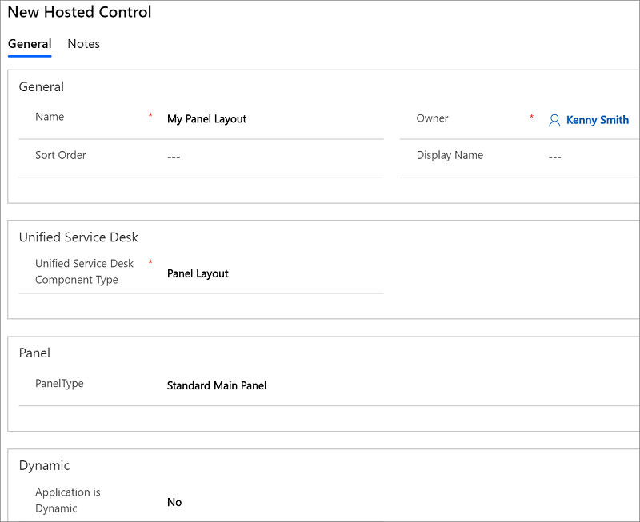

# Panel Layout (Hosted Control)
Use **Panel Layout** hosted control to define the arrangement of panels in [!INCLUDE[pn_unified_service_desk](../includes/pn-unified-service-desk.md)]. Panels hold various hosted controls, and a panel layout defines the arrangement of various hosted controls on the main screen of the [!INCLUDE[pn_unified_service_desk](../includes/pn-unified-service-desk.md)] client application. [!INCLUDE[pn_unified_service_desk](../includes/pn-unified-service-desk.md)] comes with several predefined panel types to support various layout options such as tabbed layout, deck, and stacked layout. For more information, see [Panels, panel types, and panel layouts in Unified Service Desk](../unified-service-desk/panels-panel-types-panel-layouts.md).  
  
 If a **Panel Layout** type of hosted control is not defined in the application, the default panel layout, Standard Main Panel, is created automatically. If you create a **Panel Layout** type of hosted control, you must configure a replacement for the Standard Main Panel. Any panel layout may be used in its place; however, it is quite common to just define the Standard Main Panel.  
  
## In This Section  
 [Create a Panel Layout hosted control](../unified-service-desk/panel-layout-hosted-control.md#create)  
  
 [Predefined UII actions](../unified-service-desk/panel-layout-hosted-control.md#actions)  
  
 [Predefined events](../unified-service-desk/panel-layout-hosted-control.md#events)  
  
   
## Create a Panel Layout hosted control  
 While creating a new hosted control, the fields in the **New Hosted Control** screen vary based on the type of hosted control you want to create. This section provides information about the specific fields that are unique to the **Panel Layout** hosted control type. For detailed information about creating a hosted control, see [Create or edit a hosted control](../unified-service-desk/create-edit-hosted-control.md).  
  
   
  
 In the **New Hosted Control** screen:  
  
- From the **Unified Service Desk Component Type** drop-down list, select **Panel Layout**.  
  
- From the **PanelType** drop-down list, select a panel layout type to create. You can select one from the following: **Standard Main Panel**, **Ribbon Main Panel**, **Vertical Split**, **Horizontal Split**, **XAML**, and **User Defined**. The XAML and User Defined panel layouts are the custom panels that you define. For detailed information about each of the panel layouts, see [Panels, panel types, and panel layouts in Unified Service Desk](../unified-service-desk/panels-panel-types-panel-layouts.md). The fields in this page change based on the selected panel type.  
  
- Select **Yes** or **No** from the **Application is Dynamic** list to determine if the hosted control is dynamic or not. A dynamic hosted control can be global or non-global. Global dynamic hosted controls are loaded at the first request and hidden thereafter, and they can be requested at any time, such as during a global session, normal session, or workflow. Non-global dynamic hosted controls can only be loaded after a session has started, and each session uses a different instance of the application. If a dynamic hosted control is part of a workflow, and has not started when the workflow starts then the workflow will start the hosted control and close it when the workflow is complete.  
  
- **User Can Close** check box becomes available if you selected **Yes** in the **Application is Dynamic** list. Select it to specify that the hosted control can be closed by the user.  
  
- If you selected **Vertical Split**, **Horizontal Split**, **XAML**, or **User Defined** in the **PanelType** list, the **Application is Global** check box becomes available. Select it to set the hosted control as global. Global hosted controls can be displayed outside of a customer session. Controls like the agents’ dashboard, wall or search are common uses for global hosted controls. Global hosted controls do not have session-specific state so when you change sessions, these same global hosted controls remain. If the check box is not selected, the hosted control becomes session based. Session-based controls exist in the context of the customer session. If the user changes to another session, all the session pages from the previous session are hidden.  
  
- If you selected **Vertical Split**, **Horizontal Split**, **XAML**, or **User Defined** in the **PanelType** list, the **Display Group** field becomes available. Specify a panel where this hosted control will be displayed. For information about various panels available in [!INCLUDE[pn_unified_service_desk](../includes/pn-unified-service-desk.md)], see [Panels, panel types, and panel layouts in Unified Service Desk](../unified-service-desk/panels-panel-types-panel-layouts.md).  
  
- If you selected **XAML** in the **PanelType** list, a **XAML** field becomes available where you specify the XAML definition for your panel type.  
  
- If you selected **User Defined** in the **PanelType** list, the **Assembly URI** and **Assembly Type** fields become available. In the **Assembly URI** field, type the name of your assembly. In the **Assembly Type** field, specify the following value: *\<AssemblyName>.\<ClassName>*. For detailed information about how to create a user defined panel layout see, [Create custom panel layout in Unified Service Desk](../unified-service-desk/create-custom-panel-layout.md).  
  
   
## Predefined UII actions  
 These are the predefined actions for this hosted control type.  
  
   
### Close  
 This action is used to close the hosted control.  
  
### FireEvent  
 Fires a user-defined event from this hosted control.  
  
|Parameter|Description|  
|---------------|-----------------|  
|name|Name of the user-defined event.|  
  
 All subsequent name=value pairs become the parameters to the event. For more information about creating a user-defined event, see [Create a user-defined event](../unified-service-desk/create-user-defined-event.md).  
  
   
### MoveToPanel  
 This action is used to move hosted controls between panels at runtime.  
  
|Parameter|Description|  
|---------------|-----------------|  
|app|Name of the hosted control to be moved.|  
|panel|Target panel for the hosted control.|  
  
### New_CRM_Page  
 Creates a page for creating a new record of the entity specified, and treats the page as a popup from the specified hosted control. The window navigation rules are evaluated to determine the location where the page to create the entity record is displayed.  
  
|Parameter|Description|  
|---------------|-----------------|  
|LogicalName|The logical name of the entity for creating a new instance.|  
  
> [!NOTE]
>  The rest of the parameters should consist of name=value pairs. These are the additional pre-populated values in the form for creating a new record for the specified entity. For more information about using this action, see step 4 in [Walkthrough 7: Configure agent scripting in your agent application](../unified-service-desk/walkthrough-configure-agent-scripting-agent-application.md).  
  
### Open_CRM_Page  
 Opens an existing instance of the entity specified and identified by the ID, and treats the page as a popup from the specified hosted control. The window navigation rules are evaluated to determine the location where the popup should be displayed.  
  
|Parameter|Description|  
|---------------|-----------------|  
|LogicalName|The logical name of the entity to open.|  
|id|The ID of the entity record to open.|  
  
### Popup  
 Pops up a URL from the hosted control and runs the window navigation rules against it for routing the popup to the appropriate location.  
  
|Parameter|Description|  
|---------------|-----------------|  
|url|Routes a popup from this hosted control using this URL as if it were a popup requested from the displayed control.|  
|frame|The frame from which this popup originated.|  
  
   
### RealignWindow  
[!INCLUDE[cc_RealignWindow_Action](../includes/cc-realignwindow-action.md)]
  
   
### SetSize  
 This action explicitly sets the width and height of the hosted control. This is particularly useful when using "auto" in your panel layouts.  
  
|Parameter|Description|  
|---------------|-----------------|  
|width|The width of the hosted control.|  
|height|The height of the hosted control.|  
  
   
### SetVisualProperty  
 Set the visual ([UIElement](/uwp/api/Windows.UI.Xaml.UIElement)) properties such as height, width, and visibility of a hosted control. This action call is specifically useful for UI automation, such as automatically displaying or hiding a panel. Familiarity with XAML and [!INCLUDE[pn_unified_service_desk](../includes/pn-unified-service-desk.md)] layout is required for effectively using this action.  
  
|Parameter|Description|  
|---------------|-----------------|  
|elementname|The name of the UI element for which you want to set the property such as `Expander`, `StackPanel`, and `Grid`.   For example: `elementname=Expander`|  
|propertyname|The name of the property for the specified element that you want to set such as `Height`, `Width`, `Visibility`, and `Color`.   For example: `propertyname=Visibility`|  
|value|Specify the appropriate value for the specified property. Supported value types for this parameter are `string`, `enumeration`, `integer`, or `bool`.   For example: `value=Visible`|  
  
 For an example usage of this message, see [Step 3: Configure action calls to automatically display and hide the knowledge base search panel](../unified-service-desk/walkthrough-8-use-dynamics-365-knowledge-base-within-agent-application.md#Step3) in [Walkthrough 8: Use Parature knowledge within your agent application](../unified-service-desk/walkthrough-8-use-dynamics-365-knowledge-base-within-agent-application.md).  
  
> [!NOTE]
>  By default, this action is exposed only for the **Panel Layout** type of hosted control. To use the `SetVisualProperty` action with all other predefined [!INCLUDE[pn_unified_service_desk](../includes/pn-unified-service-desk.md)] hosted control types that are derived from the [DynamicsBaseHostedControl](/dotnet/api/microsoft.crm.unifiedservicedesk.dynamics.dynamicsbasehostedcontrol) class, you must explicitly add a UII action called `SetVisualProperty` to the respective hosted control. [!INCLUDE[proc_more_information](../includes/proc-more-information.md)] [Add UII action for a hosted control](../unified-service-desk/add-uii-action-hosted-control.md)  
  
   
## Predefined events  
 There aren’t any predefined events available for this hosted control type.  
  
### See also  
 [Panels, panel types, and panel layouts in Unified Service Desk](../unified-service-desk/panels-panel-types-panel-layouts.md)   
 [UII actions](../unified-service-desk/uii-actions.md)   
 [Events](../unified-service-desk/events.md)   
 [Unified Service Desk Configuration Walkthroughs](../unified-service-desk/unified-service-desk-configuration-walkthroughs.md)   
 [Hosted control types and action/event reference](../unified-service-desk/hosted-control-types-action-event-reference.md)   

[!INCLUDE[footer-include](../includes/footer-banner.md)]