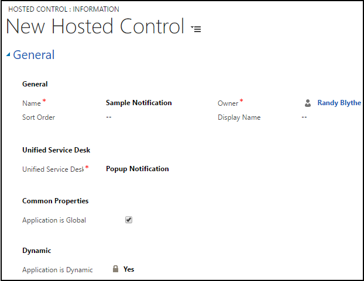

# Popup Notification (Hosted Control)
Use the **Popup Notification** hosted control type to display notifications in [!INCLUDE[pn_unified_service_desk](../includes/pn-unified-service-desk.md)]. The notification layout and content is defined as XAML  in a [!INCLUDE[pn_unified_service_desk](../includes/pn-unified-service-desk.md)] form instance, and the **Popup Notification** hosted control is used to display and hide the form instance as required. [!INCLUDE[proc_more_information](../includes/proc-more-information.md)] [Configure notifications in Unified Service Desk](../unified-service-desk/configure-notifications-unified-service-desk.md)  

> [!NOTE]
>  This hosted control type was introduced in [!INCLUDE[pn_unified_service_desk](../includes/pn-unified-service-desk.md)] 2.2 release.  

   
## Create a Popup Notification hosted control  
 While creating a new hosted control, the fields in the **New Hosted Control** screen vary based on the type of hosted control you want to create. This section provides information about the specific fields that are unique to the **Popup Notification** hosted control type. For detailed information about creating a hosted control, see [Create or edit a hosted control](../unified-service-desk/create-edit-hosted-control.md).  

 

 In the **New Hosted Control** screen:  

- Under **Unified Service Desk** area, select **Popup Notification** from the **Unified Service Desk Component Type** drop-down list.  

- Select the **Application is Global** check box to set the hosted control as global, which can be displayed outside of a customer session. Global hosted controls do not have session-specific state so when you change sessions, these same global hosted controls remain. If the check box is not selected, the hosted control becomes session based. Session-based controls exist in the context of the customer session. If the user changes to another session, all the notifications and other hosted controls   from the previous session are hidden.  

- You cannot change the value of the **Application is Dynamic** field. By default, the control is a dynamic hosted control, which allows an agent to start or close a hosted control on demand, either by using the UI or programmatically through code. More information: [Dynamic Unified Service Desk hosted controls](../unified-service-desk/unified-service-desk-hosted-controls.md#Dynamic)  

  For information about other **General** fields, see [Create or edit a hosted control](../unified-service-desk/create-edit-hosted-control.md).  

   
## Predefined UII Actions  
 These are the predefined events for this hosted control.  

   
### Show  
 Displays a notification.  

::: moniker range="=dynamics-usd-3"

|   Parameter   | Description  |
|---------------|--------------|
|   formname    | Name of the [!INCLUDE[pn_unified_service_desk](../includes/pn-unified-service-desk.md)] form to display. |
| placementmode | Specifies whether or not to display the notification relative to [!INCLUDE[pn_unified_service_desk](../includes/pn-unified-service-desk.md)] window. Valid values are `absolute` or `relative`.   -   `absolute`: Specifies that the notification will be displayed based on your screen coordinates. The values that you specify in the `left` and `top` parameters for the notification location are absolute percentage values for your computer screen.  -   `relative`:  Specifies that the notification will be displayed based on [!INCLUDE[pn_unified_service_desk](../includes/pn-unified-service-desk.md)] client window coordinates. The values that you specify in the `left` and `top` parameters for the notification location are  percentage values relative to the [!INCLUDE[pn_unified_service_desk](../includes/pn-unified-service-desk.md)] client window. |
|     left      | Specifies the position, in percentage, from the left of either your screen or the [!INCLUDE[pn_unified_service_desk](../includes/pn-unified-service-desk.md)] client window where the notification should be displayed. If you don’t specify this parameter, 0 is passed by default. |
|      top      | Specifies the position, in percentage, from the top of either your screen or the [!INCLUDE[pn_unified_service_desk](../includes/pn-unified-service-desk.md)] client window where the notification should be displayed. If you don’t specify this parameter, 0 is passed by default. |
|    timeout    | Duration in seconds for the notification to be available without any interaction. If you do not specify a valid value for this parameter, the notification will continue to appear, and won't hide/close automatically. If you want a notification to be explicitly closed, you might leave out this value but should add a cancel/close button to close the notification if the user wants to close the notification. |

::: moniker-end

::: moniker range=">=dynamics-usd-4"

|   Parameter   | Description  |
|---------------|--------------|
|   formname    | Name of the [!INCLUDE[pn_unified_service_desk](../includes/pn-unified-service-desk.md)] form to display. |
| placementmode | Specifies whether or not to display the notification relative to [!INCLUDE[pn_unified_service_desk](../includes/pn-unified-service-desk.md)] window. Valid values are `absolute` or `relative`.   -   `absolute`: Specifies that the notification will be displayed based on your screen coordinates. The values that you specify in the `left` and `top` parameters for the notification location are absolute percentage values for your computer screen.  -   `relative`:  Specifies that the notification will be displayed based on [!INCLUDE[pn_unified_service_desk](../includes/pn-unified-service-desk.md)] client window coordinates. The values that you specify in the `left` and `top` parameters for the notification location are  percentage values relative to the [!INCLUDE[pn_unified_service_desk](../includes/pn-unified-service-desk.md)] client window. |
|     left      | Specifies the position, in percentage, from the left of either your screen or the [!INCLUDE[pn_unified_service_desk](../includes/pn-unified-service-desk.md)] client window where the notification should be displayed. If you don’t specify this parameter, 0 is passed by default. |
|      top      | Specifies the position, in percentage, from the top of either your screen or the [!INCLUDE[pn_unified_service_desk](../includes/pn-unified-service-desk.md)] client window where the notification should be displayed. If you don’t specify this parameter, 0 is passed by default. |
|    timeout    | Duration in seconds for the notification to be available without any interaction. If you do not specify a valid value for this parameter, the notification will continue to appear, and won't hide/close automatically. If you want a notification to be explicitly closed, you might leave out this value but should add a cancel/close button to close the notification if the user wants to close the notification. |
|    stack    | Specifies whether Unified Service Desk shows the notifications as a stack.  Set **true** to show the notification in stack. Set **false** to not to show the notifications in stack. |
|    stackHeight    | Height the notification in pixels in the collapsed state.  The range of the value is between 1 - 100. The default is 50. If you do not specify any value, the default value (50) is passed. Also, if you specify 0 or specify more than 100, default value (50) is passed.|

::: moniker-end

   
### Hide  
 Hides the notification.  

   
### Close  
 Closes the notification, and disposes the associated UI elements.  

   
## Predefined Events  
 These are the predefined events for this hosted control.  

> [!NOTE]
>  Developers can define custom (user-defined) events for the hosted control, and fire them from the XAML. [!INCLUDE[proc_more_information](../includes/proc-more-information.md)] [Command binding to fire events for the Popup Notification control](../unified-service-desk/configure-notifications-unified-service-desk.md#CommandBinding). In case of user-defined events, you will have to explicitly invoke the `Hide` action to hide the notification as opposed to the predefined events that automatically hide the notification when they occur.  

### Ok  
 This event is fired from the form XAML that defines the notification layout. [!INCLUDE[proc_more_information](../includes/proc-more-information.md)] [Command binding to fire events for the Popup Notification control](../unified-service-desk/configure-notifications-unified-service-desk.md#CommandBinding). When this event occurs, the notification control will automatically hide.  

### Cancel  
 This event is fired from the form XAML that defines the notification layout. [!INCLUDE[proc_more_information](../includes/proc-more-information.md)] [Command binding to fire events for the Popup Notification control](../unified-service-desk/configure-notifications-unified-service-desk.md#CommandBinding). When this event occurs, the notification control will automatically hide.  

### TimedOut  
 This event occurs when the timeout value specified for the control in the `Show` action has elapsed without any interaction on the notification message. When this event occurs, the notification control will automatically hide.  

### See also  
 [How to configure notifications in Unified Service Desk](../unified-service-desk/configure-notifications-unified-service-desk.md)   
 [Create a user-defined event](../unified-service-desk/create-user-defined-event.md)

[!INCLUDE[footer-include](../includes/footer-banner.md)]