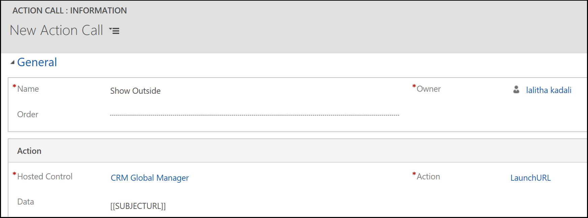
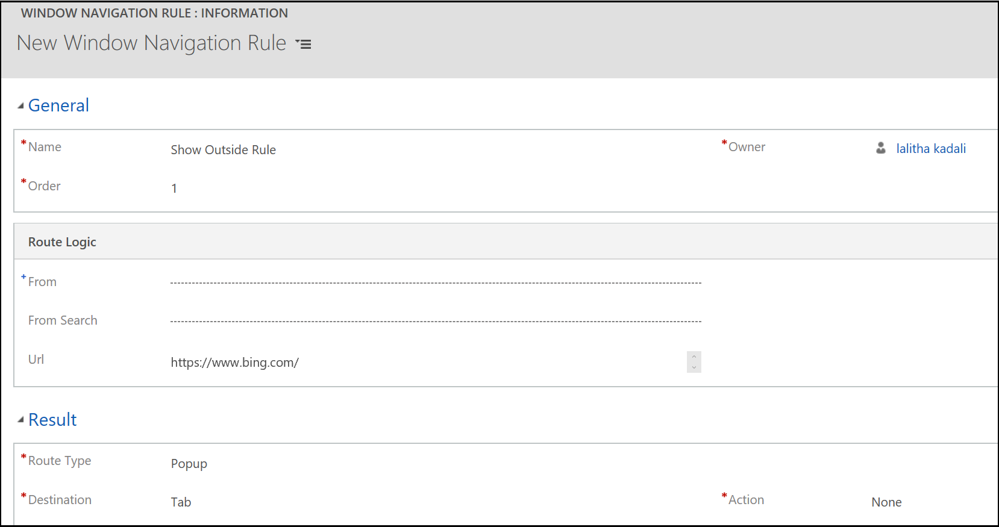

<!--from editor: Line 82 mentions upgrading a Customer Engagement instance. Unless this refers to on-premises, we should not use Customer Engagement. What should this change to? Also, the term "dirty" is used in lines 94 and 104. The style guide says to instead use "marked for edit," "marked as modified," or another, similar phrase. -->

# Unified Service Desk known issues and limitations

::: moniker range="dynamics-usd-4.1"

## Unified Service Desk 4.1 known issues and limitations

### Creating an Instance of COM component with CLSID

You use IE process hosting type and upgrade your Windows 10 to the latest version. When you launch the Unified Service Desk client application, you might see the following error: 

**Creating an Instance of COM component with CLSID (0002DF01-0000-0000-C000-000000000046) from the IClassfactory failed due to the following error: 8150002e Exception from the HRESULT: 0x8150002E.**

If the Favorites bar is enabled in Internet Explorer, then you might see that error.

#### Workaround

You can work around the issue in two ways:

- Remove the Favorites bar from Internet Explorer.
- Add the KillUSDIEProcessesOnExit UII option.

##### Remove the Favorites bar from Internet Explorer

You must remove the Favorites bar from Internet Explorer and then end the IE Process manually before restarting the Unified Service Desk client application. Then when you launch the Unified Service Desk client application, you might not see the error.

1. Open Internet Explorer.
2. Right-click the Favorites bar. The context menu appears.
3. Select **Favorites bar** to disable.

##### Add the KillUSDIEProcessesOnExit UII option

If you don't want to remove the Favorites bar for Internet Explorer, add the **KillUSDIEProcessesOnExit** UII option and set the value to true. Setting the UII option ends the IE Process running in the background at the time of exiting the Unified Service Desk client application. Then when you launch the Unified Service Desk client application, you might not see the error.

1. Sign in to the Common Data Service platform.
2. [!INCLUDE[proc_settings_usd](../includes/proc-settings-usd.md)]
3. Choose **Options**.
4. Select **New** on the **Active UII Options** page.
5. Choose **Others** for the **Global Option** field.
6. Type **KillUSDIEProcessesOnExit** for the **Name** field.
7. Set **True** for the **Value** field.
8. Select **Save**.

> [!Note]
> The mitigation works for the issue with HRESULT: 0x8150002E.

### Document Object Model (DOM) access in Chrome Process

With Chrome Process, you can't access the DOM element from the C3 custom code. 

#### Workaround

To work around, you must write JavaScript code to access the DOM and execute the RunScript action on it.

### Window Navigation Rules for Advanced Find does not work

When you use Unified Service Desk with the Unified Interface apps, Window Navigation Rules for the Advanced Find page might not work as the page is available only on Web Client and hence you must retain the route type as **Popup**.

### Importing solution causes error with Package Deployer

When you use the latest version of the package deployer (4.1.1.1246) to deploy sample packages, you might encounter an error. To work around the issue, you must upgrade your Customer Engagement instance to the latest version (9.1.0.4626).

### Support for inactivity timeout with Chrome Process and SSO

If your organization has enforced the Inactivity session timeout for the agents, then with Chrome Process, the agent is not automatically signed out when the inactivity session timeout expires as SSO is enabled by default. If you want to enforce Inactivity session timeout for the agents, then disable the SSO feature for the Chrome Process. To learn more, see [Disable Single Sign On](admin/connect-dynamics-365-instance-using-unified-service-desk-client.md#enable-or-disable-single-sign-on).

### JavaScript Alert and Confirmation dialog

While you use **Chrome Process** to host applications in Unified Service Desk, if you load applications hosted using **IE Process**, then web pages don't show the JavaScript alert, Confirmation, and prompt dialog on the application that uses **IE Process**. The web pages show the dialogs on the applications hosted using the Chrome Process. This issue occurs if you have at least one application hosted using Chrome Process and loaded in Unified Service Desk.

### Support for CloseAndPrompt action in Chrome Process

The Chrome Process does not support the **CloseAndPrompt** action for web client. When you make changes in a webpage or a form on a web client, the process does not perform a dirty data check by prompting a dialog. Instead, when you close the webpage or the form, Unified Service Desk closes the webpage or the form.

### Support for Microphone and webcam with Channel Integration Framework

When you integrate a channel with Unified Service Desk using the Channel Integration Framework and if that channel does not work on the Chromium browser (which is based on Chromium Embedded Framework), then you might not have access to Microphone and webcam.

### Preview: Edge Process

#### Support for CloseAndPrompt action in Edge Process

The Edge Process does not support the **CloseAndPrompt** action for web client. When you make changes in a webpage or a form on a web client, the process does not perform a dirty data check by prompting a dialog. Instead, when you close the webpage or the form, Unified Service Desk closes the webpage or the form.

#### Support for alert dialog with WebView control

The Edge Process doesn't support the native JavaScript alert dialog in the WebView control. When you use the Microsoft Edge WebView control, the alert dialog (WPF message) shows the information. However, the alert does not stop the JavaScript execution. That is, even though you do not perform an action on the alert dialog, the JavaScript execution continues.

#### Support for confirm dialog

The Edge Process doesn't support the confirm dialog in the WebView control. If your custom code uses the confirm dialog, the Edge Process in the WebView control does not support the execution, and your code may fail.

#### Support for multiple page navigation in Edge Process

The Edge Process WebView control doesn't support multiple-page navigation for the hosted control. During the hosted control creation, setting the option **Allow Multiple Pages** to **True** with more than one URL does not perform the navigation in the Unified Service Desk client application at run-time. That is, the navigation to first URL will happen and the page renders. However, the navigation to the second URL will not be executed and the webpage will not render the second URL.

#### Use window.top.notifyUSD to open event in a new browser

The Edge Process WebView control supports using `window.top.notifyUSD` to raise the events instead of `window.open`.

#### Using a long-running script with Edge Process freezes Unified Service Desk

When you execute a long-running script with Edge Process, the Unified Service Desk client application freezes, and you must restart the client application. We recommend that you review the script that caused the freeze, and then restart the Unified Service Desk client application.

#### Support for downloading files with Edge Process

When you host your web pages in a Unified Service Desk client application using Edge Process, downloading files from the web application is not supported with Edge Process.

A workaround is to open the Microsoft Edge browser separately, navigate to the website URL and download the file.

#### Support for launching application for a URI with Edge WebView control

When you host your web application in Unified Service Desk client application using Edge Process, launching application for a URI is not supported with Edge Process.

Some of the URI schemes and applications are as follows:

| URI Scheme | Launches |
| ----------:|----------|
|bingmaps | Maps app |
|mailto: | Default email app |
|ms-call:|  Call app |
|ms-chat: | Messaging app |

A workaround is to open the Microsoft Edge browser separately, navigate to the website URL and select the URI scheme to launch the application.

#### KB article support with Edge Process

In the web client, when you host the KB article in Unified Service Desk client application using Edge Process, the KB articles does not render. 

A workaround is to change the **Unified Service Desk Component Type** of the **KB Article** hosted control from **CRM Page** to **Unified Interface Page**.

Change the **Unified Service Desk Component Type** of the **KB Search** hosted control from **KM Control** to **Unified Interface KM Control**.

After changing the component type, go to the action call for opening the KM, and in the **Data** field you can see the parameters like **url**, **postdata**, and **header**.

Remove the following values from the data field:

`postdata=[[postdata]]`

`header=[[header]+]` 

To open a KB article, only the article URL is sufficient. For example: `url=[[KB Search.articleurl]g]`

Now, save the configuration. Log in to Unified Service Desk and open any article to see the article contents.

### Ribbon command not loading in the forms

For an entity list, in the URL, if the `cmdbar=false`, then any URL originating from the URL might not have ribbon command bar.
For example, if you are navigating from a case grid to a case, and in the URL when `cmdbar=false`, then the case page might not have ribbon command bar.

#### Workaround

As a workaround for the issue, in the hosted control configuration of the URL, set `cmdbar=true`.

## See also

[Use Edge Process to host web application](edge-process.md)

[Use Chrome Process to host web application](chrome-process.md)

[Integrate channel using Channel Integration Framework](integrate-channel-provider-channel-integration-framework.md)

::: moniker-end

::: moniker range="dynamics-usd-4"

## Unified Service Desk 4.0 known issues and limitations

### Select articles from the Unified Interface KB Control in the Unified Service Desk displays error

If you are using **Web client - Unified Interface Migration Assistant** to migrate your Unified Service Desk Configurations from Web Client to Unified Interface, the KM Control is changed to Unified Interface KM Control.

With the Unified Interface KM Control hosted control, if you login to Unified Service Desk and open any KB article, you can see server error.

#### Workaround

To fix the issue, you must manually update the data parameter for the Unified Interface KM Control action call.

In the Web Client configurations, go to the action call for opening the KM, and in the **Data** field you can see the parameters like **url**, **postdata**, and **header**.

Remove the following values from the data field:

`postdata=[[postdata]]`

`header=[[header]+]` 

To open an KB article, only the article url is sufficient. For example: `url=[[KB Search.articleurl]g]`

Now, save the configuration. Login to Unified Service Desk and open any article to see the article contents.

### Toolbar shows Unified Blue theme instead of Air theme

In the **Unified Interface Settings** record, select **Air** theme instead of **Unified Blue** theme, and select a Unified Interface App. 

Now, if you log in to [!INCLUDE[pn_unified_service_desk](../includes/pn-unified-service-desk.md)], the **About Tool Bar** and **Main** toolbar chooses to show **Unified Blue** theme colors instead of **Air** theme.

#### Workaround

Remove the **Custom Styles** XAML from the **About Tool Bar** and **Main** toolbar so that toolbar picks the **Air** theme colors.

1. Sign in to the Common Data Service platform.

2. Go to **Settings** > **My Apps** > **Unified Service Desk Administrator** app. 

3. Select **Site Map**. 

4. Choose **Toolbars** under the **Basic Settings**.

5. Select **About Tool Bar** from the list.

6. Choose the **Styles** tab.

7. Remove the content in the **Custom Styles** field.

8. Select **Save** to save the settings. 

Repeat the steps 5-8 for the **Main** toolbar.

Login to [!INCLUDE[pn_unified_service_desk](../includes/pn-unified-service-desk.md)] and toolbar chooses **Air** theme colors.

### Unified Interface form does not close the tab and navigates to Dashboard

Go to **Settings** > **Administration** > **System Settings** and set the **Enable auto save on all forms** to **No** in Unified Interface.

Now, login to [!INCLUDE[pn_unified_service_desk](../includes/pn-unified-service-desk.md)], and open any Unified Interface page. For example, open a case. After completing your work on the case, if you select **Save & Close** on the Unified Interface page (form), the form saves and closes.

However, the tab does not close, and the Unified Interface page (form) navigates to **Dashboard** page.

#### Workaround

To close the tab, you need to select **User Can Close** in the hosted control so that you see **X** button the tab in [!INCLUDE[pn_unified_service_desk](../includes/pn-unified-service-desk.md)]. 

Now, login to [!INCLUDE[pn_unified_service_desk](../includes/pn-unified-service-desk.md)], and open the case. Now, select **Save & Close** on the Unified Interface page (form), the form saves and closes. The page navigates to the **Dashboard** page. To close the tab, you can select the **X** button.

### Sub Actions Calls is not available in Unified Service Desk Administrator app

You cannot view and attach an action call to another call (sub-action call) in Unified Service Desk Administrator app as the **Action Calls** in Unified Service Desk Administrator app does not display the **Sub Action Calls** option in the related tab. .

#### Workaround

You can add an action call to another call using the Unified Service Desk configurations in Web Client. 

### Support for Relevance Search (search technique) in Unified Interface KM Control

The Unified Interface KM Control supports [Full-Text search](https://docs.microsoft.com/sql/relational-databases/search/full-text-search?view=sql-server-2017) technique and does not support the **Relevance Search**. For more information about the availability of the Relevance Search, see [Relevance search for knowledge management](https://docs.microsoft.com/business-applications-release-notes/October18/service/customer-service-core-release-notes/relevance-search-for-knowledge-management).

### Quick create in Unified Service Administrator app

Selecting the **New** button (quick create)  in the **Navigation** toolbar of the Unified Service Desk Administraor app does not display any option to create.

### Navigation and command bar configuration does not execute when Internet Explorer pooling is enabled

By default, when you a open model-driven apps page in [!INCLUDE[pn_unified_service_desk](../includes/pn-unified-service-desk.md)] client application, the navigation bar is hidden and command bar is displayed. 

However, when you enable Internet Explorer pooling and change the configurations to hide the command bar and display the navigation bar, the model-driven apps page in [!INCLUDE[pn_unified_service_desk](../includes/pn-unified-service-desk.md)] client application does hide the command bar and display the navigation bar.

To execute the configuration, disable the Internet Explorer pooling.

### Unified Service Desk crashes during sign in

when you launch Unified Service Desk, the application displays the login screen and suddenly the Unified Service Desk crashes with no error message.

If you have enabled performance data logging, the crash error is logged in the log files. The log files will be present in the following location of your computer.

`%APPDATA%\Roaming\Microsoft\Microsoft Dynamics 365 Unified Service Desk\<version>\UnifiedServiceDesk_<Id-yyyy-mm-dd>`

Open the recent log file in the notepad. Search for the following message - 

`multiple_matching_tokens_detected: The cache contains multiple tokens satisfying the requirements. Call AcquireToken again providing more requirements (e.g. UserId)`

One of the reason for the application crash is due to caching of multiple tokens. 

#### Workaround

To resolve the Unified Service Desk application crash issue, follow the steps.

1. Go to the location following in your computer.  
	`C:\Users\<computer name>\AppData\Roaming\Microsoft\USD`
	
2. In the location, you will see the following file. 
**Default_USD.tokens.dat** file. 

3. Delete the file.
	
4. Restart the Unified Service Desk client application.

You can sign in to Unified Service Desk client application now.

### Ribbon command not loading in the forms

For an entity list, in the URL, if the `cmdbar=false`, then any URL originating from the URL might not have ribbon command bar.
For example, if you are navigating from a case grid to a case, and in the URL when `cmdbar=false`, then the case page might not have ribbon command bar.

####

As a work around for the issue, in the hosted control configuration of the URL, set `cmdbar=true`.

## See Also

[Unified Interface KM Control (hosted control)](unified-interface-km-control-hosted-control.md)

::: moniker-end

::: moniker range="dynamics-usd-3"

## Unified Service Desk 3.3 known issues and limitations

This section describes the known issues and limitations in [!INCLUDE[pn_unified_service_desk](../includes/pn-unified-service-desk.md)]

### Best Practices Analyzer

- **Warning for HelpImproveUSD parameter in Customer Engagement (on-premises)**

  Help Improve [!INCLUDE[pn_unified_service_desk](../includes/pn-unified-service-desk.md)] is enabled/disabled only for the Common Data Service platform. If you are using Customer Engagement (on-premises), you can see a warning for the Help Improve [!INCLUDE[pn_unified_service_desk](../includes/pn-unified-service-desk.md)] (HelpImproveUSD) parameter in the report.

- **Error for Enable Enhanced Protected mode in Windows 7 operating system**

  If you are using [!include[pn-windows-7](../includes/pn-windows-7.md)] operating system, the **Enable Enhanced Protected Mode** option is not available in Internet Explorer options. Hence, you can see an error message for the **Enable Enhanced Protected Mode** parameter in the report.

### Provide Feedback

- **Insufficient permissions to provide feedback**

  The **Provide Feedback** feature is available only if you have the Common Data Service platform.

  If you log in using administrator credentials and select **Provide Feedback** to provide your feedback/comments, you can see an **Insufficient Permissions** message. 

  

  The message says to contact the administrator even though you log in as an administrator. The reason for this message is that you did not enable the **HelpImproveUsd** option in the UII global options.

  If you enable **HelpImproveUsd**, the data collection is enabled, and in turn, you (agent and administrator) can provide feedback to improve the product.

  To enable **HelpImproveUsd**, view [Improve Unified Service Desk](admin/help-improve-unified-service-desk.md).

This section describes the limitations in [!INCLUDE[pn_unified_service_desk](../includes/pn-unified-service-desk.md)]

### RunScript

> [!IMPORTANT]
> This also applies to:
> - [!INCLUDE[pn-unified-service-desk-3-2](../includes/pn-unified-service-desk-3-2.md)]
> - [!INCLUDE[pn-unified-service-desk-3-1](../includes/pn-unified-service-desk-3-1.md)]
> - [!INCLUDE[pn-unified-service-desk-3-0](../includes/pn-unified-service-desk-3-0.md)]
> - [!INCLUDE[pn-unified-service-desk-2-2](../includes/pn-unified-service-desk-2-2.md)]

**RunScript action does not execute if the tab or page is not in focus**

If you execute a RunScript action on a tab or a page that is not in focus, the execution of RunScript action does not execute the script.

**Example:**

Accounts and Contacts tabs are open and focus is on Accounts tab. You execute `window.close()` RunScript command to close the Contacts tab. Since, the focus is on Accounts tab the RunScript execution does not execute and the Contacts tab does not close.

**Workaround:**

If you open several tabs and want to execute a RunScript action on a tab that is not in focus, set the focus on the tab you want to work and then execute the RunScript action.

### Performance enhancement for CRM entity page loads

> [!IMPORTANT]
> This also applies to:
> - [!INCLUDE[pn-unified-service-desk-3-2](../includes/pn-unified-service-desk-3-2.md)]

**Closing CRM entity page starts loading but never completes loading**

When **InternetExplorerPooling** is enabled, and if you close a CRM entity page hosted in Unified Service Desk using the close (**x**) button (_see Image 1_), the CRM entity page to starts loading but never completes loading (_see Image 2_).

  
    
  _Image 1: Closing CRM entity page hosted in Unified Service Desk using close (x) button_
  
  
  
  _Image 2: CRM entity page start loading but never completes loading_

**Workaround**

If you close the CRM entity page, the page starts loading but never completes the loading. In this case, to restore the CRM entity page, right-click on CRM entity page and select **Forward** from the context menu (_see Image 1_).

_Image 1: Right-click on the CRM entity page and select Forward from the context menu_

> [!Note]
> The session that you are working is fine and there is no data loss.

### Clicking back button in a session does not perform navigation to original URL

If you open any webpage in the browser with hosted controls using IE Process hosting method, the webpage opens in a new window within the same-hosted control overlaying the existing page/window. 

Since the webpage is opened in the new window within the same hosted control overlaying the existing page or window, clicking the back button in the webpage does not perform the navigation back to the original page. This behavior is that the new window does not have any history to navigate back to the original page.

**Workaround**

Configure **Show Outside** action call to show the webpage in an **IE process** outside of the hosted control space in the popup window.

#### Step 1: Configure ShowOutside action call

In this step, you will create an action call to show the webpage.

1. Sign in to the Common Data Service platform.
2. [!INCLUDE[proc_settings_usd](../includes/proc-settings-usd.md)]
3. Clikc **Action Calls**.
4. Click **+ New**.
5. On the **New Action Call** page, specify the following values.
  
   | Field | Value |
   |----------|-----------|
   |Name | Show Outside |
   |Hosted Control | CRM Global Manager|
   |Action| LaunchURL|
   |Data| [[SUBJECTURL]]|

   
6. Click **Save**.

#### Step 2: Configure Window Navigation Rules and add the Action Call

In this step you will create a navigation rule and set the order before other default rules. After creating the navigation rule, add the **ShowOutside** action call that you created in Step 1 to the **Show Outside Rule** window navigation rule.

1. Sign in to the Common Data Service platform.
2. [!INCLUDE[proc_settings_usd](../includes/proc-settings-usd.md)]
3. Click **Window Navigation Rules**.
4. Click **+ New**.
5. On the **New Window Navigation Rules** page, specify the following values.

   | Field | Value |
   |-------------|----------------|
   |Name| Show Outside Rule|
   |Order | 1   **Note:** You can specify any order that is lesser than the default list of Window Navigation Rules. |
   | Url | https://www.bing.com   **Note:** You must to specify a URL to which you want to navigate.|
   |Route Type | Popup |
   | Destination | Tab |
   |Action | None |

   

6. Click **Save**.
7. On the nav bar, click the down arrow next to **Show Outside Rule**, and click **Actions**.
8. On the next page, click **ADD EXISTING ACTION CALL**, type **Show Outside** in the search bar, and then press **ENTER** or click the search icon.
9. Click **Save**.

The configuration of action call and window navigation rule is completed. If you now open a webpage, the webpage opens as a popup in a new window.

For more information related to this limitation, refer the [Unified Service Desk Blogs](https://blogs.msdn.microsoft.com/usd/2017/09/27/unified-service-desk-best-practices-part-5-open-pdf-files-in-an-ie-process-hosted-control/)

### Unified Service Desk crashes during sign in

when you launch Unified Service Desk, the application displays the login screen and suddenly the Unified Service Desk crashes with no error message.

If you have enabled performance data logging, the crash error is logged in the log files. The log files will be present in the following location of your computer.

`%APPDATA%\Roaming\Microsoft\Microsoft Dynamics 365 Unified Service Desk\<version>\UnifiedServiceDesk_<Id-yyyy-mm-dd>`

Open the recent log file in the notepad. Search for the following message - 

`multiple_matching_tokens_detected: The cache contains multiple tokens satisfying the requirements. Call AcquireToken again providing more requirements (e.g. UserId)`

One of the reason for the application crash is due to caching of multiple tokens. 

#### Workaround

To resolve the Unified Service Desk application crash issue, follow the steps.

1. Go to the location following in your computer.  
	`C:\Users\<computer name>\AppData\Roaming\Microsoft\Microsoft Dynamics 365 Unified Service Desk`
	
2. In the location, you will see the following file. 
**Default_USD.tokens.dat** file. 

3. Delete the file.
	
4. Restart the Unified Service Desk client application.

You can sign in to Unified Service Desk client application now.

### Ribbon command not loading in the forms

For an entity list, in the URL, if the `cmdbar=false`, then any URL originating from the URL might not have ribbon command bar.
For example, if you are navigating from a case grid to a case, and in the URL when `cmdbar=false`, then the case page might not have ribbon command bar.

#### Workaround

As a work around for the issue, in the hosted control configuration of the URL, set `cmdbar=true`.

## See also

[Analyze best practices in Unified Service Desk](admin/analyze-best-practices-unified-service-desk.md)

[Performance enhancement for CRM entity page loads](admin/performance-enhancement-CRM-entity-page-loads.md)

[Improve Unified Service Desk](admin/help-improve-unified-service-desk.md)

::: moniker-end
