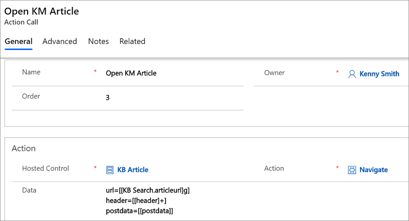
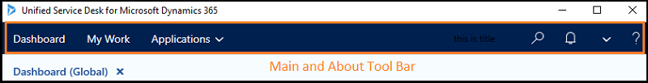
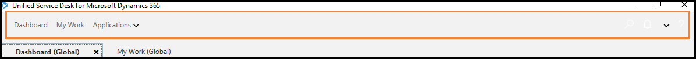

::: moniker range="dynamics-usd-4.2"

## Unified Service Desk 4.2 known issues and limitations

[!INCLUDE[cc-data-platform-banner](../includes/cc-data-platform-banner.md)]

## Unified Service Desk encounters a non-fatal error

While hosting web applications using the Edge WebView2 Process, Unified Service Desk crashes intermittently. However, the crash is non-fatal.
<br>


**Workaround**
Select **No** to continue using Unified Service Desk, or select **Yes** to restart Unified Service Desk. 

::: moniker-end


::: moniker range="dynamics-usd-4.1"

## Unified Service Desk 4.1 known issues and limitations

### Field values aren't populated in a new tab while a related record is being opened from the current page

If you're using a **Unified Interface Page** type of hosted control and you've configured to open its related entity's record creation page in a different tab from a given Unified Interface page, certain fields might not get populated in the related entity's form on the new tab.

**Example:**

You have **Case** and **Email** hosted controls to load the case and email forms, respectively. You've configured the email to open in an **Email** hosted control. 
 
Now, when the agent performs any action from a **Case** tab, the create form of an **Email** entity opens in a new tab. However, the related values won't be populated in the email form.

**Workaround:**

Configure the **RunXrmCommand** action call to initialize values in the related record, and add the action to the **PageReady** event of the related entity's hosted control. Follow these steps:

1. Create a web resource, and write the code to update the lookup value.

```
function SetLookupValue(context, fieldName, id, name, entityType)
{
  if (fieldName != null)
  {
       var lookupValue = new Array();
       lookupValue[0] = new Object();
       lookupValue[0].id = id;
       lookupValue[0].name = name;
       lookupValue[0].entityType = entityType;
       if (lookupValue[0].id != null)
       {
           context.getAttribute(fieldName).setValue(lookupValue);
       }
   }
}
```

2. In the **RunXrmCommand** action call, update the method with parameters.

```
webResourceName=new_USDFormUpdate
functionName=SetLookupValue
'field' // Logical name of the attribute that needs to be updated. In case of an email regarding field, it is regarding objectid.
'[[id]]' // ID of the case record.
'[[name]]' // Title of the case record.
'[[LogicalName]]' // LogicalName of the entity. It is case here.
```

### Unified Service Desk shuts down with an exception

The Unified Service Desk client application suddenly shuts down with a fatal exception error message. The cause is a problem with the version of .NET Framework installed on your system.

**Example error message:** 

```
Microsoft.Crm.UnifiedServiceDesk    Error    2     Message: Origin:USD BOOT FAILURE : DispatcherUnhandledException, IsFatal:True
		Source    : PresentationCore
		Method    : SyncFlush
		Error    : UCEERR_RENDERTHREADFAILURE (Exception from HRESULT: 0x88980406)
		Stack Trace    : at System.Windows.Media.Composition.DUCE.Channel.SyncFlush()
		   at System.Windows.Interop.HwndTarget.UpdateWindowSettings(Boolean enableRenderTarget, Nullable`1 channelSet)
		   at System.Windows.Interop.HwndTarget.HandleMessage(WindowMessage msg, IntPtr wparam, IntPtr lparam)
		   at System.Windows.Interop.HwndSource.HwndTargetFilterMessage(IntPtr hwnd, Int32 msg, IntPtr wParam, IntPtr lParam, Boolean& handled)
		   at MS.Win32.HwndWrapper.WndProc(IntPtr hwnd, Int32 msg, IntPtr wParam, IntPtr lParam, Boolean& handled)
		   at MS.Win32.HwndSubclass.DispatcherCallbackOperation(Object o)
		   at System.Windows.Threading.ExceptionWrapper.InternalRealCall(Delegate callback, Object args, Int32 numArgs)
   at System.Windows.Threading.ExceptionWrapper.TryCatchWhen(Object source, Delegate callback, Object args, Int32 numArgs, Delegate catchHandler)
```

More information: [WPF Render Thread Failures](/archive/blogs/dsui_team/wpf-render-thread-failures)

**Workaround:**

- Update .NET Framework on your system to the latest version.
- Update all the video drivers on your system.
- If the crash is reported on a single computer, try re-imaging the Windows operating system on that computer.

### Condition evaluation isn't working

If you've followed the security advisory recommendations in [Microsoft Guidance on Scripting Engine Memory Corruption Vulnerability](https://portal.msrc.microsoft.com/en-US/security-guidance/advisory/ADV200001), condition evaluation inside Unified Service Desktop might stop working.

**Workaround:**

To work around the issue, upgrade your Unified Service Desk client application to a version later than 4.1.1.1395.

### Creating an instance of COM component with CLSID

You use the **IE Process** hosting type and upgrade Windows 10 to the latest version. When you open the Unified Service Desk client application, the following error might appear: "Creating an Instance of COM component with CLSID (0002DF01-0000-0000-C000-000000000046) from the IClassfactory failed due to the following error: 8150002e Exception from the HRESULT: 0x8150002E."

Having the Favorites bar enabled in Internet Explorer might cause the error.

**Workaround:**

You can work around the issue in two ways:

- Remove the Favorites bar from Internet Explorer.
- Add the KillUSDIEProcessesOnExit UII option.

#### Remove the Favorites bar from Internet Explorer

You must remove the Favorites bar from Internet Explorer and then end **IE Process** manually before restarting the Unified Service Desk client application. Then, when you open the Unified Service Desk client application, the error might not appear.

1. Open Internet Explorer.
2. Right-click to select the Favorites bar.
3. On the context menu, select **Favorites bar** to disable it.

#### Add the KillUSDIEProcessesOnExit UII option

If you don't want to remove the Favorites bar from Internet Explorer, add the **KillUSDIEProcessesOnExit** UII option and set the value to **True**. Setting the UII option ends **IE Process** running in the background at the time you exit the Unified Service Desk client application. Then, when you open the Unified Service Desk client application, the error might not appear.

1. Sign in to Unified Service Desk Administrator.
2. Select **Options**.
3. On the **Active UII Options** page, select **New**.
4. For the **Global Option** field, select **Others**.
5. In the **Name** field, enter **KillUSDIEProcessesOnExit**.
6. For the **Value** field, select **True**.
7. Select **Save**.


### DOM access in Chrome Process

With **Chrome Process**, you can't access the Document Object Model (DOM) element from the C3 custom code.

**Workaround:**

To work around the problem, you must write JavaScript code to access the DOM and execute the **RunScript** action on it.

### Window Navigation Rules for Advanced Find doesn't work

When you use Unified Service Desk with Unified Interface apps, window navigation rules for the **Advanced Find** page might not work because the page is available only in the legacy web client. Therefore, you must retain the route type as **Popup**.

### Importing a solution causes an error with Package Deployer

When you use the latest version of the package deployer (4.1.1.1246) to deploy sample packages, you might encounter an error. To work around the problem, you must upgrade your environment to the latest version (9.1.0.4626).

### Support for inactivity timeout with Chrome Process and SSO

If your organization has enforced the inactivity session timeout for agents, with **Chrome Process** the agent isn't automatically signed out when the inactivity session timeout expires. This is because single sign-on (SSO) is enabled by default. If you want to enforce the inactivity session timeout for agents, disable SSO for **Chrome Process**. More information: [Disable single sign-on](admin/connect-dynamics-365-instance-using-unified-service-desk-client.md#enable-or-disable-single-sign-on)

### JavaScript alert and the confirmation dialog box

When you use **Chrome Process** to host applications in Unified Service Desk, if you load applications hosted by using **IE Process**, webpages don't show the JavaScript alert, confirmation, and prompt dialog boxes in the application that uses **IE Process**. The webpages show the dialog boxes on the applications hosted with **Chrome Process**. This issue occurs if you have at least one application hosted using **Chrome Process** and loaded in Unified Service Desk.

### Support for the CloseAndPrompt action in Chrome Process

**Chrome Process** doesn't support the **CloseAndPrompt** action for the legacy web client. When you make changes in a webpage or form in the legacy web client, the process doesn't perform a page modified (data changes) check and prompt you with a dialog box to confirm changes. Instead, when you close the webpage or form, Unified Service Desk closes the webpage or form.

### Support for microphone and webcam with Dynamics 365 Channel Integration Framework

When you integrate a channel with Unified Service Desk by using Dynamics 365 Channel Integration Framework, and if that channel doesn't work on the Chromium browser (which is based on Chromium Embedded Framework), you might not have access to the microphone and webcam.

### Edge Process

#### Support for the CloseAndPrompt action in Edge Process

**Edge Process** doesn't support the **CloseAndPrompt** action for the legacy web client. When you make changes in a webpage or form in the legacy web client, the process doesn't perform a page modified (data changes) check and prompt you with a dialog box to confirm changes. Instead, when you close the webpage or form, Unified Service Desk closes the webpage or form.

#### Support for alert with the WebView control

**Edge Process** doesn't support the native JavaScript alert in the WebView control. When you use the Microsoft Edge WebView control, the alert (Windows Presentation Foundation message) shows the information. However, the alert doesn't stop the JavaScript execution. That is, even though you don't perform an action in the alert dialog box, the JavaScript execution continues.

#### Support for confirm dialog box

**Edge Process** doesn't support the confirm dialog box in the WebView control. If your custom code uses the confirm dialog box, your code might fail.

#### Support for multiple page navigation in Edge Process

The **Edge Process** WebView control doesn't support multiple-page navigation for the hosted control. During the hosted control creation, setting the option **Allow Multiple Pages** to **True** with more than one URL doesn't perform the navigation in the Unified Service Desk client application at runtime. That is, the navigation to the first URL will happen and the page will be rendered. However, the navigation to the second URL won't be executed and the webpage won't render the second URL.

#### Open an event in a new browser by using window.top.notifyUSD

The **Edge Process** WebView control supports using `window.top.notifyUSD` to raise the events instead of `window.open`.

#### Using a long-running script with Edge Process freezes Unified Service Desk

When you execute a long-running script by using **Edge Process**, the Unified Service Desk client application freezes and you must restart it. We recommend that you review the script that caused the freeze, and then restart the Unified Service Desk client application.

#### Support for downloading files with Edge Process

When you host your webpages in a Unified Service Desk client application using **Edge Process**, downloading files from the web application isn't supported.

**Workaround:**

Open the Microsoft Edge browser separately, go to the website URL, and then download the file.

#### Support for opening an application for a URI with the Edge WebView control

When you host your web application in the Unified Service Desk client application by using **Edge Process**, opening an application for a URI isn't supported.

Some of the URI schemes and applications are as follows:

| URI Scheme | Opens |
|----------|----------|
|bingmaps | Maps app |
|mailto\: | Default email app |
|ms-call\:|  Call app |
|ms-chat\: | Messaging app |

**Workaround:**

Open the Microsoft Edge browser separately, go to the website URL, and select the URI scheme to open the application.

#### KB article support with Edge Process

In the legacy web client, when you host the KB article in Unified Service Desk client application using **Edge Process**, the KB articles aren't rendered. 

**Workaround:**

1. Change the **Unified Service Desk Component Type** of the **KB Article** hosted control from **CRM Page** to **Unified Interface Page**.

2. Change the **Unified Service Desk Component Type** of the **KB Search** hosted control from **KM Control** to **Unified Interface KM Control**.

3. Go to the **Open KM Article** action call. Note the **Data** field includes **url**, **postdata**, and **header** parameters.

   

4. Remove the following values from the **Data** field:

   `postdata=[[postdata]]`<br>
   `header=[[header]+]` 

To open a KB article, you only need the URL of the article. For example: `url=[[KB Search.articleurl]g]`

Save the configuration, sign in to Unified Service Desk, and open any article to see the article contents.

### Ribbon command not loading in forms

If the URL for an entity list includes `cmdbar=false`, any URL originating from the entity list might not show the ribbon command bar. For example, if you're navigating from a case grid to a case and the URL includes `cmdbar=false`, the case page might not show the ribbon command bar.

**Workaround:**

In the hosted control configuration of the URL, set `cmdbar=true`.

### Features not available in Unified Service Desk

The following features aren't available in Unified Service Desk:

- Auto-assign incoming messages
- Desktop notifications originating from Dynamics 365 Channel Integration Framework
- Missed notifications
- Personal quick replies
- Real-time translation of conversation messages
- Session indicators, such as unread message count
- Supervisor actions in the Agent insights report
- Supervisor and agent sentiment notifications
- Video calls in elevated chat

**Workaround:**

Upgrade to the latest version of Omnichannel for Customer Service to get all the new features. Agents should avoid transferring conversations from Omnichannel for Customer Service (the legacy web client) to a Unified Service Desk client.

### Audio limitations in Unified Service Desk

The following audio file types are supported in Unified Service Desk:

- flac 
- mp3 
- pcm 
- wav 

The following audio file types aren't supported in Unified Service Desk:

- aac 
- aiff 
- alac 
- mp2 
- wma

### See also

[Use Edge Process to host web application](edge-process.md)  
[Use Chrome Process to host web application](chrome-process.md)  
[Integrate channel using Dynamics 365 Channel Integration Framework](integrate-channel-provider-channel-integration-framework.md)

::: moniker-end

::: moniker range="dynamics-usd-4"

## Unified Service Desk 4.0 known issues and limitations

### Selecting articles from the Unified Interface KM Control in Unified Service Desk displays an error

If you're using **Web client - Unified Interface Migration Assistant** to migrate your Unified Service Desk configurations from the legacy web client to Unified Interface, **KM Control** will be changed to **Unified Interface KM Control**.

With the **Unified Interface KM Control** hosted control, if you sign in to Unified Service Desk and open any KB article, a server error similar to the following image appears.


**Workaround:**

Manually update the data parameters for the **Unified Interface KM Control** action call.

In the legacy web client configuration, go to the **Open KM Article** action call. Note that the **Data** field includes the parameters **url**, **postdata**, and **header**.


Remove the following values from the **Data** field:

- `postdata=[[postdata]]`
- `header=[[header]+]` 

To open a KB article, you only need the article URL. For example: `url=[[KB Search.articleurl]g]`

Save the configuration. Sign in to Unified Service Desk and open any article to see the article contents.


### Toolbar shows the Unified Blue theme instead of the Air theme

In the **Unified Interface Settings** record, change the **Unified Blue** them to the **Air** theme, and then select a Unified Interface app. 


Now when you sign in to [!INCLUDE[pn_unified_service_desk](../includes/pn-unified-service-desk.md)], the **About** toolbar and **Main** toolbar show the **Unified Blue** theme colors, instead of the **Air** theme.



**Workaround:**

Remove the **Custom Styles** XAML from the **About** and **Main** toolbars.

1. Sign in to the Dynamics 365 instance.

2. Go to **Settings** > **My Apps** > **Unified Service Desk Administrator** app.

3. Select **Site Map**.

   

4. Under **Basic Settings**, select **Toolbars**.

5. Select **About Tool Bar**.

6. Go to the **Styles** tab.

7. Remove the content from the **Custom Styles** field.

8. Select **Save**. 

Repeat steps 5 through 8 for the **Main** toolbar.

Sign in to [!INCLUDE[pn_unified_service_desk](../includes/pn-unified-service-desk.md)], and the toolbars are displayed with the **Air** theme colors.



### Unified Interface form doesn't close the tab and navigates to Dashboard

Go to **Settings** > **Administration** > **System Settings**, and set **Enable auto save on all forms** to **No** in Unified Interface.


Now sign in to [!INCLUDE[pn_unified_service_desk](../includes/pn-unified-service-desk.md)] and open any Unified Interface page. For example, open a case. After completing your work on the case, if you select **Save & Close** on the Unified Interface page (form), the form is saved and closed.


However, the tab doesn't close, and the Unified Interface page (form) navigates to the **Dashboard** page.


**Workaround:**

To make it possible to close the tab, select **User Can Close** in the hosted control so that **Close** (**X**) appears on the tab in [!INCLUDE[pn_unified_service_desk](../includes/pn-unified-service-desk.md)]. 


Now sign in to [!INCLUDE[pn_unified_service_desk](../includes/pn-unified-service-desk.md)] and open the case. Select **Save & Close** on the Unified Interface page (form), and the form is saved and closed. The page navigates to the **Dashboard** page. To close the tab, you can select **Close** (**X**).


### The Sub Action Calls option isn't available in the Unified Service Desk Administrator app

You can't view and attach an action call to another call (called a *sub-action call*) in the Unified Service Desk Administrator app, because **Action Calls** in the Unified Service Desk Administrator app doesn't display the **Sub Action Calls** option in the related tab.

**Workaround:**

You can add an action call to another call by using the Unified Service Desk configurations in the legacy web client.

### Support for relevance search (search technique) in Unified Interface KM Control

The **Unified Interface KM Control** supports [full-text search](/sql/relational-databases/search/full-text-search?view=sql-server-2017) but doesn't support relevance search. For more information about the availability of relevance search, go to [Relevance search for knowledge management](/business-applications-release-notes/October18/service/customer-service-core-release-notes/relevance-search-for-knowledge-management).

### Quick create in the Unified Service Desk Administrator app

Selecting the **New** button (quick create) on the **Navigation** toolbar of the Unified Service Desk Administrator app doesn't display any option to create.


### Navigation and command bar configuration doesn't execute when Internet Explorer pooling is enabled

By default, when you a open customer engagement app page in the [!INCLUDE[pn_unified_service_desk](../includes/pn-unified-service-desk.md)] client application, the navigation bar is hidden and the command bar is displayed. 

However, when you enable Internet Explorer pooling and change the configurations to hide the command bar and display the navigation bar, the customer engagement app's page in the [!INCLUDE[pn_unified_service_desk](../includes/pn-unified-service-desk.md)] client application does hide the command bar and display the navigation bar.

To execute the configuration, disable Internet Explorer pooling.

### Unified Service Desk crashes during sign-in

When you open Unified Service Desk, the application displays the sign-in screen and suddenly crashes with no error message. One of the reasons for the application's crash is due to the caching of multiple tokens.

If you've enabled performance data logging, the crash error will be written to a log file in the following location on your computer:

%APPDATA%\Roaming\Microsoft\Microsoft Dynamics 365 Unified Service Desk\\<version\>\UnifiedServiceDesk_\<Id-yyyy-mm-dd\>

Open the most recent log file in Notepad. Search for the following message: 
"multiple_matching_tokens_detected: The cache contains multiple tokens satisfying the requirements. Call AcquireToken again providing more requirements (e.g. UserId)"

**Workaround:**

1. Go to the following location in your computer: <br>
	 C:\Users\\<computer name\>\AppData\Roaming\Microsoft\USD
	
2. Locate the following file: **Default_USD.tokens.dat**

3. Delete the file.
	
4. Restart the Unified Service Desk client application.

Now you can sign in to the Unified Service Desk client application.

### Ribbon command not loading in forms

In the URL for an entity list includes `cmdbar=false`, any URL originating from the entity list might not show the ribbon command bar. For example, if you're navigating from a case grid to a case and the URL includes `cmdbar=false`, the case page might not show the ribbon command bar.

**Workaround:**

In the hosted control configuration of the URL, set `cmdbar=true`.

### See also

[Unified Interface KM Control (hosted control)](unified-interface-km-control-hosted-control.md)

::: moniker-end

::: moniker range="dynamics-usd-3"

## Unified Service Desk 3.3 known issues and limitations

This section describes the known issues and limitations in [!INCLUDE[pn_unified_service_desk](../includes/pn-unified-service-desk.md)]

### Best Practices Analyzer

- **Warning for the HelpImproveUSD parameter in Customer Engagement (on-premises)**

  **Help Improve [!INCLUDE[pn_unified_service_desk](../includes/pn-unified-service-desk.md)]** is enabled or disabled only for Dataverse. If you're using Dynamics 365 Customer Engagement (on-premises), a warning for the **Help improve [!INCLUDE[pn_unified_service_desk](../includes/pn-unified-service-desk.md)] (HelpImproveUSD)** parameter appears in the report.

- **Error for Enable Enhanced Protected mode in the Windows 7 operating system**

  If you're using the [!include[pn-windows-7](../includes/pn-windows-7.md)] operating system, the **Enable Enhanced Protected Mode** option isn't available in Internet Explorer options. An error message for the **Enable Enhanced Protected Mode** parameter appears in the report.

### Provide Feedback

- **Insufficient permissions to provide feedback**

  The **Provide Feedback** feature is available only in Dataverse.

  If you sign in by using administrator credentials and select **Provide Feedback** to provide your feedback or comments, an **Insufficient Permissions** message appears. 

  

  The message says to contact your administrator, even though you signed in as an administrator. The reason for this message is that you didn't enable the **HelpImproveUsd** option in the UII global options.

  If you enable **HelpImproveUsd**, data collection will be enabled and, in turn, you (as an agent or administrator) can provide feedback to improve the product.

More information: [Improve Unified Service Desk](admin/help-improve-unified-service-desk.md)

### The RunScript action isn't executed if the tab or page isn't in focus

> [!IMPORTANT]
> This also applies to:
> - [!INCLUDE[pn-unified-service-desk-3-2](../includes/pn-unified-service-desk-3-2.md)]
> - [!INCLUDE[pn-unified-service-desk-3-1](../includes/pn-unified-service-desk-3-1.md)]
> - [!INCLUDE[pn-unified-service-desk-3-0](../includes/pn-unified-service-desk-3-0.md)]
> - [!INCLUDE[pn-unified-service-desk-2-2](../includes/pn-unified-service-desk-2-2.md)]

If you execute a **RunScript** action on a tab or a page that isn't in focus, the **RunScript** action doesn't execute the script.

**Example:**

The **Accounts** and **Contacts** tabs are open, and the focus is on the **Accounts** tab. You execute the `window.close()` **RunScript** command to close the **Contacts** tab. Because the focus is on the **Accounts** tab, the **RunScript** action isn't executed and the **Contacts** tab doesn't close.

**Workaround:**

If you open several tabs and want to execute a **RunScript** action on a tab that isn't in focus, set the focus on the tab you want to work on and then execute the **RunScript** action.

### Performance enhancement for CRM entity page loads

> [!IMPORTANT]
> This also applies to:
> - [!INCLUDE[pn-unified-service-desk-3-2](../includes/pn-unified-service-desk-3-2.md)]

**Closing a CRM entity page starts loading but never finishes**

When **InternetExplorerPooling** is enabled and you close a CRM entity page hosted in Unified Service Desk by selecting **Close** (**X**), the CRM entity page starts loading but never finishes.

  
  
  

**Workaround:**

Right-click the CRM entity page, and then select **Forward** from the context menu.


> [!NOTE]
> After you perform the workaround, the session that you're working in will be fine and you won't lose any data.

### Selecting the back button in a session doesn't navigate to the original URL

If you open any webpage in the browser with hosted controls using the **IE Process** hosting method, the webpage opens in a new window within the same hosted control and overlays the existing window. Because this window doesn't have any history to navigate back to, you can't go back to the original page by selecting the back button in the webpage.

**Workaround:**

Configure the **ShowOutside** action call to show the webpage in **IE Process** outside of the hosted control space in the pop-up window.

#### Step 1: Configure the ShowOutside action call

In this step, you'll create an action call to show the webpage.

1. Sign in to the Dynamics 365 instance.
2. [!INCLUDE[proc_settings_usd](../includes/proc-settings-usd.md)]
3. Select **Action Calls**.
4. Select **+ New**.
5. On the **New Action Call** page, specify the following values.
  
   | Field | Value |
   |----------|-----------|
   |Name | Show Outside |
   |Hosted Control | CRM Global Manager|
   |Action| LaunchURL|
   |Data| [[SUBJECTURL]]|

   
6. Select **Save**.

#### Step 2: Configure window navigation rules and add the action call

In this step, you create a navigation rule and set it to occur before other default rules. After creating the navigation rule, add the **ShowOutside** action call that you created in Step 1 to the **Show Outside Rule** window navigation rule.

1. Sign in to the Dynamics 365 instance.
2. [!INCLUDE[proc_settings_usd](../includes/proc-settings-usd.md)]
3. Select **Window Navigation Rules**.
4. Select **+ New**.
5. On the **New Window Navigation Rules** page, specify the following values.

   | Field | Value |
   |-------------|----------------|
   |Name| Show Outside Rule|
   |Order | 1 <br> **Note:** You can specify any order that is lesser than the default list of window navigation rules. |
   | Url | https://www.bing.com <br> **Note:** You must to specify the URL to which you want to navigate.|
   |Route Type | Popup |
   | Destination | Tab |
   |Action | None |

   

6. Select **Save**.
7. On the nav bar, expand **Show Outside Rule**, and then select **Actions**.
8. On the next page, select **Add Existing Action Call**, enter **Show Outside** in the search bar, and then select **Enter** or select the search icon.
9. Select **Save**.

Now when you open a webpage, it will open in a new pop-up window.

More information: [Unified Service Desk Best Practices – Open PDF Files in an IE Process Hosted Control](/archive/blogs/usd/unified-service-desk-best-practices-part-5-open-pdf-files-in-an-ie-process-hosted-control)

### Unified Service Desk crashes during sign-in

When you open Unified Service Desk, the application displays the sign-in screen and then suddenly crashes with no error message. One of the reasons for the application to crash is due to the caching of multiple tokens.

If you've enabled performance data logging, the crash error will be written to a log file in the following location on your computer:

%APPDATA%\Roaming\Microsoft\Microsoft Dynamics 365 Unified Service Desk\\<version\>\UnifiedServiceDesk_\<Id-yyyy-mm-dd\>

Open the most recent log file in Notepad. Search for the following message:
"multiple_matching_tokens_detected: The cache contains multiple tokens satisfying the requirements. Call AcquireToken again providing more requirements (e.g. UserId)"

**Workaround:**

1. Go to the following location on your computer:<br>
	C:\Users\\<computer name\>\AppData\Roaming\Microsoft\Microsoft Dynamics 365 Unified Service Desk
	
2. Locate the following file: **Default_USD.tokens.dat**

3. Delete the file.
	
4. Restart the Unified Service Desk client application.

Now you can sign in to the Unified Service Desk client application.

### Ribbon command not loading in forms

If the URL in an entity list includes `cmdbar=false`, any URL originating from the entity might not show the ribbon command bar. For example, if you're navigating from a case grid to a case, and the URL includes `cmdbar=false`, the case page might not show the ribbon command bar.

**Workaround:**

In the hosted control configuration of the URL, set `cmdbar=true`.

### See also

[Analyze best practices in Unified Service Desk](admin/analyze-best-practices-unified-service-desk.md)  
[Performance enhancement for CRM entity page loads](admin/performance-enhancement-CRM-entity-page-loads.md)  
[Improve Unified Service Desk](admin/help-improve-unified-service-desk.md)

::: moniker-end


[!INCLUDE[footer-include](../includes/footer-banner.md)]