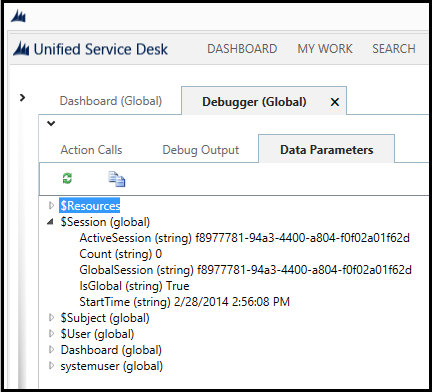

# Replacement parameters in Unified Service Desk

[!INCLUDE[cc-data-platform-banner](../includes/cc-data-platform-banner.md)]

Replacement parameters can be used throughout the application to pull data from data elements (called data parameters) captured during the execution of the application that augment and include the [!INCLUDE[pn_unified_service_desk](../includes/pn-unified-service-desk.md)] context. The context consists of name/value string pairs that change frequently as data is discovered from various ways while the application is used. Replacement parameters are used for a variety of tasks such as specifying URL query strings, generating script output in scriptlets, specifying search values for entity searches, Computer Telephone Integration (CTI), and specifying input for actions being called on other hosted controls. Replacement parameters are the key elements that enable a high degree of configuration or customization in [!INCLUDE[pn_unified_service_desk](../includes/pn-unified-service-desk.md)] without having to use the code.  
  
 For information on how you can use replacement parameters to configure your agent application, see [Use replacement parameters to configure Unified Service Desk](../unified-service-desk/use-replacement-parameters-configure-unified-service-desk.md).  
  
> [!NOTE]
>  Sometimes replacement parameter is used interchangeably with data parameter because replacement parameter essentially is the representation of a data parameter.  
  
<a name="ViewReplacementParameters"></a>   
## View the Replacement Parameters in Unified Service Desk  
 The Debugger control in the client application can be used to view the list of available replacement parameters at any given time.  
  
1. Start the [!INCLUDE[pn_unified_service_desk](../includes/pn-unified-service-desk.md)] client, and sign in to the Dynamics 365 instance where you have installed the sample packages.  
  
2. In the main screen of the [!INCLUDE[pn_unified_service_desk](../includes/pn-unified-service-desk.md)] client, click the down arrow next to the gear on the top-right corner, and select **Debug**. The Debugger appears.  
  
     
  
3. In the Debugger, click **Data Parameters** to view the replacement parameters.  
  
     
  
   A tree view is used to represent the available variables. When specifying the variable, specify the name at the root level, followed by a period (.), and then the name in the list. Here are some examples:  
  
- `[[$Session.IsGlobal]]`  
  
- `[[$User.fullname]]`  
  
  These values will change as the user interacts in the [!INCLUDE[pn_unified_service_desk](../includes/pn-unified-service-desk.md)] client. Action calls will pick up the current value and use in its parameter list, or wherever else it may be used. Any time the variables are updated, a **NotifyContextChange** event is fired in the base controls even if the [!INCLUDE[pn_unified_service_desk](../includes/pn-unified-service-desk.md)] context didn’t change itself. This allows features like the Session Lines to recheck the values of the replacement parameters to see if it needs to update its display.  
  
<a name="SystemReplacementParameters"></a>   
## System Replacement Parameters  
 System replacement parameters are the replacement parameters that are defined and populated by the system, and the names start with $ to keep them separate from the user-defined replacement parameters. For example, `$Global`. [!INCLUDE[pn_unified_service_desk](../includes/pn-unified-service-desk.md)] has following replacement parameters:  
  
-   [$Context](../unified-service-desk/replacement-parameters.md#Context)  
  
-   [$Debug](../unified-service-desk/replacement-parameters.md#Debug)  
  
-   [$Global](../unified-service-desk/replacement-parameters.md#Global)  
  
-   [$Panel](../unified-service-desk/replacement-parameters.md#Panel)  
  
-   [$Resources](../unified-service-desk/replacement-parameters.md#Resources)  
  
-   [$Return](../unified-service-desk/replacement-parameters.md#Return)  
  
-   [$Session](../unified-service-desk/replacement-parameters.md#Session)  
  
-   [$Settings](../unified-service-desk/replacement-parameters.md#Settings)  
  
-   [$Subject](../unified-service-desk/replacement-parameters.md#Subject)  
  
-   [$SystemParameters](#SystemParameters)  
  
-   [$User](../unified-service-desk/replacement-parameters.md#User)  
  
<a name="Context"></a>   
### $Context  
 This section contains the contents of the [!INCLUDE[pn_user_inteface_integration_uii](../includes/pn-user-interface-integration-uii.md)] session context, and provides a convenient way to use [!INCLUDE[pn_uii_acronym](../includes/pn-uii-acronym.md)] session context variables throughout the [!INCLUDE[pn_unified_service_desk](../includes/pn-unified-service-desk.md)]application.  
  
> [!NOTE]
>  The Global Manager hosted control provides an action that allows you to copy values from other replacement parameters into the context. This can be useful when transferring calls or saving the session for rehydration later. The context can be saved to the server in these instances using standard UII mechanisms.  
  
<a name="Debug"></a>   
### $Debug  
 This is a special replacement value used only within a Scriptlet to determine if it is being called by the debug window. Particularly when scriptlets are causing actions to be performed on the system, we test this parameter to determine if we should skip the block of code to avoid side effects when debugging. The following scriptlet would launch the Account hosted control and display the tab when the debug window is opened.  
  
```  
CRMGlobalManager.GetApp(“Account”);  
```  
  
 This is because the scripts are run in the current context to determine their values in the current state of the system. To avoid this side effect from occurring, do the following.  
  
```  
If ([[$Debug]]!= true) CRMGlobalManager.GetApp(“Account”);  
```  
  
 This will avoid the side effect and still provide useful information to the debugger.  
  
<a name="Global"></a>   
### $Global  
 This section is automatically added to show all options configured in Dataverse Options and their values. This makes Options easily accessible as they can be used to control execution or to control behaviors that were created in workflows or Action Calls. All the audit flags are automatically visible from this section.  
  
<a name="Panel"></a>   
### $Panel  
 The `$Panel` replacement parameter contains all the hosted controls and their current panel names as key-value pairs that have moved to another panel after you last started the [!INCLUDE[pn_unified_service_desk](../includes/pn-unified-service-desk.md)] client. The replacement parameter becomes available only if at least one hosted control has changed panels after you last started the [!INCLUDE[pn_unified_service_desk](../includes/pn-unified-service-desk.md)] client. All other hosted controls and their existing panels currently loaded in the agent desktop aren’t available in this replacement parameter.  
  
<a name="Resources"></a>   
### $Resources  
 This collection of replacement parameters is populated by the Global Manager with language identifiers. In the configuration of the Global Manager hosted control, you can specify various language resources. These resources take the form of .resx files but are uploaded into web resources as XML files. Upon loading of the application, [!INCLUDE[pn_unified_service_desk](../includes/pn-unified-service-desk.md)] will read the current language setting from Dataverse and then look for this language in the Global Manager language list. If the item is listed, the resource of language identifiers will be loaded into this $Resources collection.  
  
 Wherever you intended to provide language neutral text on the output, you can instead use the replacement parameters from the `$Resources` collection. For example, you may use the following for button text.  
  
```  
[[$Resources.MyButtonName]+]  
```  
  
 Depending on the selected language for the user, appropriate localized text will be used.  
  
 It is also important to note here that these replacement parameters, and therefore the .resx files that are loaded, may contain replacement parameter syntax itself. After `$Resources` values are replaced, they are rechecked for additional replacement parameters. In this way, even though you are providing language specific strings, you may substitute data from the rest of the application into this string as well.  
  
 For information about adding localized resources to configure [!INCLUDE[pn_unified_service_desk](../includes/pn-unified-service-desk.md)], see [Add multilanguage support for your agent applications](../unified-service-desk/add-multilanguage-support-agent-applications.md).  
  
<a name="Return"></a>   
### $Return  
 Some actions return a string value. This string value is placed into the $Return replacement parameter using the name of the action call. It will follow this pattern:  
  
```  
[[$Return.ActionCallName]]  
```  
  
 An example of this would be calling CreateEntity on Global Manager. This will create a record, and return the GUID of the new record. This new GUID will be in the `$Return` replacement parameter list and can be used as input to the next action.  
  
<a name="Session"></a>   
### $Session  
 The `$Session` section exposes useful variables needed by action calls such as the session count, whether the active session is global, currently active session ID. The `StartTime` value can be used for writing the start time to an activity. This section is populated automatically.  
  
<a name="Settings"></a>   
### $Settings  
 This section provides user settings that only apply to the current user. These settings are automatically loaded at startup, and may be read using an action call at runtime. These often include settings for theme selection of the user but may provide access to any user specific settings that the configurator wants to make available.  
  
 These user settings are defined in the **User Settings** area (**Settings** > **User Settings**) in Dataverse while configuring [!INCLUDE[pn_unified_service_desk](../includes/pn-unified-service-desk.md)].  
  
 These settings can be used like any other replacement parameter in the system. The Global Manager hosted control provides an action, [SaveSetting](../unified-service-desk/global-manager-hosted-control.md#SaveSetting), which will write user settings to the server, assuming the user has write access. This can be used to store user specific preferences such as theme selection and layouts.  
  
> [!NOTE]
>  The user settings can be saved to Dataverse server if the user has write access.  
  
<a name="Subject"></a>   
### $Subject  
 A useful capability in [!INCLUDE[pn_unified_service_desk](../includes/pn-unified-service-desk.md)] is to auto-populate the subject tree in a new case that is created on behalf of the user. Sometimes you’ll want to auto-populate the subject field but you need to know the correct values to use, which can change from system to system.  
  
 With this entry, you can refer to a specific subject when you are creating the case, by using the following replacement parameter.  
  
```  
[[$Subject.Default Subject.Id]][[$Subject.Default Subject.LogicalName]]  
```  
  
<a name="SystemParameters"></a>   
### $SystemParameters  
 This section contains a variable called `HighContrast` that displays whether high-contrast mode in Windows is enabled or not (true/false). You could use this variable to decide whether to enable normal custom colors or system colors (compliant with high-contrast setting) when you customize your theme in the client. [!INCLUDE[proc_more_information](../includes/proc-more-information.md)] [Customize themes in Unified Service Desk](../unified-service-desk/customize-themes-in-unified-service-desk.md )  
  
<a name="User"></a>   
### $User  
 This replacement parameter group is automatically populated with the contents of the current user’s record in the model-driven app. For example, if the administrator extends the system user entity in the model-driven app to include an agent id, the agent id will appear in this list. This can be used to configure special user settings.  
  
### See also  
 [Use replacement parameters to configure Unified Service Desk](../unified-service-desk/use-replacement-parameters-configure-unified-service-desk.md)   
 
 [Execute scripts using scriptlets in Unified Service Desk](../unified-service-desk/execute-scripts-using-scriptlets-unified-service-desk.md)   
 
 [Search data using entity searches in Unified Service Desk](../unified-service-desk/search-data-entity-searches.md) 
 
 [Learn to use Unified Service Desk](../unified-service-desk/learn-to-use-unified-service-desk.md)   
 
 [Global Manager (Hosted Control)](../unified-service-desk/global-manager-hosted-control.md)


[!INCLUDE[footer-include](../includes/footer-banner.md)]