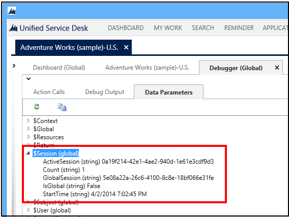
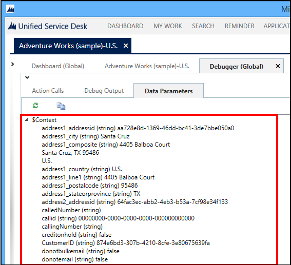
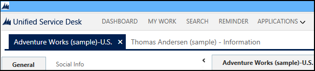
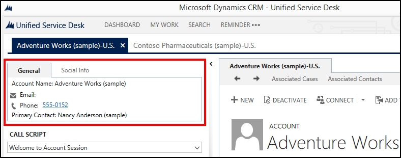

# Session management in Unified Service Desk

[!INCLUDE[cc-data-platform-banner](../includes/cc-data-platform-banner.md)]

Whenever you search for customer information in [!INCLUDE[pn_unified_service_desk](../includes/pn-unified-service-desk.md)], the system fetches the information from Microsoft Dataverse, and stores it in a session. The information about the session and the fetched customer record is stored in the session context. You can view information about the session and the session context in the **$Session** and **$Context** parameters in the **Debugger** hosted control.  
  
 Each session in the [!INCLUDE[pn_unified_service_desk](../includes/pn-unified-service-desk.md)] client is displayed in a tab in the main screen, and you can identify a session using the *session name* displayed on the tab. An area of the screen just below the tab displays information related to the customer. This section is called the *session overview* area, and can contain XAML markup that displays UI elements such as text boxes, buttons, or links. Both of these areas can display any information from either the session context or data from displayed windows, CTI search results, or entity searches that have executed.  
  
   
## Session and context information  
 Let us see how the session and context data is stored in [!INCLUDE[pn_unified_service_desk](../includes/pn-unified-service-desk.md)] when you search for customer information.  
  
1. Start the [!INCLUDE[pn_unified_service_desk](../includes/pn-unified-service-desk.md)] client application, and sign in to the Dynamics 365 instance.  
  
2. Click **Search** in the toolbar, and then click an account name to search for it.  
  
3. The customer information is displayed in a session tab. Open the **Debugger** hosted control by clicking the down arrow next to the settings option in the top-right corner, and selecting **Debug**.  
  
4. Click the **Data Parameters** tab, and expand **$Session** to see the current session information.  
  
     
  
5. Now, expand the **$Context** parameter to view information about the customer record such as the customer ID, address, and so on. You will also find information about the session.  
  
     
  
   
## Session name  
 A session name is the label text that is displayed on the tab; it helps identify the session to the agent.  
  
   
  
 In this example, there are two session tabs with the following session names: **Sidney Higa (sample)- Maintenance** and **Like some of our new products (sample)** – Information.  
  
 The first session tab is for the account, and the second session tab is for the case. You can define the format of the text for the session name for an entity using the **Session Lines** configuration (**Settings** > **Unified Service Desk** > **Session Lines**) in Dataverse. For more information, see [Configure the session tab name format](../unified-service-desk/configure-session-information.md#SessionName).  
  
   
## Session overview  
 Session overview entries are unique in the fact that more than one may display in a stacking fashion in the user interface (UI) area. Each session overview entry that has all replacement parameters successfully replaced will display in the output window. For example, the following two session overview entries are available for the Adventure Works (sample)-US session tab: **General** and **Social Info**.  
  
   
  
 These entries are not typically populated by a business user, however, a skilled business user may copy and paste existing entries and replace values that will meet their needs. This is because the entries are actually XAML markup often seen in [!INCLUDE[pn_MS_Silverlight_full](../includes/pn-ms-silverlight-full.md)] or [!INCLUDE[pn_ms_Windows_Presentation_Foundation](../includes/pn-ms-windows-presentation-foundation.md)] applications. They can be created with designer tools such as [!INCLUDE[pn_blend_for_visual_studio](../includes/pn-blend-for-visual-studio.md)] in a graphical fashion, or with a text editor. The XAML markup must be properly formatted for it to display correctly in [!INCLUDE[pn_unified_service_desk](../includes/pn-unified-service-desk.md)].  
  
 You can define the session overview information for an entity using the **Session Lines** configuration (**Settings** > **Unified Service Desk** > **Session Lines**) in Dataverse. For more information, see [Define session overview information](../unified-service-desk/configure-session-information.md#SessionOverview).  
  
### See also  
 [Configure session information](../unified-service-desk/configure-session-information.md)   
 [Session Lines (Hosted Control)](../unified-service-desk/session-lines-hosted-control.md)   
 [Session Tabs (Hosted Control)](../unified-service-desk/session-tabs-hosted-control.md)   
 [Debugger (Hosted Control)](../unified-service-desk/debugger-hosted-control.md)   
 [Walkthrough 4: Display a record in a session in your agent application](../unified-service-desk/walkthrough-display-dynamics-365-record-session-agent-application.md)   
 [Walkthrough 5: Display enhanced session information by displaying session name and overview data](../unified-service-desk/walkthrough-5-display-enhanced-session-information-displaying-session-name-overview-data.md)

[!INCLUDE[footer-include](../includes/footer-banner.md)]