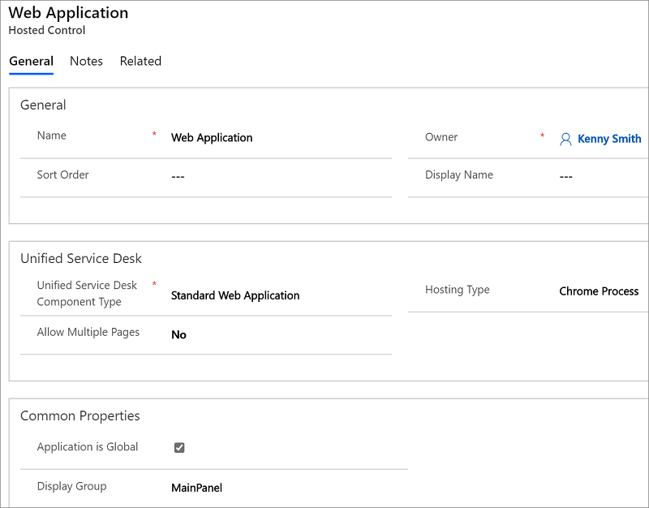

# Standard Web Application (Hosted Control)
The **Standard Web Application** hosted control type is similar to the **CRM Page** type except that it is intended to host non-model-driven pages, such as external web pages, and provides script injection for relevant features of external web pages. Like the **CRM Page** hosted control, these pages can be automated. The preferred method of automating is through [!INCLUDE[pn_JavaScript](../includes/pn-javascript.md)] injection including calling [!INCLUDE[pn_JavaScript](../includes/pn-javascript.md)] functions that are already defined in the page or manipulate the DOM. The `RunScript` action can also be used to obtain values from the page.  

> [!NOTE]
>  This hosted control type does not support the [!INCLUDE[pn_hosted_application_toolkit_hat](../includes/pn-hosted-application-toolkit-hat.md)], which facilitates the task of automating the UI of a hosted application. HAT consists of the data-driven adapters (DDA), descriptive bindings and automations (Windows workflows) to automate the applications. [!INCLUDE[proc_more_information](../includes/proc-more-information.md)] [Use UII automation adapter to interact with external and web applications](../unified-service-desk/use-uii-automation-adapter-interact-external-web-applications.md)  

   
## Create a Standard Web Application hosted control  
 While creating a new hosted control, the fields in the **New Hosted Control** screen vary based on the type of hosted control you want to create. This section provides information about the specific fields that are unique to the **Standard Web Application** hosted control type. For detailed information about creating a hosted control, see [Create or edit a hosted control](../unified-service-desk/create-edit-hosted-control.md).  

   

 In the **New Hosted Control** screen:  

- Under **Unified Service Desk** area, select **Standard Web Application** from the **Unified Service Desk Component Type** drop-down list.  

- From the **Allow Multiple Pages** drop-down list, select **Yes** to automatically create a drop-down list when a second URL is called or a window navigation rule directs a page to the tab. This will allow the user to quickly search between the pages that are attached to this control. If you select **No**, when [!INCLUDE[pn_unified_service_desk](../includes/pn-unified-service-desk.md)] receives a navigate action call or a page is routed to the tab, it will replace the page that is currently displayed and update the browser history.  

- The **Hosting Type** drop-down list specifies how you want this control to be hosted. You can choose **Chrome Process** default or **Internal WPF**. For more information, see [Select a hosting method for hosted controls](../unified-service-desk/select-hosting-method-controls.md).  

- Under the **Common Properties** area, select the **Application is Global** check box to set the hosted control as global. Global hosted controls can be displayed outside of a customer session. Controls like the agents’ dashboard, wall or search are common uses for global hosted controls. Global hosted controls do not have session-specific state so when you change sessions, these same global hosted controls remain. If the check box is not selected, the hosted control becomes session based. Session-based controls exist in the context of the customer session. If the user changes to another session, all the session pages from the previous session are hidden.  

- In the **Display Group** field, specify a panel where this hosted control will be displayed. For information about various panels available in [!INCLUDE[pn_unified_service_desk](../includes/pn-unified-service-desk.md)], see [Panels](../unified-service-desk/panels-panel-types-panel-layouts.md#Panels).  

   
## Predefined UII actions  
 These are the predefined UII actions available for this hosted control type.  

   
### Close  
 This action is used to close the hosted control.  

### FireEvent  
 Fires a user-defined event from this hosted control.  

|Parameter|Description|  
|---------------|-----------------|  
|name|Name of the user-defined event.|  

 All subsequent name=value pairs become the parameters to the event. For more information about creating a user-defined event, see [Create a user-defined event](../unified-service-desk/create-user-defined-event.md).  

### GoBack  
 This action is equivalent to selecting the back button on the browser instance.  

### GoForward  
 This action is equivalent to selecting the forward button on the browser instance.  

### GoHome  
 This action goes to the initial URL specified for this browser instance.  

   
### MoveToPanel  
 This action is used to move hosted controls between panels at runtime.  

|Parameter|Description|  
|---------------|-----------------|  
|app|Name of the hosted control to be moved.|  
|panel|Target panel for the hosted control.|  

### Navigate  
 This action is used to navigate to a url.  

|     Parameter     |                                                                                                                                                                                                                                      Description                                                                                                                                                                                                                                      |
|-------------------|---------------------------------------------------------------------------------------------------------------------------------------------------------------------------------------------------------------------------------------------------------------------------------------------------------------------------------------------------------------------------------------------------------------------------------------------------------------------------------------|
|        url        |                                                                                                                                                                                                                The URL to navigate to. This is a mandatory parameter.                                                                                                                                                                                                                 |
|      Noscan       |                                                                                                                                                                                          If this parameter is supplied and **True**, the data parameters will not be captured from the page.                                                                                                                                                                                          |
|  HideCommandBar   |                                                                                                                                                                                If this parameter is supplied and **True**, the inner frame will be displayed instead of loading the page command bar.                                                                                                                                                                                 |
| HideNavigationBar |                                                                                                                                                                                      If this parameter is supplied and **True**, the navigation panel on the target web page won't be displayed.                                                                                                                                                                                      |
|       Frame       |                                                                                                                                                                        When frames exist on the page, this parameter would specify the name of the frame to navigate, rather than navigating the main window.                                                                                                                                                                         |
|     postdata      |                 Data that is sent to the server as part of a HTTPPOST transaction. A POST transaction is typically used to send data gathered by an HTML page. In [!INCLUDE[pn_unified_service_desk](../includes/pn-unified-service-desk.md)], this data can be received from any event triggered using "<https://event/?>". Example: `[[postdata]+]`   Alternatively, the data can be passed as encoded string with its header type in the intended format.                 |
|      header       | A string value that contains additional HTTP headers to send to the server. When the `postdata` parameter is used in the `Navigate` action, you should also specify appropriate value for the `header` parameter. Example: `Content-Type:application/x-www-form-urlencoded`   If a [!INCLUDE[pn_unified_service_desk](../includes/pn-unified-service-desk.md)]POST event triggers the `Navigate` action, the default value of this parameter should be `header=[[header]+]` |

### New_CRM_Page  
 Creates a page for creating a new record of the entity specified, and treats the page as a popup from the specified hosted control. The window navigation rules are evaluated to determine the location where the page to create the entity record is displayed.  

|Parameter|Description|  
|---------------|-----------------|  
|LogicalName|The logical name of the entity for creating a new instance.|  

> [!NOTE]
>  The rest of the parameters should consist of name=value pairs. These are the additional pre-populated values in the form for creating a new record for the specified entity. For more information about using this action, see step 4 in [Walkthrough 7: Configure agent scripting in your agent application](../unified-service-desk/walkthrough-configure-agent-scripting-agent-application.md).  

### Open_CRM_Page  
 Opens an existing instance of the entity specified and identified by the ID, and treats the page as a popup from the specified hosted control. The window navigation rules are evaluated to determine the location where the popup should be displayed.  

|Parameter|Description|  
|---------------|-----------------|  
|LogicalName|The logical name of the entity to open.|  
|id|The ID of the entity record to open.|  

### Popup  
 Pops up a URL from the hosted control and runs the window navigation rules against it for routing the popup to the appropriate location.  

|Parameter|Description|  
|---------------|-----------------|  
|url|Routes a popup from this hosted control using this URL as if it were a popup requested from the displayed control.|  
|frame|The frame from which this popup originated.|  

   
### RealignWindow  
[!INCLUDE[cc_RealignWindow_Action](../includes/cc-realignwindow-action.md)]

### RunScript  
 This action injects JavaScript into the main frame of the application. You should avoid using the Common Data Service platform client SDK calls with this action; instead, use the **RunXrmCommand** action.  

|Parameter|Description|  
|---------------|-----------------|  
||The data parameter is the JavaScript that will be injected into the form. **Note:**  The replacement parameters can be used in the script, and they will be replaced before the script is executed.|  

   
### SetSize  
 This action explicitly sets the width and height of the hosted control. This is particularly useful when using "auto" in your panel layouts.  

|Parameter|Description|  
|---------------|-----------------|  
|width|The width of the hosted control.|  
|height|The height of the hosted control.|  

### WaitForComplete  
 This action can be used to block the processing until the URL finishes loading.  

> [!NOTE]
>  Some web pages, particularly the model-driven appo pages, have multiple frames. This action waits for only the main frame to complete.  

|Parameter|Description|  
|---------------|-----------------|  
|Milliseconds|Optional parameter to indicate how long, in milliseconds, to wait to timeout.|  

   
## Predefined events  
 The following predefined events are associated with this hosted control type.  

### BrowserDocumentComplete  
 Occurs when the page has finished loading. On a **CRM Page** type of hosted control, this event occurs after the data has been saved to the replacement parameter list. This event occurs only once, even though multiple frames will have individually fired their **BrowserDocumentComplete** events.  

|Parameter|Description|  
|---------------|-----------------|  
|url|The URL of the page that has finished loading.|  

### PopupRouted  
 Occurs after a popup has been routed by the system.  

|Parameter|Description|  
|---------------|-----------------|  
|url|The URL of the popup that was routed.|  

### See also  
 [UII actions](../unified-service-desk/uii-actions.md)   
 [Events](../unified-service-desk/events.md)   
 [View predefined actions and events for a hosted control](../unified-service-desk/view-predefined-actions-events-hosted-control.md)   
 [Create or edit a hosted control](../unified-service-desk/create-edit-hosted-control.md)   
 [Walkthrough 2: Display an external webpage in your agent application](../unified-service-desk/walkthrough-2-display-an-external-webpage-in-your-agent-application.md)   
 [Hosted control types and action/event reference](../unified-service-desk/hosted-control-types-action-event-reference.md)
