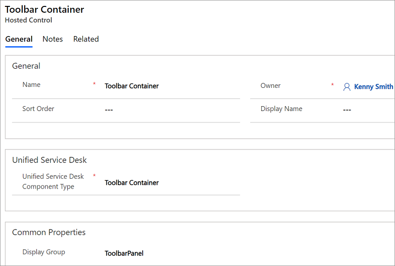

# Toolbar Container (Hosted Control)
Use **Toolbar Container** type of hosted control to create a toolbar in your application, which can display a list of buttons with images and text that can execute actions. You can create multiple Toolbar Container type of hosted controls, and place them on any panel in the application. For more information about working with toolbars, see [Configure toolbars in your application](../unified-service-desk/configure-toolbars-application.md).

## Create a Toolbar Container hosted control

 While creating a new hosted control, the fields in the **New Hosted Control** screen vary based on the type of hosted control you want to create. This section provides information about the specific fields that are unique to the **Toolbar Container** hosted control type. For detailed information about creating a hosted control, see [Create or edit a hosted control](../unified-service-desk/create-edit-hosted-control.md).

 

 In the **New Hosted Control** screen:

- From the **Unified Service Desk Component Type** drop-down list, select **Toolbar Container**.

- The **Display Group** field displays the panel where this hosted control will be displayed. **ToolbarPanel** is the most common for this hosted control type. For information about various panels available in [!INCLUDE[pn_unified_service_desk](../includes/pn-unified-service-desk.md)], see [Panels](../unified-service-desk/panels-panel-types-panel-layouts.md#Panels).

## Predefined UII actions
 These are the predefined actions for this hosted control type.

### FireEvent
 Fires a user-defined event from this hosted control.

|Parameter|Description|
|---------------|-----------------|
|name|Name of the user-defined event.|

 All subsequent name=value pairs become the parameters to the event. For more information about creating a user-defined event, see [Create a user-defined event](../unified-service-desk/create-user-defined-event.md).

### HideToolbar
 This action explicitly hides a toolbar from the user.

|Parameter|Description|
|---------------|-----------------|
||Specify the toolbar name to hide in the **Data** field.|

### RealignWindow
[!INCLUDE[cc_RealignWindow_Action](../includes/cc-realignwindow-action.md)]

### ShowToolbar
 This action explicitly shows a toolbar to the user.

|Parameter|Description|
|---------------|-----------------|
||Specify the toolbar name to show in the **Data** field.|

## Predefined events
 There aren’t any predefined events available for this hosted control type.

### See also
 [Configure toolbars in your application](../unified-service-desk/configure-toolbars-application.md)
 [UII actions](../unified-service-desk/uii-actions.md)
 [Events](../unified-service-desk/events.md)
 [Create or edit a hosted control](../unified-service-desk/create-edit-hosted-control.md)
 [Unified Service Desk Configuration Walkthroughs](../unified-service-desk/unified-service-desk-configuration-walkthroughs.md)
 [Hosted control types and action/event reference](../unified-service-desk/hosted-control-types-action-event-reference.md)
 [Administration Guide for Unified Service Desk for Microsoft Dynamics CRM](/previous-versions/dynamicsusd-2/administrators-guide/dn499779(v=usd.2))

[!INCLUDE[footer-include](../includes/footer-banner.md)]