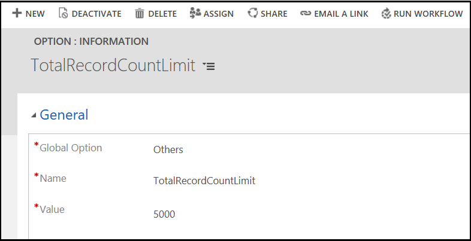

# Understand Unified Service Desk concepts

[!INCLUDE[pn_unified_service_desk](../includes/pn-unified-service-desk.md)] provides a configurable and extensible framework for quickly building applications for call centers so that agents can get a unified view of the customer data stored in [!INCLUDE[pn_microsoftcrm](../includes/pn-microsoftcrm.md)] Customer Engagement instance and external applications. You can aggregate customer information from different areas in [!INCLUDE[pn_crm_shortest](../includes/pn-crm-shortest.md)] Customer Engagement and external applications into an integrated desktop that provides a 360° view of the customer interactions. This gives your customer service agent immediate access to business critical information so they can effectively engage with customers and address queries and issues. [!INCLUDE[proc_more_information](../includes/proc-more-information.md)] [What makes up Unified Service Desk](admin/overview-unified-service-desk.md#USD) and [Call center challenges and how Unified Service Desk can help](admin/call-center-challenges-how-unified-service-desk-can-help.md) in the [!INCLUDE[pn_unified_service_desk](../includes/pn-unified-service-desk.md)] Administration Guide.  
  
 To develop an agent application using [!INCLUDE[pn_unified_service_desk](../includes/pn-unified-service-desk.md)], you can directly configure the  [!INCLUDE[pn_unified_service_desk](../includes/pn-unified-service-desk.md)] entities in your Customer Engagement instance, which does not require you to write code. To integrate with external applications, you can write code to extend [!INCLUDE[pn_unified_service_desk](../includes/pn-unified-service-desk.md)].  
  
## Configure Unified Service Desk entities

Use [!INCLUDE[pn_dynamics_crm](../includes/pn-dynamics-crm.md)] or [!INCLUDE[proc_crm_for_outlook](../includes/proc-crm-for-outlook.md)] to configure the [!INCLUDE[pn_unified_service_desk](../includes/pn-unified-service-desk.md)] entities that are created in your [!INCLUDE[pn_crm_shortest](../includes/pn-crm-shortest.md)] instance when you deploy [!INCLUDE[pn_unified_service_desk](../includes/pn-unified-service-desk.md)]. [!INCLUDE[pn_unified_service_desk](../includes/pn-unified-service-desk.md)] provides a highly configurable interface that can be used to dynamically display controls and information based on the context of the active operation, which eventually defines the user interface and functionalities in your agent application. Creating or developing agent applications by configuring the [!INCLUDE[pn_unified_service_desk](../includes/pn-unified-service-desk.md)] entities in [!INCLUDE[pn_crm_shortest](../includes/pn-crm-shortest.md)] doesn’t require you to write code, which reduces the lead time to develop a highly customized agent application per your organization requirements. This is the preferred way if you have to primarily deal with customer data available in [!INCLUDE[pn_crm_shortest](../includes/pn-crm-shortest.md)].

> [!Note]
> If you are on [!INCLUDE[pn-unified-service-desk-3-1](../includes/pn-unified-service-desk-3-1.md)] or lower versions, [!INCLUDE[pn_unified_service_desk](../includes/pn-unified-service-desk.md)] client application loads a maximum of 5000 records for any [!INCLUDE[pn_unified_service_desk](../includes/pn-unified-service-desk.md)] entities that you have configured and deployed in [!INCLUDE[pn_crm_shortest](../includes/pn-crm-shortest.md)] instance.  
Example: You have configured 5105 answer records in **Agent Scripts** entity type. When you want to view these answer records, [!INCLUDE[pn_unified_service_desk](../includes/pn-unified-service-desk.md)] client application loads a maximum of 5000 record answers. The client application does not load the remaining 105 answer records even though you have configured answer records. 

`TotalRecordCountLimit` is a UII option introduced in [!INCLUDE[pn-unified-service-desk-3-2](../includes/pn-unified-service-desk-3-2.md)]. This value is for [!INCLUDE[pn_unified_service_desk](../includes/pn-unified-service-desk.md)] to determine the batch size while fetching entity records from [!INCLUDE[pn_crm_shortest](../includes/pn-crm-shortest.md)] instance. The default value of the `TotalRecordCountLimit` in [!INCLUDE[pn_unified_service_desk](../includes/pn-unified-service-desk.md)] and in MSCRM\_CONFIG database is 5000. The `TotalRecordCountLimit` value must be always same as the value in MSCRM\_CONFIG database. You can change the default value in [!INCLUDE[pn_unified_service_desk](../includes/pn-unified-service-desk.md)] only when CRM server administrator modifies the value in MSCRM\_CONFIG database.

> [!Note]
> - It is highly recommended that you do not change the default `TotalRecordCountLimit` value in UII option of Unified Service Desk unless there is a change of value in MSCRM_CONFIG database.
> - `TotalRecordCountLimit` value must be equal to the value in MSCRM\_CONFIG database.

> [!Warning]
> If you change the default UII option value to any value other than MSCRM\_CONFIG database value, [!INCLUDE[pn_unified_service_desk](../includes/pn-unified-service-desk.md)] client application may not fetch the actual entity records.

A system administrator must configure the option on **Active UII Options** page and set the value.

To change the **TotalRecordCountLimit** timeout value:

1. Sign in to [!INCLUDE[pn_microsoftcrm](../includes/pn-microsoftcrm.md)].

2. [!INCLUDE[proc_settings_usd](../includes/proc-settings-usd.md)]

3. Choose **Options**.  

4. click **New** on the **Active UII Options** page.

5. Choose **Others** for the **Global Option** field.

6. Type **TotalRecordCountLimit** for the **Name** field.

7. Type **5000** for the **Value** field.

8. Click **Save**.

[!INCLUDE[proc_more_information](../includes/proc-more-information.md)] [Manage Options for Unified Service Desk](../unified-service-desk/admin/manage-options-unified-service-desk.md)

*Target audience*: System administrator or system customizer who has experience working with different configurations in [!INCLUDE[pn_crm_shortest](../includes/pn-crm-shortest.md)], analyzing the results, and improving or changing the configurations in an iterative manner until the desired functionality and user experience is achieved.

To get started with configuring [!INCLUDE[pn_unified_service_desk](../includes/pn-unified-service-desk.md)], see [Core concepts for configuring Unified Service Desk](../unified-service-desk/core-concepts-for-configuring-unified-service-desk.md).  
  
## Extend Unified Service Desk to integrate with other applications

[!INCLUDE[pn_unified_service_desk](../includes/pn-unified-service-desk.md)] is built using the [!INCLUDE[pn_user_inteface_integration_uii](../includes/pn-user-interface-integration-uii.md)] framework, which enables you to build and deploy composite agent applications that can provide unified access to customer information in [!INCLUDE[pn_crm_shortest](../includes/pn-crm-shortest.md)] and external systems. Also, the [!INCLUDE[pn_computer_telephony_integration_cti](../includes/pn-computer-telephony-integration-cti.md)] framework of [!INCLUDE[pn_uii_acronym](../includes/pn-uii-acronym.md)] enables organizations to build adapters to connect [!INCLUDE[pn_unified_service_desk](../includes/pn-unified-service-desk.md)] with their existing [!INCLUDE[pn_cti_acronym](../includes/pn-cti-acronym.md)] infrastructure to support customer communication in agent desktops over various channels such as chat, email, or telephone. To integrate with external applications, you’ll have to extend [!INCLUDE[pn_unified_service_desk](../includes/pn-unified-service-desk.md)] by writing code. [!INCLUDE[pn_unified_service_desk](../includes/pn-unified-service-desk.md)] provides you with [!INCLUDE[pn_Visual_Studio](../includes/pn-visual-studio.md)] project templates that you can use to create the modules and applications so you can integrate and interact with data in external applications.  
  
*Target audience*:   Software developer who has experience in creating applications/solutions using [!INCLUDE[pn_NET_Framework](../includes/pn-net-framework.md)], [!INCLUDE[pn_ms_Windows_Presentation_Foundation](../includes/pn-ms-windows-presentation-foundation.md)], XAML, and [!INCLUDE[pn_Java](../includes/pn-java.md)].  

To get started with extending [!INCLUDE[pn_unified_service_desk](../includes/pn-unified-service-desk.md)], see [Unified Service Desk and the UII framework](../unified-service-desk/unified-service-desk-uii-framework.md).
