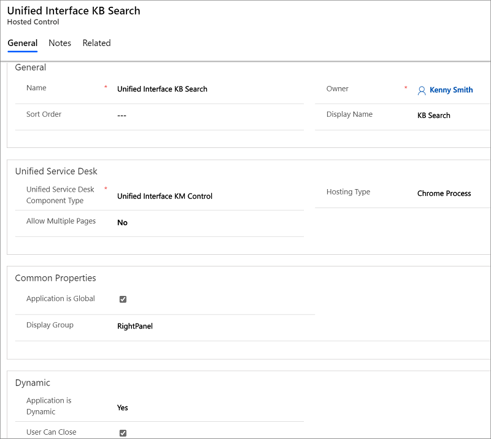

# Unified Interface KM Control (Hosted Control)

[!INCLUDE[cc-data-platform-banner](../includes/cc-data-platform-banner.md)]

Use the **Unified Interface KM Control** type of hosted control to display knowledge base articles in your agent application. Using the new hosted control, your service agents can search for articles, associate or disassociate an article with a case, copy a link to an article, and send it through email or in chat without having to switch applications. [!INCLUDE[proc_more_information](../includes/proc-more-information.md)] [Use knowledge for effective customer engagement](../unified-service-desk/use-dynamics-365-knowledge-effective-customer-engagement.md) and [Configure Unified Service Desk to use model-driven apps](../unified-service-desk/configure-unified-service-desk-use-dynamics-365-knowledge.md)

> [!NOTE]
> The Unified Interface KM Control supports all search techniques available in the model-driven apps except the **Relevance Search**. More information: [Relevance search for knowledge management](https://docs.microsoft.com/business-applications-release-notes/October18/service/customer-service-core-release-notes/relevance-search-for-knowledge-management)

   
## Create a KM Control hosted control  
 While creating a new hosted control, the fields in the **New Hosted Control** screen vary based on the type of hosted control you want to create. This section provides information about the specific fields that are unique to the **Unified Interface KM Control** hosted control type. For detailed information about creating a hosted control, see [Create or edit a hosted control](../unified-service-desk/create-edit-hosted-control.md).  

   

 In the **New Hosted Control** screen:

- Under **Unified Service Desk** area, select **Unified Interface KM Control** from the **Unified Service Desk Component Type** drop-down list.  

- The **Allow Multiple Pages** drop-down list is not supported for this hosted control type.  

- The **Hosting Type** is **Chrome Process**. For more information, see [Select a hosting method for hosted controls](../unified-service-desk/select-hosting-method-controls.md).  

- Under the **Common Properties** area, select the **Application is Global** check box to set the hosted control as global. Global hosted controls can be displayed outside of a customer session. Controls like the agents’ dashboard, wall or search are common uses for global hosted controls. Global hosted controls do not have session-specific state so when you change sessions, these same global hosted controls remain. If the check box is not selected, the hosted control becomes session based. Session-based controls exist in the context of the customer session. If the user changes to another session, all the session pages from the previous session are hidden.  

- The **Display Group** field displays the panel where this hosted control will be displayed. In the knowledge management package, the Unified Interface KM Control is displayed in the **RightPanel**; however, you can choose to display it in the **LeftPanel** or **MainPanel** as per your requirement. For information about various panels available in [!INCLUDE[pn_unified_service_desk](../includes/pn-unified-service-desk.md)], see [Panels, panel types, and panel layouts in Unified Service Desk](../unified-service-desk/panels-panel-types-panel-layouts.md).  

For information about other **General** fields, see [Create or edit a hosted control](../unified-service-desk/create-edit-hosted-control.md).  

   
## Predefined UII actions  
 These are the predefined actions for this hosted control type.  

   
### Associate  
 Associates a knowledge base record with the parent entity record in **Unified Interface KM Control**.  

|     Parameter     | Description |
|-------------------|------------------|
|  entitytypename   | The logical name of the parent entity to associate the knowledge base record to. For example: `entitytypename=incident`|
|     recordid      | The ID of the parent entity record to associate the knowledge base record to.|
|  articleuniqueid  | The unique ID of the article in that you want to associate. For example: `articleuniqueid=7924/8112/Article/41`|
|   articletitle    |  A string value representing article's title that you want to associate. For example: `articletitle=Diffused Sunlight and Weather Conditions` |
| articlepublicurl  | The public URL of the article that you want to associate. If you are using native Microsoft Dataverse knowledge base, the articles should have already been published to an external portal (select **Use an external portal** in the **Knowledge Base management Settings** dialog box in Dataverse) so that you can use the article URL in this parameter.   For example: `articlepublicurl=https://support.microsoft.com/kb/{kbnum}` |

   
### Close  
 Closes the **Unified Interface KM Control** hosted control.  

   
### Disassociate  
 Disassociates a knowledge base record, which is already associated to the parent entity record in **Unified Interface KM Control**.  

|Parameter|Description|  
|---------------|-----------------|  
|`articleuniqueid`|The unique ID of the article that you want to disassociate. For example: `articleuniqueid=7924/8112/Article/41`|  
|`relatedentityrecordid`|The ID of the parent entity record with which the knowledge base record is associated.|  
|`entityname`|The logical name of the parent entity to which the knowledge base record is associated. For example: `entitytypename=incident`|  

### FireEvent  
 Fires a user-defined event from the **Unified Interface KM Control** hosted control.  

|Parameter|Description|  
|---------------|-----------------|  
|`name`|Name of the user-defined event.|  

 All subsequent name=value pairs become the parameters to the event. For more information about creating a user-defined event, see [Create a user-defined event](../unified-service-desk/create-user-defined-event.md).  

   
### MoveToPanel  
 Moves the hosted control to the specified panel in [!INCLUDE[pn_unified_service_desk](../includes/pn-unified-service-desk.md)] at runtime.  

|Parameter|Description|  
|---------------|-----------------|  
|`app`|Name of the hosted control to be moved.|  
|`panel`|Name of the target panel to move the hosted control to.|  

### Popup  
 Pops up a URL from the hosted control, and runs the window navigation rules against it for routing the popup to the appropriate location.  

|Parameter|Description|  
|---------------|-----------------|  
|`url`|Routes a popup from the hosted control using this URL as if it were a popup requested form the displayed control.|  
|`frame`|The frame from which the popup originated.|  

   
### RealignWindow  
[!INCLUDE[cc_RealignWindow_Action](../includes/cc-realignwindow-action.md)]

   
### Search  
 Searches records in the **Unified Interface KM Control** by passing search string as parameter.  

| Parameter  | Description |
|------------|------------------------|
|   query    | A string value to be searched in the hosted control. For example: `query=contoso`. This will fetch all the knowledge articles from Dataverse that have names starting with the word "contoso". |
|  results   | An integer value to indicate the number of search results to be displayed in the hosted control. For example, specifying `results=5` will display 5 search results in the hosted control. If no value or a wrong value is provided for this data parameter, then the default value (10) will be used. The maximum value allowed for this data parameter is 20. |
|   filter   | An integer value to indicate the knowledge base article type to be displayed in the hosted control:   -   `0`: Draft -   `1`: Approved -   `3`: Published   For example, specify `filter=3` to display only published knowledge base articles.   If no value or a wrong value is provided, then the default value (3) will be used. |
| blockClick | An integer value to indicate whether to block displaying the content inline when a search result is clicked in the hosted control. Set it to `0` to open the content inline when clicked; set it `1` to block opening the content inline. For example: `blocked=1`   If no value or a wrong value is provided, then the default value (0) will be used. If you have the set the value to 1 to block the content, the [ResultOpen](../unified-service-desk/km-control-hosted-control.md#ResultOpen) event will still be fired. |
|    sort    | An integer value to indicate the sorting options for the knowledge base articles in the search result:   -   `1`: Relevance (default) -   `2`: Rating -   `3`: Number of views -   `4`: Last modified date (oldest first) -   `5`: Last modified date (newest first)   For example, specify `sort=2` to sort the articles based on rating.   If no value or a wrong value is provided, then the default value (1) will be used for the data parameter. |

   
### SetArticleContext  
 Attaches data to the current knowledge base article in **Unified Interface KM Control**.  

|Parameter|Description|  
|---------------|-----------------|  
|`articleapplication`|Name of the hosted control where the knowledge base article will be displayed.|  
|`articledata`|An article record object value passed from the [ResultOpen](../unified-service-desk/km-control-hosted-control.md#ResultOpen) event.|  

   
### SetSearchProps  
 Enables different type of filters to search for knowledge base articles in **Unified Interface KM Control**.  

|Parameter|Description|  
|---------------|-----------------|  
|`showFilter`|Indicates whether to enable the article type filter for searching knowledge base articles. Set it `0` to hide the filter and `1` to display the filter. For example: `showFilter=1`.   If no value or a wrong value is provided, then default value (0) will be used.|  
|`showLang`|Indicates whether to enable the language filter for searching knowledge base articles. Set it `0` to hide the filter and `1` to display the filter. For example: `showLang=1`.   If no value or a wrong value is provided, then default value (0) will be used.|

   
### SetSize  
 Sets the height and width of the hosted control. This is particularly useful when using "auto" in your panel layouts.  

|Parameter|Description|  
|---------------|-----------------|  
|`width`|The width of the hosted control.|  
|`height`|The height of the hosted control.|  

### SetUserCanClose  
 Enables the user to close the hosted control by clicking the X icon at the top-right corner of the hosted control tab.  

|Parameter|Description|  
|---------------|-----------------|  
|`UserCanClose`|Set this to `true` to enable the user to close the hosted control. Otherwise, set `false`.|  

   
## Predefined events  
 The following predefined events are associated with this hosted control type.  

### PopupRouted  
 Occurs after a popup has been routed by the system.  

|Parameter|Description|  
|---------------|-----------------|  
|`url`|The URL of the popup that was routed.|  

   
### ResultOpen  
 Occurs when a search result is opened for reading content in **Unified Interface KM Control**.  

|Parameter|Description|  
|---------------|-----------------|  
|`postdata`|The formdata object containing a set of key/value pairs representing form fields and their values for a knowledge article.|  

   
### SearchComplete  
 Occurs after the knowledge base article search is complete, and the search results have loaded in the hosted control.  

### SelectionChange  
 Occurs when a result is selected in **Unified Interface KM Control**.  

|Parameter|Description|  
|---------------|-----------------|  
|`postdata`|The formdata object containing a set of key/value pairs representing form fields and their values for a knowledge article.|  

### See also
 
 [Hosted control types, action, and event reference](../unified-service-desk/hosted-control-types-action-event-reference.md)

[!INCLUDE[footer-include](../includes/footer-banner.md)]