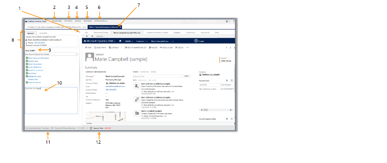

---
<<<<<<< HEAD
title: "Unified Service Desk for  Dynamics 365 2013 SP1 with product updates package | MicrosoftDocs"
=======
title: "Unified Service Desk for Dynamics CRM 2013 SP1 with product updates package | MicrosoftDocs"
>>>>>>> refs/remotes/origin/migration-july-17
ms.custom: ""
ms.date: "2016-11-01"
ms.reviewer: ""
ms.service: "crm-online"
ms.suite: ""
ms.tgt_pltfrm: ""
ms.topic: "article"
applies_to: 
  - "Dynamics 365 (online)"
  - "Dynamics 365 (on-premises)"
  - "Dynamics CRM 2013"
  - "Dynamics CRM 2015"
  - "Dynamics CRM 2016"
  - "Dynamics CRM Online"
ms.assetid: 6386013b-4e32-4fdb-9ae7-300dad955871
caps.latest.revision: 18
author: "Mattp123"
ms.author: "matp"
manager: "brycho"
---
# Unified Service Desk for Dynamics CRM 2013 SP1 with product updates package overview
[!INCLUDE[pn_unified_service_desk](../includes/pn-unified-service-desk.md)] is a desktop application that helps your customer service agents provide phone, email, chat, and social media support to your customers. It provides a configurable framework to quickly build an agent desktop application that’s integrated with [!INCLUDE[pn_microsoftcrm](../includes/pn-microsoftcrm.md)]. With [!INCLUDE[pn_unified_service_desk](../includes/pn-unified-service-desk.md)] you can quickly make a customized agent desktop application by leveraging the [!INCLUDE[pn_user_interface_integration](../includes/pn-user-interface-integration.md)] framework.  
  
 With the [!INCLUDE[pn_unified_service_desk](../includes/pn-unified-service-desk.md)] for [!INCLUDE[pn_crm_2013_sp](../includes/pn-crm-2013-sp.md)] with product updates sample application package, the following components are installed:  
  
-   User Interface Integration Solution  
  
-   Unified Service Desk Solution  
  
-   Customizations for this package  
  
-   Data required for [!INCLUDE[pn_microsoftcrm](../includes/pn-microsoftcrm.md)] and customizations  
  
-   KPI Custom Control  
  
-   Customer Information System  
  
 This package automatically populates sample data for the new features introduced through product updates, such as:  
  
-   Entitlements  
  
-   Service level agreements (SLAs)  
  
-   Routing rules  
  
-   Automatic case creation rules  
  
-   Customer service schedule  
  
> [!IMPORTANT]
>  The sample applications are not supported for production use.  
  
 For more information on how to set up and administer [!INCLUDE[pn_unified_service_desk](../includes/pn-unified-service-desk.md)], see the [Unified Service Desk Administration guide](https://technet.microsoft.com/library/dn499779.aspx)  
  
 Here’s what you’ll see when you install [!INCLUDE[pn_unified_service_desk](../includes/pn-unified-service-desk.md)]:  
  
1. **Left Nav**: Opens the left navigation area that you can open or collapse.  
  
2. **Dashboards**: Opens the Dynamics 365 customer service dashboard.  
  
3. **My Work:** Shows a list of all the active cases assigned to a service rep.  
  
4. **search**: Opens search for navigating through various entities. For this package you can search for accounts, contacts, cases, activities, and queues.  
  
5. **Reminder**: Shows a list of your activity reminders.  
  
6. **Applications**: Shows custom applications for this package. When you’re working on a customer session, this shows global applications and session-specific applications.  
  
7. **Session tabs**: When you have multiple customer sessions open, each tab shows a different session. The tabs make it easy for an agent to work on multiple customer cases.  
  
8. **Session overview**: Shows relevant information about the customer.  
  
9. **Call Script**: Shows call scripts the service agent can use when they’re working on a case. Scripts help guide the agent by giving them step-by-step instructions on how to handle the case.  
  
10. **Notes**: This is the area to record notes regarding the case.  
  
11. **KPI Control**: Shows Key Performance Indicators (KPIs) like Average Case Resolution Time, Number of Cases Resolved, and Customer Satisfaction.  
  
12. **Session timer**: Shows how long a service rep has been on the session.  
  
   
  
## View your activities  
 From the toolbar, click **My Work** to see all of your activities.  
  
## Create a case  
  
1.  To look up the contact information, from the toolbar, click **search**.  
  
2.  In the **search** field, enter the contact information.  
  
3.  When you find the contact information, click the record to open a new session.  
  
4.  In the left nav **Call Script** area, use the list of call scripts to guide you through the support case. When you click a call script, a green check mark displays to indicate that the action has been performed.  
  
5.  Enter your case notes in the **Notes** area. To attach your notes to the case, click **Update notes** from call scripts.  
  
## Locate a customer  
 When you’re working on a customer session, if you want to find your customer’s location, use [!INCLUDE[pn_bing_maps](../includes/pn-bing-maps.md)].  
  
 From the toolbar click or tap, **Applications** > **Locate the customer**. Then use [!INCLUDE[pn_bing_maps](../includes/pn-bing-maps.md)] to look up the customer’s location. This will open [!INCLUDE[pn_bing_maps](../includes/pn-bing-maps.md)] and automatically populate the customer’s address in the **search** field.  
  
## search for solutions  
 To help resolve the case, you can use knowledge articles or Bing search to find a solution.  
  
1.  From the **Call script** area, click the **search for solutions** call script.  
  
2.  Then click one of the following:  
  
    - **KB articles**: Use the search to find articles that can help you resolve the case.  
  
    - **Bing search**: The title automatically populates in the Bing search box.  
  
## Send an email  
 From the list of call scripts, click the **Send email** call script, and then select a template that automatically populates the body of the email.  
  
## Resolve a case  
 To resolve a case, from the **Call Script** area, click the **Resolve Case** call script.  
  
 When the case is resolved, the time spent on the case gets updated in the **Actual Service Unit** field of the case form. The KPI control is also updated with the number of cases and average handling time.  
  
### See also  
 [Unified Service Desk Administration guide](https://technet.microsoft.com/library/dn499779.aspx)