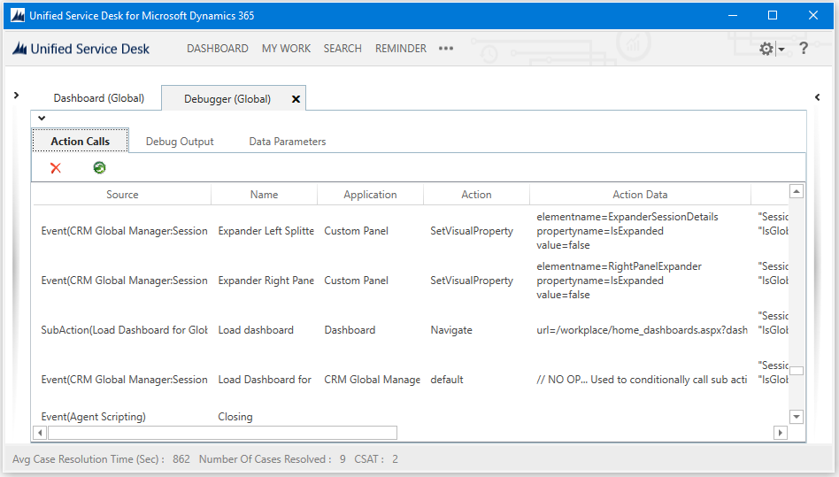
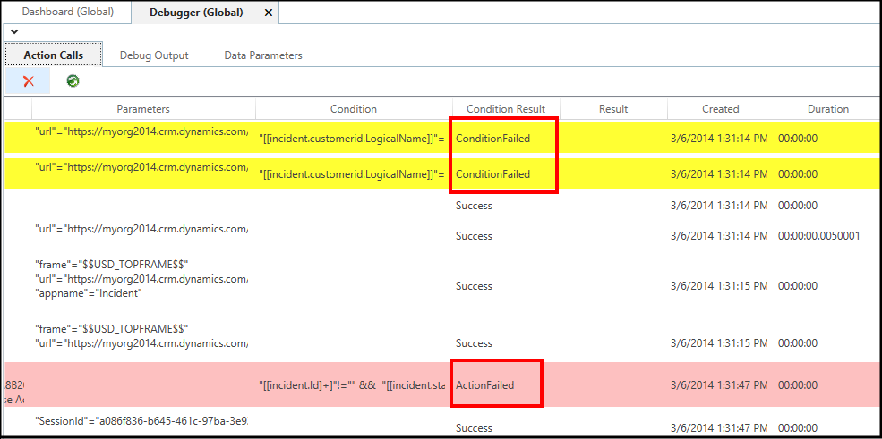
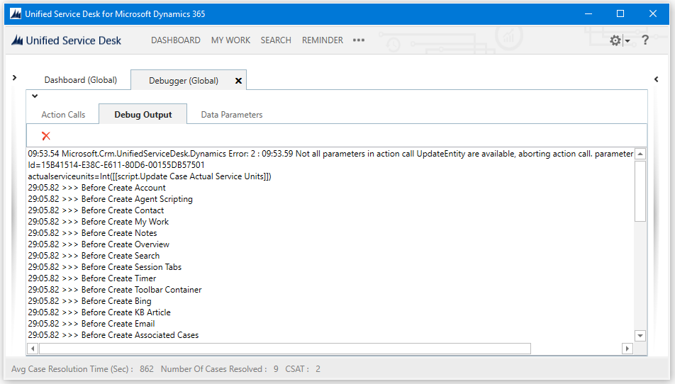
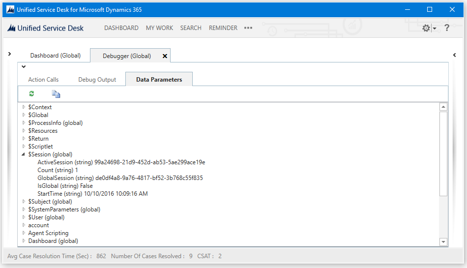

# Use the Debugger control in Unified Service Desk
To use debugger control in one of your sample [!INCLUDE[pn_unified_service_desk](../includes/pn-unified-service-desk.md)] applications, start the [!INCLUDE[pn_unified_service_desk](../includes/pn-unified-service-desk.md)] client, click the down arrow next to **Settings**, and then click **Debug**. You can also configure a debugger control if you are configuring Unified Service Desk from scratch. [!INCLUDE[proc_more_information](../includes/proc-more-information.md)] [Walkthrough 6: Configure the Debugger hosted control in your agent application](../unified-service-desk/walkthrough-configure-debugger-hosted-control-agent-application.md)  
  
 The debugger control provides information under these tabs: **Action Calls**, **Debug Output**, and **Data Parameters**. Additionally, debugger also lets you test the existing action calls and UII actions available in the system.  
  
   
## Action Calls tab  
 The first tab in the debugger is **Action Calls**. Action calls are the primary mechanisms by which things occur in [!INCLUDE[pn_unified_service_desk](../includes/pn-unified-service-desk.md)]. Tracking the progress of these, as well as the values used in your replacement parameters, can give you valuable information about your hosted controls.  
  
   
  
 The following color highlights are used for the records in the **Action Calls** tab:  
  
- Yellow indicates an action call didn’t run because a condition failed.  
  
- Red indicates the condition succeeded but the action failed, either due to an exception or because required parameters in the data weren’t replaceable.  
  
    
  
  Right-click on a row or multiple rows in the **Action Calls** tab, and select **Copy Data To Clipboard** from the shortcut menu to copy action call data and then paste it in another application (say Microsoft Word or Notepad) to easily review the data or share the copied data with others using email for troubleshooting.  
  
  You can also refresh the [!INCLUDE[pn_unified_service_desk](../includes/pn-unified-service-desk.md)] client to use the latest configuration changes on the server without having to manually restart it by clicking the refresh icon (). On clicking this icon, you are prompted whether to reload the configuration. Click **Yes** to reload the configuration or click **No** to cancel.  
  
   
## Debug Output tab  
 This tab displays a trace listener. If you attached a code debugger to the application, this is the output you would see. It also displays text that will be written to a log file.  
  
   
  
   
## Data Parameters tab  
 This tab displays data parameters that are captured during the execution of the application. The list of available values will change frequently as data is discovered from various ways while the application is used. These data parameters may be used when calling actions, for display, or other purposes in the application by using replacement parameters. System data parameters typically start with “$,” such as “$Global" to help separate them from general data parameters. For more information, see:  [Replacement parameters](../unified-service-desk/replacement-parameters.md).  
  
 You can refresh data parameters by clicking the **Update data parameters** button. You can also copy the data parameters to your clipboard.  
  
   
  
   
## Test your action calls and UII actions  
 The debugger also lets you test the existing action calls and UII actions using different conditions and replacement parameters to experiment and view results however you need. To display the area where you can test action calls and UII actions, click the down arrow above the **Action Calls** tab.  
  
   
  
- In the **Action Calls** tab, select an action call from the drop-down list, and then click the **Run Action Call** button  to view the results of the action call. For more information about testing an action call, see the [Test the action call for customizing your display](/previous-versions/dynamicsusd-2/developers-guide/dn864892(v=usd.2)#Test) section in the topic for customizing a theme.  
  
- In the **Direct Action** tab, you can directly call UII actions on hosted controls in the system. This is a great way to test action call configuration before creating an action call for the UII action. Replacement parameters can be used in the **Data** field while testing UII actions. If you have the required permissions, you can also create hosted controls and UII actions by clicking the Add buttons next to the respective drop-down lists. This opens the **New Hosted Control** or **New UII Action** page in Internet Explorer based on what you chose to create. For more information about testing a UII action, see the [Run the Unified Service Desk client to work with custom hosted control](/previous-versions/dynamicsusd-2/developers-guide/dn864925(v=usd.2)#run) section in the topic for creating a custom [!INCLUDE[pn_unified_service_desk](../includes/pn-unified-service-desk.md)] hosted control.  
  
### See also  
 [Walkthrough 6: Configure the Debugger hosted control in your agent application](../unified-service-desk/walkthrough-configure-debugger-hosted-control-agent-application.md)   
 [Debug your custom code for Unified Service Desk](../unified-service-desk/debug-custom-code-unified-service-desk.md)

[!INCLUDE[footer-include](../includes/footer-banner.md)]