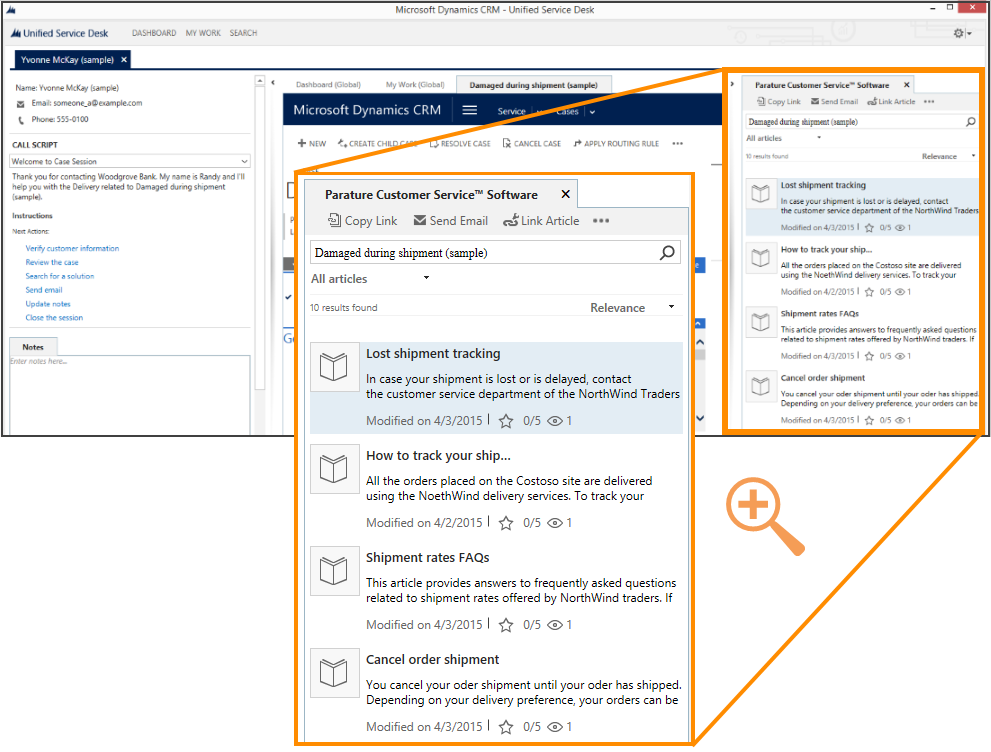
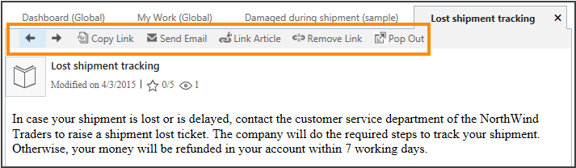
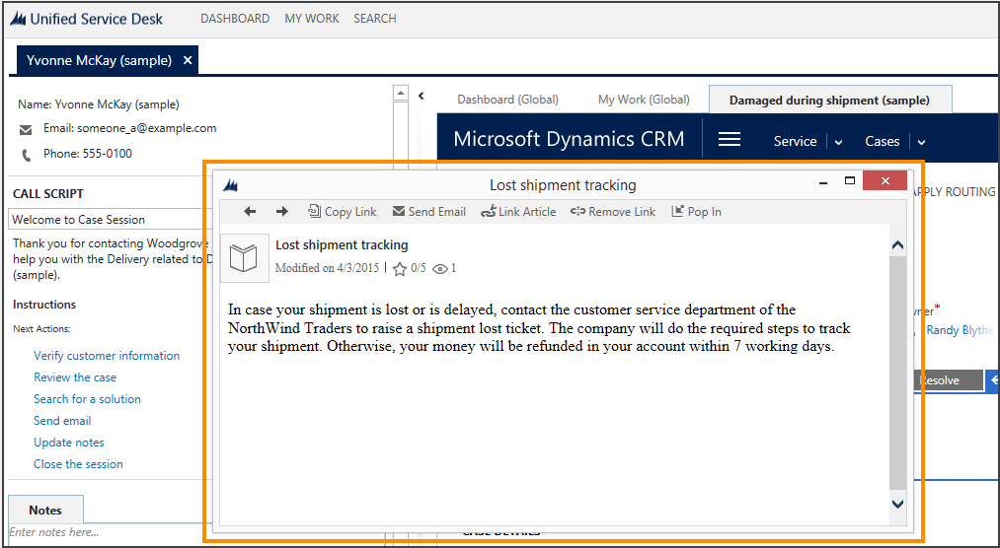

# Use Dynamics 365 or Parature knowledge for effective customer engagement in Unified Service Desk
Knowledge management plays an important part in the customer service process, and access to accurate and up-to-date information can help your customer service agents reduce the average handle time to provide quick and accurate answers to your customers. The new knowledge management solution in [!INCLUDE[pn_crm_2016](../includes/pn-crm-2016.md)] guides you through the process of creating and publishing rich knowledge articles with multimedia data like pictures and videos. It also provides translation and versioning capabilities to support the knowledge lifecycle. If you’re using [!INCLUDE[pn_crm_online_shortest](../includes/pn-crm-online-shortest.md)], you can set up knowledge management to use either [!INCLUDE[pn_crm_shortest](../includes/pn-crm-shortest.md)] knowledge or [!INCLUDE[pn_parature](../includes/pn-parature.md)] knowledge. For on-premises instances of [!INCLUDE[pn_crm_shortest](../includes/pn-crm-shortest.md)], you can just use the native [!INCLUDE[pn_crm_shortest](../includes/pn-crm-shortest.md)] knowledge base. [!INCLUDE[proc_more_information](../includes/proc-more-information.md)] [Set up knowledge management in CRM](http://go.microsoft.com/fwlink/p/?LinkId=691083)  
  
 [!INCLUDE[pn_unified_service_desk](../includes/pn-unified-service-desk.md)] enables you to use the rich knowledge base in Dynamics 365 or [!INCLUDE[pn_parature](../includes/pn-parature.md)] (depending on the knowledge source configured in Dynamics 365) from within the agent desktop so that your customer service agents can quickly search for relevant knowledge while working on a case, and provide accurate answers to the customers, without having to switch applications.  
  
> [!IMPORTANT]
>  If your knowledge source is [!INCLUDE[pn_parature](../includes/pn-parature.md)], you must have access to an instance of [!INCLUDE[pn_parature](../includes/pn-parature.md)], and must have enabled integration with [!INCLUDE[pn_parature](../includes/pn-parature.md)] knowledge management for your [!INCLUDE[pn_crm_online_shortest](../includes/pn-crm-online-shortest.md)] instance before you can use knowledge from [!INCLUDE[pn_parature](../includes/pn-parature.md)] within [!INCLUDE[pn_unified_service_desk](../includes/pn-unified-service-desk.md)]. [!INCLUDE[proc_more_information](../includes/proc-more-information.md)] [Connect Microsoft Dynamics CRM to Parature knowledge base](https://technet.microsoft.com/library/dn946909.aspx)  
  
 [!INCLUDE[pn_unified_service_desk](../includes/pn-unified-service-desk.md)] provides the **KM Control** hosted control, which can be used to configure a knowledge base article search pane in your agent desktop that lets you search for relevant knowledge in [!INCLUDE[pn_crm_shortest](../includes/pn-crm-shortest.md)] or [!INCLUDE[pn_parature](../includes/pn-parature.md)], and then take the next set of actions on the search results, such as share the results with customers or associate them with case if the knowledge helped in resolving the case. All this can be done from within your agent desktop without having to switch applications. [!INCLUDE[pn_unified_service_desk](../includes/pn-unified-service-desk.md)] provides you with a sample application, **Knowledge Management**, which demonstrates the capabilities of the new feature. [!INCLUDE[proc_more_information](../includes/proc-more-information.md)] [Sample Unified Service Desk applications](https://technet.microsoft.com/library/dn798674.aspx)  
  
 When you deploy the **Knowledge Management** sample application, and search for a case in [!INCLUDE[pn_unified_service_desk](../includes/pn-unified-service-desk.md)], the new **KM Control** hosted control is automatically displayed in the right panel of the agent desktop application in a case session.  
  
   
  
 The actions and events exposed by the **KM Control** type of hosted control let you configure a knowledge base search experience in the agent desktop. [!INCLUDE[proc_more_information](../includes/proc-more-information.md)] [KM Control (Hosted Control)](../unified-service-desk/km-control-hosted-control.md)  
  
 Use the **KM Control** hosted control to:  
  
- **Search the knowledge base**: Your service agents can search and view knowledge base articles in [!INCLUDE[pn_crm_shortest](../includes/pn-crm-shortest.md)] or [!INCLUDE[pn_parature](../includes/pn-parature.md)] from within the agent desktop. You can configure the knowledge base search control to automatically show search results based on the title of the currently opened case or based on any other criteria as soon as a session is created. The service agents can also manually search for knowledge bases by typing in the search phrase in the search box.  
  
- **Position your search control as required**: You can configure where you want to display the knowledge base search control in your agent desktop: the left panel, the main panel, or the right panel. In the **Knowledge Management** sample application, the control is placed in the right panel. For information about different types of panels, see [Panels, panel types, and panel layouts in Unified Service Desk](../unified-service-desk/panels-panel-types-and-panel-layouts-in-unified-service-desk.md).  
  
- **Configure contextual actions for the search results**: You can configure the following actions in the search control when a knowledge base article is selected in the search results:  
  
    -   Copy the link or URL of the article. You can paste the article URL in the chat session with customers or in an email. You can only copy URLs for articles that aren’t in the draft or expired state.  
  
    -   Send the knowledge base article link in an email.  
  
    -   Associate a knowledge base article with an incident (case) in [!INCLUDE[pn_crm_shortest](../includes/pn-crm-shortest.md)]. Associating articles to cases helps to determine which articles were effective in resolving cases. You can also configure to dissociate a knowledge base article from a case if the article isn’t helpful or is out-of-date.  
  
    -   Click a knowledge base article in the search panel to open it in a tab in the main panel with all the contextual actions available. Links in a knowledge base article can be accessed to navigate to the linked topic from within [!INCLUDE[pn_unified_service_desk](../includes/pn-unified-service-desk.md)].  
  
   
  
    -   Pop out and pop in a knowledge base article on the [!INCLUDE[pn_unified_service_desk](../includes/pn-unified-service-desk.md)] main panel. This feature is useful if you’re working on multiple monitors, and want to pop a knowledge base article out from the client and display it on another monitor while you continue to work with the customer on the [!INCLUDE[pn_unified_service_desk](../includes/pn-unified-service-desk.md)] client on the current monitor. After finishing your work, you can pop the article back in on the main panel.  
  
   
  
 For information about how you can configure knowledge management integration in [!INCLUDE[pn_unified_service_desk](../includes/pn-unified-service-desk.md)], see [Configure Parature knowledge in Unified Service Desk](../unified-service-desk/configure-unified-service-desk-use-dynamics-365-knowledge.md) and [Walkthrough 8: Use Parature knowledge within your agent application](../unified-service-desk/walkthrough-8-use-parature-knowledge-base-within-your-agent-application.md).  
  
### See also  
 [Configure Parature knowledge in Unified Service Desk](../unified-service-desk/configure-unified-service-desk-use-dynamics-365-knowledge.md)   
 [KM Control (Hosted Control)](../unified-service-desk/km-control-hosted-control.md)   
 [Walkthrough 8: Use Parature knowledge within your agent application](../unified-service-desk/walkthrough-8-use-parature-knowledge-base-within-your-agent-application.md)   
 [Sample Unified Service Desk applications](https://technet.microsoft.com/library/dn798674.aspx)   
 [Set up knowledge management in CRM](http://go.microsoft.com/fwlink/p/?LinkId=691083)   
 [Learn to use Unified Service Desk](../unified-service-desk/learn-to-use-unified-service-desk.md)