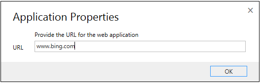

# Use HAT Software Factory to create a hosted application in Unified Service Desk

[!INCLUDE[cc-data-platform-banner](../includes/cc-data-platform-banner.md)]

The [!INCLUDE[pn_hosted_application_toolkit_hat](../includes/pn-hosted-application-toolkit-hat.md)] Software Factory provides you with [!INCLUDE[pn_Visual_Studio_short](../includes/pn-visual-studio-short.md)] templates to configure hosted [!INCLUDE[pn_ms_Windows_short](../includes/pn-ms-windows-short.md)], web, or [!INCLUDE[pn_Java](../includes/pn-java.md)] applications, and make them available to a [!INCLUDE[pn_uii_acronym](../includes/pn-uii-acronym.md)] desktop (such as [!INCLUDE[pn_unified_service_desk](../includes/pn-unified-service-desk.md)]). To use the [!INCLUDE[pn_hat](../includes/pn-hat.md)] Software Factory, you must first install it.

## Install HAT Software Factory

1. Ensure that you have [!INCLUDE[pn_Visual_Studio](../includes/pn-visual-studio.md)] installed. HAT supports [!INCLUDE[pn_Visual_Studio_short](../includes/pn-visual-studio-short.md)] 2015, [!INCLUDE[pn_visual_studio_2013](../includes/pn-visual-studio-2013.md)], [!INCLUDE[pn_Visual_Studio_short](../includes/pn-visual-studio-short.md)] 2012, and [!INCLUDE[pn_Visual_Studio_2010_short](../includes/pn-visual-studio-2010-short.md)].

2. [Download and extract the UII SDK package](https://go.microsoft.com/fwlink/p/?LinkId=395257). In the extracted folder, navigate to the UII\Templates folder to locate the HAT software plug-in for [!INCLUDE[pn_Visual_Studio_short](../includes/pn-visual-studio-short.md)]: `Microsoft.Uii.Tools.Inspector.vsix`.

3. Double-click the `Microsoft.Uii.Tools.Inspector.vsix` file to install the HAT software plug-in for [!INCLUDE[pn_Visual_Studio_short](../includes/pn-visual-studio-short.md)].

## Create a HAT hosted application project
 Installing the HAT Software Factory creates new project templates in [!INCLUDE[pn_Visual_Studio_short](../includes/pn-visual-studio-short.md)] that let you create hosted applications that can use HAT automations.

1. Start [!INCLUDE[pn_Visual_Studio_short](../includes/pn-visual-studio-short.md)], and create a new project.

2. In the **New Project** dialog box, from the list of installed templates on the left, expand **Visual C#**, and select:

   1. **UII** > **External Application**:  Create a project with basic initialization string (Initstring.xml) file for an external application.

   2. **UII** > **Web Application**:  Create a project with basic initialization string (Initstring.xml) for a web application.

      In this topic, you’ll create a web application.

   

3. Specify the name and location of the project, and click **OK**.

4. You are prompted to enter a URL for your web application. Type the URL, and then click **OK**.

   

    This creates a web application project with an initialization string (Initstring.xml) that contains information about your web application URL, adapter info, and data bindings. This is basic information, and will get updated as you configure your hosted application with automations and bindings.

5. Next, configure the application by using one of the following options by right-clicking the project name, and selecting an option from the shortcut menu.

   

   |             Option             |                                                                                                                                                                             Description                                                                                                                                                                             |
   |--------------------------------|---------------------------------------------------------------------------------------------------------------------------------------------------------------------------------------------------------------------------------------------------------------------------------------------------------------------------------------------------------------------|
   |          **Inspect**           |                                                     Start UII Inspector to inspect the application controls. [!INCLUDE[proc_more_information](../includes/proc-more-information.md)] [Using UII inspector to create bindings](../unified-service-desk/use-uii-inspector-create-bindings-hosted-application.md)                                                      |
   | **Inspect As Different User**  |                                                                                                                                                          Start UII Inspector using different credentials.                                                                                                                                                           |
   | **Application  Configuration** |                                                                             Configure the hosted control application. [!INCLUDE[proc_more_information](../includes/proc-more-information.md)] [Configure the HAT application](../unified-service-desk/configure-hosted-application.md)                                                                              |
   |    **Action Configuration**    |                                                                Configure an action for the HAT application. [!INCLUDE[proc_more_information](../includes/proc-more-information.md)] [Configuring an action for the HAT application](../unified-service-desk/configure-action-hosted-application.md)                                                                 |
   |           **Deploy**           | Deploy the hosted control application configuration to the Microsoft Dataverse server. [!INCLUDE[proc_more_information](../includes/proc-more-information.md)] [Deploy and import an application configuration to or from Dataverse server](../unified-service-desk/deploy-hosted-application-unified-service-desk.md) |

   > [!NOTE]
   >  When using **Inspect as a different User** for a Windows-based application with different access rights, the UII Inspector may sometimes not inspect the controls. In such cases, ensure that [!INCLUDE[pn_Visual_Studio_short](../includes/pn-visual-studio-short.md)] and the target application run with the same privileges and that you use the **Inspect** option instead of **Inspect as a different User**. This option isn’t available for web applications.
   >
   >  While inspecting an application with the **Inspect as a different User** function, if the application uses the `Set Parent` method of hosting, the application bindings may have errors. While using the `Set Parent` method, you must select `Use FindWindow` in the `Alternate Top-Level window` section and specify the `Caption` and `Class` for the application window.

6. Save your project, and build it (**Build** > **Build Solution**). After the project is built successfully, an assembly (Bing_Search.dll) is generated in the \bin\debug folder of your project folder. This assembly will be used later when deploying the application.

### See also
 [Using UII inspector to create bindings](../unified-service-desk/use-uii-inspector-create-bindings-hosted-application.md)
 [Configure the hosted application](../unified-service-desk/configure-hosted-application.md)
 [Configure an action for the hosted application](../unified-service-desk/configure-action-hosted-application.md)
 [Deploy the hosted application to Unified Service Desk](../unified-service-desk/deploy-hosted-application-unified-service-desk.md)
 [Import the hosted application from Unified Service Desk](../unified-service-desk/import-hosted-application-from-unified-service-desk.md)

[!INCLUDE[footer-include](../includes/footer-banner.md)]