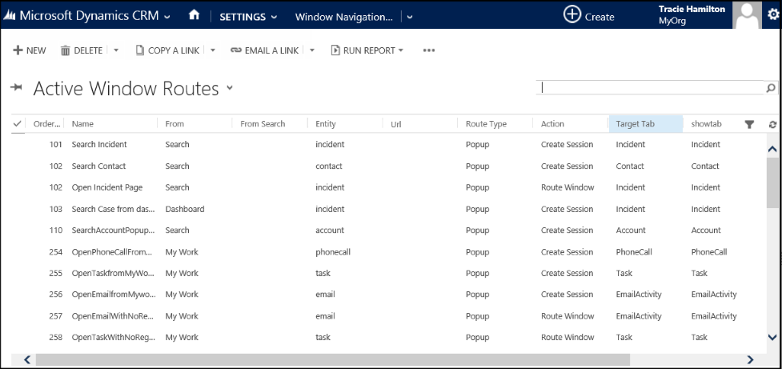
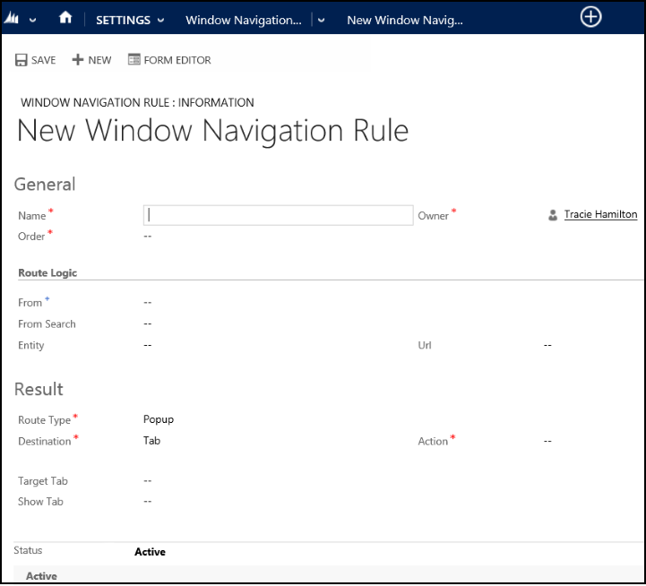

# Use window navigation rules in Unified Service Desk
Window navigation rules define the interaction between various controls in [!INCLUDE[pn_unified_service_desk](../includes/pn-unified-service-desk.md)]. You can use the rules to define the location of the sessions or the model-driven app pages to appear in the [!INCLUDE[pn_unified_service_desk](../includes/pn-unified-service-desk.md)] client application when invoked from a hosted control or an entity search. For more information about hosted controls and entity searches in [!INCLUDE[pn_unified_service_desk](../includes/pn-unified-service-desk.md)], see [Unified Service Desk Hosted Controls](../unified-service-desk/unified-service-desk-hosted-controls.md) and [Search data using entity searches in Unified Service Desk](../unified-service-desk/search-data-entity-searches.md).  

 Window navigation rules in [!INCLUDE[pn_unified_service_desk](../includes/pn-unified-service-desk.md)] are executed in the numerical order and as per the conditions specified. The order is particularly important when more than one rule applies to the conditions under which the control might appear. For example, it is possible to create default handlers that will match when no other rules apply. Such default handlers must come after the more specific handlers, otherwise, the specific handlers will never get used.  

   
## Create or edit a window navigation rule  
 To create or edit window navigation rules:  

1. Sign in to your Common Data Service platform.  

2. [!INCLUDE[proc_settings_usd](../includes/proc-settings-usd.md)]  

3. Click **Windows Navigation Rules**. The page displays all the existing navigation rules in the system.  

     

4. On the window navigation rules page:  

   1.  To create a new navigation rule, click or tap **NEW** on the command bar.  

   2.  To edit an existing navigation rule, either click on the navigation rule name or select the navigation rule record in the list, and then click **EDIT** on the command bar.    
5. On the navigation rule definition page, specify or modify the following values if you are creating a new navigation rule or editing an existing navigation rule respectively. Fields marked with red asterisk are mandatory.  

     

   |        Field        |                                                                                                                                                                                                                                                                                                                                                                                                                                                                                                                                                        Description                                                                                                                                                                                                                                                                                                                                                                                                                                                                                                                                                         |
   |---------------------|----------------------------------------------------------------------------------------------------------------------------------------------------------------------------------------------------------------------------------------------------------------------------------------------------------------------------------------------------------------------------------------------------------------------------------------------------------------------------------------------------------------------------------------------------------------------------------------------------------------------------------------------------------------------------------------------------------------------------------------------------------------------------------------------------------------------------------------------------------------------------------------------------------------------------------------------------------------------------------------------------------------------------------------------------------------------------------------------------------------------------|
   |        Name         |                                                                                                                                                                                                                                                                                                                                                                                                                                                                                                                                      This is the name of the window navigation rule.                                                                                                                                                                                                                                                                                                                                                                                                                                                                                                                                       |
   |        Order        |                                                                                                                                                                                                                                                                                                                                                                                                                                             This is the numerical order of the rule that controls the order of execution. The smaller value here matches first. More specific rules should have a smaller value while more general or default rules should have larger values.                                                                                                                                                                                                                                                                                                                                                                                                                                             |
   |        From         |                                                                                                                                                                                                                                                                                                                                  Select the hosted control from where the navigation or routing request originates. **Note:**  If you select a **CTI Desktop Manager** type of hosted control in the **From** list, the interface on this page changes to let you define a CTI search. For more information about configuring a CTI search using window navigation rule, see [CTI search](../unified-service-desk/consideration-creating-cti-adapter-unified-service-desk.md#CTISearch).                                                                                                                                                                                                                                                                                                                                   |
   |     From Search     |                                                                                                                                                                                                                                                                                         Select the entity search name that initiates the **OnLoad** routing type rule (later) to display data from the related entities. When you want to access data that is not displayed on the form, you can use entity searches. When an entity search completes and returns data, the **OnLoad** routing type rule are executed to allow you to load related entities. For more information about entity searches, see [Search data using entity searches in Unified Service Desk](../unified-service-desk/search-data-entity-searches.md).                                                                                                                                                                                                                                                                                          |
   |       Entity        |                                                                                                                                                                                                                                                                                                                                                                                                                                                                            Select the name of the apps entity for which the information will be displayed by the window navigation rule.                                                                                                                                                                                                                                                                                                                                                                                                                                                                            |
   |         Url         |                                                                                                                                                                                                                                                                                                                                              This field is typically used for windows that do not represent the Common Data Service platform entities or are standard web URLs. This field is used instead of the **Entity** field, but can be used with the **Entity** field in certain circumstances. An asterisk (*) in this field is used to create a default rule that applies to any pop-up windows originating from the \*\*From*\* field.                                                                                                                                                                                                                                                                                                                                               |
   |     Route Type      |         - **Popup**: Used to determine how to handle a pop-up window. - **OnLoad**: Used to determine how to handle an entity search, the model-driven apps page, or external Web page after it is loaded. - **In Place**: Used to determine how to handle an in-place transition or loading of the model-driven apps form. For example, when you click on the contact name in an account page in the model-driven app, the contact information is loaded in the same frame where the account information was displayed. - **Menu Chosen**: Used to determine how to handle the selection of a menu item, when the user clicks the down arrow next to a record name in the nav bar, and selects an item from the menu list. For example, when you click the drop-down arrow next to an account name on the nav bar of the account page in the model-driven app to select an item such as **Contacts**, **Opportunities**, and **Cases**.          |
   |       Action        | - **Create Session**: Only applies to a **Popup** route type. This action will load a session based upon the entity contained in the popup. For example, if the **From** is set to `Queues`, **Entity** is set to `incident`, **Route Type** is set to `Popup`, and **Action** is set to `Create Session`, double clicking an incident in the queue will create a session and load the popup in a tab identified in the **Target Tab** field. - **Route Window**: Direct the window to another tab within the same session. This is the most basic form of routing of windows. - **Show Outside**: When this rule matches, the pop-up window will appear outside the client application. This new window will not be under the control of Unified Service Desk any longer and will not participate in the Unified Service Desk session management. This is useful for displaying a window on a second monitor or for comparing a window against another tab or a window in another [!INCLUDE[pn_unified_service_desk](../includes/pn-unified-service-desk.md)] session. - **None**: No action is performed. |
   |     Destination     |                                                                                                                                                                                                                                                                                                                   - **Tab**: The item selected in the route type should target a tab. It enables the **Target Tab** and **Show Tab** fields. - **Entity Search**: The item selected in the route type should target an entity search to look up the data using a web service call to the Common Data Service platform. This populates the [!INCLUDE[pn_unified_service_desk](../includes/pn-unified-service-desk.md)] data so it can be used in replacement parameters.                                                                                                                                                                                                                                                                                                                    |
   |     Target Tab      |                                                                                                                                                                                                                         When this rule matches, this is where the window will be directed. If the target tab (hosted control) is a dynamic control, it will automatically be loaded and the window will be directed to it. If this field is set to the **Global Manager** and the **Action** is **Create Session**, the system will re-evaluate the rules to determine the actual location of the window in the tabs. This is useful to avoid creating a **Create Session** rule for every route type that might pop up from a particular window. If you leave the **Target Tab** field empty, an entity search is performed using first entity search matching the type of entity from the popup.                                                                                                                                                                                                                         |
   |      Show Tab       |                                                                                                                                                                                                                                                                                                                                                                                                                                                                                                                       After the action is taken, this field will be used to activate a specific tab.                                                                                                                                                                                                                                                                                                                                                                                                                                                                                                                       |
   |    Entity Search    |                                                                                                                                                                                                                                                                                                                                                                           This is the entity search (FetchXML-based web service definition) that will be used to look up the data. This will populate the data fields in the session with the fields collected by the call. For more information about entity searches, see [Search data using entity searches in Unified Service Desk](../unified-service-desk/search-data-entity-searches.md).                                                                                                                                                                                                                                                                                                                                                                           |
   |  Hide Command Bar   |                                                                                                                                                                                                                                                                                                                                                                                                                                                 This causes [!INCLUDE[pn_unified_service_desk](../includes/pn-unified-service-desk.md)] to hide the model-driven app command bar after the window is displayed in the new tab.                                                                                                                                                                                                                                                                                                                                                                                                                                                  |
   | Hide Navigation Bar |                                                                                                                                                                                                                                                                                                                                                                                                                                    This causes [!INCLUDE[pn_unified_service_desk](../includes/pn-unified-service-desk.md)] to hide the model-driven app navigation bar on the left of the window, when the window is displayed in a new tab.                                                                                                                                                                                                                                                                                                                                                                                                                                    |
   |      Condition      |                                                                                                                                                                                                                                              The condition field is a JavaScript expression that results in true or false. The windows navigation rule is executed only if the conditional expression is validated as true at the run-time. In addition to the standard replacement parameters, you can use the `[[url]]` as a replacement parameter in the condition. The `[[url]]` replacement parameter is replaced with the URL of the target page at the run-time. The conditional expression is optional and does not affect the windows navigation rule validation.  However, incorrect conditional expression causes the windows navigation rule to fail.                                                                                                                                                                                                                                              |

6. Click **Save** to create or modify the window navigation rule.

To see how window navigation rules are used for configuring and agent application, see [Walkthrough 4: Display a record in a session in your agent application](../unified-service-desk/walkthrough-display-dynamics-365-record-session-agent-application.md), [Walkthrough 7: Configure agent scripting in your agent application](../unified-service-desk/walkthrough-configure-agent-scripting-agent-application.md), and [Walkthrough: Use a generic listener adapter for CTI events](../unified-service-desk/walkthrough-use-the-generic-listener-adapter-for-cti-event-routing.md).  

   
## View sample window navigation rules  
 You can view the definition of the existing window navigation rules in [!INCLUDE[pn_unified_service_desk](../includes/pn-unified-service-desk.md)] to understand how to manage navigation within the agent application. To view a navigation rule definition:  

1. Sign in to your Common Data Service platform.  

2. On the nav bar, click **Dynamics 365**.  

3. On the nav bar, click **Settings** > **Unified Service Desk** > **Window Navigation Rules**. The page displays all the existing navigation rules in the system.  

4. On the navigation rules page, either click the navigation rule name or select the navigation rule record in the list, and then click **EDIT** on the command bar.  

    This displays the window navigation rule definition.  

### See also  
 [Walkthrough 4: Display a record in a session in your agent application](../unified-service-desk/walkthrough-display-dynamics-365-record-session-agent-application.md)   
 [Walkthrough 7: Configure agent scripting in your agent application](../unified-service-desk/walkthrough-configure-agent-scripting-agent-application.md)   
 [Walkthrough: Use a generic listener adapter for CTI events](../unified-service-desk/walkthrough-use-the-generic-listener-adapter-for-cti-event-routing.md)   
 [Learn to use Unified Service Desk](../unified-service-desk/learn-to-use-unified-service-desk.md)
