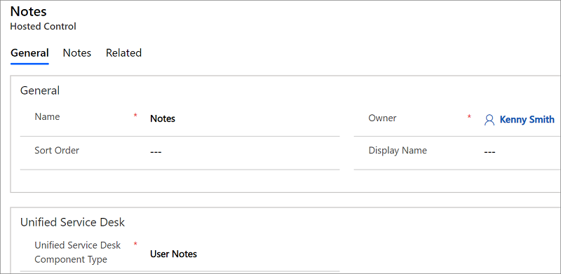

# User Notes (Hosted Control)
Use **User Notes** hosted control type to provide agents with a scratch pad to type notes during an interaction. Language specific spell checking can be applied to this component by calling the **SetLanguage** action. This component does not automatically pick up the current language of the user, by design. The ability to change the language used is intended to provide the ability to set the language appropriate for the transaction. For example, consider there is a bilingual agent that can speak English and Spanish. The IVR may pass the language selection from the phone system to the agent application’s CTI adapter. This language selection can then be used to set the spell check language for this hosted control.

> [!NOTE]
>  This hosted control does not automatically populate replacement parameters. The [UpdateReplacementParameters](#UpdateReplacementParameters) action can be called to take the current notes and populate the replacement parameters. The replacement parameters can be used to copy the notes to the case.  
  
   
## Create a User Notes hosted control  

 While creating a new hosted control, the fields in the **New Hosted Control** screen vary based on the type of hosted control you want to create. This section provides information about the specific fields that are unique to the **User Notes** hosted control type. For detailed information about creating a hosted control, see [Create or edit a hosted control](../unified-service-desk/create-edit-hosted-control.md).  
  
   
  
 In the **New Hosted Control** screen:  
  
- From the **Unified Service Desk Component Type** drop-down list, select **User Notes**.  
  
- In the **Display Group** field, specify a panel where this hosted control will be displayed. For information about various panels available in [!INCLUDE[pn_unified_service_desk](../includes/pn-unified-service-desk.md)], see [Panels](../unified-service-desk/panels-panel-types-panel-layouts.md#Panels).  
  
   
## Predefined UII actions  
 These are the predefined actions for this hosted control type.  
  
   
### Close  
 This action is used to close the hosted control.  
  
### FireEvent  
 Fires a user-defined event from this hosted control.  
  
|Parameter|Description|  
|---------------|-----------------|  
|name|Name of the user-defined event.|  
  
 All subsequent name=value pairs become the parameters to the event. For more information about creating a user-defined event, see [Create a user-defined event](../unified-service-desk/create-user-defined-event.md).  
  
   
### MoveToPanel  
 This action is used to move hosted controls between panels at runtime.  
  
|Parameter|Description|  
|---------------|-----------------|  
|app|Name of the hosted control to be moved.|  
|panel|Target panel for the hosted control.|  
  
### New_CRM_Page  
 Creates a page for creating a new record of the entity specified, and treats the page as a popup from the specified hosted control. The window navigation rules are evaluated to determine the location where the page to create the entity record is displayed.  
  
|Parameter|Description|  
|---------------|-----------------|  
|LogicalName|The logical name of the entity for creating a new instance.|  
  
> [!NOTE]
>  The rest of the parameters should consist of name=value pairs. These are the additional pre-populated values in the form for creating a new record for the specified entity. For more information about using this action, see step 4 in [Walkthrough 7: Configure agent scripting in your agent application](../unified-service-desk/walkthrough-configure-agent-scripting-agent-application.md).

### Open_CRM_Page
 Opens an existing instance of the entity specified and identified by the ID, and treats the page as a popup from the specified hosted control. The window navigation rules are evaluated to determine the location where the popup should be displayed.

|Parameter|Description|
|---------------|-----------------|
|LogicalName|The logical name of the entity to open.|
|id|The ID of the entity record to open.|

### Popup
 Pops up a URL from the hosted control and runs the window navigation rules against it for routing the popup to the appropriate location.

|Parameter|Description|
|---------------|-----------------|
|url|Routes a popup from this hosted control using this URL as if it were a popup requested from the displayed control.|
|frame|The frame from which this popup originated.|

### RealignWindow
[!INCLUDE[cc_RealignWindow_Action](../includes/cc-realignwindow-action.md)]

### SetSize
 This action explicitly sets the width and height of the hosted control. This is particularly useful when using "auto" in your panel layouts.

|Parameter|Description|
|---------------|-----------------|
|width|The width of the hosted control.|
|height|The height of the hosted control.|

### UpdateReplacementParameters
 This action is used to explicitly update the **User Notes** hosted control data into the replacement parameter list. This is unlike other hosted control types where the hosted control data is automatically updated into the replacement parameters.

## Predefined events
 The following predefined events are available for this hosted control type.

### Loaded
 Occurs when the hosted control has finished loading.

### PopupRouted
 Occurs after a popup has been routed by the system.

|Parameter|Description|
|---------------|-----------------|
|url|The URL of the popup that was routed.|

### See also
 [UII actions](../unified-service-desk/uii-actions.md)
 [Events](../unified-service-desk/events.md)
 [View predefined actions and events for a hosted control](../unified-service-desk/view-predefined-actions-events-hosted-control.md)
 [Unified Service Desk Configuration Walkthroughs](../unified-service-desk/unified-service-desk-configuration-walkthroughs.md)
 [Hosted control types and action/event reference](../unified-service-desk/hosted-control-types-action-event-reference.md)
 [Administration Guide for Unified Service Desk for Microsoft Dynamics CRM](/previous-versions/dynamicsusd-2/administrators-guide/dn499779(v=usd.2))

[!INCLUDE[footer-include](../includes/footer-banner.md)]