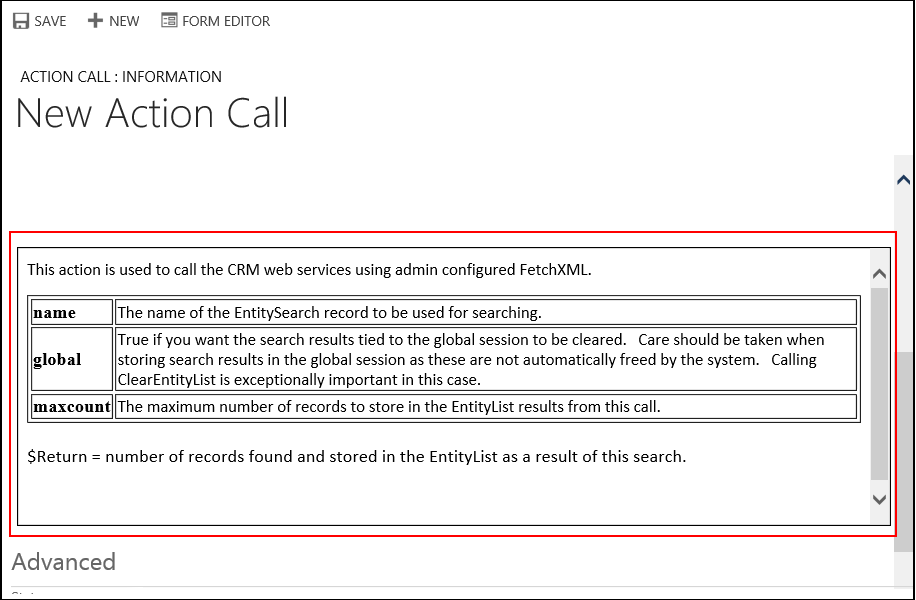
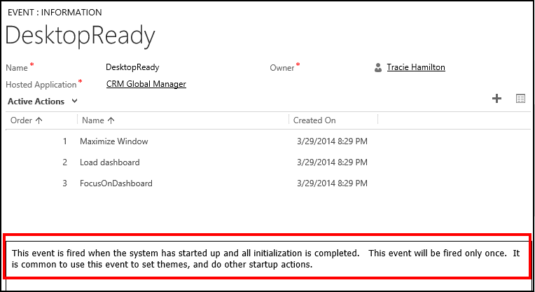

# View embedded help for actions and events in Unified Service Desk

[!INCLUDE[pn_unified_service_desk](../includes/pn-unified-service-desk.md)] provides an embedded help on actions and events within Dataverse.  
  
   

## Embedded help for actions  
 When you create an action call for a UII action, the help is displayed below the data field. For information about creating an action call, see [Create an action call for a UII action](../unified-service-desk/create-action-call-uii-action.md).  
  
   
  
   

## Embedded help for events  
 Open an event definition to view the help for the event. To do so:  
  
1. Sign in to Unified Service Desk Administrator. 

2. Select **Events** under **Basic Settings**. 
  
3. Select an event name from the list and view the event definition. The help is displayed in the lower part of the event definition page.  
  
     
  
### See also  
 [Hosted control types and action/event reference](../unified-service-desk/hosted-control-types-action-event-reference.md)
    
 [Manage hosted controls, actions, and events](../unified-service-desk/manage-hosted-controls-actions-events.md)

[!INCLUDE[footer-include](../includes/footer-banner.md)]
