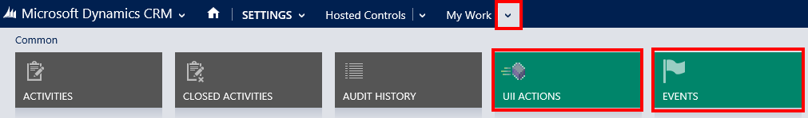

# View predefined actions and events for a hosted control in Unified Service Desk

Each predefined hosted control type in [!INCLUDE[pn_unified_service_desk](../includes/pn-unified-service-desk.md)] supports a set of UII actions and events. To view the predefined UII actions and events for a hosted control:  
  
1. Sign in to Unified Service Desk Administrator.

2. Select **Hosted Controls** under **Basic Settings**.

3. Open an existing hosted control or create a hosted control in [!INCLUDE[pn_unified_service_desk](../includes/pn-unified-service-desk.md)]. For information, see [Create or edit a hosted control](../unified-service-desk/create-edit-hosted-control.md).  
  
4. Select **Related** tab, and select **UII Actions** or **Events** to view the predefined UII actions or events for the hosted control.   
  
     
  
### See also  
 [UII actions](../unified-service-desk/uii-actions.md)   
 [Events](../unified-service-desk/events.md)   
 [Manage hosted controls, actions, and events](../unified-service-desk/manage-hosted-controls-actions-events.md)   
 [Unified Service Desk Configuration Walkthroughs](../unified-service-desk/unified-service-desk-configuration-walkthroughs.md)   
 [Learn to use Unified Service Desk](../unified-service-desk/learn-to-use-unified-service-desk.md)

[!INCLUDE[footer-include](../includes/footer-banner.md)]