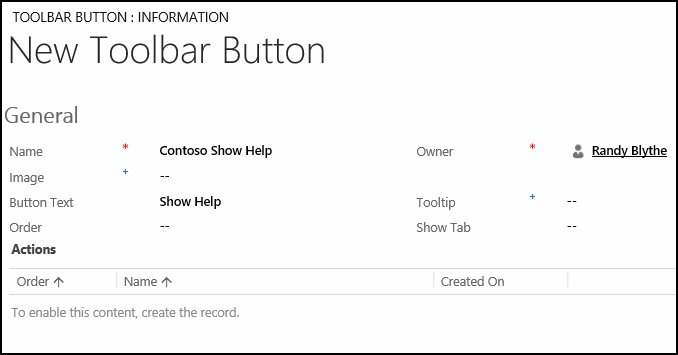
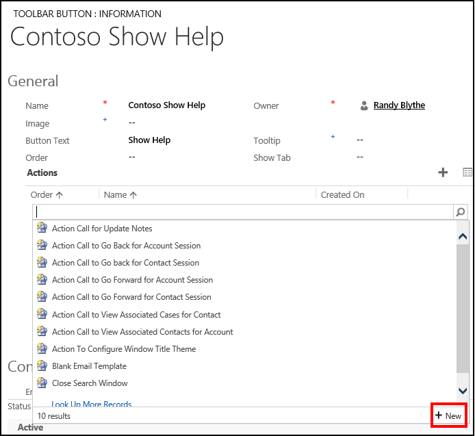
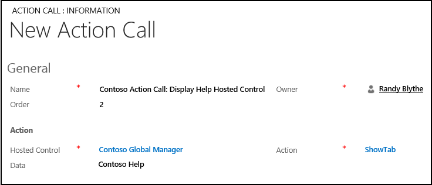
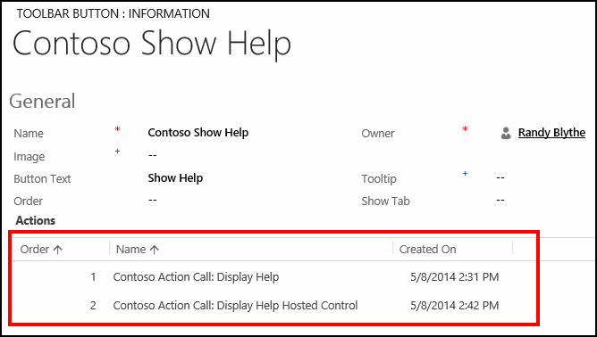
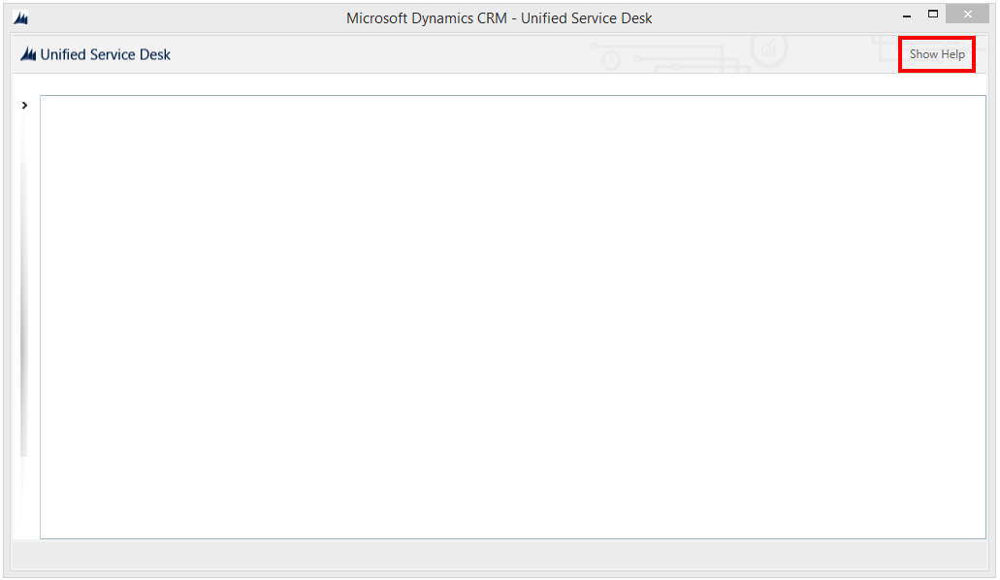
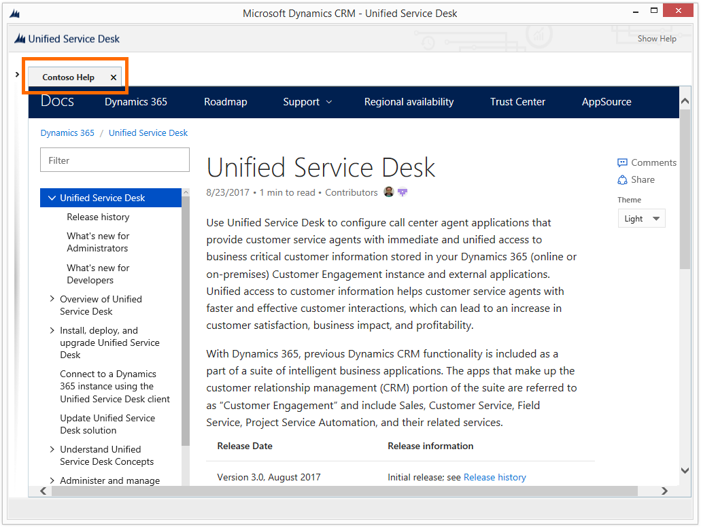

# Walkthrough 2: Display an external webpage in your agent application

[!INCLUDE[cc-data-platform-banner](../includes/cc-data-platform-banner.md)]

This walkthrough demonstrates how to display a webpage or external URL in your agent application. In this walkthrough, you’ll learn how to display the [!INCLUDE[pn_unified_service_desk](../includes/pn-unified-service-desk.md)] Guide, which is available online at https://go.microsoft.com/fwlink/?LinkID=856273, in the client application.  

## Prerequisites  

- You must have completed [Walkthrough 1: Build a simple agent application](../unified-service-desk/walkthrough-1-build-a-simple-agent-application.md). The configurations that you completed in the first walkthrough are required in this walkthrough.  

- This walkthrough assumes that you will be using the same user credential that you used at the end of Walkthrough 1 to sign in to the agent application. If a different user will be testing the application, you must assign the user to **Contoso Configuration**. [!INCLUDE[proc_more_information](../includes/proc-more-information.md)] [Walkthrough 1: Build a simple agent application](../unified-service-desk/walkthrough-1-build-a-simple-agent-application.md)  

- You must be familiar with the following concepts in [!INCLUDE[pn_unified_service_desk](../includes/pn-unified-service-desk.md)]:  

  - These two types of hosted controls: Standard Web Application and Toolbar Container. [!INCLUDE[proc_more_information](../includes/proc-more-information.md)] [Hosted control types and action/event reference](../unified-service-desk/hosted-control-types-action-event-reference.md)  

  - How to configure [Action calls](../unified-service-desk/action-calls.md)  

  - Filter access using [!INCLUDE[pn_unified_service_desk](../includes/pn-unified-service-desk.md)] configuration. [!INCLUDE[proc_more_information](../includes/proc-more-information.md)] [Manage access using Unified Service Desk configuration](../unified-service-desk/admin/manage-access-using-unified-service-desk-configuration.md)  

   
## In This Walkthrough  
 [Step 1: Create a hosted control to display the webpage](../unified-service-desk/walkthrough-2-display-an-external-webpage-in-your-agent-application.md#Step1)  

 [Step 2: Create a toolbar container type of hosted control](../unified-service-desk/walkthrough-2-display-an-external-webpage-in-your-agent-application.md#Step2)  

 [Step 3: Add a toolbar and attach it to the toolbar container](../unified-service-desk/walkthrough-2-display-an-external-webpage-in-your-agent-application.md#Step3)  

 [Step 4: Add a toolbar button and action calls to display the webpage](../unified-service-desk/walkthrough-2-display-an-external-webpage-in-your-agent-application.md#Step4)  

 [Step 5: Add the controls to the configuration](../unified-service-desk/walkthrough-2-display-an-external-webpage-in-your-agent-application.md#Step5)  

 [Step 6: Test the application](../unified-service-desk/walkthrough-2-display-an-external-webpage-in-your-agent-application.md#Step6)  

 [Conclusion](../unified-service-desk/walkthrough-2-display-an-external-webpage-in-your-agent-application.md#Conclusion)  

   
## Step 1: Create a hosted control to display the webpage  
 In this step, you’ll create a hosted control of Standard Web Application type to display the webpage.  

1. Sign in to the Dynamics 365 instance.  

2. [!INCLUDE[proc_settings_usd](../includes/proc-settings-usd.md)]  

3. Click **Hosted Controls**.  

4. Click **New**.  

5. On the **New Hosted Control** page, specify the following values:  

   |Field|Value|  
   |-----------|-----------|  
   |Name|Contoso Help|  
   |Display Name|Contoso Help|  
   |USD Component Type|Standard Web Application|  
   |Allow Multiple Pages|No|  
   |Hosting Type|Internal WPF|  
   |Application is Global|Checked|  
   |Display Group|MainPanel|  

     

6. Click **Save**.  

   
## Step 2: Create a toolbar container type of hosted control  
 Toolbar Container hosted controls are used to hold and display the toolbars in [!INCLUDE[pn_unified_service_desk](../includes/pn-unified-service-desk.md)]. In this section, you’ll create a **Toolbar Container** type of hosted control that appears in the toolbar region of the client application.  

1. Sign in to the Dynamics 365 instance.  

2. [!INCLUDE[proc_settings_usd](../includes/proc-settings-usd.md)]  

3. Click **Hosted Controls**.  

4. Click **New**.  

5. On the **New Hosted Control** page, specify the following values:  

   |Field|Value|  
   |-----------|-----------|  
   |Name|Contoso About Toolbar Container|  
   |USD Component Type|Toolbar Container|  
   |Display Group|AboutPanel|  

     

6. Click **Save**.  

   
## Step 3: Add a toolbar and attach it to the toolbar container  
 In this step, you’ll create a toolbar, and attach the toolbar to the toolbar container hosted control created in step 2. This is done to display the toolbar in your agent application.  

1. Sign in to the Dynamics 365 instance.  

2. [!INCLUDE[proc_settings_usd](../includes/proc-settings-usd.md)]  

3. Click **Toolbars**.  

4. Click **New**.  

5. On the **New Toolbar** page, type **Contoso About Toolbar** in the **Name** box, and then click **Save**.  

6. Attach the toolbar to the toolbar container hosted control created in step 2. On the nav bar, click the down arrow next to **Contoso About Toolbar**, and click **Hosted Controls**.  

7. On the next page, click **Add Existing Hosted Control**, type `Contoso About Toolbar Container` in the search bar, and then press ENTER or click the search icon.  

8. From the search results, select **Contoso About Toolbar Container**.  

9. Click **Save**.  

   
## Step 4: Add a toolbar button and action calls to display the webpage  
 In this step, add a button on the toolbar and attach an action call to the button so that when the button is clicked, the specified webpage is displayed in the hosted control that you created in step 1.  

1. After you save the toolbar in step 3, the **Buttons** area becomes available. In the **Buttons** area, click **+** on the right corner to add a button.  

2. On the **New Toolbar Button** page, specify the following values.  

   |Field|Value|  
   |-----------|-----------|  
   |Name|Contoso Show Help|  
   |Button Text|Show Help|  

     

3. Click **Save** to save the record, and enable the **Actions** area.  

4. Add two action calls to specify the URL of the webpage to navigate to for the hosted control that you created in step 1. Additionally, create another action call to on the **Contoso Global Manager** hosted control to display the hosted control created in step 1 in the agent application.  

    In the **Actions** area, click **+** on the right corner to add an action call.  

5. In the search box in the **Actions** area, press ENTER or click the search icon.  

6. In the search results box, click **New** in the lower right corner to create an action call for this toolbar button.  

     

7. On the **New Action Call** page, specify the following values:  

   |     Field      |                        Value                        |
   |----------------|-----------------------------------------------------|
   |      Name      |          Contoso Action Call: Display Help          |
   |     Order      |                          1                          |
   | Hosted Control |                    Contoso Help                     |
   |     Action     |                      Navigate                       |
   |      Data      | url=<https://go.microsoft.com/fwlink/?LinkID=856273> |

     

8. Click **Save**. The new action call is added to the **Contoso Show Help** button.  

9. Add another action call to the button to set the focus on the hosted control that displays the webpage in the client application. In the **Actions** area, click **+** in the right corner to add an action call.  

10. In the search results box, click **New** in the lower right corner to create an action call for this toolbar button.  

11. On the **New Action Call** page, specify the following values.  

    |Field|Value|  
    |-----------|-----------|  
    |Name|Contoso Action Call: Display Help Hosted Control|  
    |Order|2|  
    |Hosted Control|Contoso Global Manager|  
    |Action|ShowTab|  
    |Data|Contoso Help|  

      

12. Click **Save**. The new action call gets added to the **Contoso Show Help** button. You can see both action calls added to the toolbar button.  

      

   
## Step 5: Add the controls to the configuration  
 In this step, add the action calls, hosted controls, and toolbar that you created in this walkthrough to **Contoso Configuration** to display these controls to the user who is assigned to the configuration. **Contoso Configuration** was created in [Walkthrough 1: Build a simple agent application](../unified-service-desk/walkthrough-1-build-a-simple-agent-application.md).  

 Add the following to **Contoso Configuration**.  

|Control name|Control type|  
|------------------|------------------|  
|Contoso Action Call: Display Help|Action Call|  
|Contoso Action Call: Display Help Hosted Control|Action Call|  
|Contoso Help|Hosted Control|  
|Contoso About Toolbar Container|Hosted Control|  
|Contoso About Toolbar|Toolbar|  

 To add a control to the configuration:  

1. Sign in to the Dynamics 365 instance.  

2. On the nav bar, click **Dynamics 365**, and then select **Settings**.  

3. [!INCLUDE[proc_settings_usd](../includes/proc-settings-usd.md)]  

4. Click **Configuration**.  

5. Click **Contoso Configuration** to open the definition.  

6. On the nav bar, click the down arrow next to **Contoso Configuration**, and select **Action Calls**.  

7. On the next page, click **Add Existing Action Call**, type “`Contoso Action Call`” in the search bar, and then press ENTER or click the search icon.  

8. Both action calls are displayed in the search results. Add both of them.  

9. Similarly, add both of the hosted controls and the toolbar by clicking the down arrow next to **Contoso Configuration**, and clicking **Hosted Controls** and **Toolbars** respectively.  

10. Click **Save**.  

   
## Step 6: Test the application
  
 Start the [!INCLUDE[pn_unified_service_desk](../includes/pn-unified-service-desk.md)] client application, and sign in to the Dynamics 365 instance where you configured [!INCLUDE[pn_unified_service_desk](../includes/pn-unified-service-desk.md)] using the same user credentials that you assigned to the **Contoso Configuration** in [Walkthrough 1: Build a simple agent application](../unified-service-desk/walkthrough-1-build-a-simple-agent-application.md). For information about connecting to Dataverse instance using the [!INCLUDE[pn_unified_service_desk](../includes/pn-unified-service-desk.md)] client application, see [Connect to a model-driven app instance using the Unified Service Desk client](../unified-service-desk/admin/connect-dynamics-365-instance-using-unified-service-desk-client.md)  

 Your agent application will now have a **Show Help** button at the top-right corner:  

   

 Clicking **Show Help** displays the specified web URL within the [!INCLUDE[pn_unified_service_desk](../includes/pn-unified-service-desk.md)] application.  

   

   
## Conclusion  
 In this walkthrough, you learned how to display a webpage in [!INCLUDE[pn_unified_service_desk](../includes/pn-unified-service-desk.md)] client application. You also learned how to filter access to [!INCLUDE[pn_unified_service_desk](../includes/pn-unified-service-desk.md)] controls using configuration.  

### See also  
 [Walkthrough 1: Build a simple agent application](../unified-service-desk/walkthrough-1-build-a-simple-agent-application.md)   
 [Walkthrough 3: Display records in your agent application](../unified-service-desk/walkthrough-3-display-microsoft-dynamics-365-records-in-your-agent-application.md)   
 [Walkthrough 4: Display a Microsoft record in a session in your agent application](../unified-service-desk/walkthrough-display-dynamics-365-record-session-agent-application.md)   
 [Walkthrough 5: Display enhanced session information by displaying session name and overview data](../unified-service-desk/walkthrough-5-display-enhanced-session-information-displaying-session-name-overview-data.md)   
 [Walkthrough 6: Configure the Debugger hosted control in your agent application](../unified-service-desk/walkthrough-configure-debugger-hosted-control-agent-application.md)   
 [Walkthrough 7: Configure agent scripting in your agent application](../unified-service-desk/walkthrough-configure-agent-scripting-agent-application.md)   
 [Walkthrough 8: Use Parature knowledge within your agent application](../unified-service-desk/walkthrough-8-use-dynamics-365-knowledge-base-within-agent-application.md)   
 [Unified Service Desk Configuration Walkthroughs](../unified-service-desk/unified-service-desk-configuration-walkthroughs.md)  

[!INCLUDE[footer-include](../includes/footer-banner.md)]